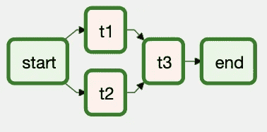
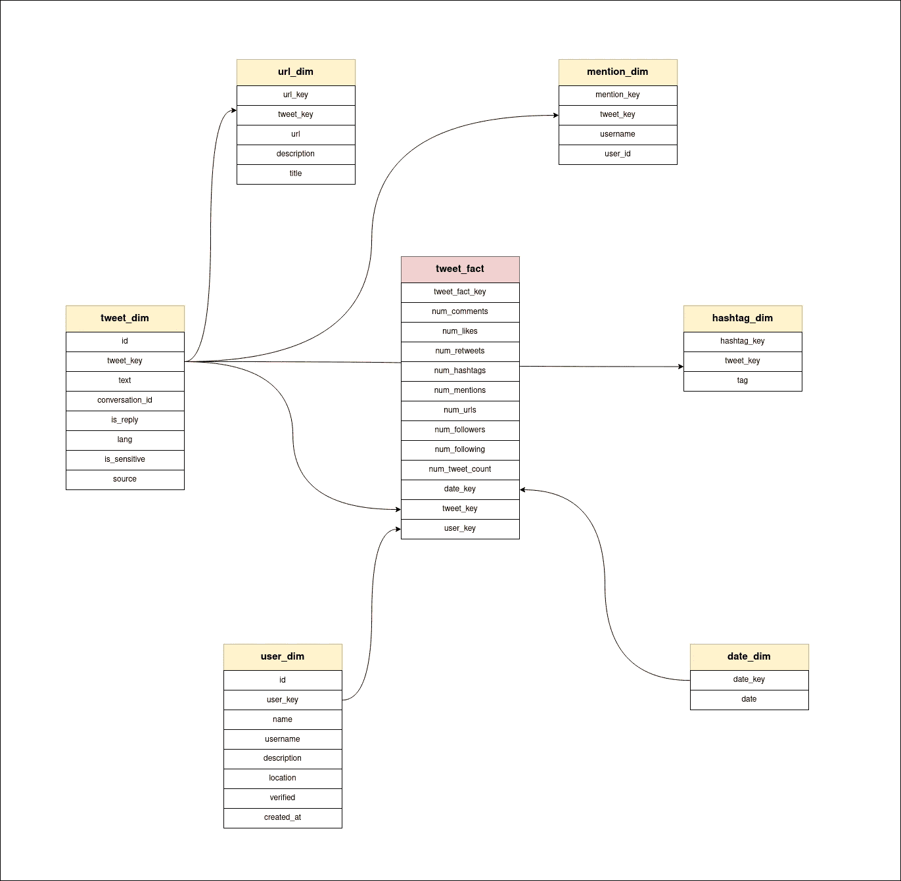
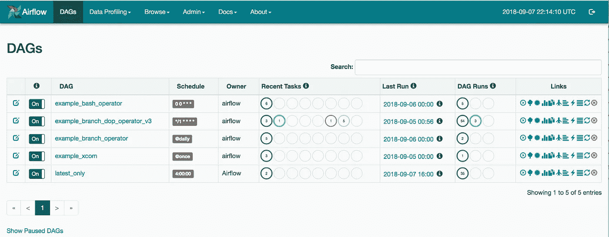

# 使用气流构建数据仓库和 ETL 管道的快速指南

> 原文：<https://blog.devgenius.io/a-quick-guide-for-building-datawarehouse-and-etl-pipelines-with-airflow-19cce17017bd?source=collection_archive---------1----------------------->

嘿，伙计们！在本文中，我们将构建一个 ETL 管道，从 Twitter 获取数据，应用转换，并将其存储在数据仓库中。我们将使用:

- **Apache Airflow，**这是一个工作流管理工具。
- **CouchDB** 进行中间存储。
- **MySQL** 用于创建我们的数据仓库。
- **Twitter API** 获取我们的数据来源

如果你不知道什么是仓库，可以考虑看我的文章 [**数据仓库速成**](/data-warehouse-crash-course-f761d015bd70) 。这个博客的代码可以在 [**Github**](https://github.com/Dev967/twitter_warehouse_airflow_pipeline) 找到

简而言之，数据仓库是专门为分析目的而构建的数据库。这就是为什么我们会有一个不同的模式，并且**不会**使用规范化。

# ETL:

ETL 过程是对数据执行的一组操作，用于将数据存储在数据仓库中。ETL 或者有时 ELT 由三个阶段组成，**提取**、**转换**和**加载。**您可能已经猜到，在提取阶段，我们从多个来源提取数据，这些来源可能是数据流、OLTP 数据库或 API。在转换阶段，我们对数据应用一组操作，以清理数据，并根据我们的需要构造数据，考虑将来自 NoSQL 数据库的数据转换为 SQL 数据库。在加载阶段，我们将数据加载到 DW 中。当存储数据时，加载阶段处理特定于数据仓库的规则、架构设计和方法，例如，当更新时有多个规则，我们可以追加新版本行、替换旧版本行、或者用新数据替换整个数据表。

# 管道:

管道是一系列操作/任务。数据通过这些任务序列移动，并产生最终输出。每个任务可以依赖于一个或多个任务。 **Airflow** 是一个让你创建和管理管道的工具。Airflow 具有仪表板、日志、通知、日程安排等功能。正如所讨论的，任务不必是具体的。您可以在管道中运行任何任务。尽管本质上气流主要用于 ETL 管道和机器学习环境。

# 气流概念:

Airflow 为提交的任务创建了一个 DAG(定向非循环图)。这个 DAG 让 Airflow 知道任务之间的依赖关系，因此 airflow 能够知道哪些任务需要按顺序运行，哪些任务可以并行运行，从而节省时间。创建 DAG 时，您可以指定任务及其依赖关系，根据气流，它们有两种类型的依赖关系，**上游**和**下游**。上游依赖是需要在当前任务之前完成的任务，而下游依赖是需要在当前任务之后执行的任务。为了更好地理解这一点，请考虑以下示例

`first_task >> second_task >> [third_task, fourth_task]`

这里，`first_task`有 3 个下游任务，而`second_task`有 1 个上游任务和 2 个下游任务。
任务在不同于 DAG 的文件中定义。DAG 控制任务的执行。您可以定义任务的顺序、任务之间传递的任何数据、处理错误以及在 DAG 中记录日志。这是你开始学习气流所需要知道的。

# 设置气流:

o 为您的项目设置气流环境，首先您需要在您的系统中安装气流。你可以用 PyPi(pip)来安装`apache-airflow`包。你可以在这里找到其他的安装方法 [**。**](https://airflow.apache.org/docs/apache-airflow/stable/installation/) 安装好 Airflow 后，创建一个项目目录，按照以下步骤操作:

-创建一个虚拟环境(可选)
-设置路径变量`AIRFLOW_HOME`到当前工作目录。它将在实例化 airflow 项目时使用。
-运行`airflow db init`实例化项目
-使用`airflow users create`
创建用户-启动气流流程，运行`airflow scheduler`。现在你可以执行你的任务了。但是如何跟踪进度并使用 airflow 提供的其他功能呢？要做到这一点，你需要启动气流网络服务器，并从浏览器访问它。
-要启动 Airflow 服务器，请在相同的目录但不同的窗口中运行`airflow webserver` 。
-打开浏览器并访问`localhost:8080`您可以使用刚刚创建的用户的凭证登录。

你可以在他们的官方网站上探索 UI 并了解更多关于气流的信息。您可以看到那里已经有一些 DAG。这些是由气流提供的 DAG 示例。如果你愿意，你可以运行并探索它们。如果你不明白这个项目是如何组织的，这里有。“airflow db init”命令创建一个 airflow 数据库，airflow 使用它来安排任务、存储日志和其他内容。这个可以考虑立项。在一个 Airflow DB 实例中，可能有多个 DAG 和多个用户。因此，如果你想创建更多的气流 DAG，你仍然可以使用同一个项目。但是尽量只将相关的 DAG 放在单个 DB 或项目下。

**项目结构:**

新创建的项目的文件结构是不言自明的。你把 DAG 的文件放在`dags`文件夹，任务放在`tasks`文件夹，有`airflow.cfg`文件用于配置，`logs` 文件夹有生成的日志。

# 计划是:

这条管道的目标相当简单，我们将使用 twitter API 从 Twitter 获取推文，并将它们存储到我们的数据仓库中。如果你还没有，你应该注册 Twitter API。我们将只需要基本版本。让我们分解这个过程

**摘录:**

在 Twitter API 的免费版本中，你不能访问实时发布的推文流。但你可以访问某个特定话题的推文，并根据各种参数过滤掉。我们将使用 Twitter API 来获取特定主题的数据(目前为暗网),并根据请求放置一个过滤器来获取 7 天前的数据。然后，我们将安排管道以 7 天为间隔运行。从而避免再次获取和存储相同数据的冲突。我们将获取数据并将其放入 NoSQL 数据库中，对于我们的例子来说是 CouchDB。将它放在中间数据库而不是直接放在 DW 中的原因是为了执行转换操作。这允许我们更灵活地运行操作，例如过滤、数据清理或为插入数据仓库的数据构建摘要。例如，我们可能有兴趣知道本周我们插入了多少推文等等。
要构建一个 Airflow 任务，你只需要定义一个普通的函数并用 air flow 的注释`[@task](http://twitter.com/task)(task_id=’xyz’)`来修饰它。创建任务还有其他方法，但我更喜欢这一种。
**获取 tweets 和创建请求的逻辑在名为** `**DataHandle**`的类下的文件 `**stream.py**` **中**

**转换:**

在转换阶段，我们将读取存储在 CouchDB 中的数据，对其进行某种转换，然后再次放入 CouchDB。从数据工程师的角度来看，我们在这里没有太多事情要做，但仍然只是为了模拟事情，我们将过滤推文的`source`字段。对于每一条推文，都有一个附加的源字段。它告诉我们推文是从什么设备上创建的，例如`Twitter for iPhone`。它的问题在于，它在每条推文中都包含多余的文本`Twitter for …`。因此，我们将过滤掉文本`Twitter for …`，在此阶段只留下设备的名称。

**负载:**

在这个阶段，我们将从 CouchDB 读取转换后的数据，并将其放入我们的数据仓库。在开始之前，让我们讨论一下数据仓库的结构。构建数据仓库的 SQL 文件可以在 [**Github**](https://github.com/Dev967/twitter_warehouse_airflow_pipeline) 上找到。首先，我们从提取的数据中提取不同的数据类，即创建一个新的对象用户、推文、用于存储与用户、推文制作和推文附件相关的数据的实体。然后我们使用`mysql-connector-python`进行一些 SQL 调用，将数据写入数据仓库。

**仓库结构:**

让我们讨论一下我们的数据仓库的结构。我们的数据仓库包含 6 个维度表和 1 个事实表。我们的数据仓库的模式是星型模式。

**以下是维度表:**
- `user_dim`:存储用户详细信息，`user_key`是自定义 id，用于标识记录，`id`是从 twitter 接收的唯一 id。在构建仓库时，拥有自定义 id 通常是个好主意，因为您可能会从多个来源收集数据，id 的唯一性是不可信的。
- `tweet_dim`:存储推文详情，因为`user_dim`有`tweet_key`和`id`，但我们还有`conversation_id`。它告诉我们这条推文是否是对其他推文的评论。
- `url_dim, mention_dim, hashtag_dim`:存储 tweet 中`url, hashtag and mentions`的详细信息。这个维度不直接与事实表链接，因为它们完全依赖于与`tweet_dim`链接的 tweet。`tweet_key`在这里作为外键
- `date_dim`:存储记录进入仓库
- `tweet_fact`的日期:使用`id`组合所有这些细节，并存储`num_comments, num_likes, num_retweets, num_hashtags etc`等事实。汇总并提供有用的见解和结果。

## DAG:

控制所有操作的 Dag:

你可以在 [**github**](https://github.com/Dev967/twitter_warehouse_airflow_pipeline) 上查看完整代码，更深入地了解上述项目的工作。

完美运行所有步骤后，您可以从 webserver UI 中查看、编辑和控制 DAG，可能如下所示

感谢您的阅读😊