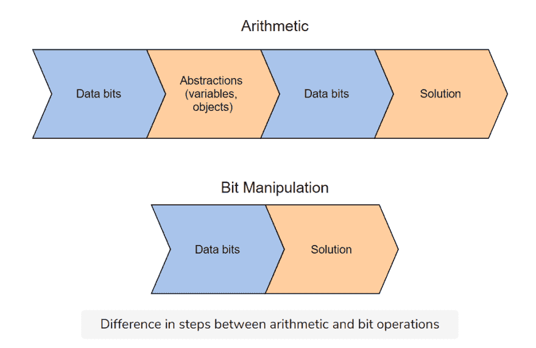
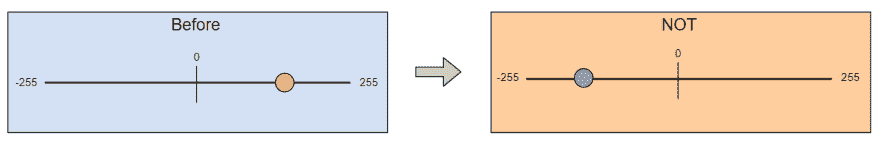

# Java 位操作快速指南

> 原文：<https://blog.devgenius.io/a-quick-guide-to-bit-manipulation-in-java-4559839653f5?source=collection_archive---------1----------------------->


图片来源:作者

位操作是直接操作数据位来执行操作，是 FAANG 招聘人员现在测试的一个重要的优化技能。然而，这个主题是高度数学化的，在非大学计算机科学环境中很少涉及。

今天，我们将为您提供一个关于位操作的教程，并探索一些常见面试问题的实践。

**下面是我们今天要讲的内容:**

*   什么是比特操作？
*   按位运算符
*   逐位技巧
*   按位运算符的实践操作
*   接下来学什么

# 什么是比特操作？

位操作是对位序列(计算机中最小的数据形式)应用逻辑运算以达到所需结果的过程。位操作具有恒定的时间复杂度和并行处理，这意味着它在所有系统上都非常有效。

大多数编程语言会让你处理抽象概念，比如对象或变量，而不是它们所代表的位。但是，在某些情况下，需要直接位操作来提高性能和减少错误。

位操作需要很强的二进制和二进制转换知识。

**这里有一些需要位操作的任务的例子:**

*   低级设备控制
*   错误检测和纠正算法
*   数据压缩
*   加密算法
*   最佳化

例如，看看算术和位操作方法在寻找 RGB 值的绿色部分时的区别:

```
// arithmetic
(rgb / 256) % 256// bit
(rgb >> 8) & 0xFF
```

虽然两者做的是同样的事情，但第二个选项要快得多，因为它直接在内存中工作，而不是通过抽象层。

我们将在本文的后面探讨这些操作符的作用(`>>`和`&`)。

# 按位操作和编码采访

比特操纵也是编码面试的常见话题，尤其是和 FAANG 公司。这些面试官希望你对比特有一个基本的了解，基本的比特操作符，并大致了解比特操作背后的思维过程。

> 拥有这些知识表明你是一个全面发展的开发人员，既了解特定的工具，又了解计算机科学的基础。

如果你申请的是一个与嵌入式系统或其他低级系统一起工作的职位，你会遇到更多的 bit 问题。简而言之，你的角色越接近机器级别，你遇到的位操作问题就越多。

准备位操作问题的最好方法是练习使用每个位运算符，并复习二进制到十进制的转换。

# 按位运算符

逐位运算接受一个或多个位模式或二进制数，然后**在比特级处理它们**。它们本质上是我们操纵比特来完成操作的工具。

算术运算对人类可读的值(`1+2`)执行运算，而按位运算符直接操作低级数据。



图片来源:作者

**优点**

*   它们是快速而简单的动作。
*   它们由处理器直接支持。
*   它们用于操作值以进行比较和计算。
*   位运算非常简单，而且比算术运算更快。

让我们快速看一下每个主要的按位运算符及其用法。

# 逻辑积算符

AND ( `&`)是比较两个长度相等的操作数的二元运算符。操作数从它们的可读形式转换成二进制表示。对于每个位，该操作检查两个操作数的两位是否都是`1`。如果是，则在答案中将该位设置为`1`。否则，相应的结果位被设置为`0.`

它实际上将每个位乘以另一个操作数中的相应位。由于将任何东西乘以`0`得到`0`，与任何`0`位的 AND 比较将得到`0`。

*   如果两个输入位为 1，则输出为 1。
*   在所有其他情况下，它为 0，例如:
*   `1 & 0` = >收益率为 0。
*   `0 & 1` = >收益率为 0。
*   `0 & 0` = >收益率为 0。

```
0101 (decimal 5)
AND 0011 (decimal 3)
```

`0 * 0 = 0`

`1 * 0 = 0`

`0 * 1 = 0`

`1 * 1 = 1`

因此:

`= 0001 (decimal 1)`

该操作可用于确定特定位是置位(1)还是清零(0)。它还用于清除寄存器中的选定位，其中每个位代表一个单独的布尔状态。

```
class AndOperation {
    public static void main( String args[] ) {
        int x = 12;
        int y = 10;
        System.out.println("Bitwise AND of (" + x + " , " + y + ") is: " + (x & y)); // yields to 8
    }
}
```

# OR 运算符

OR 运算符(`|`)是一个二元运算符，接受两个等长的操作数，但**以与 AND 相反的方式对它们**进行比较；如果任一对应位为`1`，则答案为`1`。否则答案就是`0`。换句话说，如果给定的输入之一是`1`，按位“或”将返回‘1’。

*   如果两个输入位为`0`，则输出为`0`。
*   其他情况都是`1`。例如:
*   收益率为 1。
*   收益率为 1。
*   收益率为 1。

```
a = 12
b = 10
---------------------------------
a in Binary : 0000 0000 0000 1100
b in Binary : 0000 0000 0000 1010
---------------------------------
a | b           : 0000 0000 0000 1110
--------------------------------------
```

这通常用作解决其他问题的临时逻辑步骤。

```
class OROperation {
    private static int helper(int x, int y) {
        return x | y;
    }
    public static void main(String[] args) {
        int x = 12;
        int y = 10;
        System.out.println("Bitwise OR of " + x + ", " + y + " is: " + helper(x, y)); // yields to 14
    }
}
```

# “非”算符

NOT ( `~`)或有时称为按位补码运算符，是一种一元运算，它接受单个输入，**将二进制表示中的每个位**交换为相反的值。

所有的`0`实例都变成了`1`，所有的`1`实例都变成了`0`。换句话说，NOT 反转每个输入位。这个反转的序列被称为位序列的**补码**。

> *比如考虑*
> 
> *`*x*`*的二进制数表示为:**
> 
> *`*x = 00000000 00000000 00000000 00000001*`*
> 
> **现在，* `*x*` *的按位非将是:**
> 
> *`*~x = 11111111 11111111 11111111 11111110*`*
> 
> **所以:**
> 
> *`*x*` *包含 31 个 0 和 1 个 1**
> 
> *`*~x*` *包含 31 个 1 和一个 0**

*这使得数字为负，因为任何以`1`开始的位集合都是负的。*

*NOT 对于将无符号数翻转为中点对面的镜像值非常有用。*

*对于 8 位无符号整数，`NOT x = 255 - x`。*

**

*公式:`~x = 2^{32} - x`*

```
*class NOTOperation {
    public static void main( String args[] ) {
        int a = 1;
        System.out.println("Bitwise NOT of a is : " + ~a);
    }
}*
```

# *异或运算符*

*按位 XOR 运算(`^`)，“异或”的缩写)是一个二元运算符，接受两个输入参数，**比较每个相应的位。**如果两位相反，结果在该位位置有一个`1`。如果它们匹配，则返回一个`0`。*

*   *`1 ^ 1` = >收益率为 0。*
*   *`0 ^ 0` = >收益率为零。*
*   *`1 ^ 0` = >收益率为 1。*
*   *`0 ^ 1` = >收益率为 1。*

*例如:*

```
*a = 12
b = 10
--------------------------------------
a in binary : 0000 0000 0000 1100
b in binary : 0000 0000 0000 1010
--------------------------------------
a ^ b       : 0000 0000 0000 0110
--------------------------------------*
```

*XOR 用于反转寄存器中选定的单个位，或操作表示布尔状态的位模式。*

*XOR 有时也用于将注册表的值设置为零，因为两个相同输入的 XOR 将总是导致`0`。*

```
*class XOROperation {
    public static void main( String args[] ) {
        int x = 12;
        int y = 10;
        System.out.println("Bitwise XOR of (x , y) is : " + (x ^ y)); // yields to 6
    }
}*
```

# *左右移位运算符*

 *移位是一种逐位运算，其中一系列比特的顺序被移动以有效地执行数学运算。移位是将一个数的二进制表示中的每一位向左或向右移动第二个操作数指定的空格数。*

*这些运算符可以应用于整数类型，如`int`、`long`、`short`、`byte`或`char`。*

***换档有三种类型:***

*   ***左移:** `<<`是左移运算符，同时满足逻辑和算术移位的需要。*
*   ***算术/有符号右移:** `>>`是算术(或有符号)右移运算符。*
*   ***逻辑/无符号右移:** `>>>`是逻辑(或无符号)右移运算符。*

> **在 Java 中，所有的整数数据类型都是有符号的，而* `*<<*` *和* `*>>*` *只是算术移位。**

*这是一个左移的例子:*

*`6 = 00000000 00000000 00000000 00000110`*

*将该位模式左移一位(`6 << 1`)得到数字 12:*

*`6 << 1 = 00000000 00000000 00000000 00001100`*

*如您所见，数字向左移动了一个位置，右边的最后一个数字用零填充。注意，左移等效于乘以 2 的幂。*

*`6 << 1 → 6 * 2^1 → 6 * 2`*

*`6 << 3 → 6 * 2^3 → 6 * 8`*

*优化良好的编译器会尽可能用移位来代替乘法，因为移位更快。*

```
*class LeftShift {
    private static int helper(int number, int i) {
        return number << i;// multiplies `number` with 2^i times.
    }
    public static void main(String[] args) {
        int number = 100;
        System.out.println(number + " shifted 1 position left, yields to " + helper(number, 1));
        System.out.println(number + " shifted 2 positions left, yields to " + helper(number, 2));
        System.out.println(number + " shifted 3 positions left, yields to " + helper(number, 3));
        System.out.println(number + " shifted 4 positions left, yields to " + helper(number, 4));
    }
}*
```

*使用右移位，您可以进行算术(`>>`)或逻辑(`>>`)移位。*

*不同之处在于算术移位保持相同的最高有效位(MSB)或**符号位**，最左边的位决定一个数是正还是负。*

*`1011 0101 >> 1 = **1**101 1010`*

*公式:`x >> y = x/(2^y)`*

*另一方面，逻辑移位只是将所有内容向右移动，并用`0`替换 MSB。*

*`1011 0101 >>> 1 = 0101 1010`*

*公式:`a >>> b = a/(2^b)`*

# *逐位技巧*

*现在，让我们来看看使用按位运算符可以做到的一些技巧。*

*这些通常用作面试问题，以检查您是否已经复习了基本的位操作，并能够将其应用到日常的编码任务中。*

# *检查一个数字是否是偶数*

*这一题测试你对 AND 如何工作以及偶数/奇数在二进制中如何不同的知识。您可以简单地使用:*

```
*(x & 1 ) == 0
  0110 (6)
& 0001
= 0000 TRUE*
```

*这个解决方案依赖于两件事:*

*   *`2`等同于`0001`*
*   *所有大于 2 的奇数最右边的数字是`1`*

*任何时候最后一位的值为`1`，你就知道它匹配，因此是一个奇数。如果取而代之的是`0`，你知道没有匹配的数字，因此它是偶数。*

# *将字符转换为大写或小写*

*这个技巧测试你对二进制中大写和小写字符的知识。您可以使用`ch ^= 32`将任意字符`ch`转换成相反的大小写。*

*这是因为小写和大写字母的二进制表示几乎相同，只有 1 位的差异。*

*使用 XOR 运算，我们可以切换单个位，并将其交换为相反的值，从而将小写字符转换为大写字符，反之亦然。*

```
*public class Test 
{     static int x=32;     // tOGGLE cASE = swaps CAPS to lower 
    // case and lower case to CAPS 
    static String toggleCase(char[] a) 
    { 
        for (int i=0; i<a.length; i++) {             // Bitwise XOR with 32 
            a[i]^=32; 
        } 
        return new String(a); 
    }     /* Driver program */
    public static void main(String[] args)  
    { 
        String str = "CheRrY"; 
        System.out.print("Toggle case: "); 
        str = toggleCase(str.toCharArray()); 
        System.out.println(str);         System.out.print("Original string: "); 
        str = toggleCase(str.toCharArray()); 
        System.out.println(str);     
    } 
}*
```

# *按位运算符的实践操作*

 *现在，让我们对这些操作员进行一些实际操作。*

# *和挑战:计数设置位*

*写一个 Java 程序，计算设置为 1(设置位)的整数的位数。*

***解决方案和解释***

```
*class CountSetBit {
    private static int helper(int n) {
        int count = 0;
        while (n > 0) {
            n &= (n - 1);
            count++;
        }
        return count;
    } public static void main(String[] args) {
        int number = 125;
        System.out.println("SetBit Count is : " + helper(number));
    }
}*
```

*在这种方法中，我们只对设置的位进行计数。所以，*

*   *如果一个数有 2 个设置位，那么 while 循环运行两次。*
*   *如果一个数有 4 个设置位，那么 while 循环运行四次。*

*我们的 while 循环迭代到`n = 0`，每次通过 AND 操作符除以 2。在通道 1 中，`125`变为`62`，并且`count`增加 1。第二遍时，`62`变为`31`，计数增加到 2。这一直持续到`n`变为 0，然后计数被返回。*

# *按位 OR:翻转次数*

*写一个程序，取 3 个整数，用最少的翻转次数使前两个数之和等于第三个数。该程序将返回所需的翻转次数。*

> *翻转是将一个比特改变为相反的值，即。 `*1 --> 0*` *或* `*0 --> 1*` *。**

*输入:`a = 2`、`b = 6`、`c = 5`*

*输出:`3`*

***解决方案和解释***

```
*class MinFlips {
    private static int helper(int a, int b, int c) {
        int ans = 0;
        for (int i = 0; i < 32; i++) {
            int bitC = ((c >> i) & 1);
            int bitA = ((a >> i) & 1);
            int bitB = ((b >> i) & 1); if ((bitA | bitB) != bitC) {
                ans += (bitC == 0) ? (bitA == 1 && bitB == 1) ? 2 : 1 : 1;
            }
        }
        return ans;
    } public static void main(String[] args) {
        int a = 2;
        int b = 6;
        int c = 5;
        System.out.println("Min Flips required to make two numbers equal to third is : " + helper(a, b, c));
    }
}*
```

*首先，我们将`ans`初始化为`0`。然后我们从 0 - 31 的范围内循环。我们将`bitA`、`bitB`和`bitC`初始化为等于我们的右移公式，并与 1:*

*`(a/(2^i) & 1`*

*然后，我们检查`bitA | bitB`是否等于`bitC`。如果是，我们继续检查`bitC = 0`。从那里，如果`bitA = 1`和`bitB = 1`那么我们将`ans`增加 2。否则，我们将`ans`加 1。*

*最后我们返回`ans`，每操作一次就加一。*

# *按位异或:单个数字*

*查找数组中不重复的元素。*

*输入:`nums = { 4, 1, 2, 9, 1, 4, 2 }`*

*输出:`9`*

***解决方案和解释***

```
*class SingleNumber {
    private static int singleNumber(int[] nums) {
        int xor = 0;
        for (int num : nums) {
            xor ^= num;
        }
        return xor;
    } public static void main(String[] args) {
        int[] nums = {4, 1, 2, 9, 1, 4, 2};
        System.out.println("Element appearing one time is " + singleNumber(nums));
    }
}*
```

*该解决方案依赖于以下逻辑:*

*   *如果我们对零和某个位进行异或运算，它将返回该位:`a ^ 0 = a`*
*   *如果我们对两个相同的位进行异或运算，它将返回 0: `a ^ a = 0`*
*   *对于 n 个数字，可以应用下面的数学公式:`a ^ b ^ a = (a ^ a) ^ b = 0 ^ b = b`*

*举个例子，*

*`1 ^ 5 ^ 1 =`*

*`(1 ^ 1) ^ 5 =`*

*`0 ^ 5 = 5`*

*因此，我们可以将所有位一起进行 XOR 运算，以找到唯一的数字。*

# *按位左移:获取第一个设置位*

*给定一个整数，找出从右数第一个设置位(`1`)的位置。*

*输入:`n = 18`*

*18 进制= `0b10010`*

*输出:`2`*

***解决方案和解释***

```
*class FirstSetBitPosition {
    private static int helper(int n) {
        if (n == 0) {
            return 0;
        } int k = 1; while (true) {
            if ((n & (1 << (k - 1))) == 0) {
                k++;
            } else {
                return k;
            }
        }
    } public static void main(String[] args) {
        System.out.println("First setbit position for number: 18 is -> " + helper(18));
        System.out.println("First setbit position for number: 5 is -> " + helper(5));
        System.out.println("First setbit position for number: 32 is -> " + helper(32));
    }
}*
```

*该解决方案的逻辑依赖于左移和 and 运算的组合。*

*本质上，我们首先使用`bit & 1`检查最右边的有效位是否是 set bet。如果没有，我们继续左移并检查，直到我们找到使我们的 and 运算产生的位`1`。*

*轮班次数由我们的指针`k`跟踪。一旦我们找到设置位，我们返回`k`作为我们的答案。*

# *接下来学什么*

*祝贺您完成我们的钻头操作快速指南！钻头操作可能是一个很难学的话题，但是实践是提高的最好方法。*

*当你寻找更多的练习时，看看这些练习题:*

*   *找到丢失的数字*
*   *使用右移找到第一个设置位*
*   *计算整数的位数*
*   *检查一个数是否是 2 的幂*

**快乐学习！**