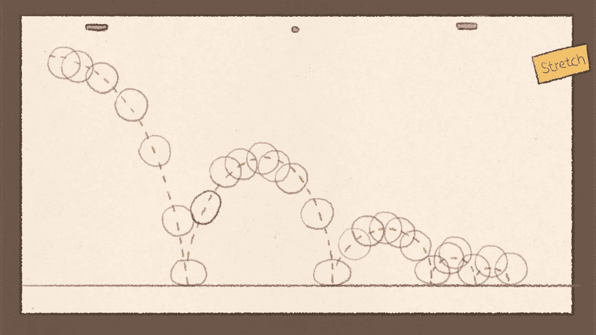
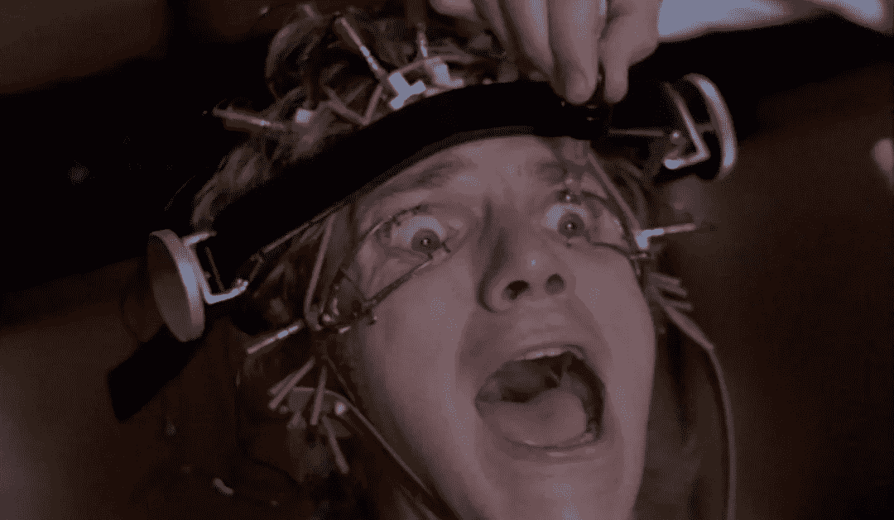
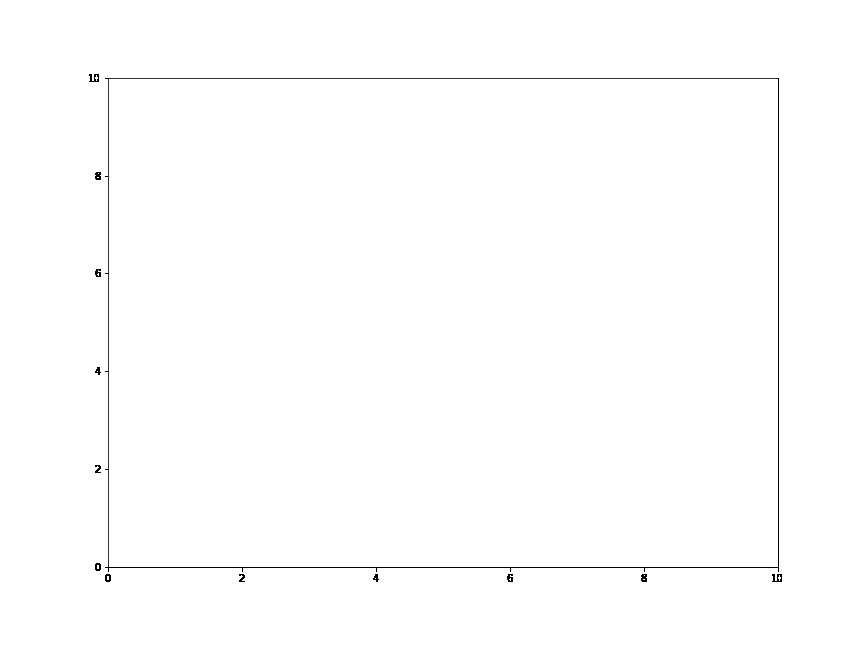
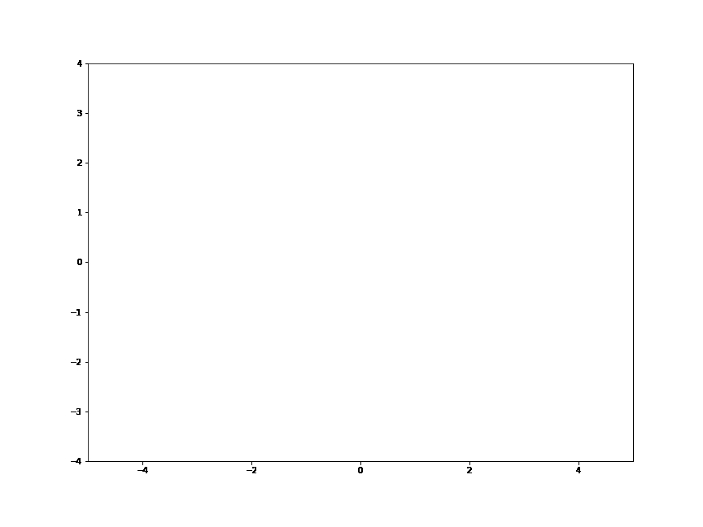

# Python 绘图动画快速教程

> 原文：<https://blog.devgenius.io/a-quick-tutorial-on-plot-animation-in-python-9eac6eb24ee9?source=collection_archive---------5----------------------->



[图像来源](https://www.google.com/url?sa=i&url=https%3A%2F%2Fwww.youtube.com%2Fwatch%3Fv%3DoJvGHbUHYWU&psig=AOvVaw3TNPWrpf6AMVp_NEyGMbvI&ust=1646199196033000&source=images&cd=vfe&ved=0CAwQjhxqFwoTCLCkxYWYpPYCFQAAAAAdAAAAABAh)

在过去的几周里，我了解到数据可视化是一个多么有效的工具。它不仅帮助我掌握了我正在处理的数据，还帮助我几乎不用说一句话就能向别人解释我的想法。

对我来说，最吸引人的数据可视化形式之一是通过 Python 中的基本动画。如果一幅画值 1000 个字，加上运动就等于每秒 24000 个字。(每秒 1000 字 X 24 帧，我的数学检查过了)。与其强迫你的潜在观众背对背地看剧情，并希望他们从每张幻灯片中保留足够的信息，以便在你喋喋不休时看到你试图强调的任何内容，你可以在谈论它们时播放一段你的剧情随时间变化的视频。



客户被迫连续查看 10 个散点图的真实图像。[图片来源](https://the-take.com/read/what-is-the-ludovico-technique-in-a-clockwork-orange-and-how-does-it-work)

现在这一切都很好，但你可能会问，你到底是如何在 Python 中制作动画的？我如何开始？我应该只是拍下我的情节，然后把它们混在我的假期照片中扔进 iMovie 吗？

不要害怕！在接下来的几个段落中，我将给出一个简单的例子，说明如何用 Python 制作 Matplotlib 动画，这样你就可以为自己和未来的客户制作更吸引人的演示文稿了！

为了使事情尽可能容易理解，我们将简单地从屏幕的一边画一条线到另一边，但是使用这些基本工具，你可以使它尽可能复杂。

我们开始吧！

首先，将以下包导入到代码块中:

```
import numpy as np
import matplotlib.pyplot as plt
import matplotlib.animation as animation
from matplotlib.animation import FuncAnimation
```

然后我们将 x 和 y 变量初始化为两个空列表:

```
x = [ ]
y = [ ]
```

然后，当我们将它保存为 gif 时，我们用我们希望最终动画的图形大小创建我们的图形和轴。

在这个例子中，我选择了(12，9)，因为我总是可以在事后调整它的大小。我还在这一点上定义了轴的界限。

```
figure, ax = plt.subplots(figsize = (12,9))
ax.set_xlim(0, 10) 
ax.set_ylim(0, 10)
```

然后，我们先发制人地绘制我们的线，只是为了告诉 Python 我们从哪里开始绘制我们的线

```
line,  = ax.plot(0, 0) 
```

然后，我们为这个例子定义非常基本的函数。我们所要做的就是获取我们的输入， *i* ，并使其成为 x 和 y 变量。

```
def animation_function(i):
    x.append(i) 
    y.append(i) 

    line.set_xdata(x) #drawing our x data point by point 
    line.set_ydata(y) #drawing our y data point by point

    return line
```

在我们为动画师定义了函数之后，我们使用 matplot。FuncAnimation，并传入我们的 figure，函数来制作动画，我们的 *i* 作为我们的帧，帧之间的间隔以毫秒显示。【FuncAnimation 的文档可以在这里找到。

```
line_drawer = FuncAnimation(figure,
                            func = animation_function,  
                            frames = np.arange(0, 10, 0.1), 
                            interval = 30)
```

通常，我们会做一个简单的 plt.show()来查看我们的动画，但是为了将我们的动画保存为 gif 格式，我们将使用[动画。PillowWriter，关于它的信息可以在这里找到。](https://matplotlib.org/3.1.1/api/_as_gen/matplotlib.animation.PillowWriter.html)

```
pillow = animation.PillowWriter(fps=24)
```

我们为 PillowWtriter 创建一个新变量，并为输出 gif 设置 fps。最后，我们在 line_drawer 上执行. save()函数，定义 gif 文件的位置和名称，并将参数“writer”设置为我们刚刚创建的 PillowWriter 变量，

```
line_drawer.save('line_drawer.gif', writer=pillow)
```

一旦您运行我们刚刚创建的代码块，您将保存一个动画的 gif。你可以在任何地方使用它。

下面是所有的代码在一个地方，所以你可以复制并粘贴它来尝试运行自己。

```
import numpy as np
import matplotlib.pyplot as plt
import matplotlib.animation as animation
from matplotlib.animation import FuncAnimationx = []
y = []

figure, ax = plt.subplots(figsize = (12,9)) #Setting the size of the figure. Make it larger as you can shrink the gif

ax.set_xlim(0, 10) #Setting x limits on our axis
ax.set_ylim(0, 10) #Setting x limits on our axis

line,  = ax.plot(0, 0) #preemptively plotting our line at it's starting point. We will define line in our function

def animation_function(i): #very basic function - just taking our inputs and outputting them as (x,y) 

    x.append(i) 
    y.append(i) #Appending x and y list but also saying where the x and y data is souced from to our function

    line.set_xdata(x) #drawing our x data point by point 
    line.set_ydata(y) #drawing our y data point by point

    return line
line_drawer = FuncAnimation(figure, #Defining where we will plot our new animation

                          func = animation_function,  #this will be the funtion we will draw as defined above

                          frames = np.arange(0, 10, 0.1), #our frames of animation, 
                                                          #aka our i passed into our function

                          interval = 30) #The delay between frames in milliseconds# plt.show() #Normally this would show the animation in your notebook with your desired interval
             #but this has been commented out so you can see how to save your animation as a gif.pillow = animation.PillowWriter(fps=24) #Using the PillowWriter as our writer (required for the next step)
                                        #we define our frames per second 
                                        #I'm using 24 since it is a film standardline_drawer.save('line_drawer.gif', writer=pillow) #Use the .save function and pass our new file's desired
                                                   #name and set writer = to our pillow variable from before.
```

这是上面的代码将输出的 gif。



相当酷，虽然相当简单

**结论**

现在我知道这是一个非常简单的代码，但它非常强大。

只需修改传递给 FuncAnimation 的函数，就可以创建一些令人印象深刻的视觉效果。这里是我做的一个快速重写，以显示一个正弦波，它看起来已经比一条简单的直线更令人印象深刻。



我知道我有偏见，但这看起来如此顺利

您可以使用最后几行代码的基础来创建任何您想要的动画(您不仅仅局限于行)。

只需定义一个新的函数，就可以显示直方图随时间的变化，或者不同人口统计数据之间的散点图分布。您可以使用输入框架来调用时间代码或数据框架索引。

如果您可以编写一个可以分解成帧的函数，那么几乎肯定有一种方法可以用 FuncAnimation 和 PillowWriter 来实现。可能性绝对是无穷无尽的！