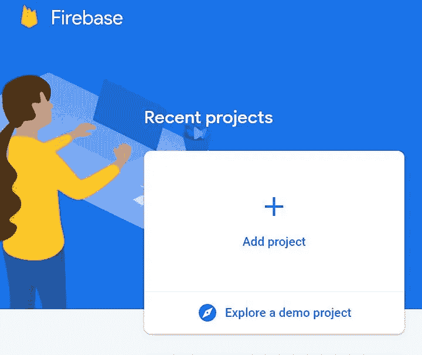
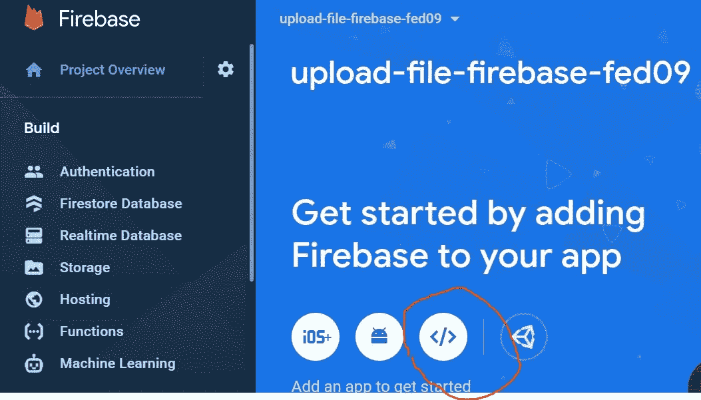
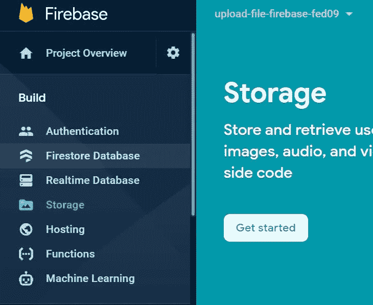
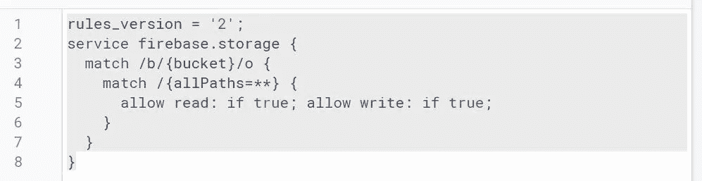
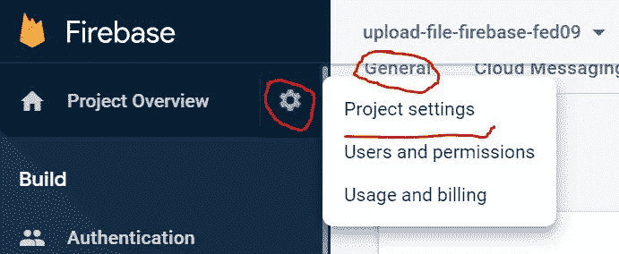
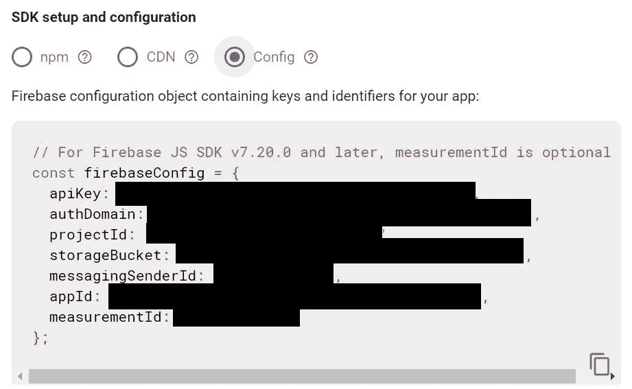
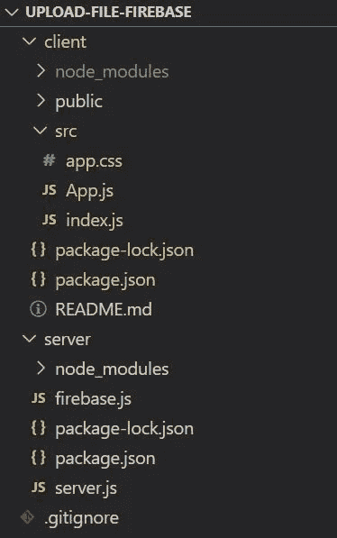
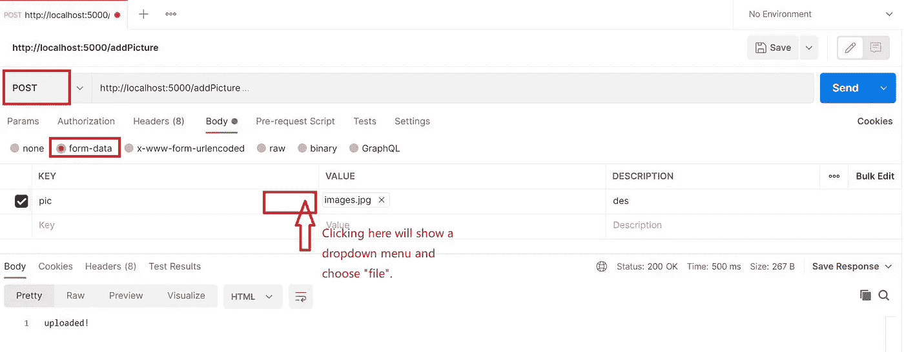
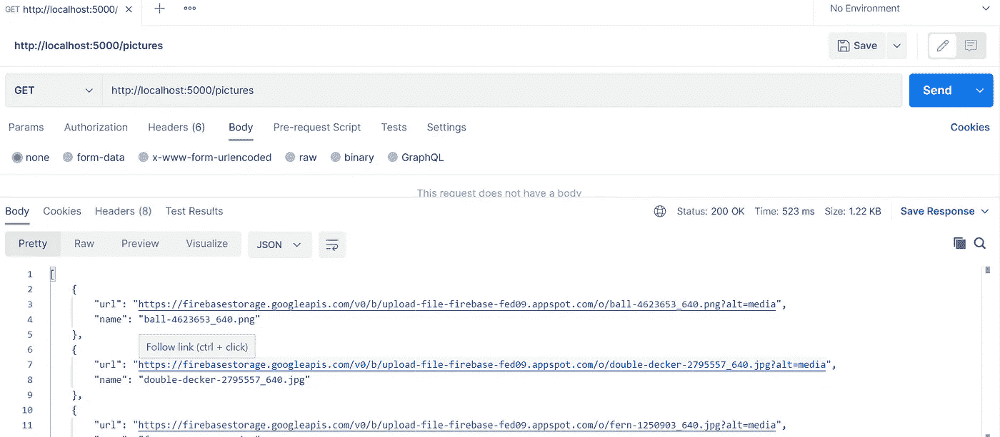
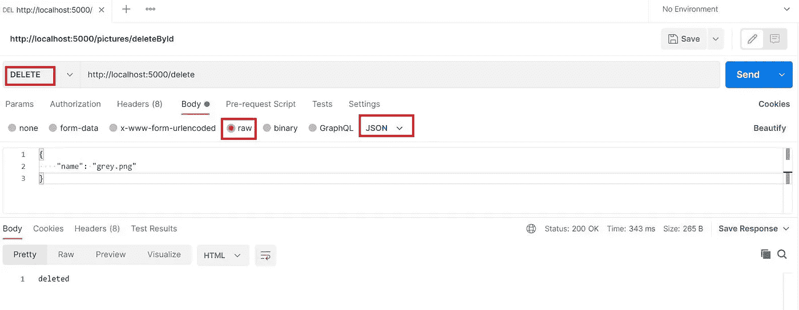

# 一个基于 ReactJS 和 NodeJS 的 Web 应用程序，用于将图像上传到 Firebase

> 原文：<https://blog.devgenius.io/a-reactjs-and-nodejs-based-web-app-for-uploading-images-to-firebase-fe3d4a91c496?source=collection_archive---------3----------------------->

# 介绍

嗨伙计们！感谢您对本文的关注。它将为您提供一个关于如何将映像从 ReactJS 构建的前端上传到带有基于 NodeJS 的后端的 Firebase 存储的示例。这个功能在电子商务网站和社交媒体中非常常见和基本。尽管如此，我还是觉得给我这样的新手写个教程挺有意思的。

# 燃料库

首先，您需要创建一个 Firebase 项目。使用您的 Google 帐户进入 firebase 控制台。按照说明操作，所有默认设置都没问题。

然后向该项目添加一个 web 应用程序。为此 web 应用选择位置和名称。不过，所有默认设置都没问题。

接下来，进入侧边栏的“存储”，点击“开始”。

您可以选择开发的测试模式。如果您不想在以后收到过期时间的警告，您可以更改规则，如下图所示。该规则允许每个人读写您的数据。当然是**不安全**。你可以通过检查认证等方式让它更安全。但是安全规则不是本文的重点。更多信息可以在[这里](https://firebase.google.com/docs/rules)找到。

成功设置存储后，您可以转到项目设置，并在 general tap 中复制配置。确保配置信息中有一个“存储包”。后端将使用它来连接 Firebase。

好了，燃烧基地部分完成了。很简单，对吧？😉

# 计算机网络服务器

## 初始化

我们可以首先在后端设置和 API 上工作。为这个项目创建一个文件夹，在这个文件夹中，创建一个名为“服务器”的文件夹，或者你喜欢的任何文件夹。完整的项目结构如下所示:

直接到这个服务器文件夹并运行`npm init -y`，它用默认设置初始化 npm 包。接下来，我们将安装一些软件包。我们将用 express 编写这个 NodeJS。要考虑跨域问题，所以 cors 库是必要的。此外，我将使用 Postman 来测试 API，因此使用 multer 库。在您的终端中运行`npm i express cors multer`。

现在，在服务器文件夹中创建一个 firebase.js 文件，并将 firebase 项目设置中的配置信息粘贴到其中。像这样写它

现在，我们可以在服务器文件夹中创建一个 server.js 文件。从 firebase.js 导入必要的库和存储。" Multer 是一个处理`multipart/form-data`的 node.js 中间件，主要用于上传文件."[1]此外，我使用`multer.memeryStorage()`来存储文件，因为文件将以这种方式存储为缓冲区对象[2]。`uploadBytes()`提供了储存火基的方法。`uploadBytes()`通过 JavaScript [File](https://developer.mozilla.org/en-US/docs/Web/API/File) 和[Blob](https://developer.mozilla.org/en-US/docs/Web/API/Blob)API 获取文件并上传到云存储【3】。所以，我们可以将`file.buffer`作为参数传递给`uploadBytes()`。

NodeJS 服务器正在本地监听 5000 端口。通过`nodemon server.js`运行 NodeJS 服务器。如果没有安装 [nodemon](https://www.npmjs.com/package/nodemon) ，可以通过`node server.js`运行。如果启动成功，您的终端应该输出“服务器已经在端口 5000 上启动”。稍后，我们可以编写上传图像、从 Firebase 存储中获取所有图像以及删除图像的路径。

## 上传图像

我们为上传设置了一个路径“/addPicture”。由于后端连接 Firebase 传输数据，`async/await`用于异步功能。`upload.single(“pic”)`表示 multer 需要上传一个文件“pic”。如果要上传几个文件，可以使用`upload.array()`。我们为要由`ref(storage, file.originalname)`上传的图像创建一个参考。这里我只使用文件的原始名称。在真实场景中这不是一个好主意。您可以通过将随机生成的 id 与其原始名称相结合来创建新名称。然后，我们为该图像分配`metatype` 。

上传完 API，我们就可以用 Postman 测试了。运行你的服务器，设置邮递员如下。我们将发送带有表单数据的请求。注意文件的关键字设置为“pic”，这与`upload.single(“pic”)`一致。如果成功，它将输出“上传！”。您也可以在 Firebase 存储中检查图像。

## 获取所有图像

要获取 Firebase 中存储的所有图像，需要使用`listAll()`。由于我们只是将所有的图片存储在根目录下，所以我们可以简单地创建一个引用，在这里我们将通过`ref(storage)`获取数据。因为我们希望在前端显示所有的图像，所以我们将图像的公共 URL 分配给一个数组，并将其作为响应发送回去。为了获得每张图片的 url，我们映射了由`listAll()`返回的图片。`productPictures` 的每个元素将是一个由 url 和名称组成的对象。诀窍在于公共 url 的格式是“`https://firebasestorage.googleapis.com/v0/b/${YOUR_BUCKET_NAME}/o/${FILE_NAME}?alt=media`”。你可以通过`console.log(item)`的图片来理解我为什么在这里写下`item._location.bucket`和`item._location.path_` 。

如果我们在邮递员身上测试，成功的结果会是这样的。

## 删除图像

删除图像更简单。我们在请求体中获取要删除的图像，并为它创建一个 ref。然后我们使用`deleteObject()`将其从 Firebase 存储中删除。稍后我会解释`req.body.name`。

现在，在 Postman 中测试它。在请求体中，我们写`{“name”: “grey.png”}`，它对应于我们如何获得图片名称，即通过`req.body.name`。如果图片删除成功，会发送“已删除”响应。你可以同时检查存储。

哇，我们已经完成了后端代码和测试。干杯！🎈

# 客户

## 初始化

让我们回到项目文件夹并运行`npx create-react-app client`。然后会为您创建一个名为 client 的文件夹。通过`cd client`重定向至客户端文件夹。您可以首先删除一些不必要的文件，这些文件不在项目结构图中。

React 最近好像有一些更新。即使你只是创建它，当你用`npm start`运行前端时，它也会给出“警告:React 18 中不再支持 ReactDOM.render。请改用 createRoot。在你切换到新的 API 之前，你的应用会表现得像运行 React 17 一样。了解更多:[https://reactjs.org/link/switch-to-createroot](https://reactjs.org/link/switch-to-createroot)”。因此，如果您不想看到此警告，请将 index.js 文件更改为

记得通过运行`npm i axios`来安装 axios。我们将使用它与后端进行通信。

## App.js

我们将有一个表单，其中有一个文件类型的输入标签来选择文件和一个按钮来提交上传请求。在表单下面，显示了存储在 Firebase 存储器中的所有图片。如果没有图片，也就是`allPics` 为空，什么都不会出现。这就是我们写`{allPics && …}`的原因。

我们应用 useState()来存储要上传的图片的状态(`pic`)和存储在 Firebase 存储器中的图片的状态(`allPics`)。`useEffect()`将在 react 项目启动时运行一次。`getAllPics()`功能将被取消。它还有一个依赖项`allPics`。如果我们上传一张图片或者删除一张图片，显示的图片也要相应的变化。如果`allPics` 发生变化，`getAllPics()`将被作为依赖项再次撤销。

`getAllPics()`是一个异步函数，因为它将与后端交互。我们使用 axios 发送请求。由于我们是本地开发，所以基础 api 是“http://localhost:5000”。还记得我们写后端 API 的时候应该返回什么吗？是的，一个由对象组成的数组，每个对象都有一个“url”和“name”。获得响应后，我们将其分配给`allPics`。

如本文封面图片所示，每张图片正下方都有一个删除按钮。`handleDelete()`函数将图片名称作为参数。我们通过`axios.delete(“http://localhost:5000/delete", {data: { name: name },})`发送删除请求。图片名称存储在请求体`{data: { name: name }}`中，对应后端删除路径的`req.body.name`。删除后，现在再次获取存储器中的所有图片。

让我们看看表单标签。定义了一个`handleChange()`函数来获取选定的文件并将其分配给`pic`。我们还定义了一个`handleSubmit()` 函数，当点击按钮提交时，该函数将被撤销。`handleSubmit()`阻止页面刷新。一个 FormData 对象。我们通过`formData.append(“pic”, pic)`给它加上`pic`。注意后端的`upload.single(“pic”)`对应的`“pic”`。发布请求由`axios.post(“http://localhost:5000/addPicture", formData)`发送。上传成功后，我们再次运行`getAllPics()`重新渲染前端。

前端部分就这些了。🎈下面是前端的 CSS 文件。

> 感谢阅读！希望对你有所帮助。

# 参考

[1][https://www.npmjs.com/package/multer](https://www.npmjs.com/package/multer)

[2][http://expressjs.com/en/resources/middleware/multer.html](http://expressjs.com/en/resources/middleware/multer.html)

[3][https://firebase . Google . com/docs/storage/web/upload-files # web-version-9 _ 1](https://firebase.google.com/docs/storage/web/upload-files#web-version-9_1)