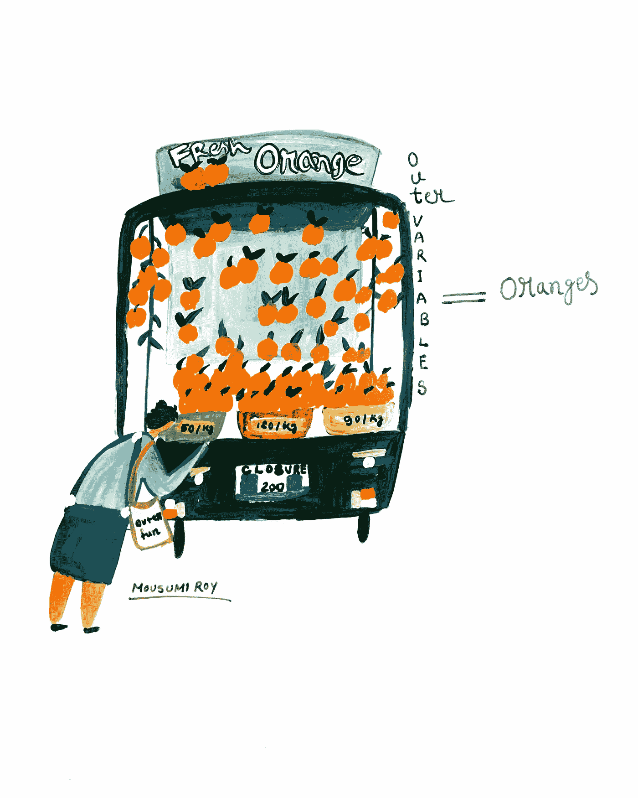
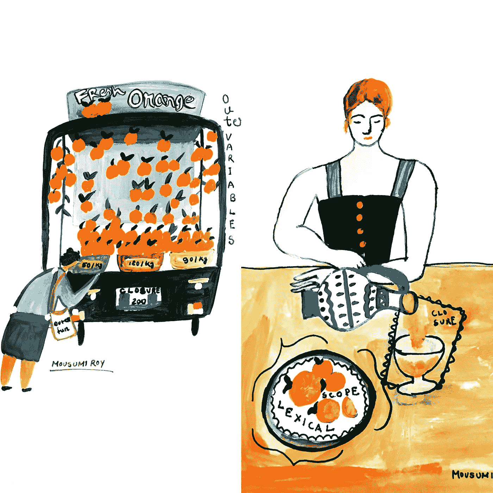
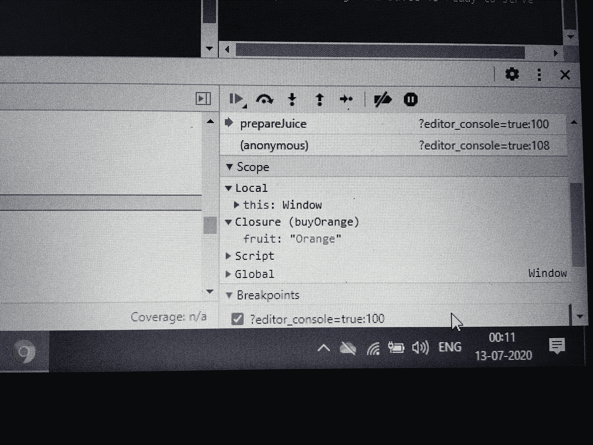

# JavaScript 闭包的一个实时例子

> 原文：<https://blog.devgenius.io/a-real-time-example-of-javascript-closure-b10687d66e72?source=collection_archive---------8----------------------->

**嘿！你过得怎么样？今天我要给大家讲一个结局故事。这很有趣，也很容易记住。我们都知道在 JavaScript 中，这是一个经常被问到的问题，什么是闭包？你能给出一个实时的例子吗？**

在上图中，你可以看到一位女士正在外面的手推车上买橘子。想象这是一个外部函数，橘子是一个变量。那位女士把那些橘子带回家。现在你认为她在内部功能。现在她想喝一杯橙汁。所以她切了几个橙子，把它压扁，然后倒进一个罐子里。在这个过程中，她返回了装在玻璃容器中的果汁。

> 永远记住闭包从词法范围捕获变量。

现在，如果我以编程方式编写整个过程，它会是什么样子？

函数 buyOrange () {

让水果=“橘子”；//词法范围

函数 prepareJuice() {

调试器

Console.log("来个壁球吧:"+水果+ "&果汁好了")；//闭包

}

返回 prepareJuice

}

const serveJuiceInAGlass = buy orange()；

serveJuiceInAGlass()；

如果你在 jsfiddle 或 codepen 或其他任何地方运行这段代码，你可以在控制台上看到内部作用域闭包是 buyOrange

> 这不是很简单吗？

现在，如果有一个不同的场景，让我们看看它会如何表现。这一次，她的一个朋友突然出现，让她大吃一惊。她很高兴见到她的朋友。她礼貌地问她的朋友，你想喝点果汁吗？

她的朋友，当然！这次她想让她的朋友们为果汁选择一种口味。然后，她开始闲聊，几分钟后，她做了一个果汁，她的朋友选择，并为她服务。

现在让我们创建函数。

函数 prepare juice(flavor){

返回函数(){

调试器

setTimeout(_ => console.log('做了一个$ { flavour }果汁！),1000)

}

}

const serveJuiceLater = prepare juice('西瓜')；

serveJuiceLater()；

## 此处关闭(准备果汁)

> 封闭优势

*   范围不是在块级别，而是在函数级别
*   许多功能是事件驱动/异步的
*   通过信息隐藏进行封装

## 要记住的事情

因为闭包可以访问外部函数中的变量，所以它们通常用于两件事:

1.  来控制副作用
2.  创建私有变量。

感谢您阅读我的文章。如果你喜欢这篇文章，请为它鼓掌。请随时过来问任何问题。为了结束，让我们干杯！