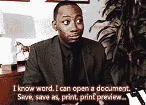

# 回顾我在大会上的软件工程沉浸式体验——在 12 条推文中

> 原文：<https://blog.devgenius.io/a-recap-of-my-software-engineering-immersive-experience-at-general-assembly-in-12-tweets-d750fa95c766?source=collection_archive---------3----------------------->

我不知道我让自己陷入了什么样的境地…

那些是快乐的日子。虽然银行余额应用程序确实让我的钱跑了一趟(双关语)。

我仍然支持设计理念…我不支持代码。老实说，我害怕重新审视这个项目。只能说是一个很好的例子来表现“我走了多远”哈哈。

和 API 一起工作真的很有收获。我仍然不太明白为什么人们会免费赠送它…

现在，我开始觉得我可以自己制作一个严肃的应用程序了。一直想搞清楚怎么做一个用户数据库。这对于只使用过 wordpress 和拖放网站(Wix、Squarespace、Shopify)的人来说很难。所以这周让我很兴奋。

虽然这个应用程序是在 Sinatra 上运行的，现在我会在 Rails 上运行，但我仍然为这个项目感到非常自豪！我实现了我在课堂上学到的所有东西，坚持专注于构建我的表格，并有能力对所有表格进行 CRUD。

后来我知道 jQuery 有点过时了，React 是所有酷孩子都用的。

“信息过载”又名:

我意识到和团队一起工作是真实的世界——但是要有版本控制！我的团队很棒，我从他们身上学到了很多。使用谷歌 API 很有趣。

确认:[越了解越觉得自己蠢](https://www.psychologytoday.com/us/blog/thinking-about-kids/201208/the-more-i-know-the-stupider-i-feel)

无可奉告。

用 NodeBots 创建我的最终项目真的很有价值，这是我们在课堂上根本没有过的东西。在软件行业呆了这么久之后，与硬件打交道让人耳目一新。

总的来说，我真的很喜欢在 GA 的时光，并强烈推荐它(有一些警告，请发电子邮件给我)。

现在开始找工作吧！

