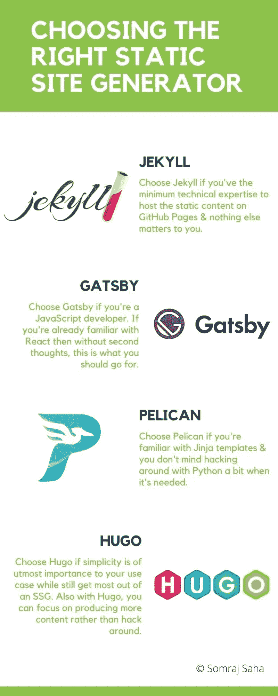

# 对一些最流行的静态站点生成器的回顾

> 原文：<https://blog.devgenius.io/a-review-of-some-of-the-most-popular-static-site-generators-e473aa5fa2f9?source=collection_archive---------1----------------------->

## 博客

## 流行的静态站点生成器简评。你应该使用哪一个，为什么&等等。阅读这篇相当长的文章时，一定要带上一份爆米花

好困惑！我应该使用哪个静态站点生成器？|来源:作者

好困惑！我应该使用哪个静态站点生成器？

当我开始写博客时，我在寻找一个平台来存放我的内容。我在以前的一篇文章中分享了我的困境。查看:[中型与静态站点生成器-计算机视觉工程师的困境](https://jarmos.netlify.app/posts/reviewing-popular-static-site-generators/static-site-vs-medium.md)。可以说，一年后我用这两个，&一个 SSG 创建了[我的博客](https://jarmos.netlify.app/)。

但是选择正确的[静态站点生成器](https://www.cloudflare.com/learning/performance/static-site-generator/) (SSGs)从来不是一件容易的事情。我环顾四周。尝试了几个可用的选项。我发现了一些事情。每个站点生成器在某些方面都是独一无二的，或者其他的&会比其他的有一些优势。

记住这一点，我必须记下我的具体要求。以下是我写博客的需求:

1.  在 [Markdown](https://www.markdownguide.org/) 中写入内容。
2.  专注于提供高质量的内容，而不是美学。避免在黑客和建立开发环境上花费时间。
3.  尽可能自动化我工作的某些方面。

我缺乏经验也没有帮助&我最初尝试用杰基尔失败了。于是，我跳槽去了[Gatsby](https://www.gatsbyjs.com/)&[GitHub Pages](https://pages.github.com/)也没有成功！*感叹*。所以，我又快速切换到了[鹈鹕](https://blog.getpelican.com/) &用它来处理我的前几篇文章。

唉，我也不能对鹈鹕忠诚太久。在本文中，我进一步证明了我经常从一种工具切换到另一种工具的理由。但是，雨果到现在还没有让我失望，所以让我们看看我能坚持多久。

此外，如果你读到这里，你可能会对自己说，我是多么善变。也许我是善变的。但如果说我从这次经历中学到了什么？这将是我对各种 SSG 如何以自己的方式实现相同目标的公正看法。因此，我想分享我的心得&给我的观众留下一份软件的详细评论。

所以，事不宜迟，让我们回顾一下一些最流行的静态站点生成器，或者至少是我用过的那些。

# 所有 SSG 都应具备的共性(默认)

将一个 SSG 与另一个进行比较并非易事。它们都服务于一个单一的目的，即生成静态内容。静态内容(*想 HTML，CSS & JS 文件*)然后通过互联网上的 CDN 提供。因此，没有一个站点生成器比其他的更好。

但是，为了简洁&一个精确的回顾，我们需要在共同的基础上回顾每个站点生成器。因此，审查现场发电机将更容易(*和相关的个人需求*)。

也就是说，以下是审查每个站点生成器的常见方面:

*   **简单的安装过程**——安装现场发电机不应该是火箭科学。即使对于一个非技术人员来说，设置最少的障碍也是足够容易的。
*   清晰的文件——这一点怎么强调都不为过！一个经验丰富的开发人员可能会在指令不足的情况下四处乱搞&仍然可以解决他们的问题。同样不能说一个非技术人员。因此，文件越容易遵循，SSG 就越好。
*   **易用性** —虽然文档可以简化工具的使用，但某些工具并不总是如此。Pelican &使用 Jinja 模板就是一个例子。或者 Jekyll & Liquid templates 来定制网站的美学。这些额外的工具通常会增加使用工具的学习曲线。因此，在一个假想的世界里，没有额外工具的 SSG 是这项工作的完美工具。所以，如果你的偏好是制作内容，那么选择没有额外麻烦的工具。
*   主题的可用性——我不明白为什么一个站点生成器不能提供广泛的主题供选择。尤其是当有像[Wordpress](https://wordpress.com/)&[Wix](https://www.wix.com/)这样的选择时。主题的可用性是必须的，不管是付费还是免费的。
*   **定制主题的便捷性**——如果你不能根据自己的需求定制主题，那么拥有一份现成的主题列表又有什么意义呢？考虑到品牌个性化的重要性，不提供这个选项是显而易见的。我们将看到定制您选择的主题是多么容易。如果主题是开源的，还会有额外的荣誉！❤️

所以，这些都是我们将要讨论的所有站点生成器的共同点。

也就是说，让我们深入研究一下，回顾一下站点生成器。

# Jekyll:支持 GitHub 页面的静态站点生成器

Jekyll 是[宣传的](https://docs.github.com/en/github/working-with-github-pages/setting-up-a-github-pages-site-with-jekyll)为你所有博客需求的一站式解决方案。它有望开箱即用，无需太多配置&复杂的设置。到目前为止，它是本文提到的所有其他 SSG 中最容易使用的一个。再加上太容易安装，软件有据可查。官方文档可在:[jekyllrb.com/docs/](https://jekyllrb.com/docs/)获得。

关于它的易用性，事情变得有趣了。嗯，你看，在本地机器上安装 Jekyll 首先是不需要的。你可以手写一个单页的网站(*)*！).将其保存为`index.html`，将其推送到名为`https://<YOUR-USERNAME>.github.io`的远程存储库。GitHub 将为你的网站提供你选择的 Jekyll 主题。

和哲基尔一起工作就是这么简单。查看官方 [GitHub 页面](https://pages.github.com/)登陆页面了解更多澄清。

但是想想你自己，你想手写标记文件吗？如果是你，见鬼，你根本就不需要 SSG！但是要我说，您最好使用 SSG 来生成静态文件。您会发现标记中的错误更少&此外，默认情况下，使用 SSG 可以实现良好的 SEO 实践。

也就是说，我观察到 Jekyll 有最大的主题集合。虽然有些是免费的&由社区维护，但也有高级的。所以，如果你想为自己的公司创建一个博客或登陆页面，总会有一个适合你的主题。找到一些主题的一个很好的地方是官方的[杰基尔主题](https://jekyllrb.com/docs/themes/)页面(*它们都是免费的**😉).在谷歌上习惯性地搜索“*化身主题*，你会找到更多。*

*定制 Jekyll 主题并不像使用 Jekyll 那样简单。你需要学习使用一种叫做 [Liquid](https://shopify.github.io/liquid/) 的模板语言。最重要的是，Jekyll 甚至提供了更实用的工具来帮助你定制你的站点。所以，如果你不熟悉模板，你只能使用可用的主题。*

*但是从好的方面来说，对于 JavaScript 和前端开发人员来说，这是一个好消息。下一个 SSG ( *或者更确切地说是一个框架*)，叫做盖茨比，你可能会有更好的运气。*

# *Gatsby:构建静态站点的 React.js 框架*

*盖茨比标榜自己是一个 SSG，能够创建速度极快的现代网站。而且他们确实实现了他们的承诺，网站的加载时间看似不存在！但与文章中提到的大多数其他 SSG 不同，Gatsby 更多的是一个框架。它基于 React 组件，因此被认为是一个框架而不是 SSG。*

*虽然它对 JavaScript 开发人员来说效果很好，但其他开发人员可能会感觉受到了冷落。你看，要充分利用 Gastby，你首先必须非常擅长 JS。React 组件方面的经验也是一个优势。但是，并不是每个开发人员都懂 JavaScript。此外，学习一门新语言不是一朝一夕就能完成的。*

*但是从好的方面来看，盖茨比很容易安装。您可以使用`npm install -g gatsby-cli` &进行全球安装。没有什么比安置盖茨比更容易的了。没有必要在环境变量上浪费时间。*

*安装后，CLI 可以下载主题并生成静态内容。整个过程只有一步。设置主题不需要手动操作。*

*盖茨比[的纪录片](https://www.gatsbyjs.com/docs/)似乎也有所改进。我不得不承认他们的新网站设计看起来很漂亮，很容易使用。有了“*教程*”、“*操作指南*”等部分，文档导航再简单不过了。*

*所以，为他们尽可能使他们的文档变得容易理解和吸引人而喝彩。*

*但这是评论盖茨比的有趣之处。它是在牢记 JS 开发人员及其工具包的基础上构建的。所以，如果你是 JS 开发人员(如果你是前端开发人员就更是如此)，不要再看了。你不会找到比盖茨比更好的了。*

***它有一个集成的 GraphQL API ( *和一个基于 web 的 GraphQL IDE* )** 。虽然它是可选的&如果你觉得使用 GraphQL 很困难，也有选择退出的选项。*

*GraphQL API 使 Gatsby 能够从任何地方获取数据。需要你的降价文件来源于一个基于网络的内容管理系统，然后盖斯比让你涵盖？或者从文件系统中获取内容是您的偏好吗？那么盖茨比也把你包括在内了！*

*所以，如果你对后端系统没有经验，就不要再找了。见鬼，甚至有[教程](https://youtu.be/Lk9Cj8a6QJg)把一个 Firebase 数据库连接到你的盖茨比博客&上，你就可以开始了。你不再需要设置后端服务器&什么的。如果你是一名前端开发人员，你所要做的就是坚持你已经擅长的事情。*

*但是事情也没有到此结束！盖茨比生态系统为用户带来了更多的好东西。它的插件系统&广泛的可用主题是无与伦比的。有了广泛的可用主题和广泛的插件系统，你可以用你的博客做无限的事情。*

*还有人说，“前端开发人员不是真正的程序员”🤨。如果你问我，盖茨比开发者做得很好。为前端软件启用后端功能是非常值得称赞的。*

*但是，尽管盖茨比的一切看起来都很好，但有一点需要注意。如前所述，它是从前端开发人员的角度构建的。所以，除非你精通 JavaScript ( *和/或 React* )，否则你就不走运了。这是对一款优秀软件的重大打击。*

*可以说，作为一名 Python 开发人员，使用 Gatsby 太难了。如果我必须定制主题，哪怕只是一点点，我必须精通 JavaScript。不要忘记对 React 组件的深入了解。😔*

# *Pelican:用 Python 构建的静态站点生成器*

*那么，如果前端技能不是我的强项，还有什么其他选择？*

*这就是用 Python 构建的静态站点生成器 [Pelican](https://blog.getpelican.com/) 大放异彩的地方。因此，您还需要在您的机器上安装 Python。*

*此外，如果你是一名后端开发人员，你的系统上可能已经安装了 Python。因此，安装 Pelican 只需要一个`pip`命令。这就像运行`pip install pelican`命令&一样简单，您可以让 Pelican 工作。*

*现成的 Pelican 支持以`.rst`格式编写的文件。但是你甚至可以在 Markdown 上写文章。您只需要用`pip install "pelican[markdown]"`命令安装依赖项。这应该可以安装额外的东西来将 Markdown 文件转换成 HTML。*

*但另一方面，在撰写本文时，该软件已经有十多年的历史了。因此，不像其他网站生成器，鹈鹕显得平淡无奇。我认为它的部分 API 对于现在的开发者来说可能很难读懂。*

*鹈鹕的年龄也到处可见。它的登陆页面看起来像是在 90 年代初建造的。主题和配置系统也很原始。对一些人来说，这可能是一个重大的交易破坏者&没有吸引力。他们这样想是对的。*

*Pelican 站点在一个`pelicanconf.py`文件中配置了[全局变量](https://docs.python.org/3/faq/programming.html#how-do-i-share-global-variables-across-modules)。有些变量是由 Pelican 预设的，而主题作者也可以添加他们自己的变量。换句话说，Pelican 可以使用任意范围的设置！这可能听起来很好，但对鹈鹕来说，它并没有像你很快就会看到的那样好。*

*像大多数维护良好的 Python 项目一样，Pelican 也是由一个活跃的开发团队维护的。他们已经很好地记录了这个软件，但是还可以做得更好。这也是其他 Python 项目面临的问题。这是因为作者依赖于从源代码的文档字符串中自动生成他们的文档。因此，您可能经常会注意到某些 Python 项目文档缺乏“人情味”。*

*不管怎样，大多数文档问题都是可以解决的。但我担心鹈鹕群体不会有同样的遭遇。虽然鹈鹕有很多主题，但是你猜怎么着？大部分主题都没有维护([来源](https://github.com/getpelican/pelican-themes/issues/677))！*

*因此，如果你使用的是带有主题的 Pelican，祝你好运，如果你遇到了问题的话。还记得鹈鹕主题的作者如何在预置的基础上添加他们自己的任意设置吗？这是它回来咬鹈鹕生态系统的地方。*

*想象你找到一个你喜欢的主题。为你的博客安装它，只为它打破了最新的鹈鹕安装。你没有办法修复它，因为主题作者已经 5 年没有对回购做出承诺了。很悲伤，不是吗？*

*最重要的是，如前所述，大多数主题看起来陈旧乏味。您可以自定义它们或从头开始创建一个。但是这需要使用 [Jinja 2](https://jinja.palletsprojects.com/en/2.11.x/) 模板的知识。Jinja 模板也有一个轻微的学习曲线。所以，当你的时间可以更好地用来写博客时，祝你好运。*

*那么，在一天结束时，您应该何时/为什么使用 Pelican？你是一个 Python 后端开发人员，有使用 Jinja 模板的经验。此外，如果 SEO 和网站的其他美学价值对你来说不重要，那么 Pelican 是你的正确选择。*

*但是，如果你关心效率和适当的时间管理呢？还有雨果给你。下一节详细介绍了雨果作为 SSG 的评论。*

# *Hugo:有史以来最快的静态站点生成器*

*[Jamstack](https://www.jamstack.com/generators/) 将 Hugo 列为第二大最受欢迎的站点生成器。紧随其后的是盖茨比，只有一小部分 *GitHub 明星*。*

*此外，它还是 JavaScript 框架领域中为数不多的非 JS 软件之一。它的流行主要是由于它生成静态内容的速度。此外，它的漂亮，现代和搜索引擎优化友好的主题的可用性也是一个被低估的方面。*

*Hugo 是用 [Go](https://golang.org/) 构建的，所以你只需要调用一个二进制文件就可以开始使用 Hugo 了。不需要安装。您可以在官方文档的“[入门](https://gohugo.io/getting-started/installing)”部分找到详细的安装说明。*

*这里还需要注意的是，Hugo docs 是迄今为止我在其他地方见过的最详细的文档。开发人员对其余的文档也很罗嗦。所以，给他们额外的荣誉！*

*如果到现在还不明显，我无法欣赏 Hugo dev 使他们的文档尽可能具有包容性的努力！他们对冗长的关注值得称赞。他们在阐明文件时没有留下任何未触及的角落。所以我的 Python 开发者伙伴们，向 Hugo 开发者们学习一下如何写好文档。😜*

*此外，能够调用单个二进制文件，安装 Hugo themes 也是小菜一碟。你所要做的就是将你喜欢的主题克隆到`./theme/`目录中。通过更新设置了主题的文件`config.yml`来确保你的 Hugo 知道使用哪个主题。*

*同样，相信我，但是，你要花一两天的时间仔细阅读可用的主题列表！它们不仅每一个都很现代，而且大部分都维护得很好。*

*关于这一点，如果你想知道定制主题有多容易，我会说，它们并不难。此外，官方的 Hugo docs 会支持你，以防你被困在某个地方。😉*

*在走上定制商店这条路(*或者甚至建立你自己的主题*)之前，你所要知道的就是 [Go 模板](https://golang.org/pkg/text/template/)。Hugo 使用 go 强大的模板语言。与 Liquid 和/或 Jinja2 不同，Go 模板非常直观。最重要的是，您也不必放弃现有的前端技能。再加上 Go 模板，你就可以建立一个看起来完全不像静态网站的网站。*

*所以，如果你问我？我想说，不管你有什么特殊需求和/或技能水平，Hugo 都是你的最佳选择。这是来自一个没有 Golang 和/或 JavaScript 工作经验的 Python 开发人员！有了 Hugo，我可以专注于制作更多内容，而不是开发前端内容。*

*对我来说，回顾这些工具并不难&决定哪种工具适合哪种用户。所以，下面是我对根据个人需求选择合适工具的最终想法。为了让你更容易总结一篇相当长的文章，我为它制作了一个信息图。所以，下一次当你不知道使用哪个站点生成器时，信息图将会派上用场。*

**

*信息图:选择正确的静态网站生成器|来源:作者*

*说了这么多，做了这么多，一定要让我知道你是否喜欢阅读这些内容。在 Twitter 上找到我: [@Jarmosan](https://twitter.com/Jarmosan) 和/或[订阅我的时事通讯](https://jarmos.ck.page/newsletter)，将个性化内容发送到您的收件箱。*

**原载于 2021 年 2 月 4 日*[*https://jarmos . netlify . app*](https://jarmos.netlify.app/posts/reviewing-popular-static-site-generators/)*。**