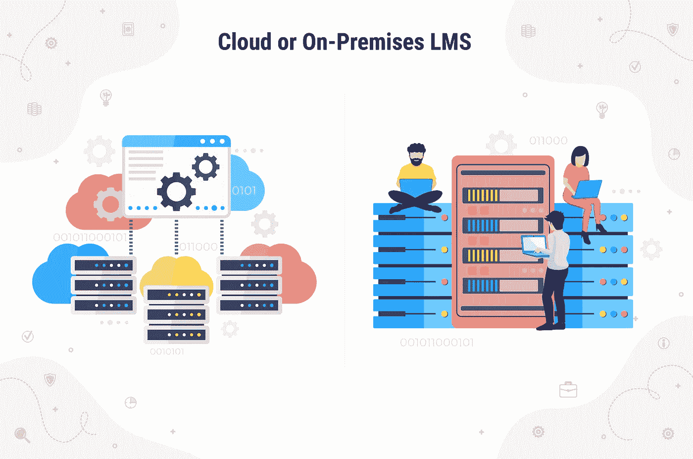
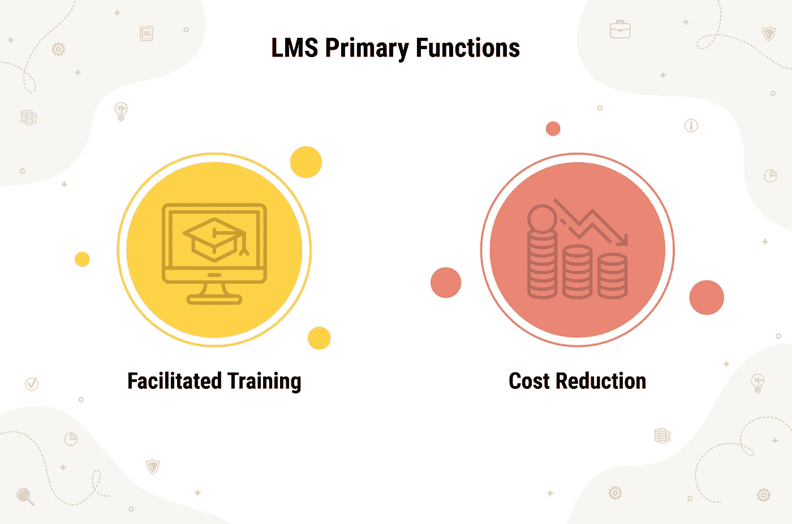
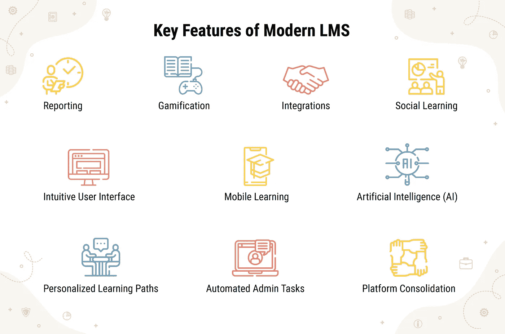

# 什么是学习管理系统的简短指南

> 原文：<https://blog.devgenius.io/a-short-guide-to-what-a-learning-management-system-is-53c04763bbca?source=collection_archive---------11----------------------->

## 什么是 LMS，如何选择合适的 LMS，系统的主要功能和优点是什么，现代 LMS 在功能方面应该提供什么？让我们来解决这个问题！

员工的教育和培训计划在许多企业中都很常见，有了 LMS，公司可以大大减少在这类培训上的时间和金钱投入。那么什么是 LMS，如何选择合适的 LMS，系统的主要功能和优点是什么，现代 LMS 在功能方面应该提供什么？让我们来解决这个问题！

# 什么是 LMS？

LMS 代表学习管理系统，是电子学习的“引擎”,有助于创建、管理和交付任何类型的课程。每个 LMS 都由两个关键元素组成:服务器组件和 UI。

*   第一个负责提供核心功能，包括身份验证、通知交付、数据管理等。
*   后者是引擎中发生的事情的可视化表示，因此管理员、教师、学生和其他类型的用户可以轻松使用 LMS。

# LMS 有哪些类型？

并非所有的 LMS 都是平等的。实际上，根据需求，可以从不同的选项中进行选择。首先，学习管理系统分为免费和商业两种。

# 开源或商业 LMS

当在免费和商业选项之间进行选择时，重要的是要考虑每种类型提供的好处和缺陷，以做出正确的长期决策。

开源软件最明显的好处是它是免费的。然而，免费选项通常是为老练的用户设计的，并且需要支持服务来帮助新手用户。

与开源软件相反，商业软件是按照特定用户的需求定制的，这就是为什么它对初学者来说更容易使用，也更容易部署。但是陷阱是这样的解决方案通常要付出巨大的代价。然而，这是值得的。

商业软件有两种形式:云和内部部署。让我们更详细地看一下每一个。

# 云或本地 LMS

在大多数情况下，可扩展的商业学习管理系统可以通过以下方式获得:

*   **本地或本地托管解决方案**

尽管本地托管的 LMS 可以在其所有者一方进行定制、升级和支持，但它需要有一个内部 it 团队。因此，该解决方案成为拥有 IT 人员的公司的最佳选择。

*   **云，或托管在厂商端的解决方案**

通常，它是以软件即服务的形式出现的(SaaS)。就云解决方案而言，每月的支持和升级都是由供应商完成的，确保在需要时轻松扩展。

还有各种集成解决方案，以及那些有能力和没有能力创建学习课程的解决方案。

# LMS 主要功能

尽管现代 LMS 有一系列共同的功能，但有两个至关重要的功能:培训便利和降低成本。

# 促进式培训的 LMS

该功能是通过生成、分发和跟踪员工培训来实现的。此外，LMS 确保培训本身对那些接受培训的人来说更令人兴奋和有趣，这意味着材料将被更好地学习。当涉及到统计数据时，它表明使用 LMS 的培训往往会将保留率提高 25%到 60 %，而传统的培训结果只有 8%到 10 %。

# 降低成本的 LMS

诚然，LMS 的开发需要大量的资金投入，但事实是，在大多数情况下，该系统为自己买单。最好的证明之一可以从思科公司的例子中看出，该公司通过 LMS 将其总体培训成本削减了约 40%至 60%。诀窍在于，电子学习使公司摆脱了与租赁物理学习空间/教室相关的投资，以及雇用专业人员和不断在纸质产品上花钱。

这两种功能对企业都非常有利。然而，LMS 提供的优势列表并不局限于这两个，所以让我们看看它还提供了什么。

# 学习管理系统软件的主要优势

如果我们概括 LMS 的好处，精简的学习活动正成为它的关键好处。以下是学习管理系统如何让这成为可能:

## **容易获得的培训**

LMS 可以在桌面、网络和移动设备上工作，这样就为培训提供了更多的机会。

## **量身定制的培训课程**

有了 LMS，你可以调整你的训练计划以适应任何类型的用户，无论是新手还是熟练掌握技能的用户。

## **所有学习资料放在一起**

将所有需要的培训材料放在一个地方并随时可用的便利性确保了更高效、更有成效的培训。

## **嵌入式分析**

LMS 中的分析工具确保您能够分析学习模式并调整系统以进行更个性化的学习，从而获得更好的结果。

## **自动化学习过程**

没有必要在日程安排、邀请和后续支持等重要而耗时的任务上浪费时间。

如您所见，LMS 以最有益的方式影响了电子学习。但是一旦系统彼此不同，选择或开发一个系统就需要关注其特性。

# 现代 LMS 的主要特征

那么现代学习管理系统的必备功能是什么呢？前 10 名包括:

当然，这些只是确保您系统现代化的一般要求。然而，您可能不需要上述的一些特性，或者需要一些其他的特性来获得成功的性能。最棒的是，你可以包含任何你需要的东西，按照你公司的特定需求和目标来构建你的系统。

# 底线

LMS 提供广泛的功能，自动化某些任务，并提供一系列的好处，成为公司处理电子学习课程的强大工具。然而，这种系统提供的大量机会有时会令人困惑，尤其是在开发阶段。因此，除了清晰地描绘出需要做什么之外，公司还应该非常注意选择供应商。

在 Emerline，我们通常从与[咨询服务](https://emerline.com/services/technology-consulting)合作开始，这包括对您的业务进行深入分析，以确定其关键目标、观点和预期结果。在分析的基础上，我们的专家将为您提供一个全面的解决方案，帮助您取得业务成功。在与您就所有细节达成一致后，我们将组建一个专家团队，帮助您实现这一目标。

我们利用最新的工具和技术，在预定的预算内按时交付，并采取一切必要措施确保富有成效的合作。因此，如果您正计划构建一个 LMS，或者想了解更多关于将其实施到您公司流程中的可能性或优势，[请联系我们进行免费咨询](https://emerline.com/company/contacts)。我们永远在这里，让你的技术梦想成真！

【https://emerline.com】最初发表于**。**