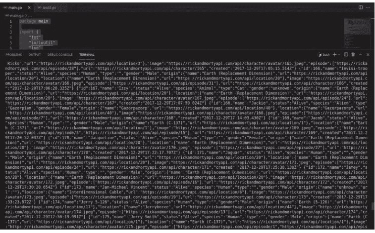

# Goroutines 和频道的简短介绍

> 原文：<https://blog.devgenius.io/a-short-intro-to-goroutines-and-channels-188f4332501c?source=collection_archive---------8----------------------->

由 [Chinmay Bhattar](https://unsplash.com/@geekgunda?utm_source=medium&utm_medium=referral) 在 [Unsplash](https://unsplash.com?utm_source=medium&utm_medium=referral) 拍摄的照片

并发和并行。相当复杂的话题。各种编程语言以不同的方式处理这个问题。有些真的很复杂，有些没那么复杂。但是许多开发者会同意 Go 在这方面确实做得很好。它之所以能够如此出色地处理并发性和并行性，是因为它是在 21 世纪构建的，当时多核处理器已成为行业标准，而执行速度是关键。

**什么是 goroutine？**

Goroutine 本质上是一个非常轻量级的线程。如果你来自 Java，你可能会知道一个 Java 线程默认分配 1MB 的内存。另一方面，单个 goroutine 只分配 2kb(！) .它可以动态添加更多内存，但不会浪费内存。

**如何实现一个 goroutine**

现在让我们看一些代码。假设我不想访问第三方 API 来获取一些信息。我需要很多信息，而且要快。我知道从一个简单的 HTTP 请求中检索数据的大部分时间都花在了等待远程服务器的响应上，所以我决定使用并发。

为了使事情变得简单，我将一步一步来，首先用同步的方式来做。首先，我需要一个发送 API 调用并返回请求体的函数:

正如我们所知，作为一个网络调用，请求可能会出错，所以我检查是否有错误。我还调用了`defer r.Body.Close()`,因为这样我们告诉这个函数在完成请求后关闭请求体，就像我们在读取文件内容后关闭文件一样。

最后，我们给一个体变量分配一个调用 ioutil 返回的值。ReadAll 函数，它接受一个实现 io 的参数。Reader 接口(Go 中经常实现的接口)，并返回一个字节数组，之后我们可以很容易地将其转换为字符串。

现在让我们在主函数中调用这个函数。我将使用 Rick 和 Morty API:

太好了，我们得到了 100 号角色的一些信息，他的名字很幸运——“黑死病”。很好。但是，我们实际上需要所有瑞克和莫蒂角色的信息，而不仅仅是瘟疫先生。我们不想等几十秒或几百秒去得到它，我们现在就需要。Goroutines 前来救援:

如果你不熟悉 Go 语法，你可能会想——这个箭头在做什么？这种变化类型是什么？

为了让我解释，让我给你看一下可能预期的版本，以及我们如何在主函数中调用它(剧透警告:它不会像预期的那样工作):

现在，我们修改了 getDataFaster 函数，只打印结果，而不返回结果。稍后我会解释原因。我们还使用一个 for 循环来获取所有 200 个字符(实际上有更多的字符，但我们真的不想让 API 变得如此垃圾)。由于`i`是一个整数，我们将使用内置模块`strconv`将其转换为一个字符串。现在，最酷的部分来了。我们使用`go`关键字告诉 go 编译器我们希望这个函数异步运行，意思是运行得如此之快，好像所有 200 个函数调用都在同时运行。不幸的是，当我们运行它时，我们发现它什么都不做。

这不返回任何东西的原因是因为 main 函数本质上是它自己的 goroutine，它只是通过了 for 循环并退出。它不在乎其他 200 个 goroutines 还没有完成他们的工作。它完成了它的工作，现在想喝杯啤酒。

**进入频道！**

还记得那段带有箭头和`chan`的异常代码吗？那些是通道。通道本质上是一个存储来自我们的 goroutine 的一些值并使另一个 goroutine(在这种情况下是我们的主函数)获得该值的地方。结尾的箭头基本上是说——不要像在常规函数中那样返回`string(body)`,而是把它塞在一个通道中，因为这不是常规函数，它是异步的。

好的，但是主函数是如何访问这些值的呢？让我们看看下一段代码:

顺便说一句，这段代码包含了所有的包和导入声明，供那些只是在这里进行复制/粘贴的人使用。

如您所见，我们做的第一件事是使用内置的`make`函数声明一个通道。信道也需要强类型，所以我们声明一个只保存字符串的信道。接下来，我们声明一个名为 *data* 的字符串片段，我们计划在其中存储所有这些古怪的 Rick 和 Morty 角色的所有信息。我们像以前一样进入 for 循环，但是现在我们又有了这个奇怪的箭头。这一次，通道不是接收端的通道，而是发送端的通道。我们在这里做的是将通道为我们保存的值附加到我们的数据片。

这样我们就开始了封锁行动。这意味着主函数将阻塞，直到从通道中实际获得一个值。这就是我们如何让主函数等待，而不是像第一次那样不小心退出。

这也是我们不能给一个对 goroutine 的调用赋值的原因(我说过我会在后面解释)，因为它是异步的，它不会返回任何值，它只能把它加到一个通道上。

最后，我们将所有内容打印到控制台，因为它获取了 200 个结果，您的控制台可能会像我的一样崩溃:

这就是了。这是一种非常优雅的方式，通过使用 goroutines 和 channels 来快速检索大量数据。

这篇文章到此为止，如果你喜欢它，你可以通过[这个链接](https://pavledjuric.medium.com/membership)订阅 Medium 来支持我。你将获得所有写在介质上的文章。

感谢阅读！