# 区块链的简短视觉指南

> 原文：<https://blog.devgenius.io/a-short-visual-guide-to-blockchain-9ff59d0ac6fd?source=collection_archive---------21----------------------->

克林特·王茂林在 [Unsplash](https://unsplash.com?utm_source=medium&utm_medium=referral) 上拍摄的照片

当你想到区块链时，你指的是一个将人们聚集在一起的系统。

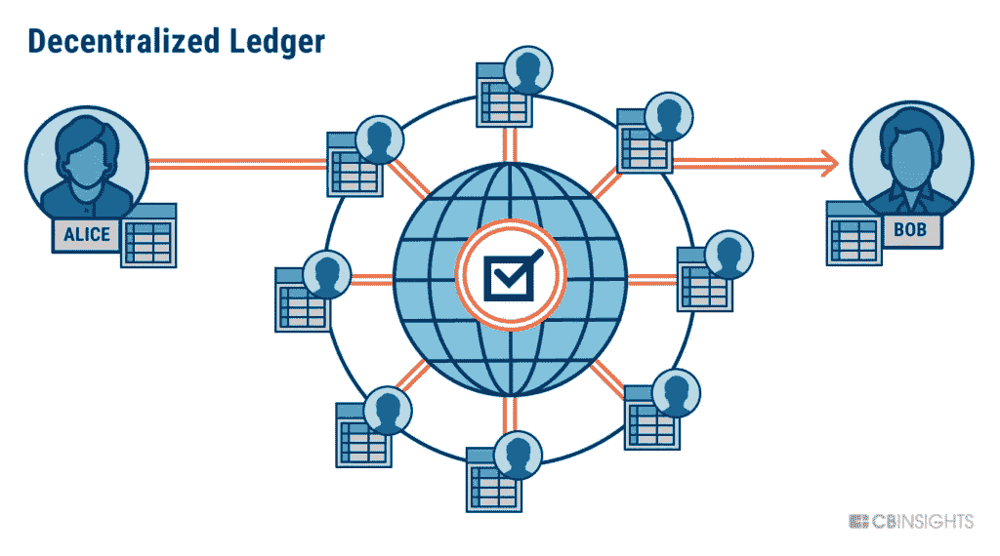

[https://www . CB insights . com/research/what-is-区块链-科技/](https://www.cbinsights.com/research/what-is-blockchain-technology/)

这个想法类似于互联网，除了它是一个去中心化的系统。

## 什么是互联网？

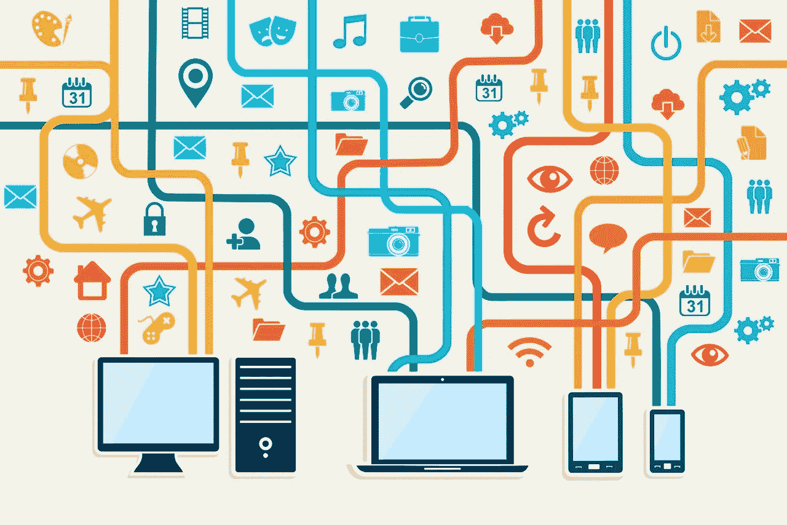

[https://www . internet society . org/blog/2022/04/common-internet-network-interconnecting-and-charging-practices/](https://www.internetsociety.org/blog/2022/04/common-internet-network-interconnection-and-charging-practices/)

互联网提供了一种连接终端用户访问海量数据(信息)的方式。

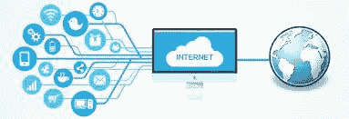

[https://windows101tricks.com/internet-vs-network/](https://windows101tricks.com/internet-vs-network/)

然而，理论上，每个人都拥有互联网。你只需要支付服务费。英雄联盟

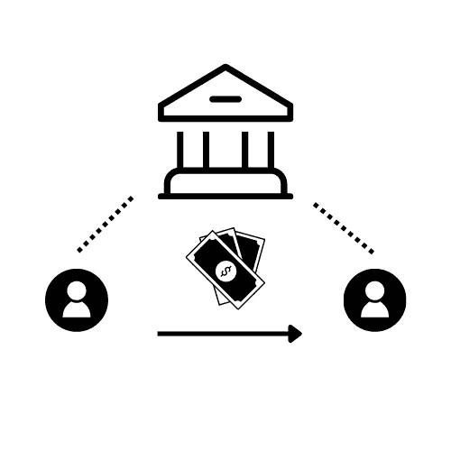

为什么让银行处理你的钱？相反，你可以用区块链代替银行。

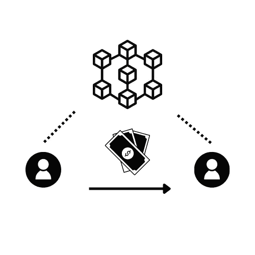

每个块包含存储在区块链中的单个交易或数据价格。

## **什么是云？**

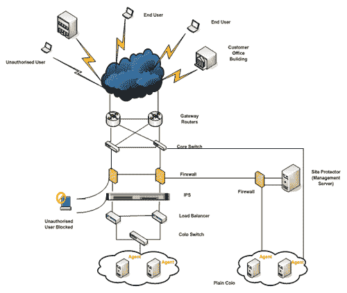

[https://www . relianceidc . com/HTML/product _ services/managed _ security/host _ shield/host _ shield _ how _ it _ work . HTML](https://www.relianceidc.com/HTML/product_services/managed_security/host_shield/host_shield_how_it_work.html)

云意味着数据可以随时随地访问。但是数据必须以物理方式存储在数据中心。像谷歌一样，他们在世界各地都有数据中心。

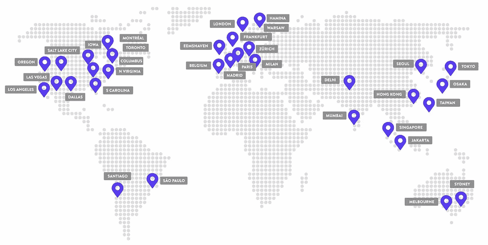

[https://kinsta . com/知识库/Google-cloud-data-center-locations/](https://kinsta.com/knowledgebase/google-cloud-data-center-locations/)

## **区块链=互联网？**

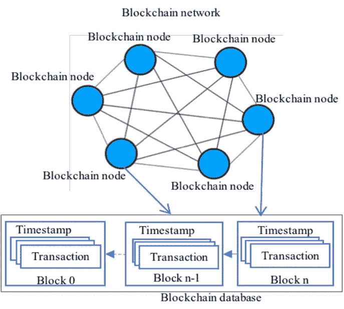

[https://www . research gate . net/figure/block chain-network-database-blocks-and-transactions _ fig 1 _ 326888946](https://www.researchgate.net/figure/Blockchain-network-database-blocks-and-transactions_fig1_326888946)

一个区块链网络的运行就像互联网连接着每一个节点。

每个节点或参与者通过互联网访问区块链网络，并将他们的计算机或节点连接到区块链应用程序以执行“工作”。

## **区块链=云？**

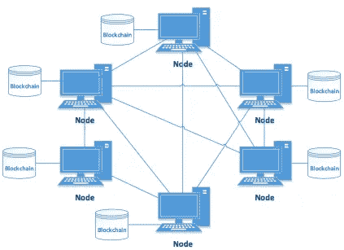

[https://www . researchgate . net/figure/block chain-P2P-Network _ fig 1 _ 320127088](https://www.researchgate.net/figure/Blockchain-P2P-Network_fig1_320127088)

区块链是分布式数据库或分类帐，在节点之间共享信息。

另一方面，云是由中央实体运行的计算服务，提供对软件、存储、数据库等软件服务的访问。

## 谁提供互联网供应？

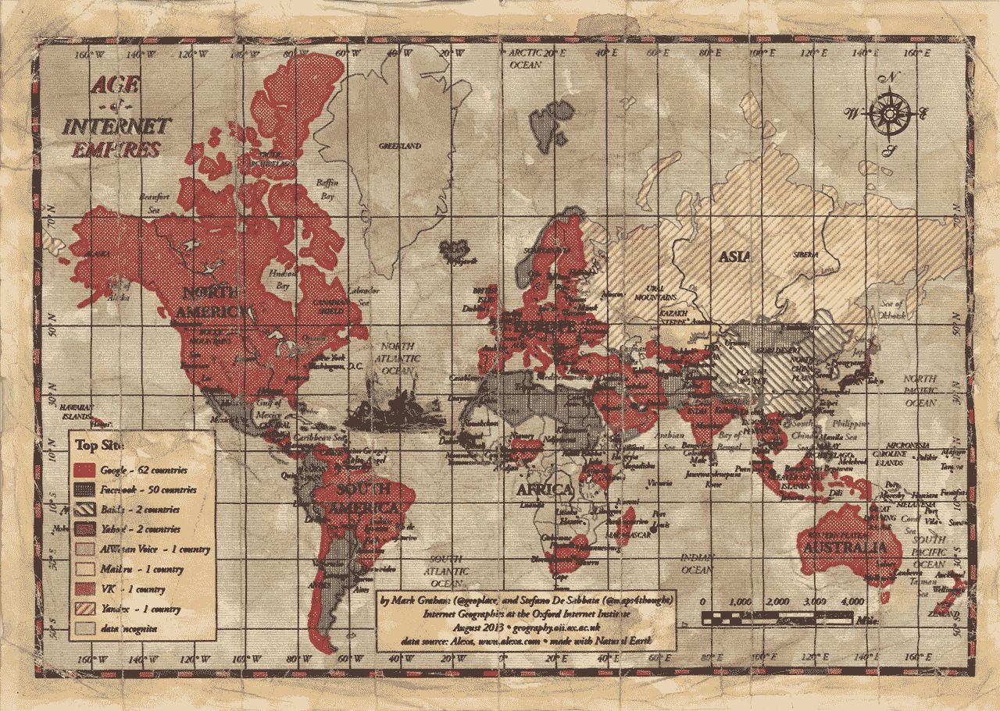

[https://www . weforum . org/agenda/2016/02/who-are-the-great-internet-powers/](https://www.weforum.org/agenda/2016/02/who-are-the-great-internet-powers/)

一些玩家凭借他们的云服务统治了互联网。

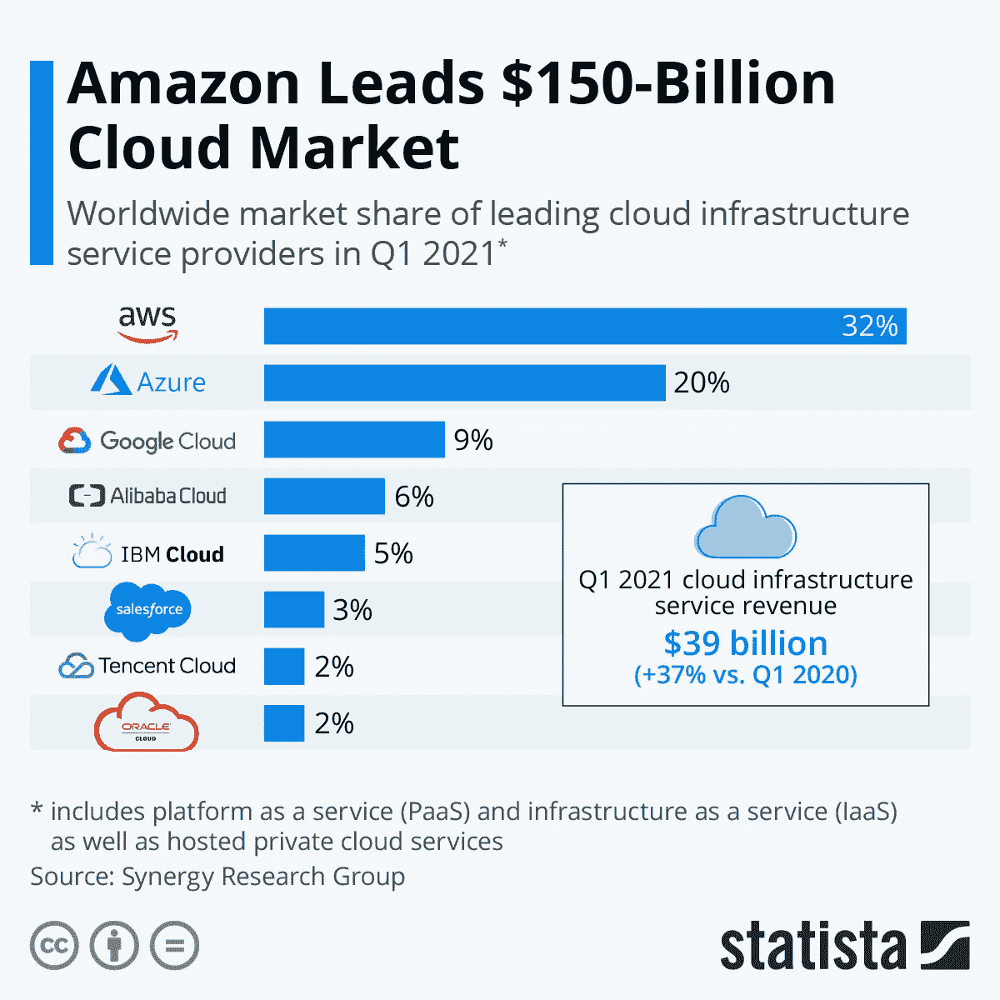

[https://plrfreeonline . com/AWS-leads-cloud-infra structure-in-Gartner-魔力象限/](https://plrfreeonline.com/aws-leads-cloud-infrastructure-in-gartners-magic-quadrant/)

区块链公司正在迎头赶上。

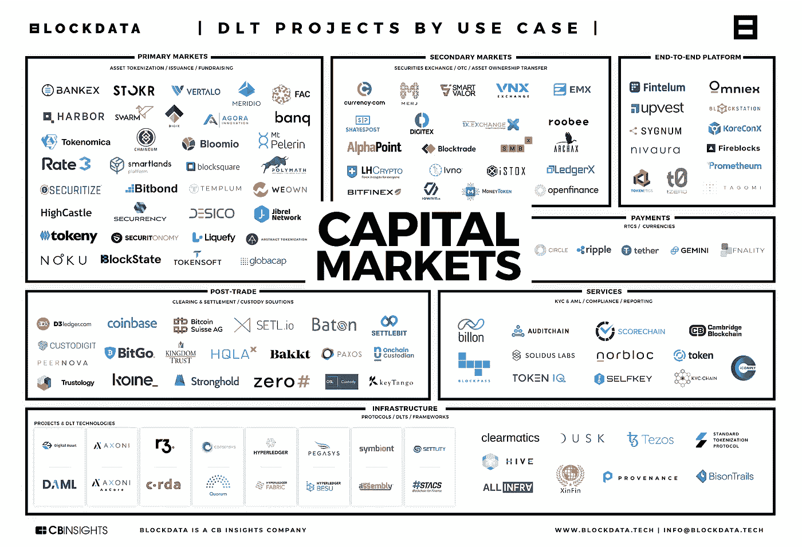

[https://www . CB insights . com/research/区块链-资本-市场-分布式-分类帐-技术-市场-地图/](https://www.cbinsights.com/research/blockchain-capital-markets-distributed-ledger-tech-market-map/)

互联网公司和区块链的区别在于，单一实体拥有互联网公司，而区块链则是按节点拥有。

你不能宣称成为一个成功的实体，但你可以通过使用你的笔记本电脑很容易地成为一个节点。

互联网公司意识到区块链技术可能会改变未来的游戏。

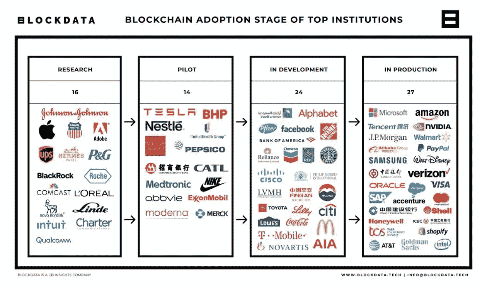

[https://forkast . news/81-of-top-100-companies-use-区块链-technology-blockdata/](https://forkast.news/81-of-top-100-companies-use-blockchain-technology-blockdata/)

以下是区块链过程的工作原理:

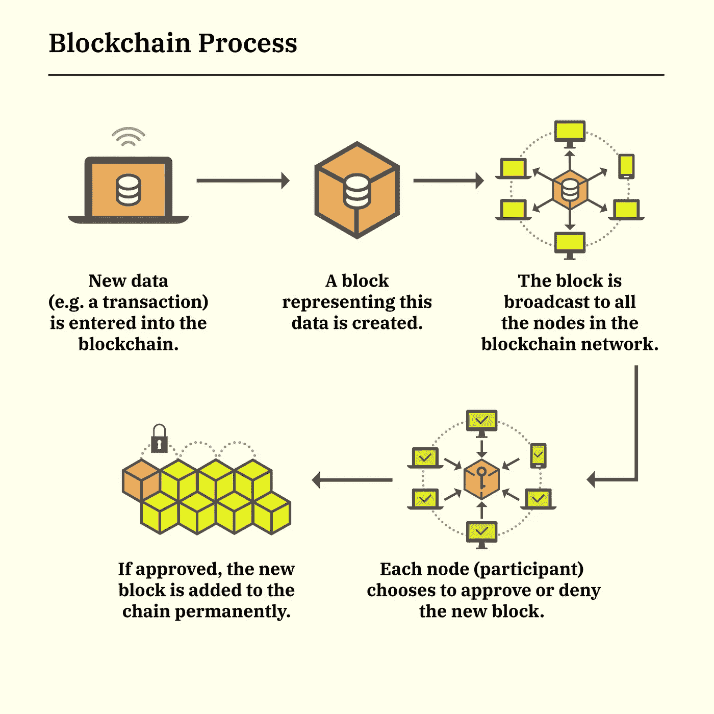

[https://money.com/what-is-blockchain/](https://money.com/what-is-blockchain/)

## 总而言之:

*   区块链是一本账簿
*   区块链是分布式的
*   区块链在互联网上运行
*   云运行在数据中心的顶部
*   块包含数据或信息

如果你喜欢读我的文章，请在这里给我买杯咖啡。