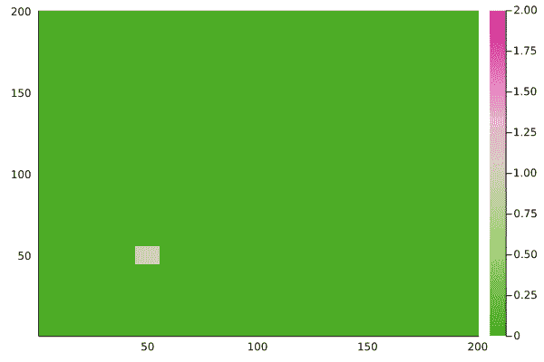

# Julia 中植物流行病的简单细胞自动机

> 原文：<https://blog.devgenius.io/a-simple-cellular-automaton-of-plant-epidemics-in-julia-29ac62d87516?source=collection_archive---------7----------------------->

我最近开始学习 Julia 编程语言，因为它简单的语法和高性能的前景吸引了我。我最初的一个小项目是一个所谓的细胞自动机，我用它在格子上模拟植物疾病的传播。

## 现实世界的动机

在葡萄栽培中，越来越多的酿酒师开始种植在一定程度上抗真菌病害的葡萄品种。典型的品种如梅洛或霞多丽对真菌疾病，即白粉病或霜霉病非常敏感。如果酿酒商不使用杀真菌剂来对付这些病原体，他们每年将损失大部分产量。关于葡萄藤疾病的更多细节，请查看 VineForecast 博客上关于白粉病和霜霉病的文章。

所以，你现在可能会问这样一个问题:“为什么不仅仅种植抗病品种？”问题是，大多数消费者并不真正喜欢用抗病品种酿造的葡萄酒。

因此，我想知道流行但敏感的品种与不太流行但有抗性的品种间作是否会减缓病害的发展，从而减少对敏感品种的杀真菌剂的使用。最初的假设是，抗病品种在某种程度上充当了疾病传播的波断路器，因此可以保护感病品种免受即将到来的疾病波。

# 细胞自动机

为了模拟间作田里的流行病，我使用了细胞自动机。元胞自动机由排列在晶格上的多个元胞组成。每个细胞都处于某种状态。这里，我使用了常见的 SIR 概念。SIR 模型( **S** 可接受， **I** 感染， **R** 移除)是一种典型的疾病建模方法。您可以在一个媒体中找到各种文章，向您介绍该模型的不同变体([)，例如 https://medium . com/forward-data-science/infectious-disease-modeling-part-I-understanding-sir-28d 60 e 29 fdfc](https://medium.com/towards-data-science/infectious-disease-modelling-part-i-understanding-sir-28d60e29fdfc))。

## 过渡规则

元胞自动机的动力学是由转移规则引入的。这些转换规则应用于模型的每个单元的每个更新步骤。为了简单起见，我们的细胞自动机只考虑两个转移规则。第一个规则定义了单元从状态 S 到状态 I 的转换，第二个规则定义了从状态 I 到 R 的转换:

1.  S → I:如果一个细胞的 8-邻域中的邻居被感染，该细胞以某种概率感染。
2.  I → R:如果一个细胞已经被感染，它会以一个概率 *p_removal 被移除。*

受到霜霉病严重损害的葡萄藤叶子

注意，如果 *p_removal > 0，则进入感染状态的细胞将最终被移除。这是对葡萄病害的合理假设，因为感染的葡萄组织不能从感染中恢复，最终会死亡。*

## 模拟间作

抗性和敏感性品种的间作可以通过给网格的细胞分配不同的 *p_infection* 值来建模。葡萄藤通常成排种植。因此，对于第一个实验，我选择了一个分布，其中每隔一行具有低的 *p_infection* (抗性品种)值，而剩余的行具有高的 *p_infection* (敏感品种)值。注意，同样在现实中，抗性品种对真菌疾病并不完全免疫，但具有一些降低病原体感染效率的能力。

# Julia 中的实现

这种细胞自动机的 Julia 代码基本上由一系列 for 循环和条件语句组成，其中三种状态使用一组整数值(0 → S，1 → I，2 → R)进行编码:

第 4 行到第 18 行用 200 x 200 点阵初始化模型，模拟 500 个更新步骤。为了启动动力学，感染细胞的第一个热点在左下角被初始化。感病品种的 *p_infection* 值设定为 50%,抗病品种设定为 2.5%。被感染的细胞有 20%的可能性被移除。

然后，第 20 到 44 行计算模型的演化。第 28 到 36 行实现 S → I 转换规则，第 39 到 41 行实现 I → R 转换规则。

最后，第 46 到 48 行为状态的演变生成一个 GIF。

疾病的演变，状态 S 为绿色，I 为浅棕色，R 为粉红色

你可以清楚地看到疾病在垂直方向的传播速度比水平方向快。因此，抗病品种的列，如预期的那样，减缓了疫情的横向传播。此外，在(几乎)所有单元都被移除的列和其中大部分单元保持状态 S(绿色)直到模拟结束的列之间存在交替模式。这正在重组抗感品种的分布。

接下来，让我们研究另一种抗性品种的分布是否更有能力减缓水平传播。为此，我将四列易感品种与四列抗性品种交替排列。因此，总的来说，与前面的实验中存在相同数量的抗性品种。

有趣的是，疾病的横向传播明显慢于之前的实验。向左的疾病波甚至完全停止。

# 结论

看起来，田间抗性品种的分布实际上影响了整体的病害动态。此外，将多列抗病品种并排放置的分布可能更有能力减缓疾病的传播。

然而，最初的感染往往不仅仅发生在一个地方，而是在整个领域更加均匀。在这种更现实的情况下，抗性品种的分布对整个疾病动态的影响可能更小。但这是另一篇文章；).

## 链接

*   [https://twitter.com/pjpetersik](https://twitter.com/pjpetersik)
*   https://www.instagram.com/vineforecast/
*   【https://www.vineforecast.com/en/ 