# 一个简单的基于内容的电子商务平台推荐系统

> 原文：<https://blog.devgenius.io/a-simple-content-based-recommendation-system-for-an-e-commerce-platform-5bc69af5737e?source=collection_archive---------3----------------------->

我在电商行业做了一年的数据专员。在与该行业合作期间，我负责为从不同供应商处获得的数千个数据集开发和执行数据清理和争论模型，这些供应商在电子商务平台上提供产品以方便获取。你可能已经观察到许多在线平台或企业使用个性化广告来建议购买什么、阅读哪篇文章、观看哪部电影、参加哪门课程以及在社交媒体平台上与谁交往。这告诉你用户体验的个性化最近是如何成为电子商务行业的一个主要优先事项，这需要更好的推荐系统。

本文的目的是解释我如何为尼日利亚的一个电子商务购物平台构建一个简单的基于内容的推荐系统。本文还将帮助您发现构建一个简单的基于内容的推荐系统是很容易的，它甚至可以用 KNN 算法给出更好的结果。也不用担心复杂性，它将帮助您开始构建一个。这项工作的完整代码可以在我的 [Github](https://github.com/orokgospel/MyShoplivery-Content-based-Recommendation-System.git) 上找到。

在详细介绍构建推荐系统的步骤之前，有必要在这里指出，作为一名数据科学家或工程师，更好地理解业务环境对于构建推荐系统是多么重要。

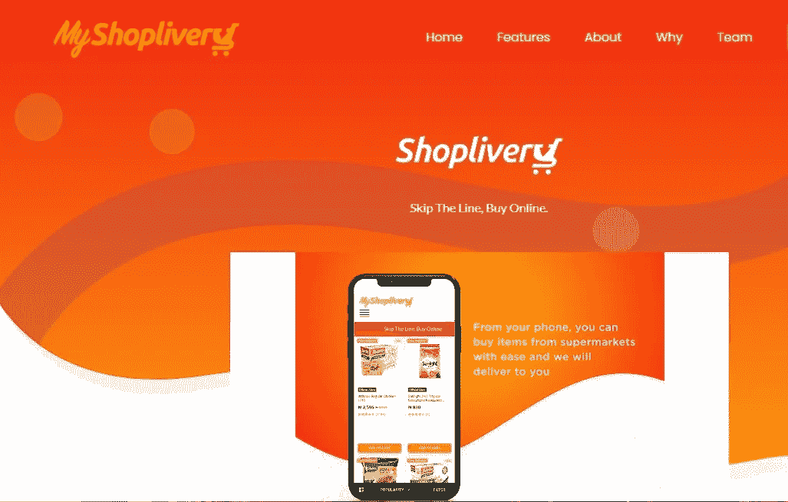

[尼日利亚电子商务购物平台和初创科技公司 MyShoplivery](https://myshoplivery.com/home/) 为数百万尼日利亚人开发了一个在线平台，让他们不用排队，在网上购买商品，送货上门。通过 MyShoplivery 应用程序，消费者可以在家中舒适地在尼日利亚的不同商店和地点购物，并快速送货到送货地址。

推荐系统是信息过滤系统，旨在预测用户偏好，并帮助推荐正确的项目，以创建用户特定的个性化体验。推荐系统有两种类型，**基于内容的过滤**和**协同过滤**。但是本文的中心是一个基于内容的过滤推荐系统，它可以根据项目元数据(比如描述、类别和标签)推荐相似的项目。

这种推荐系统背后的一般思想是，如果客户选择了一个特定的项目，他或她也应该喜欢与之相似的项目。并且用 [MyShoplivery App](https://myshoplivery.com/home/) 推荐这个，你可以通过手机走进商店，选择商品，付款，看着它们在几分钟内送到你家门口。

在执行构建基于内容的推荐系统的任何步骤之前，首先我需要导入必要的库来帮助开发推荐系统:

```
import pandas as pd
import numpy as np
import pandas as pd
import numpy as np
from nltk.corpus import stopwords
from sklearn.metrics.pairwise import linear_kernel
from sklearn.feature_extraction.text import CountVectorizer
from sklearn.feature_extraction.text import TfidfVectorizer #Import TfIdfVectorizer from scikit-learn
from nltk.tokenize import RegexpTokenizer
import re
import string
import random
from PIL import Image
import requests
from io import BytesIO
import matplotlib.pyplot as plt
%matplotlib inline
```

下一步是将 MyShoplivery 元数据数据集加载到 pandas 数据框架中。我从 MyShoplivery no business and non-fiction 获得了数据集。

可用的数据集有 8 个重要的列特性:

*   Id:哪个是项目编号
*   标题:它带有项目的名称
*   描述:这显示了每个项目的简要细节。
*   类别:这有助于识别不同类别中的项目。
*   标签:这包括关键字，以帮助项目属性容易识别
*   重量:可测量项目的重量
*   图像:每个项目的图像
*   价格:每个项目的价格价值

```
# Loading the myshoplivery data
myshoplivery_data = pd.read_csv('myshoplivery_data1 - Sheet2.csv', low_memory=False)
#Print the first three rows
myshoplivery_data.head(2)
```

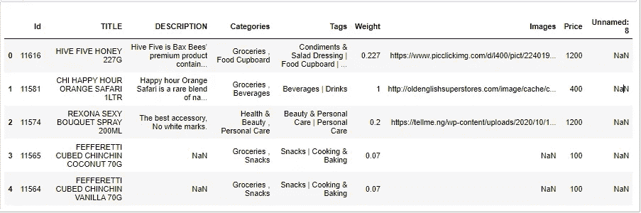

下一步是执行探索性数据分析(EDA)以了解数据集。

让我们来看看项目描述中顶级词性标签的字数分布:

```
# Calculating the word count for item description
myshoplivery_data['word_count'] = myshoplivery_data['DESCRIPTION'].apply(lambda x: len(str(x).split()))# Plotting the word count
myshoplivery_data['word_count'].plot(
    kind='hist',
    bins = 50,
    figsize = (12,8),title='Word Count Distribution for MyShoplivery Items')
```

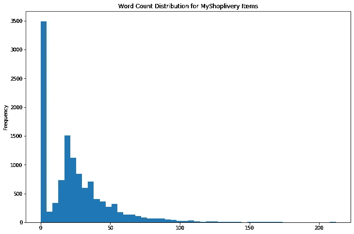

从上面的图来看，数据集没有太多冗长的产品描述。这也表明所使用的 Myshoplivery 数据集提供了简短的描述，有些没有描述。

**让我们通过绘制来检查 NA 的空值百分比**

```
import matplotlib.pyplot as plt
import seaborn as sns
%matplotlib inline
x = myshoplivery_data.columns
y = myshoplivery_data.isnull().sum()
plt.figure(figsize=(10,6))
sns.set()
sns.barplot(x,y)
ax = plt.gca()
for p in ax.patches:
    height = p.get_height()
    ax.text(p.get_x(),
            height + 2,
            str(100*round(int(height)/myshoplivery_data.shape[0], 3)) +"%",
            fontsize=10, ha='center', va='bottom')
ax.set_xlabel("Columns")
ax.set_ylabel("NA's")
plt.xticks(rotation=80)
plt.show()
```

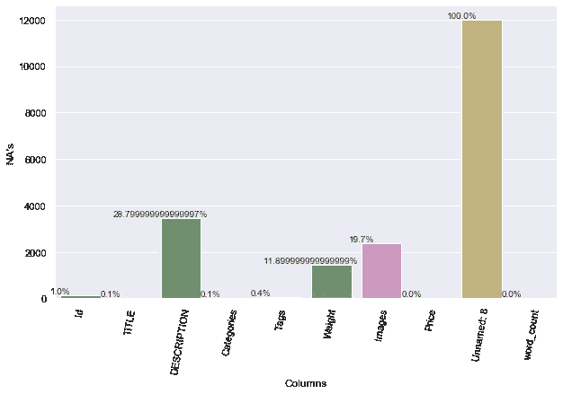

上图表明数据集需要清理过程。

**数据清理过程**

在这一步，我将把文本和关键字实例转换成小写，删除不必要的单词标记，并去掉它们之间的所有空格。去除单词之间的空格是一个重要的预处理步骤，这样做是为了让你的矢量器不会把诸如“美容霜”和“美容皂”这样的项目算在一起。在这个处理步骤之后，上述项目将被表示为“beautycream”和“beautysoap ”,并且对于矢量器是不同的。

```
#Cleaning the the category and tags column
def clean_data(x):
        if isinstance(x, list): 
            return [str.lower(i.replace("|", ",")) for i in x]             
        else: 
            #Check if director exists. If not, return empty string          
            if isinstance(x, str):
                return str.lower(x.replace(">", ","))          
            else:           
                return '' 
# Apply clean_data function to your features.  
features = ['DESCRIPTION','Categories', 'Tags']
for feature in features:
    myshoplivery_data[feature] = myshoplivery_data[feature].apply(clean_data)# Function for removing NonAscii characters in the description column
def _removeNonAscii(s):
    return "".join(i for i in s if  ord(i)<128)# Function for converting into lower case
def make_lower_case(text):
    return text.lower()# Function for removing punctuation
def remove_punctuation(text):
    tokenizer = RegexpTokenizer(r'\w+')
    text = tokenizer.tokenize(text)
    text = " ".join(text)
    return text# Function for removing the html tags
def remove_html(text):
    html_pattern = re.compile('<.*?>')
    return html_pattern.sub(r'', text)
```

根据清理后的数据，必须创建列名为“text”的更好的数据集，该数据集将用于改进的数据集模型。

```
myshoplivery_data["text"]=  myshoplivery_data['DESCRIPTION'] + ' '+ myshoplivery_data['item_name'] + ' ' + myshoplivery_data['Categories'] + ' ' + myshoplivery_data['Tags']
df_shop= myshoplivery_data[['Id','TITLE','text']]
df_shop.head()
```

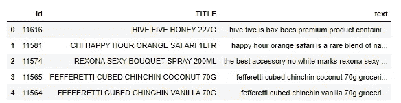

# 使用 TF-IDF 建立模型

使用术语频率-逆文档频率(TF-IDF)向量构建推荐模型将给出一个矩阵，其中每一列代表在至少一个文档中出现的所有单词中的一个单词。

从本质上来说， ***TF-IDF 得分是一个单词在一个文档中出现的频率，根据它出现的文档数量进行向下加权*。**这样做是为了降低在绘图概览中频繁出现的单词的重要性，以及它们在计算最终相似性得分中的重要性。Scikit-learn 提供了一个内置的 TfIdfVectorizer 类，它用几行代码生成 TF-IDF 矩阵。

让我们用 TF-IDF 矩阵定义一个函数，它接受项目标题并输出数据中的类似项目。

```
#Import TfIdfVectorizer from scikit-learn
from sklearn.feature_extraction.text import TfidfVectorizer
#Define a TF-IDF Vectorizer Object. Remove all english stop words such as 'the', 'a'
tfidf = TfidfVectorizer(stop_words='english')
#Construct the required TF-IDF matrix by fitting and transforming the data
tfidf_matrix = tfidf.fit_transform(df_shop['text'])
#Output the shape of tfidf_matrix
tfidf_matrix.shape
```

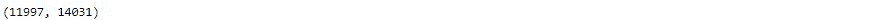

从上面的输出中，您观察到 TF-IDF 矩阵在 11，997 个条目的数据集中有 14，031 个不同的词汇或单词。

下一步是定义一个函数，它将商品标题作为输入，输出最相似的产品。

```
# Function that takes in item title as input and outputs most similar products
def get_recommendations(TITLE,Tags, cosine_sim=cosine_sim):
    #Get the index of the items that matches the title
    idx = indices[TITLE]
    #Get the pairwsie similarity scores of all items
    sim_scores = list(enumerate(cosine_sim[idx])) # Sort the items
    #Sort the products based on the similarity scores
    sim_scores = sorted(sim_scores, key=lambda x: x[1],    reverse=True)
    #Get the scores of the 5 most similar items
    sim_scores = sim_scores[1:5]# Item indicies, Get the items indices
    shop_indices = [i[0] for i in sim_scores]

    #It reads the top 5 recommended Items titles
    print(df_shop['TITLE'].iloc[shop_indices])#get_recommendations('REXONA SEXY BOUQUET SPRAY 200ML', 'Condiments')
```

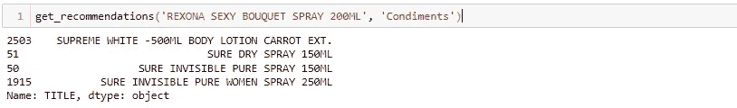

查看推荐引擎的推荐结果，我们可以说推荐引擎已经完成了我们对它的期望，但是最好的方法是通过使用推荐的分数检查来评估模型。

# 使用 CountVectorizer()改进模型

由于在这种情况下构建推荐系统的重点是使用文本特性，而不仅仅是使用基于描述的列，所以考虑其他文本特性很重要，比如 categories 和 tags 列，也就是说，我将使用 CountVectorizer()而不是 TF-IDF 来改进 text 列。

CountVectorizer 将文本文档的集合转换为术语/标记计数的向量。它还支持文本数据的预处理。这个功能使它成为自然语言处理的特征表示模块中的一个更好的选项。

我需要计算提取的文本列之间的相似性和/或不相似性。要使用文本数据进行预测建模，必须对文本进行解析以删除某些单词，这一过程称为标记化。这些单词需要被编码为整数或浮点值，作为机器学习算法的输入。这个过程称为特征提取。

```
# Import CountVectorizer and create the count matrix
from sklearn.feature_extraction.text import CountVectorizer
count = CountVectorizer(stop_words='english')
count_matrix = count.fit_transform(df_shop['text'])
count_matrix.shape
```

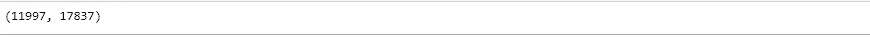

从上面的输出中，您观察到计数矢量器矩阵在 11，997 个项目的数据集中有 17，837 个不同的词汇或单词。

```
# Compute the Cosine Similarity matrix based on the count_matrix
from sklearn.metrics.pairwise import cosine_similarity
cosine_sim2 = cosine_similarity(count_matrix, count_matrix)
# Reset index of your main DataFrame and construct reverse mapping as before
myshoplivery_data = myshoplivery_data.reset_index()
indices = pd.Series(myshoplivery_data.index, index=myshoplivery_data['TITLE'])#get_recommendations('REXONA SEXY BOUQUET SPRAY 200ML', cosine_sim2)
```

# 模型评估

在这一部分，对改进的推荐系统进行评估，以了解它们的性能得分。

让我们定义一个函数来获得按分数排序的前 N 个推荐。

```
def get_recommendation(top, myshoplivery_data, scores):
    recommendation = pd.DataFrame(columns = ['User Id','Item Id','TITLE','score'])
    count = 0
    for i in top:
        recommendation.at[count, 'User Id'] = u
        recommendation.at[count, 'Item Id'] = df_shop['Id'][i]
        recommendation.at[count, 'TITLE'] = df_shop['TITLE'][i]
        recommendation.at[count, 'score'] =  scores[count]
        count += 1
    return recommendation
```

# 让我们通过选择项目 Id 为 11574 的用户来测试推荐者

```
u = 2 #the user 2(using index)
user= myshoplivery_data[['Id','text']]
user_q = user.iloc[[u]]
```

# 使用 TF-IDF

下面是 TF-IDF 建议的定义函数，它将有助于执行建议并给出评分性能。

```
#initializing tfidf vectorizer
from sklearn.feature_extraction.text import TfidfVectorizerdef TF_IDF_recommender(user):
    #fitting and transforming the vector
    tfidf_vectorizer = TfidfVectorizer()
    tfidf_itemid = tfidf_vectorizer.fit_transform(df_shop['text'])    #fitting and transforming the vector
    user_tfidf = tfidf_vectorizer.transform(user_q['text'])
    cos_similarity_tfidf = map(lambda x: cosine_similarity(user_tfidf, x),tfidf_itemid)
    output = list(cos_similarity_tfidf)
    top = sorted(range(len(output)), key=lambda i: output[i], reverse=True)[:10]
    list_scores = [output[i][0][0] for i in top]
    return get_recommendation(top, myshoplivery_data, list_scores)TF_IDF_recommender(user_q)
```

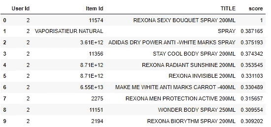

推荐及其评价表明，系统已经能够找到具有相似描述的项目，但是从评价来看，推荐的质量不是那么好。分数看起来并不令人印象深刻，即使我们可以得到与用户的项目相似的项目。这是因为 TF-IDF 得分是单词在文档中出现的频率，根据它出现的文本数量向下加权。这样做是为了降低在情节概览中频繁出现的单词的重要性，这与计算相似性得分推荐系统的重要性相反。

# 使用计数矢量器

下面是一个为计数矢量器推荐定义的函数，它将有助于执行推荐并给出分数性能。

```
from sklearn.feature_extraction.text import CountVectorizer
from sklearn.metrics.pairwise import cosine_similaritydef CVextor_recommender(user):
    count_vectorizer = CountVectorizer()
    count_item_id = count_vectorizer.fit_transform((df_shop['text'])) #fitting and transforming the vector
    user_count = count_vectorizer.transform(user_q['text'])
    cos_similarity_countv = map(lambda x: cosine_similarity(user_count, x),count_item_id)
    output = list(cos_similarity_countv)
    top = sorted(range(len(output)), key=lambda i: output[i], reverse=True)[:10]
    list_scores = [output[i][0][0] for i in top]    
    return get_recommendation(top, myshoplivery_data, list_scores)
CVextor_recommender(user_q)
```

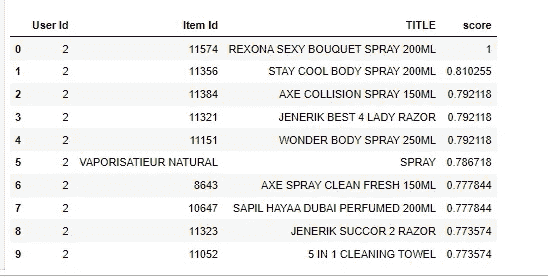

您可以看到，推荐器由于更多的元数据而成功地捕获了更好的信息，并且在考虑其他文本特征的情况下，给出了具有更好分数的更好推荐的项目。

# 使用 KNN

使用改进的计数矢量器数据和 KNN 算法，让我们看看推荐引擎的性能。

```
from sklearn.neighbors import NearestNeighbors
n_neighbors = 10
KNN = NearestNeighbors(n_neighbors, p=2)
from sklearn.feature_extraction.text import TfidfVectorizer
# Function that takes in item title as input and outputs most similar products
def KNN_recommender(user):
    tfidf_vectorizer = TfidfVectorizer()
    tfidf_itemid = tfidf_vectorizer.fit_transform((df_shop['text'])) #fitting and transforming the vector
    user_tfidf = tfidf_vectorizer.transform(user_q['text'])
    KNN.fit(tfidf_itemid)
    NNs = KNN.kneighbors(user_tfidf, return_distance=True) 
    top = NNs[1][0][1:]
    index_score = NNs[0][0][1:]
    return get_recommendation(top, myshoplivery_data, index_score)KNN_recommender(user_q)
```

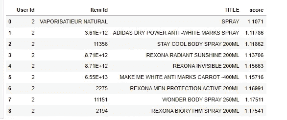

KNN 推荐模型的结果表明，它已经能够根据描述、类别和标签推荐类似于 REXONA SEXY BOUQUET SPRAY 200ML 的商品。从分数上，你可以看到似乎表现过度。

## 摘要

该模型能够根据商品描述和不同特征的改进文本栏推荐与用户选择的商品相似的商品，从而利用 KNN(K-Nearest neighborhood)算法建立了一个更好的模型。使用 TF-IDF，减少常用词的权重，增加不使用的词的权重，在自然语言处理中处理非常频繁的文本时，很少使用 TF-IDF。**计数矢量器**提供了从文本数据中提取和表示特征的强大方法，使其成为 TF-IDF 的更好选择。

此外，可以通过添加价格和重量等数字数据特征来进一步改进该模型。它还受到有关行业标准的高级改进。你可以访问我的 [Github](https://github.com/orokgospel/MyShoplivery-Content-based-Recommendation-System.git) 获取这部作品的完整笔记本。

感谢阅读。如果你有什么要补充的，为了贡献，为了清晰，请随时留下评论！

## 关于作者

福音 Orok 是一名数据专家和工程师，在电子商务和工程行业有 2 年的工作经验。他还热衷于建立一个人工智能生态系统，提供高人类能力发展的影响。
目前是哈科特港市[数据科学家网络社区(DSN)](https://www.datasciencenigeria.org/) 的负责人和城市冠军。