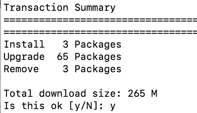

# 如何在 CentOS 8 上安装 Apache

> 原文：<https://blog.devgenius.io/a-simple-guide-to-install-apache-on-centos-8-6650ef0aa4d7?source=collection_archive---------8----------------------->

阿帕奇初学者指南。

# **什么是阿帕奇？**

**Apache** 是一款开源软件，允许用户在互联网上部署他们的网站。Apache 是最可靠、最受欢迎的 web 服务器之一。在本文中，您将学习如何使用 CentOS 8 安装 Apache 并正确运行服务器。

> ***先决条件:*** CentOS 8 服务器
> 一个拥有 Sudo 权限的用户账号
> 命令行终端

# **第一步:连接服务器**

为了执行下面剩下的所有步骤，我将通过 SSH 连接到我的云服务器。登录时会要求您输入服务器密码。

# **第二步:安装 CentOS 更新**

输入以下命令。键入您的密码，然后按回车键。

输入“y”接受下载的大小。

这将需要几分钟的时间，当安装完成时，它会说“完成！”。

# **第三步:安装 Apache Web 服务器**

输入以下命令:

输入您的密码开始安装。

“完成！”将在脚本完成后显示。

# **步骤 4:启用 Apache Web 服务器**

我们想要启用 Apache Web 服务器。这将允许 Apache Web 服务器在将来自动开始运行。要在此命令中启用键入:

要启动 Apache 服务器，请输入以下命令:

现在，您应该通过输入以下命令来检查 Apache Web 服务器的状态:

# **第五步:打开 HTTP 防火墙端口 80**

我们需要打开防火墙端口 80，这样我们就可以公开 web 服务器。
要打开输入以下命令:

在你点击输入后，将显示“成功”。

要使前面的命令生效，我们需要通过输入以下命令来重新加载防火墙服务:

# 最后一步:测试它！

要运行您的公共地址，您必须通过输入以下命令来请求它:

最后，在您的 web 浏览器中输入公共 IP 地址，您的服务器应该配置正确。恭喜你，你已经在 CentOS 8 上安装了 Apache Web 服务器！

