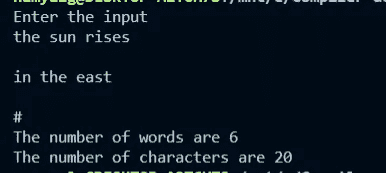

# 一个简单的词法分析器

> 原文：<https://blog.devgenius.io/a-simple-lexical-analyser-aaa4329b18d0?source=collection_archive---------10----------------------->

要求:为了能够看到你自己的词法分析器，确保你是在一个基于 Linux 的环境中工作。(对于 Windows 用户，请查看 WSL)

我将使用 Linux 提供的 lex 工具，它可以按照[提到的](https://stackoverflow.com/questions/3871425/how-to-install-lex-and-yacc-in-ubuntu)进行安装

编译过程的第一步(即把源代码转换成机器码)是词法分析。合乎逻辑的第一步是确保程序只包含有效的字符和符号。一旦这一点得到确认，下一步就是解释代码的正确含义。

词法分析器将字符流转换成标记流。令牌是指一组有意义的字符。例如:标识符、整数、关键字、空白等等。每个程序都要运行一个词法分析器，词法分析器是一个定义语言接受的标记的程序。即什么是有效的。

我解释词法分析器工作的方式。
只要输入被提供
-保持两个指针，一个在字符串的开始，另一个指针向右移动，只要满足一个正则表达式条件。
-当不存在匹配条件时，开始指针被移动到结束指针的位置(这标志着在开始和结束指针之间创建了一个令牌)，结束指针继续向右移动。

> 现在让我们构建一个简单的词法分析器来计算给定文本中的字符和单词的数量，这将用 C 编写

词法分析器由 3 部分组成

1.声明(用 C 语言编写)

2.规则(Regex 和 C)

3.辅助功能(用 C 语言编写)

> 申报

声明由头文件、变量定义等组成。它还可能包含正则表达式的模板

> 规则

从字符流中识别标记的规则是基于正则表达式决定的。每个正则表达式规则都是以互斥的方式一个接一个地编写的。在一个空格之后，写入所需 C 代码的期望动作

> 辅助功能

C 语言中执行一些计算的函数，或者这里包含的主函数

密码

```
// Declaration enclosed in % { %}%{#include<stdio.h>#include<string.h> int word = 0;int chars = 0;%} // Rules specified as regex space action enclosed in %%%% [a-zA-Z]+ {word += 1;  chars += strlen(yytext);} // yytext stores the latest token encountered, getting its length to get the length of the word# return 0; // # indicated the end of the input. ;  // on any other character do nothing%%// Auxillary functions// This returns an error if not included, doesnt mean anything but include this function prototypeint yywrap(){return 0;}int main(){printf("Enter the input \n");// this function has an in-built scanf, or can read from a file inputyylex(); printf("The number of words are %d \n" , word);printf("The number of characters are %d \n ", chars);return 0;}
```

给定一个输入，词法分析器将返回包含的单词数和字符数。通过键盘输入#时，函数 yylex()返回。yylex()是 lex 实用程序的内置函数。

上面的代码被粘贴到一个带有**的文件中。l** 扩展，即可以是 **main.l**

执行命令

```
lex main.l
```

**它生成了一个 C 文件，命名为 lex . YY . C**

**lex 实用程序主要负责将正则表达式转换成 C 语言**。这也可以手动完成，但会变得非常复杂😅

现在我们有了一个 C 文件，只需按照通常的方式编译它

```
gcc lex.yy.c // gived an executable a.out
./a.out
```



生成的输出