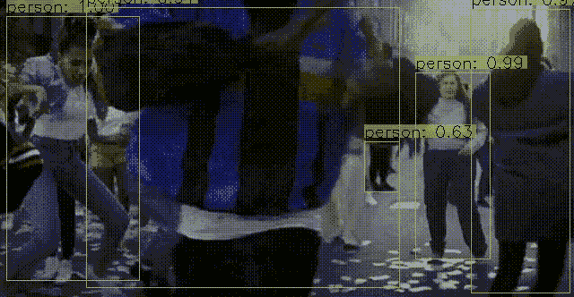
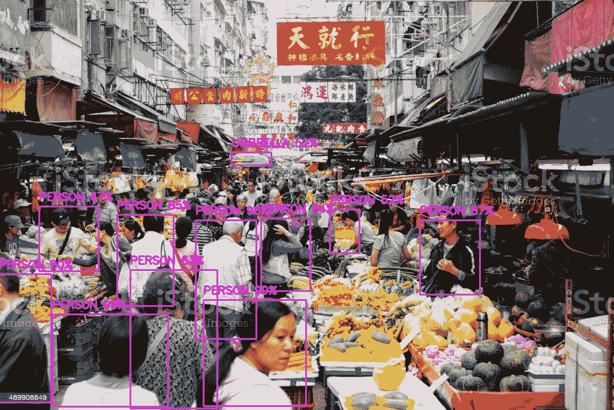
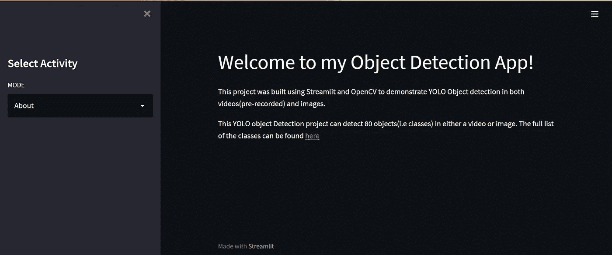
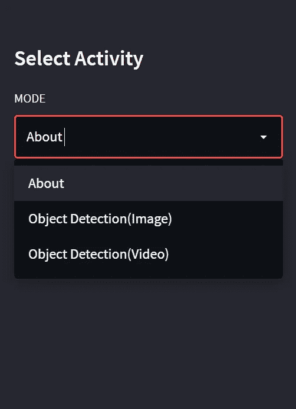

# 使用 Streamlit 和 OpenCV 构建的简单对象检测应用程序。

> 原文：<https://blog.devgenius.io/a-simple-object-detection-app-built-using-streamlit-and-opencv-4365c90f293c?source=collection_archive---------2----------------------->

**视频中的物体检测。**

# 什么是物体检测？

> 对象检测是一种计算机视觉技术，它允许我们在图像或视频中识别和定位对象。通过这种识别和定位，可以使用对象检测来计数场景中的对象，并确定和跟踪它们的精确位置，同时准确标记它们。

**物体检测**可以认为是**图像识别**，具有一些高级功能。该算法不仅识别/标识图像/视频中的对象，而且还对它们进行定位。换句话说，在图像或视频帧中的对象周围创建边界框。

**图像中的目标检测。**

本文的目的是展示 **streamlit** 如何与对象检测算法一起使用(本例中为**YOLO**)。YOLO(你只看一次)是一种对象检测算法，它使用神经网络来产生实时对象检测，这种算法因其速度和准确性而受欢迎。

这篇文章使用了 YOLO 算法，但是没有解释算法是如何工作的。有关该算法及其如何用于对象检测的概述，请单击[**此处**](https://www.section.io/engineering-education/introduction-to-yolo-algorithm-for-object-detection/#:~:text=YOLO%20is%20an%20algorithm%20that,%2C%20parking%20meters%2C%20and%20animals.) **。**

Streamlit 是一个用 **Python** 语言编写的开源应用框架。它帮助我们在短时间内为数据科学和机器学习创建 web 应用程序。假定 **streamlit** 的工作知识。如果您不熟悉 **streamlit** ，您可以参考 **streamlit 的**文档，了解使用该框架的速成课程:

 [## 简化文档

### Streamlit 不仅仅是一种制作数据应用程序的方式，它还是一个分享应用程序和想法的创作者社区…

docs.streamlit.io](https://docs.streamlit.io/) 

足够的介绍，现在让我们进入我们的应用程序编码！！！

# 导入所需的库。

这段代码的起点是**主**函数，我们将在下面看到。

运行我们的应用程序，看到一大堆关于我们的应用程序做什么的文字(例如，我们的应用程序是关于什么的)，甚至可能是一个引导我们到其他功能的侧边栏，这将是很好的。

下面这个**主**函数，我们代码的起点，处理所有这些！！。

现在让我们编写检测图像中对象的函数

如果我们从工具条中选择**物体检测(图像)**，上面的功能就会运行。

让我们来看一个例子。

现在谈谈视频中的物体检测。我们下面的函数可以帮助我们解决这个问题。

我发现显示我们检测到的物体的书面视频无法在 **streamlit 的**界面上显示。要查看原因，请点击 [**此处**](https://discuss.streamlit.io/t/st-video-doesnt-show-opencv-generated-mp4/3193) **。**

为了解决这个问题，我们可以使用 **ffmpeg，**一个命令行工具来处理视频、音频和其他多媒体文件和流。但这本身是另一个问题， **ffmpeg** 是一个命令行工具。我们需要将使用 **openCV** 编写的视频更改为可以在 python 脚本运行时在 **streamlit** 上显示的视频，而不是在命令行上。python 模块 MoviePy 帮助我们解决了这个问题，它的用法可以在上面我们的**主**函数中看到。

让我们再来看一个视频中物体检测的例子。

本系列使用的所有代码都可以在这个 [**Github 资源库**](https://github.com/zhoroh/ObjectDetection) **中找到。**

谢谢大家！！。