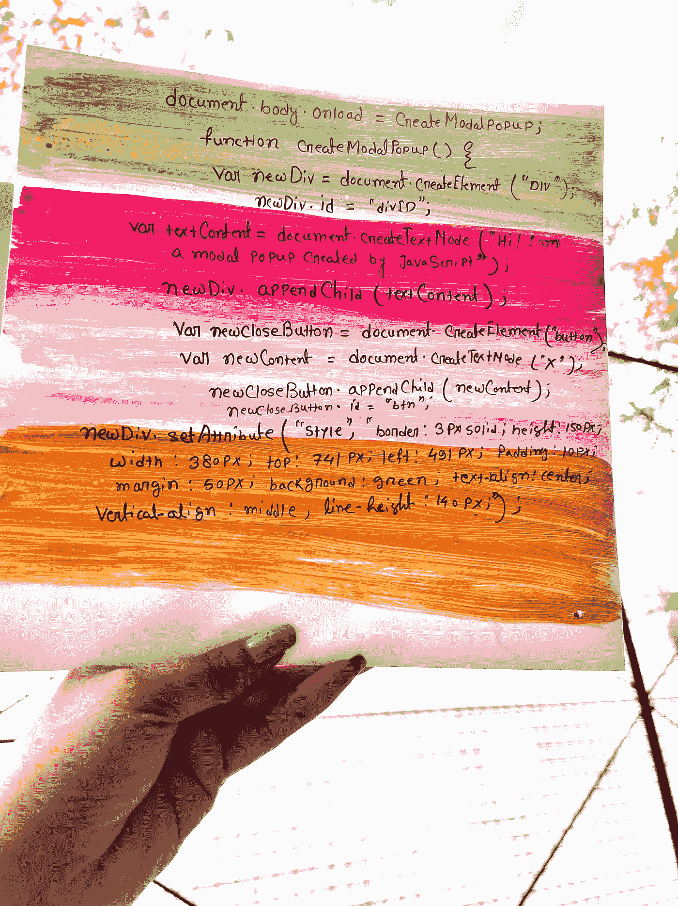
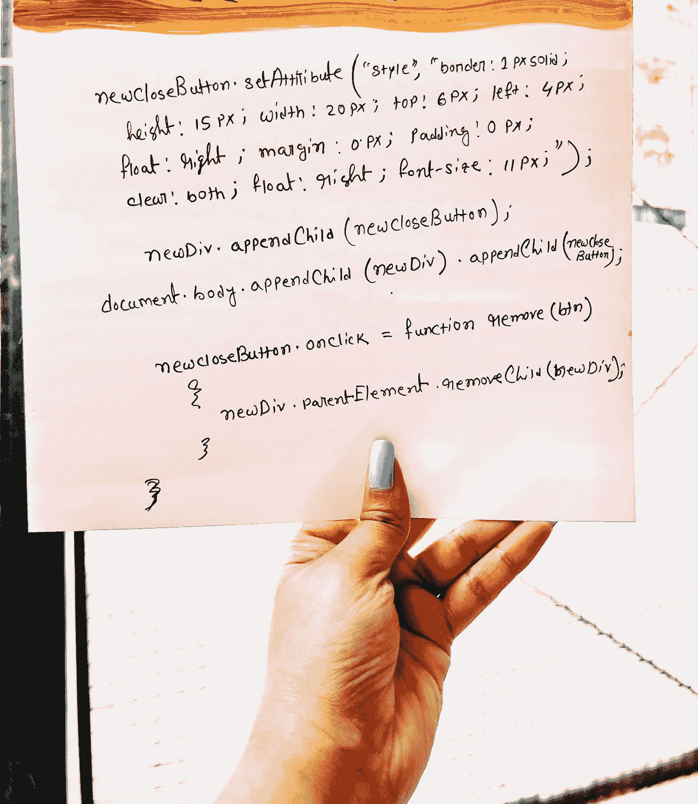

# 一种简单的编程方法，使用纯 Javascript 创建一个模态弹出窗口，不使用外部 HTML 和 CSS 或任何其他库。

> 原文：<https://blog.devgenius.io/a-simple-programmatic-approach-to-create-a-modal-popup-using-pure-javascript-without-using-70a94dc099df?source=collection_archive---------3----------------------->

插图作者:Mousumi Roy

大家好！我已经很久没有发表任何文章了，现在我在这里告诉你另一个故事。有个没什么经验的家伙带着他的一个问题来找我。问题是

> “他的 HTML 页面是由 API 调用自动生成的，在自动生成的 HTML 页面中有一个名为 Escalation 的按钮，他必须在单击该 Escalation 按钮时显示一个模态弹出窗口。”

他试图为模态 pop 创建一个 html 页面，并试图在调用该事件时显示该页面，但是没有成功，因为他新创建的 HTML 页面不是自动生成的。他尝试了 jquery、bootstrap 甚至 javascript，但是没有任何效果。当他向我寻求解决方案时，我让他在 DOM Manupulation 的概念中动态创建模态弹出窗口，他诚实地说 google 不能帮助他解决这个问题。所以我在这里提供了解决方案，这样你也可以学习。

我用纯 javascript 创建了一个简单的模态弹出窗口。这将为您提供以下功能:

> **一个 div 内容，其文本将水平和垂直居中**
> 
> **一个关闭按钮，onclick of close 按钮弹出就会关闭。**

插图作者:Mousumi Roy

document . body . onload = createModalpopup；

函数 createModalpopup(){
var new DIV = document . createelement(" DIV ")；
new div . id = " div "
var text content = document . create textnode(" Hi！我是纯 javascript 创建的模态弹出”)；
new div . appendchild(text content)；
var newcloseButton = document . createelement(" button ")；
var new content = document . create text node(" X ")；
newclosebutton . appendchild(new content)；
newclosebutton . id = " BTN "；
newDiv.setAttribute("style "，" border:3px solid；高度:150px 宽度:380pxtop:741 px；左:491px 填充:10px 边距:50px 背景:红色；文本对齐:居中；垂直对齐:居中；行高:140 像素；");

插图作者:Mousumi Roy

newclosebutton . set attribute(" style "，" border:1px solid；高度:15px 宽度:20pxtop:6px；左:4px 浮动:对；边距:0px 填充:0px 明确:两者都有；浮动:对；font-size:11px；");

new div . appendchild(newcloseButton)；
document . body . appendchild(new div)。appendChild(newcloseButton)；

newclosebutton . onclick = function remove(BTN)
{
new div . parentelement . remove child(new div)；
}

}

嘣嘣嘣，看看谁在那里

非常感谢你阅读我的文章，如果你真的喜欢阅读，那么就鼓掌并留下评论。欢迎随时学习和分享。编码快乐:)干杯！

# JavaScript # modal popup # dynamic # DOM manualization