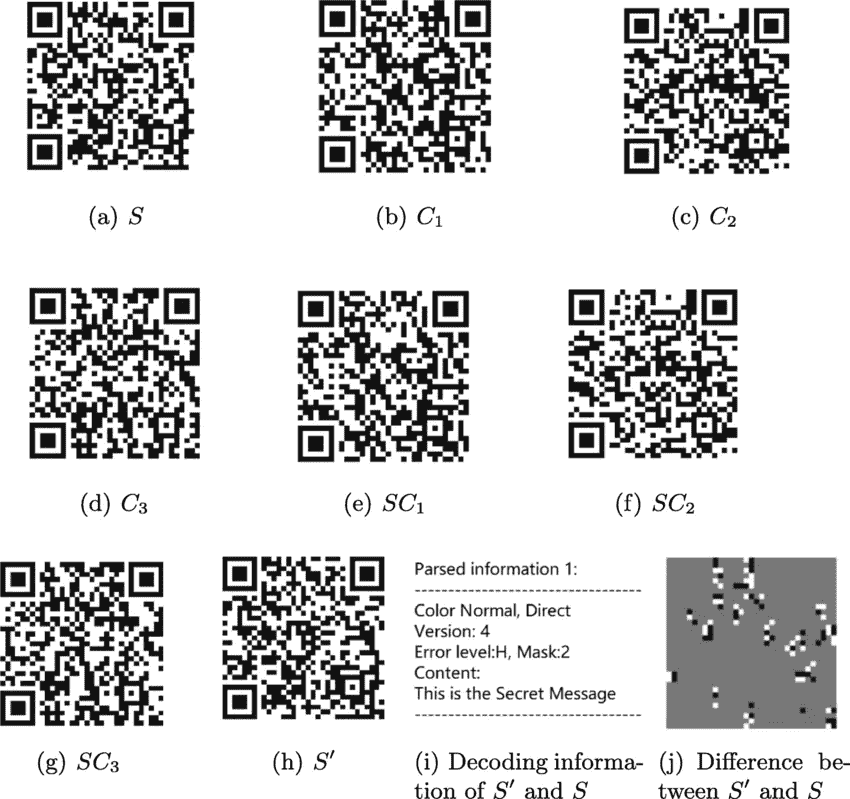
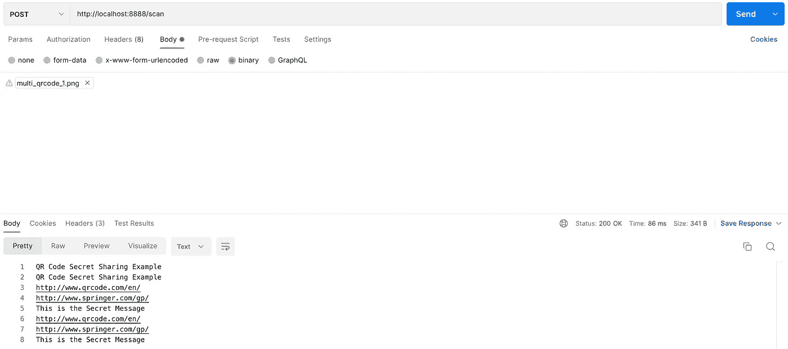

# Golang 中一个简单的二维码阅读器服务

> 原文：<https://blog.devgenius.io/a-simple-qr-code-reader-service-in-golang-15483fbe55e4?source=collection_archive---------6----------------------->


使用 Golang 的二维码阅读器

对于我们的二维码阅读器服务，我们将使用 zxing 的 Golang 端口，这是一个用于 Java 和 Android 的扫描库。但是在我们进入 Golang 库之前，让我们先了解一些重要的[类](https://zxing.github.io/zxing/apidocs/)，我们将在稍后的实现中使用它们。

该库支持两种检测器类别来检测图像中的 QR 码。

1.  **检测器**检测图像中的单个二维码

```
public class [**Detector**](https://zxing.github.io/zxing/apidocs/com/google/zxing/qrcode/detector/Detector.html)
extends Object
```

> 封装可以检测图像中 QR 码的逻辑，即使 QR 码旋转、倾斜或部分模糊。

2.**多检测器**检测图像中的一个或多个二维码。

```
public final class [**MultiDetector**](https://zxing.github.io/zxing/apidocs/com/google/zxing/multi/qrcode/detector/MultiDetector.html)
extends Detector
```

> 封装可以检测图像中一个或多个 QR 码的逻辑，即使 QR 码被旋转、倾斜或部分模糊。

下面是一个在 Java 中使用 MultiDetector 的简单例子。

*注意:在扫描二维码之前，我们也在对图像进行一些预处理。您可以从文档中了解更多关于它们的信息。*

该库支持两个解码器类来解码图像中的 QR 码。

1.  **QRCodeReader** 分两步工作:它首先检测图像中的任何 QR 码模式，如果找到该模式，它将从中解码出文本。

```
public class [**QRCodeReader**](https://zxing.github.io/zxing/apidocs/com/google/zxing/qrcode/QRCodeReader.html)
extends Object
implements Reader
```

> 这种实现可以检测和解码图像中的 QR 码。

2. **QRCodeMultiReader** 与 QRCodeReader 的工作原理相同，唯一的区别是它可以检测一幅图像中的多个 QR 码。

```
public final class [**QRCodeMultiReader**](https://zxing.github.io/zxing/apidocs/com/google/zxing/multi/qrcode/QRCodeMultiReader.html)
extends QRCodeReader
implements MultipleBarcodeReader
```

> 这种实现可以检测和解码图像中的多个 QR 码。

在这个例子中，我使用了这张图片



来源:谷歌图片

**输出:**

> 二维码秘密分享示例
> 二维码秘密分享示例
> 这是秘密消息
> http://www.qrcode.com/en/
> http://www.springer.com/gp/
> http://www.springer.com/gp/
> http://www.qrcode.com/en/
> 这是秘密消息

到目前为止，我们已经介绍了在二维码服务的 Golang 实现中将要用到的所有重要类。我们将在纯 Go 中使用 zxing 的端口。

在我们的实现中，我们将使用标准的 [net/http](https://pkg.go.dev/net/http) 来实现客户端和服务器。我们的 Golang 服务接受带有二进制图像的 **POST** 请求，并使用多阅读器功能返回图像中的文本列表。

支持的图像格式类型列表: **JPEG、PNG、BMP、TIFF、WebP、GIF** (仅第一帧)

*第 34 行*:处理 POST 请求，调用 scan()方法，以 image 为参数，以[]字节为单位。

*第 61-63 行*:图像预处理。

*第 70 行*:创建一个新的 QRCodeMultiReader 来检测图像中的多个 QR 码。

*第 77–79 行*:创建一个从图像解码的文本列表。

使用上面的示例图像使用 Postman 进行查询。



使用邮递员向服务发送请求

目前就这些。在下一篇文章中，我将尝试介绍这个库的其他方面。希望这有用:-)