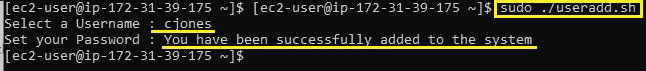
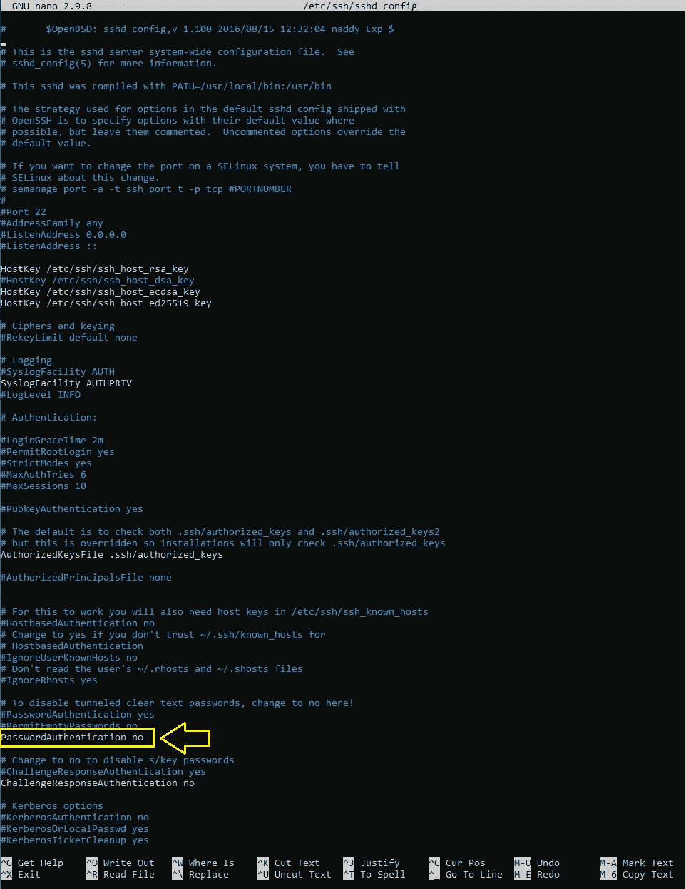
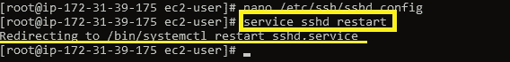
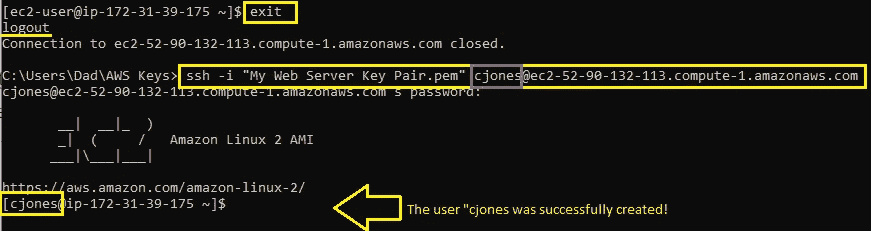
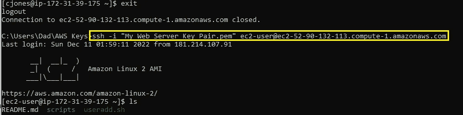
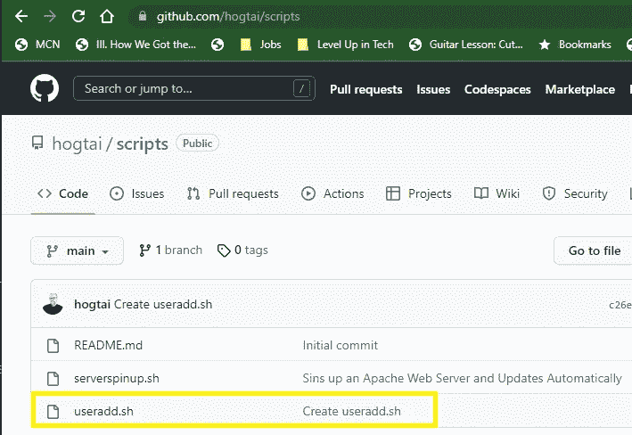

# 向 AWS EC2 实例添加用户的简单脚本

> 原文：<https://blog.devgenius.io/a-simple-script-for-adding-users-to-your-ec2-instance-590684c382d6?source=collection_archive---------10----------------------->


作为系统管理员，添加用户是一个多命令的过程，也非常耗时。幸运的是，正确的 BASH 脚本可以节省您的时间和按键次数。

在本文中，我将向您展示我的 [useradd.sh](https://github.com/hogtai/scripts/commit/c26e3b2799ddc0f1e31ea4e9ed23ee35ccd754ac) 脚本，以及您如何使用它来无缝地将用户添加到您的云系统中，这四个简单、易于遵循的步骤是:

*特别提示:为了有效地运行这样的脚本，您必须拥有系统的 root 权限。如果您没有 root 访问权限，您的脚本将无法正常执行。*

# 先决条件

*   基本的 AWS 服务知识
*   具有正在运行的 EC2 实例的活动 AWS 帐户
*   熟悉 CLI 和基本 Linux 命令
*   基本的 BASH 脚本知识
*   对 Git 和指挥知识有基本的了解
*   具有创建的个人访问令牌(PAT)的 GitHub.com 帐户

# 步骤 1:创建您的脚本

SSH 到您的远程实例。我的正好是 AWS EC2。你的可能不同。登录后，使用 nano 命令创建您的脚本:

```
nano useradd.sh
```

我在下面给你提供了一个简单的脚本。执行时，该脚本将:

*   指导用户创建用户名
*   指导用户设置密码
*   对照现有用户名检查用户名，以确保用户名不存在
*   使用 perl 函数加密并将密码安全地写入/etc/shadow
*   发送确认消息或返回错误消息

```
#!/bin/bash
# Automatically add a user to the server

if [ $(id -u) -eq 0 ]; then
        read -p "Select a Username : " username
        read -s -p "Set your Password : " password
        egrep "^$username" /etc/passwd > /dev/null
                if [ $? -eq 0 ]; then
                                echo "$username already exists. Please choose a different username."
                                exit 1
                        else
                                pass=$(perl -e 'print crypt($ARGV[0], "password")' $password)
                                useradd -m -p $pass $username
                                [ $? -eq 0 ] && echo "You have been successfully added to the system" || echo "Authentication Error. Failed to Create New User"
                        fi
                else
                        echo "Only a user with administrative privledges may add a user to the system."
                        exit 2
                fi
```

按[CTRL+X]退出 nano。退出前保存文件。确认文件名(useradd.sh)

现在您的脚本已经编写好了，您需要使它可执行:

```
chmod u+x useradd.sh
```

# 步骤 2:运行您的脚本

运行您的脚本:

```
sudo ./useradd.sh
```

出现提示时，选择用户名并按[ENTER]键，设置密码并按[ENTER]键。

如果成功，您应该会在终端中看到类似的内容



您将收到一个提示，告诉您用户已成功添加

# 步骤 3:更改 EC2 配置文件以允许密码验证

在 AWS 中，仅仅创建一个添加新用户的脚本是不够的。我们还必须编辑/etc 目录中的 sshd_config 文件来实现这一点。现在让我们在您的 CLI 中完成这项工作:

切换到根用户:

```
sudo su
```

在首选编辑器中打开 sshd_config 文件:

```
nano /etc/ssh/sshd_config
```



将密码验证从“否”更改为“是”

你可能需要滚动。发现行“密码验证否”更改为“密码验证是”。键入[CTRL+X]退出。按“Y”保存对文件的更改，按[ENTER]退出并返回到 CLI 中的工作目录。

现在，我们需要重新启动 sshd。使用以下命令执行此操作:

```
service sshd restart
```

如果成功，您应该会收到类似的消息:



# 步骤 4:使用新用户的凭证，通过 SSH 将结果验证到我们的 EC2 实例中

最后，为了测试我们的脚本和更新 SSHD 文件是否有效。我们注销实例，并尝试作为新添加的用户“cjones”登录:

```
ssh cjones@<EC2-xx-xxx-xxx-xx.compute-1.amazonaws.com
```

出现提示时，我们输入分配给“cjones”的密码。点击[回车]。如果一切顺利，现在您应该以使用 BASH 脚本添加的用户身份登录:



# 额外步骤:将我们的脚本添加到我们的 GitHub 帐户

既然我们已经测试了添加用户的脚本。让我们将它保存到我们的 GitHub 存储库中。在之前的一篇文章中，我谈到了如何[将远程脚本推送到 GitHub 以备后用](https://medium.com/dev-genius/pushing-your-remote-scripts-to-github-for-later-use-c11ee34e91aa)。

如果您有兴趣为 GitHub 存储库保存您的脚本，我强烈建议您阅读它，因为我不会在这里详细介绍如何克隆、暂存、提交和推送回购。

现在继续我们将脚本添加到 GitHub 帐户的步骤:

使用构建脚本时使用的用户登录到 EC2 实例:



我们将把我们的脚本移动到我们的 git 存储库中:

```
mv useradd.sh scripts/
```

进入我们的 git 仓库:

```
cd scripts/
```

指示 git 准备我们的脚本:

```
git add useradd.sh
```

指示 git 用一个备忘录来准备我们的提交:

```
git commit -m "Automatically adds a user to the system and prompts for a password"
```

将我们的 git 推向我们的 GitHub 仓库:

```
git push origin main
```

最后，我们可以仔细检查 GitHub.com 回购协议，以验证我们的推动:



如果你觉得这些内容有帮助，我会很感激你的“关注”、“鼓掌”或评论。

在下面留下评论，让我知道你的想法

直到下一次:前进！