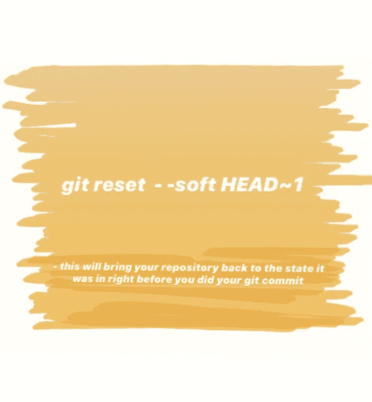

# 一个简单的解决方案来恢复已经推送到主分支的 git 提交

> 原文：<https://blog.devgenius.io/a-simple-solution-to-revert-a-git-commit-that-has-been-pushed-to-master-branch-8038db31def1?source=collection_archive---------8----------------------->

今天我将告诉你一个不同的故事。

**犯错远比自杀好。不是吗？**

有一个女孩叫西尔维亚，她很聪明，但有时她犯了愚蠢的错误，而提交她的文件。她过去总是在承诺的时候面对挑战。一天，她在一个生产就绪分支上犯了一个巨大的错误。她将她最近的变化提交给了一个**主**分支，而不是**开发**分支，所有的开发都发生在这个分支。

她太紧张了，她告诉了我她的错误。

作为她的领导，我有责任纠正她的错误。所以我告诉她使用**git****reset**撤销**提交。**

她不确定会有什么命令。她再次问我，我 pinged 了她这个命令

这将使您的存储库回到您执行 **git** **commit** 之前的状态。

> 现在您可以切换到您的 **dev** 分支，并在正确的地方重新提交变更。

在做这一步之前，她问我，在这段代码中，soft 和 HEAD 是做什么的。

嗯,––软选项告诉 git 不要管你的暂存区和工作树。假设您使用的不是软的，而是硬的，它将删除您所有的本地更改。

HEAD~1 仅仅意味着最近一次提交给 parent。

> 然后，她运行下面的命令，但她仍然得到错误。你知道为什么吗？

在提交给主分支之后，她立即进行了 git 推送。这是因为她的本地回购落后于远程回购，因此它拒绝了她的推动。

然后我告诉她使用 git revert

从那以后，我能看到她快乐的脸。

非常感谢你阅读我的文章，如果你真的喜欢阅读，那就鼓掌吧。欢迎随时学习和分享。编码快乐！干杯！