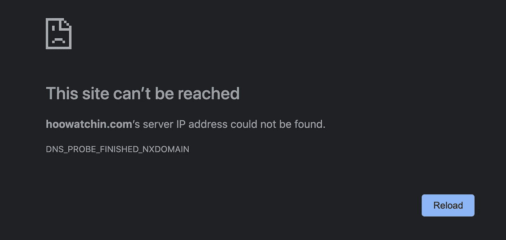
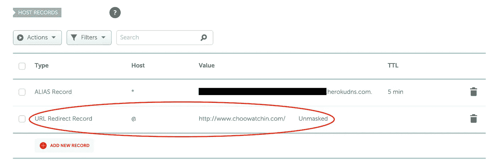

# 一个简单的 URL 重定向到您的根域

> 原文：<https://blog.devgenius.io/a-simple-url-redirect-to-your-root-domain-883090c11caf?source=collection_archive---------3----------------------->

## 使用 DNS 设置来确保用户不会错过我的网站

如果你在 Google Chrome 上访问你的网站时发现了上面的结果，这篇文章也许能解决你的问题。首先，我将概述我是如何发现我的问题的，以及我是如何追溯我的步骤来找到根源的。然后，如果您的问题与我的原因相同，我将解释对您有效的简单解决方案。

# 适用于一种浏览器，但不适用于另一种浏览器

我最近用响应式设计完成了网站的重组，所以我把这些改变推给了 Heroku，我的网站就部署在那里。当我在 iPhone 的 Safari 浏览器上访问该网站时，它看起来就像我预期的那样。但我在 iPhone 的谷歌 Chrome 浏览器中输入了相同的网址，看到上面的错误信息说“这个网站无法访问…找不到服务器 IP 地址。”这导致我疯狂地在公寓里所有设备的两种浏览器上查看我的网站，包括我女朋友的 iPhone。我在每个地址栏里输入同样的“choo watchin . com”；果然 Safari 总能找到我的站点，而 Google Chrome 从来没找到过我的站点。

我不知道为什么会这样。我能在谷歌 Chrome 上打开我的网站的唯一地方是我自己的 MacBook Pro，我用它建立了这个网站。然后我意识到我一输入“choo”Google Chrome 就自动填充了我的网站，于是我删除了我的历史，再试了一次。当我删除了我的浏览历史后，谷歌浏览器不再找到我的网站，这证实了我的怀疑。凭着直觉，我试着输入“ **www** .choowatchin.com”，而不是像以前那样不输入“www”。就在那里！我在所有其他设备上又试了一次，都正常。

这本身是一种解脱，但我仍然想修复我的网站，这样当用户忘记“www”时，它就不会隐藏在谷歌浏览器中。在网上搜索解决这个问题的方法后，我发现最简单的方法是设置一个 URL 重定向。

# 通过 DNS 设置设置重定向

Heroku 托管我的网站，我在以前的博客中详细介绍了为 Heroku 应用程序设置自定义域名的方法。

 [## Heroku 应用程序的自定义域

### 从注册商处购买域名，并配置路由至 Heroku 应用。

medium.com](https://medium.com/analytics-vidhya/custom-domains-for-heroku-apps-7c71d43e3eab) 

我从 Namecheap 上购买了我的域名，所以我在那里配置了 DNS(域名系统)设置，将我的域名连接到我的应用程序。重读我的旧博文，我注意到 DNS 设置中的一些我以前认为不必要的东西。这是购买我的域名时默认创建的 URL 重定向记录。我已经删除了它，我的应用程序似乎工作正常，所以我直到现在才忘记它。当谷歌 Chrome 拒绝识别我的没有“www”前缀的 URL 时，删除那个 URL 重定向记录终于赶上了我。我删掉了什么？

这是一个 URL 重定向记录，主机为“@”，值为“http://www.choowatchin.com/”。@ Host 表示根域，它只是我的网站 URL，开头没有“www”业务。该值只是完整的网站域。

 [## 如何重定向一个网址-网站重定向-名称便宜

### URL 重定向(URL 转发)允许您将您的域访问者转发到您选择的任何 URL(到一个新的域或…

www.namecheap.com](https://www.namecheap.com/support/knowledgebase/article.aspx/385/2237/how-to-redirect-a-url-for-a-domain) 

一旦我将 URL 重定向记录添加回我的 Namecheap 帐户的 DNS 设置中，我就可以再次成为我懒惰的自己，离开“www ”,仍然可以访问我在 Google Chrome 上的网站。

 [## React 应用

### 使用 create-react-app 创建的网站

www.choowatchin.com](http://www.choowatchin.com/)