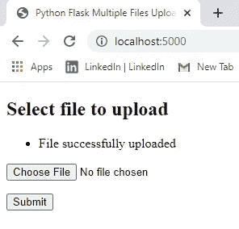
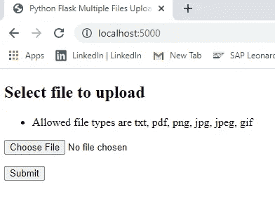

# 使用 Python 上传烧瓶文件

> 原文：<https://blog.devgenius.io/a-simple-way-to-build-flask-file-upload-1ccb9462bc2c?source=collection_archive---------5----------------------->

## 使用 Python 通过 Flask API 上传文件

使用 Flask API 和 Python 上传文件的简单指南。。。,


彼得·福格登在 [Unsplash](https://unsplash.com?utm_source=medium&utm_medium=referral) 上的照片

# **为什么是这个教程？**

看了很多人写的关于《Flask for 初学者》教程的博客后。我注意到，只有少数博客提到了“烧瓶文件上传”。所以，我对写“Flask 文件上传”产生了兴趣。我相信这个博客会帮助你建立文件上传，让你变得简单。。。,

寻找多个文件上传使用 Flask？

[](https://medium.com/@ngbala6/get-started-with-multiple-files-upload-using-flask-e8a2f5402e20) [## 开始使用 Flask 上传多个文件

### 烧瓶多个文件上传

medium.com](https://medium.com/@ngbala6/get-started-with-multiple-files-upload-using-flask-e8a2f5402e20) 

# 为什么是烧瓶？

就像人们对从哪个 Python 版本开始感到困惑一样，Django vs Flask 是另一个古老的争论。虽然人们说 Flask 简单易用，而 Django 对于构建 web 应用程序来说很笨重，但是还有一个重要的原因让你应该选择 Flask 而不是 Django。

作为云时代的开发人员，我们正在远离单一的应用程序。有了微服务架构，运行多个 Django 服务器将会使您的服务变得沉重，因为它附带了所有的内置应用程序。


用于 Web 开发的烧瓶

# 要求和安装

1.  当然，我们需要 Python 3.5 或以上版本。[但是为什么呢？？看到这个](https://flask.palletsprojects.com/en/0.12.x/python3/)
2.  安装烧瓶

```
pip install flask
```

# 简单的烧瓶应用程序

*这一步是针对初学者的，如果你了解 Flask 的基础知识，跳过这一步。。。，*

要运行的简单 Flask 应用程序。。,

```
# app.pyfrom flask import Flask           # import flask
app = Flask(__name__)             # create an app instance

@app.route("/")                   # at the end point /
def hello():                      # call method hello
    return "Hello World!"         # which returns "hello world"if __name__ == "__main__":               # on running python app.py
    app.run(host='127.0.0.1",port = 5000)   # run the flask app 
```

通过运行“python app.py”来运行应用程序。进入浏览器，输入“http://localhost:5000”，你会看到“Hello World！”程序正在运行。


# *开始上传烧瓶文件*

文件上传是将二进制文件或普通文件传输到服务器的过程。Flask 方便我们轻松上传文件。

在这里，我们将上传一个“PNG”文件，并将它们存储在一个特定的文件夹中。

你可以上传任何文件，并按照你的意愿存储它。。。,

你也可以用它把文件从一个系统转移到另一个系统。。。,

> 创建一个名为“singlefileupload.py”的文件

1.  ***导入库***

```
**import** os      # For File Manipulations like get paths, rename**from** flask **import** Flask, flash, request, redirect, render_template
**from** werkzeug.utils **import** secure_filename
```

**②*。创建一个实例并检查扩展*和**

```
app=Flask(__name__)

app.secret_key = **"secret key" # for encrypting the session**#It will allow below 16MB contents only, you can change it
app.config[**'MAX_CONTENT_LENGTH'**] = 16 * 1024 * 1024 path = os.getcwd()
*# file Upload* UPLOAD_FOLDER = os.path.join(path, **'uploads'**)

**if not** os.path.isdir(UPLOAD_FOLDER):
    os.mkdir(UPLOAD_FOLDER)

app.config[**'UPLOAD_FOLDER'**] = UPLOAD_FOLDERALLOWED_EXTENSIONS = set([**'txt'**, **'pdf'**, **'png'**, **'jpg'**, **'jpeg'**, **'gif'**])

**def** allowed_file(filename):
    **return '.' in** filename **and** filename.rsplit(**'.'**, 1)[1].lower() **in** ALLOWED_EXTENSIONS
```

***3。App 路由和应用运行***

```
@app.route(**'/'**)
**def** upload_form():
    **return** render_template(**'upload.html'**)

@app.route(**'/'**, methods=[**'POST'**])
**def** upload_file(): **if** request.method == **'POST'**:
        *# check if the post request has the file part* **if 'file' not in** request.files:
            flash(**'No file part'**)
            **return** redirect(request.url) file = request.files[**'file'**] **if** file.filename == **''**:
            flash(**'No file selected for uploading'**)
            **return** redirect(request.url) **if** file **and** allowed_file(file.filename):
            filename = secure_filename(file.filename)
            *file.save(os.path.join(app.config['UPLOAD_FOLDER'], filename))* flash(**'File successfully uploaded'**)
            **return** redirect(**'/'**)
        **else**:
            flash(**'Allowed file types are txt, pdf, png, jpg, jpeg, gif'**)
            **return** redirect(request.url)

**if** __name__ == **"__main__"**:
    app.run(host='127.0.0.1',port=5000)
```

**4。模板创建**

创建一个名为“templates”的文件夹，并在“templates”文件夹中创建一个文件“upload.html”。

**upload.html**

```
<!doctype html><title>Python Flask Multiple Files Upload Example</title><h2>Select file to upload</h2><p><ul class=flashes><li>{{ message }}</li></ul></p><form method="post" action="/" enctype="multipart/form-data"><dl><p><input type="file" name="file" autocomplete="off" required></p></dl><p><input type="submit" value="Submit"></p></form>
```

# ***坍塌？？？这里是*的完整代码**

> ***single file upload . py***

> ***upload.html***

# 运行应用程序

通过运行“python singlefileupload.py”来运行应用程序。进入浏览器，输入“http://localhost:5000”，你会在浏览器中看到“上传文件”。


单个文件上传的输出



*如果我上传不同的文件而不是* ***txt、pdf、png、jpg、jpeg、gif*** *类型的扩展名。该文件将不被接受。。，*



允许的文件内容

完整的代码被上传到下面的 GitHub 库

[](https://github.com/ngbala6/Flask-Uploadfiles.git) [## ngbala 6/Flask-上传文件

### 使用 Flask 上传文件。在 GitHub 上创建一个帐户，为 ngbala6/Flask-Uploadfiles 的开发做出贡献。

github.com](https://github.com/ngbala6/Flask-Uploadfiles.git) 

在接下来的博客中，我们将学习使用 Python 进行多文件上传。

[](https://medium.com/@ngbala6/get-started-with-multiple-files-upload-using-flask-e8a2f5402e20) [## 开始使用 Flask 上传多个文件

### 烧瓶多个文件上传

medium.com](https://medium.com/@ngbala6/get-started-with-multiple-files-upload-using-flask-e8a2f5402e20) 

你喜欢你读到的东西吗？

***按住*** *的“拍拍”按钮，保持分享*


谢谢，

巴拉穆鲁甘