# 在 Mac 上将手写变成独特风格的简单方法

> 原文：<https://blog.devgenius.io/a-simple-way-to-turn-handwriting-into-a-unique-styling-feature-on-mac-264fce4bff5a?source=collection_archive---------10----------------------->

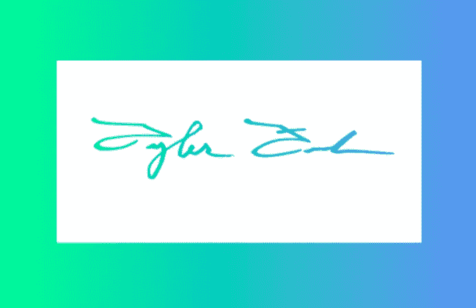

我一直在想办法让我的应用和网站在创意方面脱颖而出。我没有很多图像编辑软件或任何东西，但我仍然想做出独特的东西，并引发阴谋。

我最近在为我妈妈制作一个应用程序时受到了启发。这是一个用 React 构建的渐进式网络应用程序，它在一个地方编译了她的所有食谱。我想找到一种方式把她的个人风格放在上面，这篇文章将谈论我发现我可以做的一些事情，增加一个真正独特的特征，她的笔迹。

不久前，我写了一篇关于不用 Adobe Photoshop 创建自定义徽标的文章，这篇文章将演示许多我用来制作自定义徽标的相同方法，除了用手写代替谷歌图像。也可以随意查看那篇文章，链接[这里](https://tyler-j-funk.medium.com/creating-a-custom-logo-for-your-app-without-photoshop-on-mac-6c4b23e7e771)。我还将讨论在你的应用程序中实现这些风格特征的几种不同方法，我更喜欢 React。

# 开始

**你需要的一切:**
1。Sharpie 或其他黑色毡尖记号笔，(我用 Expo 作凿尖)
2。一张打印纸
3。在 Mac 上预览应用程序

我们在这里所做的要点是把黑色的笔迹放在一张白纸上，然后把它转换成 PNG。从那里，我们可以选择做一些不同的创造性的事情。

首先，我们需要在纸上写下我们想要的文本。如果你写的东西需要在一条直线上:用一把尺子，用铅笔画一条尽可能浅的线，用记号笔完成后，小心地擦掉铅笔线，不要弄皱纸张。

在这个演示中，我将使用我的签名。这是我目前掌握的情况:

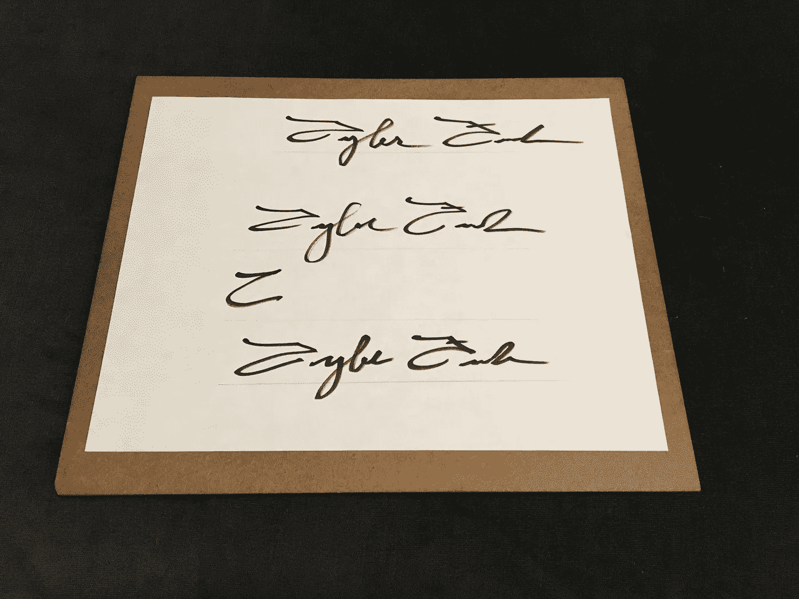

熟能生巧

我决定我最喜欢上面的签名，所以我给那个签名拍了一张特写照片。然后，我把手机上不必要的部分剪掉，然后放进谷歌硬盘，以便在我的 Macbook 上查看图片。

在擦掉铅笔线并裁剪了一张特写照片后，我剩下的是:

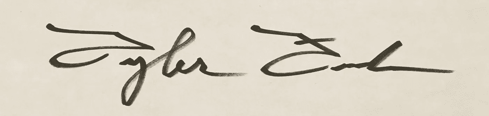

我喜欢复制一份，然后在新的副本上工作。我们可以通过点击`command + A`来高亮显示图像，点击`command + C`来复制图像，最后点击`command + N`从剪贴板中创建一个新的副本。

# 变成巴布亚新几内亚

现在，我将在预览中打开图像，并单击“标记工具栏”按钮:

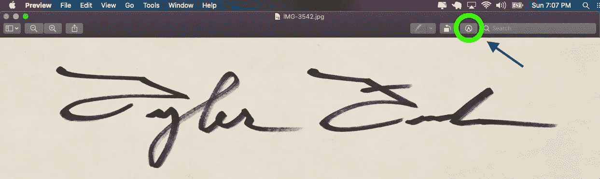

接下来，我们将使用“Insta Alpha”工具(魔棒图标):

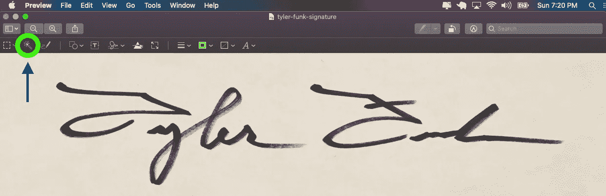

如果我们在背景上使用即时阿尔法工具，然后点击删除，我们消除了背景，只留下签名。下面是一张 GIF 图片，展示了我到底做了什么:

GIF 设置里一定要选高清！

我用 delete 键删除了用红色突出显示的部分，在我删除了“y”内的空白后，我用`command + Z`来撤销。如果不喜欢边缘的样子，你可以随时撤销，然后再试一次。

以下是此方法的 PNG 结果，它保持了原始标记线的完整性，赋予了它标志性的外观和感觉:

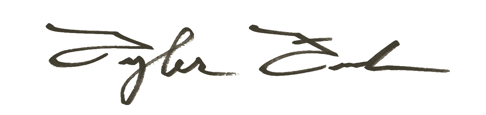

除了一些粗糙的边缘之外，这看起来还不错，这可以通过使用真正的实线来避免。我推荐一个全新的记号笔，里面有很多墨水，也许可以用较慢的速度来使线条变得大胆和坚实。

# 怎么处理它

我们可以立即开始在专业文件的末尾使用这种签名，包括您的电子邮件签名！我将继续把这一条放到我的电子邮件签名中来炫耀一下:

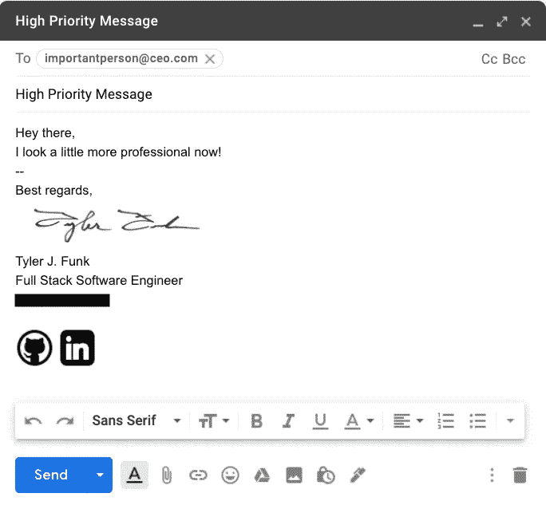

涂黑我的电话号码，因为谁真的需要更多的机器人电话？没错。

这是获得 PNG 格式签名的简单方法，然而，如果我们制作签名的模板而不是删除背景，我们会更有创意。

# 反转笔迹制作模板

使用我们刚刚创建的 PNG 文件，我像上面一样制作了一个副本(`command + A`、`command + C`、`command + N`)。现在，我们需要在谷歌上找到一个空白的白色背景图像，最好是一个相当大的，然后在它的顶部粘贴我们的 PNG 签名，就像这样:

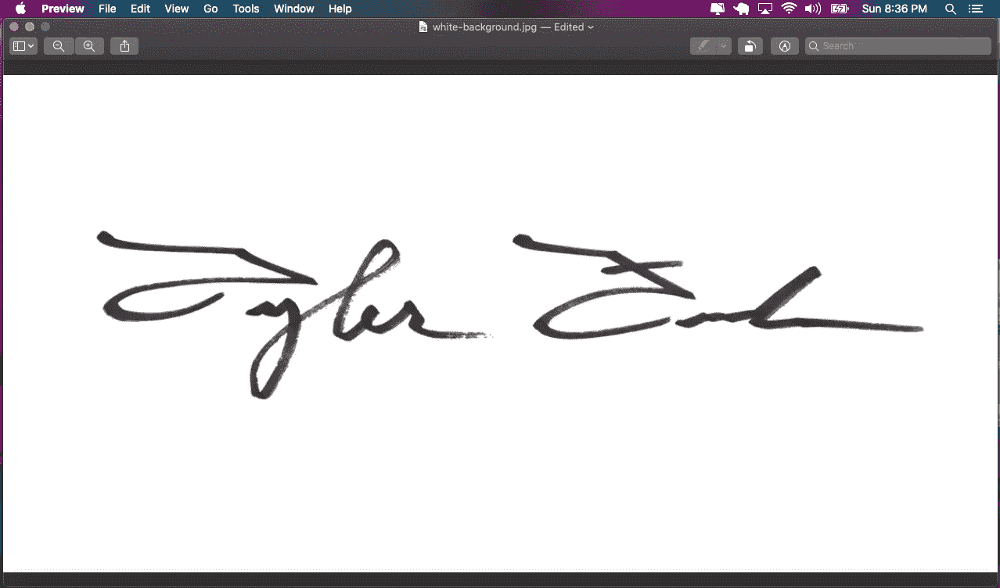

我必须调整我的 PNG 签名副本的大小(点击窗口顶部的预览“工具”，然后“调整大小”)，以便它适合我下载的 1200x600 白色背景图像。

这一次，当我使用“即时 Alpha”工具时，我将删除签名本身，只留下白色背景:

还是那句话，一定要在 GIF 设置上选择高清！

现在我只剩下一个模板，我可以把它放在任何我想要的东西上面，颜色渐变，纹理，图像，任何东西！

我将用一个渐变来演示，我喜欢在酷派制作我的渐变[这里](https://coolors.co/gradient-maker/00ff87-6190ff?position=10,90&opacity=100,100&type=linear&rotation=90)，然后我下载了一张图片。

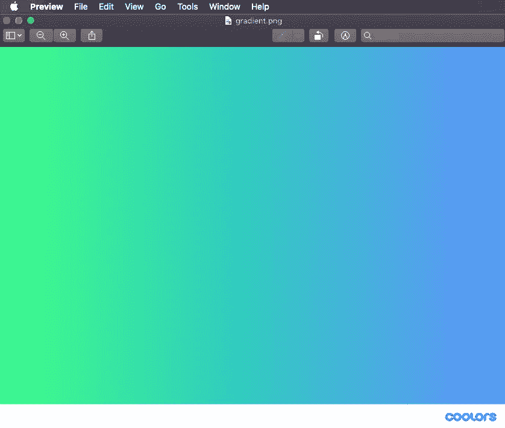

现在，我可以复制我的签名模板，并将其粘贴在这张图片的顶部:

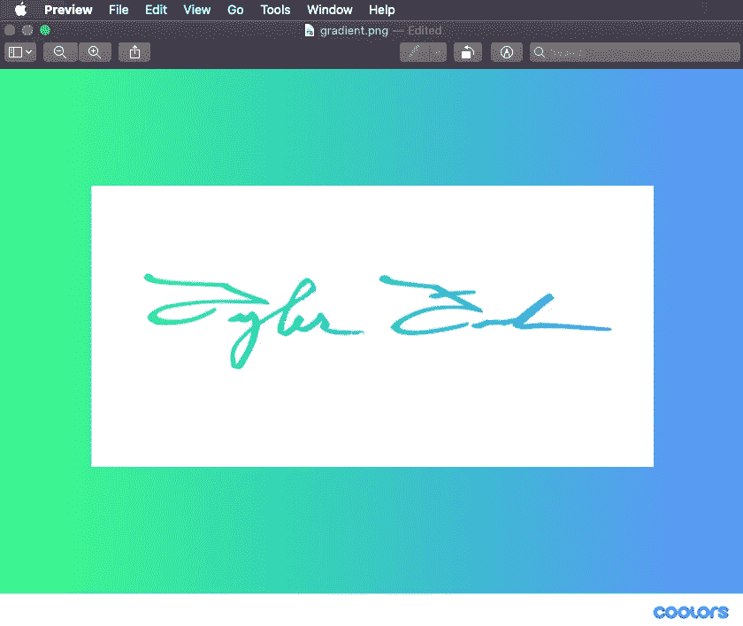

在裁剪掉不必要的背景后，我们只剩下梯度签名和白色背景，我们可以移除它们，只留下梯度签名:

高清是进行设置的方式！

以下是裁剪后在浅色背景上的效果，以及在深色模式窗口上的效果:

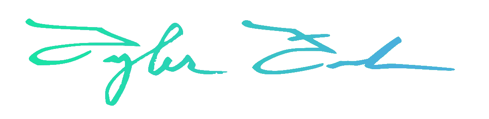

光

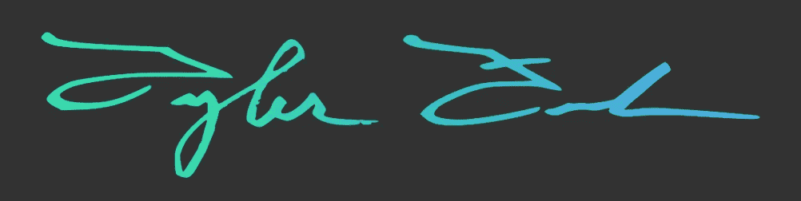

黑暗

像这样的东西可以放在开发者作品集的网站上，进行**独特的** **个人接触**来展示他们的**创造力**，并在他们的作品上打上他们的**标记**。

# 我最初如何使用这个想法

下面来看看我是如何在我妈妈的应用程序中使用这个手写技巧的，当时我就知道如何做到这一点。她把自己的食谱组织在纯色文件夹中，并用 sharpie 在每个文件夹上写下类别。

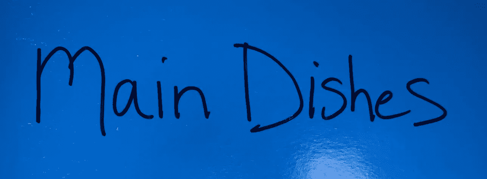

我将如上图所示的图片转换成白色文本，成为应用程序中每个类别的标签:

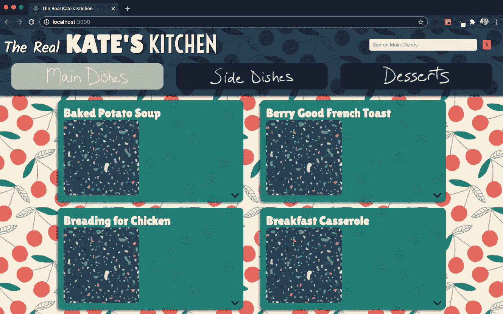

现在就像她现实生活中的食谱一样！

# **结论**

在您的项目中使用手写作为 PNG 可以提高创造力水平，并给它带来额外的特殊感觉，使您脱颖而出！我希望这至少对一个人有所启发！

如果你能做到这一步，感谢你的阅读，一如既往，祝你黑客生涯愉快！