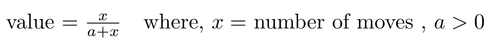
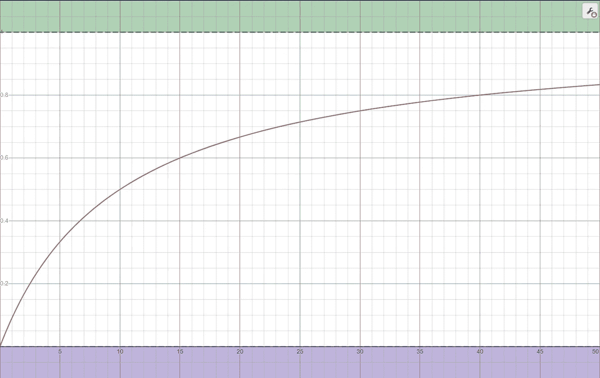
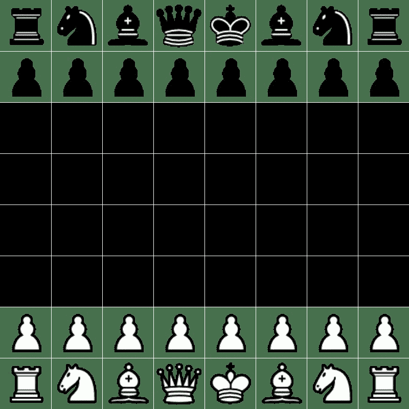

# Python 中更聪明的最小最大国际象棋人工智能

> 原文：<https://blog.devgenius.io/a-smarter-min-max-chess-ai-in-python-224be62c385c?source=collection_archive---------2----------------------->

欢迎来到我的 Python 象棋教程系列的第 3 部分！在本教程中，我们将扩展并改进第 2 部分中简单的最小最大算法。让我们开始吧！

第一部分:[https://medium . com/dev-genius/simple-interactive-chess-GUI-in-python-c 6d 6569 f 7 b 6 c](https://medium.com/dev-genius/simple-interactive-chess-gui-in-python-c6d6569f7b6c)

第二部分:[https://medium . com/dev-genius/simple-min-max-chess-ai-in-python-2910 a 3602641](https://medium.com/dev-genius/simple-min-max-chess-ai-in-python-2910a3602641)

以下是我们将在第 2 部分中改进的主要问题:

*   增加一本打开的书来弥补最小最大深度的不足
*   在人工智能中实现赢/平/输条件
*   提炼什么是通过占空间的想法做出好的举动

```
import chess.polyglot
import chess

BOARD = chess.Board()
#opening book
reader = chess.polyglot.open_reader('baron30.bin')

#search the opening book for this game state
opening_move = reader.get(BOARD)

#if no move is found
if opening_move == None:
    move = None
#if move is found
else:
    move = opening_move.move

print(move)
```

我们的第一个代码块向我们展示了如何使用 chess 模块实现一本打开的书。我用的是男爵开书，详情可以在这里找到([https://www . chess programming . net/new-version-of-the-Baron-v3-43-plus-the-barons-polyglot-opening-book/](https://www.chessprogramming.net/new-version-of-the-baron-v3-43-plus-the-barons-polyglot-opening-book/))。该代码只是在当前游戏状态中搜索打开的书中的一步棋，并从书中选择最佳的一步棋。

```
#list to store score of each
scores = []
#iterating over the possible moves
for move in moves:
    outcome = temp.outcome()
    #if we not at an endstate
    if outcome == None:
        # we will have code here to deepen our search 
        # and return an evaluation of the move
        pass
    #if our move checkmates our opponent
    elif temp.is_checkmate():
        # we return this move as it is our best move
        return move
    # if our move ends in a draw
    else:
        scores.append(0)
```

我们的第二个代码块展示了我们将如何在 Min Max 函数中实现我们的赢/平/输条件。象棋模块有一个非常漂亮的**象棋。Board.outcome()** 告诉我们是否处于将死/和棋状态的函数。这是用来快速告诉我们停止评估状态，如果我们在一个残局，节省我们的时间，并作出更好的决定。

```
def eval_space(BOARD):
    no_moves = len(list(BOARD.legal_moves))

    #this function is always between 0 and 1 so we will never evaluate
    #this as being greater than a pawns value. The 20 value is arbitrary
    #but this number is chosen as it centers value around 0.5
    value = (no_moves/(20+no_moves))

    if BOARD.turn == True:
        return value
    else:
        return -value
```

我们的第三个代码块是一个二级评估函数。这是需要的，因为对于许多移动来说，可能移动的当前评估是相等的。背后的想法是，在大多数情况下，一个人在一个回合中可能走的步数越多，他的位置就越好(假设材料数量相等)。所以我们简单地将可能的移动次数相加，并通过下面的函数进行计算。



空间评价函数

我们选择这个函数，因为它受(0，1)限制，并且严格递增。这意味着*值*将始终位于 0 和 1 之间，并且随着 *x* 增加*值*也将增加，保持更多可能移动次数将导致更高*值的特性。*它还保持了作为第二评估函数的属性，因此它永远不能添加/移除比棋子更多的值。



Y 轴上的值函数和 X 轴上的移动次数。a = 10

有了这三个改进，我们现在可以将它们结合起来，创建一个更好的最小最大算法，如下所示。

```
import chess
from copy import deepcopy
import random
import chess.polyglot

#opening book
reader = chess.polyglot.open_reader('baron30.bin')

def random_agent(BOARD):
    return random.choice(list(BOARD.legal_moves))

scoring= {'p': -1,
          'n': -3,
          'b': -3,
          'r': -5,
          'q': -9,
          'k': 0,
          'P': 1,
          'N': 3,
          'B': 3,
          'R': 5,
          'Q': 9,
          'K': 0,

          }

def eval_board(BOARD):
    score = 0
    pieces = BOARD.piece_map()
    for key in pieces:
        score += scoring[str(pieces[key])]

    return score

def eval_space(BOARD):
    no_moves = len(list(BOARD.legal_moves))

    #this function is always between 0 and 1 so we will never evaluate
    #this as being greater than a pawns value. The 20 value is arbitrary
    #but this number is chosen as it centers value around 0.5
    value = (no_moves/(20+no_moves))

    if BOARD.turn == True:
        return value
    else:
        return -value

def min_maxN(BOARD,N):

    opening_move = reader.get(BOARD)
    if opening_move == None:
        pass
    else:
        return opening_move.move

    #generate list of possible moves
    moves = list(BOARD.legal_moves)
    scores = []

    #score each move
    for move in moves:
        #temp allows us to leave the original game state unchanged
        temp = deepcopy(BOARD)
        temp.push(move)

        #here we must check that the game is not over
        outcome = temp.outcome()

        #if checkmate
        if outcome == None:
            #if we have not got to the final depth
            #we search more moves ahead
            if N>1:
                temp_best_move = min_maxN(temp,N-1)
                temp.push(temp_best_move)

            scores.append(eval_board(temp))

        #if checkmate
        elif temp.is_checkmate():

            # we return this as best move as it is checkmate
            return move

        # if stalemate
        else:
            #value to disencourage a draw
            #the higher the less likely to draw
            #default value should be 0
            #we often pick 0.1 to get the bot out of loops in bot vs bot
            val = 1000
            if BOARD.turn == True:
                scores.append(-val)
            else:
                scores.append(val)

        #this is the secondary eval function
        scores[-1] = scores[-1] + eval_space(temp)

    if BOARD.turn == True:
        best_move = moves[scores.index(max(scores))]
    else:
        best_move = moves[scores.index(min(scores))]

    return best_move

# a simple wrapper function as the display only gives one imput , BOARD

def min_max1(BOARD):
    return min_maxN(BOARD,1)

def min_max2(BOARD):
    return min_maxN(BOARD,2)

def min_max3(BOARD):
    return min_maxN(BOARD,3)

def min_max4(BOARD):
    return min_maxN(BOARD,4) 
```

这是它在深度 3 的一个例子



最小最大深度 3(黑色)与随机代理(白色)

我们可以看到它很好地打开了中心，并在最后找到了一个巨大的十字交叉将军！不幸的是，深度 3 是我在花费太长时间之前所能合理达到的深度，所以这可能是我下一个需要改进的地方。感谢你完成了我的 3 部分教程！

如果你想对抗这个 AI，复制最后的代码块并运行我的教程[第一部分](https://medium.com/dev-genius/simple-interactive-chess-gui-in-python-c6d6569f7b6c)中的 **main_one_agent** 。