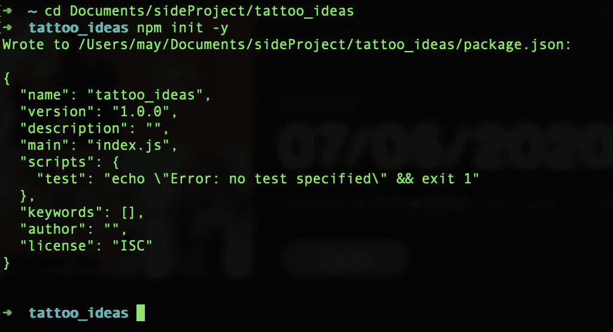

# 软件工程师的纹身创意——NPM init-y

> 原文：<https://blog.devgenius.io/a-software-engineers-tattoo-idea-2bebbe685ecd?source=collection_archive---------14----------------------->

## 如果你是一名软件工程师，给你一个纹身的灵感

马库斯·斯皮斯克在 [Unsplash](https://unsplash.com?utm_source=medium&utm_medium=referral) 上的照片

我还没有决定我想要一个纹身，但是只要想想如果有一天我真的想要一个的话，那会是一件很有趣的事情。到目前为止，我有 3 个想法，让我把它们放在这里，在我把它们放在我的身体上并决定它们是愚蠢的之前。这是我的第一个。

“npm init -y”是我的第一个纹身创意——一个我觉得非常酷的编程命令。如果您是 javascript 开发人员，您可能对它很熟悉。但是如果您不是，npm 是一个包管理器工具，它允许您管理项目中的依赖项。

如果你不是一个书呆子，我刚才说的没有任何意义，想象一下你是一个木匠，你想造一张桌子，你不会从种植一棵树和开采金属开始造一把斧头和锯子。你可能会去五金店买些木材和工具，然后你就可以开始你的项目了。

这与软件项目的环境非常相似。当你写软件时，你永远不会从头开始写，而是总是建立在一些现有的东西之上(比如从商店里得到木材和工具)。npm 是一个工具，它管理你使用的工具(依赖是编码的术语，通常是其他人编写的一些代码)来构建你的东西，无论是表还是软件，并确保它们在你需要的时候就位。

想象另一个场景，你和另一个木匠一起做一个项目，你们可能会在同一个地方工作并分享你们的工具。但是当你和其他人一起开发一个软件时，你可能不会共用一台计算机，你会在你自己的计算机上有一个软件的副本，并不时地和其他人同步，这就是 npm 派上用场的时候。npm 记录了您使用的工具，您可以通过运行一个命令来检索这些工具。因此，当你的朋友向项目引入一个新工具，而你在你的计算机上同步了最新的代码时，你将没有这个工具，但它很好，因为你可以使用 npm 找到这个工具的记录并安装它。

现在，“npm init”是你开始一个项目时首先运行的命令(init 在这里代表初始化)，这就像说“嘿 npm，我要开始一个项目，你能帮我管理我需要的工具并记录它们吗？”npm 会说“是的，女士，我很乐意这么做”，然后会问你几个问题，比如你想给你的项目起什么名字，这是什么版本，详细描述一下，blabla…

如果你是一个懒惰的人，不想被官僚主义困扰，那么“-y”就是一个魔术。这是一个对所有事情都说是的选项，所以如果您使用命令“npm init -y”，听起来就像:

“嘿 npm，你能帮我开始我的项目吗，不要问我任何问题！”

而 npm 就像“但是…但是我需要他们…”

你就像“好吧…是的！每个问题都是肯定的！现在去完成你的工作吧！”

这是您在终端中运行该命令时的样子，比我刚才描述的稍微没有那么戏剧化

如果我在上面已经说清楚了，让我着迷的是，你可以用 npm 在一秒钟内安装任何工具，并开始像使用自己的工具一样使用它。这就像尼欧是如何从《黑客帝国》中的电脑磁盘上“学会”所有那些技能的。我希望我可以运行一个命令，在自己身上安装技能，并开始掌握我的生活，例如，一些闲聊的技能将把我从许多社交场合中拯救出来。

我想以一种我不在乎的方式去做，所以-是的。

我对这个想法的唯一担心是，编码工具过时得太快了，自从我有了这个想法，我已经从 npm 换了另一个工具。我怕有一天我看着纹身的时候，会像今天你看到有人在身上纹了 Windows98 一样。

请给我一些掌声，让我知道你喜欢它。

**继续看我的其他纹身创意:**

1.  [一条黄鳍金枪鱼](https://medium.com/@mayyyyyyc/a-tattoo-idea-yellowfin-tuna-3aa90e9db8fa)
2.  [2020 年 6 月 14 日前最佳](https://medium.com/@mayyyyyyc/another-tattoo-idea-best-before-14-06-2020-e0d1c1c378f0)