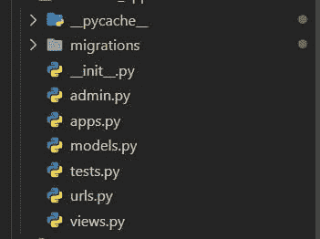
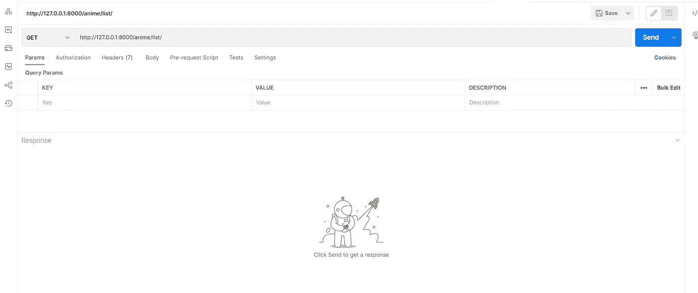
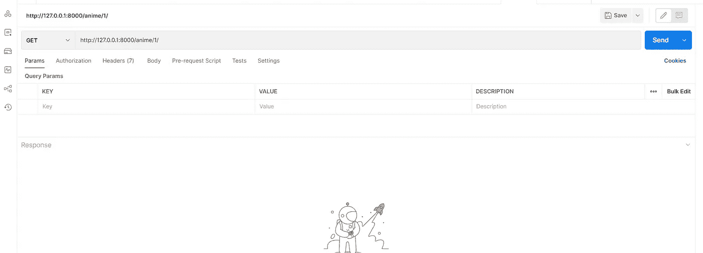

# 在 Django 中构建 API 的分步指南

> 原文：<https://blog.devgenius.io/a-step-by-step-guide-to-building-an-api-in-django-d2b9844721e?source=collection_archive---------5----------------------->


梅尔文·查韦斯在 [Unsplash](https://unsplash.com?utm_source=medium&utm_medium=referral) 上的照片

本教程将教你如何建立一个 Django 项目，并创建一个 API 来返回动画列表。

API 是两个 app 之间的中间人。它允许一个应用程序使用另一个应用程序的功能。例如，可以使用 API 来允许社交媒体平台从他们的电话访问用户的位置数据。

API 用于连接不同的软件，并允许它们相互通信。它们也可以用来让一个软件与其他东西交互，比如数据库或网页。一般来说，项目 A 和项目 B 可以通过一个 API 连接起来。

API 可以用来创建不同领域的项目。例如，在线零售商可以使用 API 从他们的网站访问客户数据。

维基百科对应用编程接口(API)的定义是计算机之间或计算机程序之间的连接。它是一种软件接口，为其他软件提供服务。

当与 API 交互时，我们发送请求并得到响应。请求有不同类型:

*   C —创建(发布)
*   R —读取(获取)
*   U —更新(上传)
*   D —删除(删除)

在本教程中，我们将创建一个 API，它将返回一个简单的 JSON 响应，我将写一篇单独的文章介绍如何创建上述每个方法。

**1。设置 Django 项目**

Django 是一个 Python web 框架，旨在快速开发高质量的 web 应用程序。它是 BSD 许可下的免费开源软件。

Django 的主要特点是其“包含电池”的 web 开发方法，包括许多通常很难或很费时间从头构建的东西，如用户认证、数据库访问、缓存支持等等；对可读性的强调；以及使用 Python 作为实现语言。你可以从 Django 的文档[这里](https://www.djangoproject.com/)了解它

现在我们只需要 Django 和一个代码编辑器(我用的是 Vscode)来完成这个项目。

创建一个文件夹来处理这个项目。

二。在您刚刚创建的文件夹中，创建一个虚拟环境。要创建虚拟环境，请打开该文件夹中的终端并输入:

```
$ python -m venv env
```

三。激活虚拟环境并安装 Django

```
$ env\Scripts\activate$ pip install Django
```

四。创建项目:

因为我们正在创建一个 anime list API，所以我们将创建一个名为 anime list 的项目:

```
$ django-admin startproject animelist $ cd animelist
```

二。在我们的项目中创建应用程序

一般来说，如果我们需要在 Django 中添加任何功能或做任何事情，我们需要创建应用程序。所以完整的项目被分成多个 app。让我们使用以下命令创建我们的第一个应用程序:

```
$ python manage.py startapp animelist_app
```

将应用添加到 [settings.py](http://settings.py) 中的 INSTALLED_APPS 列表中

```
INSTALLED_APPS = [
    'django.contrib.admin',
    'django.contrib.auth',
    'django.contrib.contenttypes',
    'django.contrib.sessions',
    'django.contrib.messages',
    'django.contrib.staticfiles',
    'animelist_app',
]
```

我们将测试我们的项目，看看我们是否能看到 Django 项目的默认页面:

```
$ python manage.py runserver
```

**2。创建 Django 模型**

对于任何开发人员来说，在 Django 中创建模型都是重要的一步。这是在 Django 中创建数据库的第一步，也是创建 web 应用程序的第一步。

Django 模型是表示数据库表的类。它们用于创建、读取、更新和删除表中的数据。

在本教程中，我们将为动画列表创建一个 API 模型。

第一次创建 Django 项目时，需要执行几次迁移。我们可以通过运行以下命令来做到这一点:

```
$ python manage.py migrate
```

二。运行以下命令时，通过提供详细信息来创建超级用户:

```
$ python manage.py createsuperuser
```

现在，尝试通过运行服务器来访问 Django 管理界面:

```
$ python manage.py runserver
```

访问: [127.0.0.1:8000/admin](http://127.0.0.1:8000/admin)

三。在 animelist_app 文件夹中创建 [urls.py](http://urls.py) 文件:

Django 遵循一种叫做 MVT 架构的东西，它是模型(数据库)、视图、模板，Django 中的 URL 会告诉我们点击哪个端点来获取信息，或者指定项目内部的路径。

[urls.py](http://urls.py)



四。在 [models.py](http://models.py) 文件中创建一个模型。在下面的代码中，我们要创建一个名为 Anime 的数据库表:

```
class Anime(models.Model):
    name = models.CharField(max_length=50)
    description = models.CharField(max_length=200)
    active = models.BooleanField(default=True)

    def __str__(self):
        return self.name
```

动词 （verb 的缩写）由于我们已经添加到我们的模型中，我们需要进行迁移:

```
$ python manage.py makemigrations
```

Django 的一个令人惊奇的特性是它支持 ORM(对象关系映射器),这使我们能够像使用 SQL 查询一样与数据库进行交互。事实上，这只是一种创建 SQL 查询、操作数据库和获得结果的 python 式方法，更容易的是，开发人员不需要编写任何 SQL，因为 ORM 自动完成了这项工作。运行以下命令创建数据库。

```
$ python manage.py migrate
```

不及物动词在[管理副本](http://admin.py)中注册模型

```
from animelist_app.models import Anime

admin.site.register(Anime)
```

运行服务器，尝试从管理界面添加一些动画到数据库

127 . 0 . 0 . 1:8000/管理员

**3。创建 JSON 响应**

这里我们将 Django 模型的查询集(对象)转换成 python 字典，然后转换成 JSON

```
from animelist_app.models import Anime
from django.http import JsonResponse

def anime_list(request):
    animes= Anime.objects.all()

    # print(list(animes.values()))

    data = {
        'animes': list(animes.values())    
    }

    return JsonResponse(data)
```

这样会返回 JsonResponse …我们可以通过检查数据是否在双引号里(JSON 里单引号改成双引号)，字典里 True 的大写 T 在 JSON 里改成小 T。

2/在 [urls.py](http://urls.py) 中为上面的视图创建一个链接

[URL . py](http://urls.py)内部 animelist:

```
from django.contrib import admin
from django.urls import path, include

urlpatterns = [
    path('admin/', admin.site.urls),
    path('anime/', include('animelist_app.urls')),
]
```

【animelist _ app 内的 urls.py :

```
from django.urls import path
from animelist_app.views import anime_list

urlpatterns = [
    path('list/', anime_list, name = 'anime-list'),
]
```

在[127 . 0 . 0 . 1:8000/anime/list](http://127.0.0.1:8000/anime/list/)查看结果

**4。为单个数据创建视图**

I .创建一个视图来返回单个动画的单个元素或细节

```
# return individual elements
def anime_details(request, pk):
    anime= Anime.objects.get(pk=pk)

    data = {
        'name': anime.name,
        'description': anime.description,
        'active': anime.active
    }

    # print(anime.name)

    return JsonResponse(data) # convert to json
```

二。在 animelist_app 的 [urls.py](http://urls.py) 文件中添加 url:

```
from animelist_app.views import anime_list, anime_details

urlpatterns = [
    path('list/', anime_list, name = 'anime-list'),
    path('<int:pk>', anime_details, name='anime-detail'),
]
```

通过访问 [127.0.0.1:8000/anime/1](http://127.0.0.1:8000/anime/1/) 测试 API

到目前为止，我们已经通过从模型 JSON 转换 python 字典数据创建了一个 JSON 响应。当我们有大量的对象需要转换时，这将是一个很大的工作量，在此期间，我们可能会选择使用 Django rest 框架，在那里我们可以使用称为序列化的东西转换到 JSON。

**5。使用 Postman 测试 API 端点**

API 测试对开发过程至关重要。Postman 是一个很棒的 API 测试工具。它可以用来生成和测试 API 端点。您还可以使用它来测试您的 API，方法是生成和发送不同的请求，以及检查错误和其他潜在问题的响应。

如果你没有邮递员，你可以从[这里](https://www.postman.com/downloads/)下载

因为我们只有两个端点来测试我们的 API，所以从左边选择 GET 方法并如下粘贴端点。点击发送查看回复

第一个端点:获得 animelist 响应



第二个端点:获取单个动画细节



**结论:**

在本教程中，我们回顾了用 Django 构建动画列表 API 的过程。

*原载于*[*https://wulfi . hash node . dev*](https://wulfi.hashnode.dev/a-step-by-step-guide-to-building-an-api-in-django)*。*