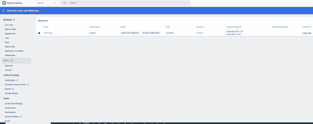
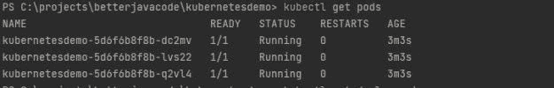
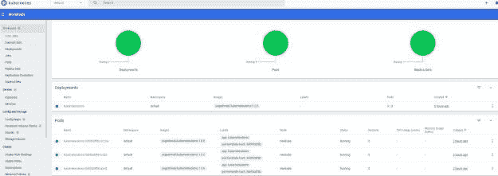
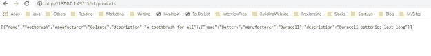

# Kubernetes 的逐步指南

> 原文：<https://blog.devgenius.io/a-step-by-step-guide-to-kubernetes-4524dad98d2a?source=collection_archive---------2----------------------->

在本帖中，我们将讨论如何使用 Kubernetes 以及如何在 Kubernetes 集群中部署您的微服务。我将介绍基本原理，因此如果您是初学者，这将是学习 Kubernetes 的一个很好的分步指南。因为我们将构建一个 docker 化的容器应用程序，你可以从使用 docker-compose 的完整指南[开始。](https://betterjavacode.com/docker/the-complete-guide-to-use-docker-compose)

# 什么是 Kubernetes？

根据[原始来源](https://kubernetes.io/) — *Kubernetes 是一个用于自动化部署、扩展和管理容器化应用的开源系统。Kubernetes 是一个容器编排平台。*

基本上，一旦有了容器化的应用程序，就可以在 Kubernetes 集群上部署它。具体来说，集群包含多台机器或服务器。

在传统的 Java 应用程序中，人们会构建一个 jar 文件并将其部署在服务器上。有时，甚至在多台机器上部署相同的应用程序来进行水平扩展。最重要的是，有了 Kubernetes，您不必担心服务器机器。显然，Kubernetes 允许创建一个机器集群，并在其上部署容器化的应用程序。

此外，使用 Kubernetes，您可以

*   跨多台主机协调容器
*   控制和自动化应用程序部署
*   更好地管理服务器资源
*   通过自动放置、自动重启、自动复制和自动扩展，对您的应用进行运行状况检查和自我修复

此外，Kubernetes 集群包含两个部分

具体来说，节点(物理机或虚拟机)使用 Kubernetes API 与控制平面进行交互。

*   **控制平面** —控制 Kubernetes 节点的进程集合。
*   **节点** —执行通过流程分配的任务的机器。
*   **Pod** —部署在单个节点上的一组一个或多个容器。pod 上的所有容器共享资源和 IP 地址。
*   **服务** —一种将运行在一组 pod 上的应用程序公开为网络服务的抽象方式。
*   **kube let**—kube let 是在每个节点上运行的主节点代理。它读取容器清单并跟踪容器的启动和运行。
*   kube CTL—Kubernetes 的命令行配置工具

# 如何创建集群？

此后，根据您的环境，下载 [Minikube](https://minikube.sigs.k8s.io/docs/start/) 。我使用的是 Windows 环境。

将创建一个新的 Kubernetes 集群。

最后，如果您想查看更详细的仪表板，您可以使用命令`minikube dashboard`。该命令将在浏览器中启动 Kubernetes 仪表板。([http://127 . 0 . 0 . 1:60960/API/v1/namespaces/kubernetes-dashboard/services/http:kubernetes-dashboard:/proxy/)](http://127.0.0.1:60960/api/v1/namespaces/kubernetes-dashboard/services/http:kubernetes-dashboard:/proxy/))



# 向 Kubernetes 部署微服务的演示

## 创建容器化的微服务

此外，让我们创建一个简单的微服务，我们最终将在集群中部署它。我将使用 Spring Boot 创建一个微服务，为 REST API 调用返回产品列表。

该微服务将在通话中返回产品列表。

```
package com.betterjavacode.kubernetesdemo.controllers;

import com.betterjavacode.kubernetesdemo.dtos.ProductDTO;
import com.betterjavacode.kubernetesdemo.services.ProductService;
import org.springframework.beans.factory.annotation.Autowired;
import org.springframework.web.bind.annotation.GetMapping;
import org.springframework.web.bind.annotation.RequestMapping;
import org.springframework.web.bind.annotation.RestController;

import java.util.List;

@RestController
@RequestMapping("/v1/products")
public class ProductController
{
    @Autowired
    public ProductService productService;

    @GetMapping
    public List getAllProducts()
    {
        return productService.getAllProducts();
    }
}
```

此外，`ProductService`将有一个返回所有产品的方法。

```
package com.betterjavacode.kubernetesdemo.services;

import com.betterjavacode.kubernetesdemo.dtos.ProductDTO;
import org.springframework.stereotype.Component;

import java.util.ArrayList;
import java.util.List;

@Component
public class ProductService
{

    public List getAllProducts ()
    {
        List productDTOS = new ArrayList<>();

        ProductDTO toothbrushProductDTO = new ProductDTO("Toothbrush", "Colgate", "A toothbrush " +
                "for " +
                "all");
        ProductDTO batteryProductDTO = new ProductDTO("Battery", "Duracell", "Duracell batteries " +
                "last long");

        productDTOS.add(toothbrushProductDTO);
        productDTOS.add(batteryProductDTO);
        return productDTOS;

    }
}
```

我故意不使用任何数据库，而是使用一个静态的产品列表来进行演示。

在构建 docker 映像之前，运行

`minikube docker-env`

## 构建 docker 映像

让我们为刚刚创建的微服务构建一个 [docker](https://betterjavacode.com/docker/the-complete-guide-to-use-docker-compose) 映像。首先，在项目的根目录下创建一个 dockerfile。

```
FROM openjdk:8-jdk-alpine 
VOLUME /tmp COPY ./build/libs/*.jar app.jar 
ENTRYPOINT ["java", "-jar", "/app.jar"]
```

现在让我们使用这个 docker 文件构建一个 docker 映像。

`docker build -t kubernetesdemo .`

这将创建一个带有最新标签的`kubernetesdemo` docker 图像。

如果您想在您的本地环境中试验这个映像，您可以使用以下命令运行它:

`docker run --name kubernetesdemo -p 8080:8080 kubernetesdemo`

这将在端口 8080 上运行我们的[微服务 Docker 映像](https://betterjavacode.com/programming/revisiting-docker-how-to-use-docker-container-in-ecs)。无论如何，在部署到 kubernetes 之前，我们需要将这个 docker 映像推送到 docker hub 容器注册中心，以便 Kubernetes 可以从 hub 中提取。

`docker login` -使用您的用户名和密码从终端登录 docker hub。

一旦登录成功，我们需要为 docker 图像创建一个标签。

`docker tag kubernetesdemo username/kubernetesdemo:1.0.0`。

使用您的 docker hub 用户名。

现在，我们将使用以下命令将该映像推送到 docker hub:

`docker push username/kubernetesdemo:1.0.0`。

现在，我们的 docker 图像在容器注册表中。

## Kubernetes 部署

Kubernetes 是一个容器编排器，旨在运行考虑到可伸缩性的复杂应用程序。

容器编排器管理服务器周围的容器。这就是简单的定义。如前所述，我们将使用以下命令在 windows 机器上创建一个本地集群

`minikube start`。

一旦集群启动，我们可以使用命令查看集群信息

`kubectl get cluster-info`。

现在，为了在 Kubernetes 中部署我们的微服务，我们将使用声明式接口。

## 声明部署文件

在你的项目根目录下创建一个`kube`目录。添加一个名为`deployment.yaml`的`yaml`文件。

该文件将如下所示:

```
apiVersion: v1
kind: Service
metadata:
  name: kubernetesdemo
spec:
  selector:
    app: kubernetesdemo
  ports:
    - port: 80
      targetPort: 8080
  type: LoadBalancer

---
apiVersion: apps/v1
kind: Deployment
metadata:
  name: kubernetesdemo
spec:
  selector:
    matchLabels:
      app: kubernetesdemo
  replicas: 3
  template:
    metadata:
      labels:
        app: kubernetesdemo
    spec:
      containers:
      - name: kubernetesdemo
        image: username/kubernetesdemo:1.0.0
        imagePullPolicy: IfNotPresent
        ports:
        - containerPort: 8080
```

很快，我们将检查这个部署文件的每个部分。

一旦我们运行这个部署文件，它将创建一个容器和一个服务。我们先来看`Deployment`。

```
apiVersion: apps/v1 kind: Deployment 
metadata: 
  name: kubernetesdemo
```

这几行声明我们使用版本 v1 和名称`kubernetesdemo`创建了一个类型`Deployment`的资源。

`replicas: 3`表示我们正在运行容器的 3 个副本。但是这里的容器只不过是一个豆荚。pod 是包裹容器的包装材料。单个 pod 可以运行多个容器，而这些容器共享 pod 的资源。请记住，pod 是 Kubernetes 中最小的部署单位。

`template.metadata.labels`定义了运行应用程序`kubernetesdemo`容器的 pod 的标签。

`containers`的部分是不言自明的。如果不清楚，这就是我们声明我们计划在 pod 中运行的容器的地方。容器的名称`kubernetesdemo`和该容器的图像为`username/kubernetesdemo:1.0.0`。我们将公开这个容器的端口 8080，我们的微服务将在这里运行。

## 服务定义

现在，让我们来看看这个部署文件的前面部分。

```
apiVersion: v1
kind: Service
metadata:
  name: kubernetesdemo
spec:
  selector:
    app: kubernetesdemo
  ports:
    - port: 80
      targetPort: 8080
  type: LoadBalancer
```

这里，我们正在创建一个类型为 `Service`的资源。

服务允许 pod 与其他 pod 通信。但是它也允许外部用户访问 pod。没有服务，你就不能进入豆荚。我们在这里定义的服务类型将允许我们将流量转发到特定的 pod。

在此声明中，`spec.selector.app`允许我们选择名为`kubernetesdemo`的 pod。服务将暴露这个 pod。到达端口 80 的请求将被转发到所选 Pod 的目标端口 8080。

最后，服务的类型是`LoadBalancer`。基本上，在我们的 Kubernetes 集群中，服务将充当负载平衡器，将流量转发到不同的 pods。服务确保应用程序的持续可用性。如果一个单元崩溃，另一个单元会启动，服务会确保相应地路由流量。

服务跟踪您在群集中运行的所有副本。

## 运行部署

到目前为止，我们已经构建了一个部署配置来在集群中创建资源。但是我们还没有部署任何东西。

要运行部署，请使用

`kubectl apply -f deployment.yaml`

你也可以直接跑

`kubectl apply -f kube`它将从`kube`目录中获取部署文件。

对此命令的响应将是

`service/kubernetesdemo configured
deployment.apps/kubernetesdemo created`

`kubectl get pods`将显示吊舱的状态



现在要查看集群和服务运行的实际情况，我们可以使用

`minikube dashboard`。



我们可以看到有 3 个 pod 在为我们的微服务`kubernetesdemo`运行。

如果您运行`kubectl get services`，我们将看到所有的服务都在运行。现在要访问我们的应用程序，我们必须找到服务 url。在这种情况下，服务(不是微服务)的名称是`kubernetesdemo`。

`minikube service kubernetesdemo --url`会在终端窗口显示一个 URL。

现在如果使用这个 URL `http://127.0.0.1:49715/v1/products`，我们可以在浏览器中看到输出



# 如何缩放？

使用 Kubernetes，很容易扩展应用程序。我们已经使用了 3 个副本，但是我们可以使用一个命令来减少或增加数量:

`kubectl scale --replicas=4 deployment/kubernetesdemo`。

如果您有控制面板，您将看到第 4 个复制副本正在启动。仅此而已。

# 结论

哇，我们在这个演示中已经讲了很多。我希望我能够一步一步地解释 Kubernetes 的基本概念。如果你想了解更多，请评论这篇文章。如果你想学习 Spring 安全概念，你可以买我的书[简化 Spring 安全](https://yogsma.gumroad.com/l/VgSdH)。

*原载于 2021 年 11 月 8 日*[*https://betterjavacode.com*](https://betterjavacode.com/programming/learn-kubernetes-step-by-step)*。*