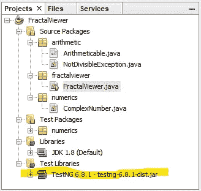
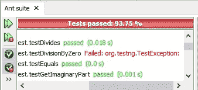
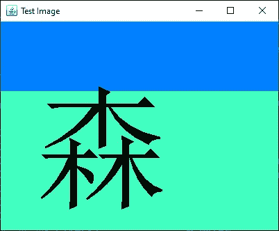
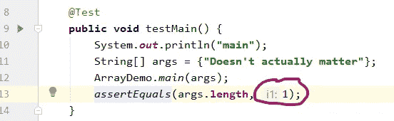

# Java 的 TestNG 测试驱动程序

> 原文：<https://blog.devgenius.io/a-test-drive-of-testng-for-java-5ab29cb4253a?source=collection_archive---------7----------------------->


由[扬·巴布拉克](https://unsplash.com/@janbaborak?utm_source=medium&utm_medium=referral)在 [Unsplash](https://unsplash.com?utm_source=medium&utm_medium=referral) 上拍摄的照片

TestNG 是最受推崇的 Java 单元测试框架之一。即使是所谓的“批评性评论”也会被视为好评。

然而，除了知道 TestNG 是可用的之外，许多 Java 程序员并不太了解 TestNG。也许那是你，那是最近的我。我看到 TestNG 是 Apache NetBeans 中的一个选项(它在 NetBeans 的 Oracle 时代也是一个选项)。

JUnit 似乎非常适合我所有的 Java 单元测试需求。JUnit 是 Java 的标准单元测试框架，似乎也是其他编程语言(如 C#)的单元测试框架的标准参考框架。

我从事 Scala 编程已经有几年了，但在某些方面我还是新手。也许我会到一个需要使用 ScalaTest 的时候。但我还没到那一步。我在所有的 Scala 项目中都使用 JUnit(当然不是在 REPL 或 Scastie 上匆忙完成的小事情)。


曼德尔布罗集分形。

但是今天，我想在一个 Java 项目上尝试 TestNG。我将把我的 Mandelbrot Julia Viewer 程序从我的 Toy Examples 存储库中分出来，放入一个更集中的项目，一个分形查看程序。

要绘制像著名的 Mandelbrot 集这样的分形，我们需要一个表示所谓“复数”的类。实际上，我们没有*来创建这样一个类。伯努瓦·曼德尔布罗自己可能没有。*

另外，我担心必须创建数千个`ComplexNumber`对象会导致程序非常慢。但事实证明并非如此，尽管在 1975 年可能是这样。

此外，用对象来表示复数大大简化了放大和缩小功能。

# 测试不可变的类

我用`ComplexNumber`类开始了 TestNG 的试驾。如果你想理解但不喜欢复数，你仍然可以理解分数、美元金额、玛雅数字，以及任何你可以应用四则运算的东西。

关于复数以及如何相加相乘的解释，[参见布雷特·贝里的文章](https://medium.com/i-math/complex-numbers-explained-fad9a6793019)。

对于这次试用，我将使用 Apache NetBeans，因为我确信 NetBeans 附带了 TestNG。我让您决定是为此创建一个新的 NetBeans 项目，还是在一个现有的项目中进行尝试，甚至是一个您已经在使用 JUnit 的项目。

如果你选择跟随复数，这里有一个粗略的草稿，你可以复制粘贴:

这可能会使我们对它进行的大多数测试失败。

在 NetBeans 中，找到带有“`public class ComplexNumber`”的行，并将光标放在上面。这一行的左边应该会出现一个灯泡，像通常创建 JUnit 测试类一样单击它。而是选择“创建测试类[测试包中的 TestNG”。

就像 JUnit 一样，NetBeans 将生成一个测试类，您可以也应该编辑它。您可能注意到的第一个区别是导入语句不同:`org.testng.annotations.Test`和`org.testng.Assert.*`(后者是静态导入)。

另请注意，TestNG 6.8.1 被添加到项目概述窗格中的测试库中。



生成的测试似乎与为 JUnit 生成的测试完全相同。其中许多都有潜在的空指针警告和对`fail()`的默认调用。

但是，请注意断言行是

```
 assertEquals(result, expResult);
```

不

```
 assertEquals(expResult, result);
```

我开始更喜欢“`expected`”而不是“`expResult`”；更喜欢“`actual`”而不是“`result`”所以我的断言行需要

```
 assertEquals(actual, expected);
```

不

```
 assertEquals(expected, actual);
```

就像我习惯和 JUnit 在一起一样。我检查了 Javadoc 以确保这一点。

现在我将注释掉所有带有空指针警告的行，以及所有导致错误的行，直到我得到一个绿色指示器。

然后我重写了`testToString()`，因为`toString()`对于其他测试来说是至关重要的。测试得出一个非常接近 0 的伪随机复数，然后调用`toString()`。

当然，测试会失败，第一次也应该如此，因为`toString()`返回“尚未实现”，而不是类似于“0.3999688226275+0.395365866

继续运行测试。我从未能够在 NetBeans 中隔离 JUnit 测试，我认为 TestNG 测试也是如此，尽管 TestNG。所以运行它们，让其他测试以“测试用例是原型”失败

> 应为[1.3325346606463198+1.09455474585856 I]，但找到了[NOTIMPLEMENTEDYET]

你知道如何通过`toString()`测试。进行更改并验证其测试通过。如果没有，检查`ComplexNumber`是否被重新编译。

对于大多数其他测试，我们需要覆盖`equals()`。这也意味着`hashCode()`。如果您愿意，可以让 NetBeans 为您编写这些覆盖。如果不是，放入覆盖存根(`equals()`总是假，`hashCode()`总是 0)并相应地编写测试。

当一个测试期望两个对象相等，但是断言失败时，来自 TestNG 的测试失败解释是有帮助的，就像您期望来自 JUnit 的解释一样。举个例子，

> [verbosestng]Java . lang . assertion error:应为[0.5173287743137084+0.2005433523537954 I]，但找到了[0.5173287743137084+0.2005433523537954 I]

但是当一个测试预计两个对象不相等，断言失败时，TestNG 默认的失败解释就不是很有用了:

> [verbosestng]Java . lang . assertion error:null

这是针对我的不同虚部测试的，但也可能是针对在那次运行中失败的其他不等于测试的。啰嗦？不是很对`assertNotEquals()`。

但是请记住，您总是可以添加定制的断言消息，就像在 JUnit 中一样，例如，

```
 @Test
    public void testNotEqualsDiffIm() {
        double re = Math.random();
        double im = Math.random();
        ComplexNumber numberA = new ComplexNumber(re, im);
        ComplexNumber numberB = new ComplexNumber(re, im * 2.5);
        **String msg = numberA.toString() + " shouldn't be equal to " 
                + numberB.toString();**
        assertNotEquals(numberA, numberB, **msg**);
    }
```

注意断言消息在最后，不像 Jupiter (5.0)之前的 JUnit。我猜 TestNG 从 1.0 版本开始就这样了。

通过这种调整，不同的虚部测试应该给出更有帮助的故障解释，例如

> Java . lang . assertion error:0.9054998092512067+0.37128832 8766911 I 不应等于 0.9059999998 809 2512

一旦你让`equals()`正常工作，你就可以为算术运算、`plus()`、`minus()`、`times()`甚至`divides()`编写测试了。嗯，让我们稍微推迟一下`divides()`…

复数加法的公式相当明显，减法的公式也是如此。乘法和除法的公式有点难记，但是，嘿，这就是我们有电脑的原因。在编写乘法测试时，一定要参考参考文献。

不管你是在学习复数还是更熟悉的东西，比如纯实数分数，我们仍然要处理除数为零的问题。

无论是对于复数还是纯实数分数，我认为被零除应该会导致异常。哪个例外？类比整数除法建议`ArithmeticException`。

我对`ArithmeticException`的问题是，它表明更大的位宽或更高的机器精度可以提供正确的结果(例如，如果您从`Math.addExact()`获得`ArithmeticException`，您可以尝试使用`long`或`BigInteger`来代替)。

但是被零除并不是一个可以在任何机器精度水平上精确表示的数字，也不能像无理数那样令人满意地近似。

所以我觉得被零除应该导致`IllegalArgumentException`。但是在某些情况下，这可能需要捕捉一个`ArithmeticException`并将其包装成一个`IllegalArgumentException`。

如果被零除测试接受任一异常，但不接受可能处于相同继承级别的其他异常，这将是很好的，因为通过测试是有效的。在 JUnit 中，唯一有意义的方法是使用一个 Try 块和三个 Catch 块。

TestNG 有一个类似 JUnit 4 的预期异常属性，但是我们可以指定两个或更多的预期异常。

```
 @Test(expectedExceptions = **{ArithmeticException.class, 
                                IllegalArgumentException.class}**)
    public void testDivisionByZero() {
        double re = -0.5 + Math.random();
        double im = -0.5 + Math.random();
        ComplexNumber someNumber = new ComplexNumber(re, im);
        ComplexNumber zero = new ComplexNumber(0.0, 0.0);
        ComplexNumber division = someNumber.divides(zero);
        System.out.println(someNumber.toString() + " divided by " 
                + zero.toString() + " is said to be "
                + division.toString());
    }
```

如果`divides()`抛出这两个异常中的任何一个，那么这个测试应该通过，如果抛出其他异常或者根本没有异常，那么这个测试就会失败。

测试不是文档。测试只是衡量一个程序是否在可接受的参数范围内工作。然而，我承认通过允许多个异常，TestNG 允许多个可能的异常被更清楚地交流。

如果您没有更改`divides()`存根，这个测试将失败，因为结果将是`someNumber`。但是如果你让`divides()`为非零除数工作，测试将失败，因为结果将是无意义的 NaN + NaN *i* ，或者类似的东西。

针对 TestNG 的预期异常测试的 NetBeans 集成还有一些不足之处:



什么？就这样吗？

> [VerboseTestNG]调用:“命令行测试”-数字。complexnumberngtest . testdivisionbyzero()
> 0.4118823922587276 0.46011452072966397 I 除以 0.0 + 0.0i 据说是 NaN + NaNi
> 
> [VerboseTestNG]失败:“命令行测试”numerics。complexnumberngtest . testdivisionbyzero()在 0 毫秒内完成
> [VerboseTestNG]org . TestNG . test exception:
> [VerboseTestNG]方法 complexnumberngtest . testdivisionbyzero()[pri:0，instance:numerics。ComplexNumberNGTest@6d86b085]应该抛出 java.lang.ArithmeticException 类的异常

我仔细检查以确保没有遗漏“或 Java . lang . illegalargumentexception”类，但那就是不能被遗漏。

但是，我向您保证，两个指定异常中的任何一个都将通过测试。

这是 TestNG 发明者 Cédric Beust 事后不会加入的功能，因为它使预期的消息功能变得复杂，对他自己编程和我们使用它都是如此。

查看 Javadoc 中的`@Test`注释，我注意到它说它可以应用于一个测试过程(就像我们到目前为止所做的一样，也像我们在 JUnit 中所做的一样)，或者应用于整个测试类(这在 JUnit 中是一个错误)。

因此，如果您的测试类完全由测试过程组成(与带有助手函数和嵌套类的测试过程相反)，您可以简单地将`@Test`注释放在靠近顶部的地方，然后您可能不必将它放在每个单独的测试过程上。

我继续对`ComplexNumberNGTest`进行了修改，尽管被零除的测试需要注释，这样我就可以在它上面挂上预期的异常属性。

我发现 TestNG Javadoc 有点缺乏细节。除了我已经提到的，我不知道在类级别使用`@Test`注释是否还有其他的注意事项或条件。

我还认为，如果您已经正确指定了测试设置和拆卸过程，您仍然可以将`@Test`注释放在类级别。那么 TestNG 测试运行者将正确地理解那些不是作为测试运行的测试过程，而是在测试之前或之后运行的。

# 用状态测试类

显然`ComplexNumberNGTest`并不是一个测试建立和拆除的好例子。我们需要一个有状态对象的类。

一个更好的例子是类似于`CheckingAccountNGTest`的东西，它从一个`CheckingAccount`实例开始，比如说，一开始就有 1000 美元的游戏币。然后，随着测试的进行，平衡会发生波动。

由于`CheckingAccount`与当前项目无关，我转而测试`ImageSelection`，这很像 Java 开发工具包(JDK)中的`StringSelection`，但是是针对图像的。

这是一个能让我们把图像放到系统剪贴板上的类。如果这样的东西已经存在于 JDK，我还没有能够找到它。



剪贴板测试的示例测试图像。

我们需要一张测试图片放到剪贴板上。它不会是任何分形。它需要是简单的东西，可以在一个`Graphics2D`实例上用几个非迭代命令完成。

我想我们可以把它放在测试类的静态嵌套类中。但是我更喜欢在测试包下的`clipboardops`包中创建一个名为`TestImagePanel`的独立类(如果你不想创建自己的类，你可以使用我的[中的一个](https://github.com/Alonso-del-Arte/algebraic-integer-calculator/blob/main/unit-testing/clipboardops/TestImagePanel.java))。

这是我为`ImageSelection`写的非常粗略的草稿:

该清单并没有反映出`plainTextFlavor`已被弃用(是的，这是术语，“数据风格”)。

让 NetBeans 生成`ImageSelectionNGTest`的框架，然后注释掉或删除所有带有潜在空指针警告的行。还要添加这些导入语句:

```
import org.testng.annotations.AfterClass;
import org.testng.annotations.AfterTest;
import org.testng.annotations.BeforeClass;
import org.testng.annotations.BeforeTest;
```

我们可能不会用到所有四个。我们总是可以在以后删除未使用的导入。还有一些其他的，但是这些是我相当确定有 JUnit 等价物的。

大概`BeforeClass`和`AfterClass`的工作方式与 JUnit 4 中的注释非常相似，JUnit 5 中的`BeforeAll`和`AfterAll`也是如此。

而`BeforeTest`和`AfterTest`大概相当于 JUnit 4 中的`Before`和`After`以及 JUnit 5 中的`BeforeEach`和`AfterEach`。

我说可能是因为我可能做了一些不正确的假设。

我不想假设 TestNG 要求测试类的设置和拆卸是静态的，就像在 JUnit 中一样。

这对`ComplexNumberNGTest`来说无关紧要，因为每个测试过程都应该或多或少地创建`ComplexNumber`的随机实例，这些实例不会在接下来的测试中保留。

但是对于`ImageSelectionNGTest`，我们希望跟踪系统剪贴板上的内容。所以这个测试类需要获得一个指向系统剪贴板的指针，并保持它直到所有的测试都完成。

这指出了 JUnit 和 TestNG 之间的一个更重要的区别，这个区别对于用 state 测试类很重要:JUnit test runner 为每个测试过程实例化测试类，而 TestNG 没有。

这意味着如果一个测试类有十个测试，JUnit 测试运行器将实例化这个测试类十次。另一方面，TestNG 测试运行程序将只实例化测试类一次，无论它只有一个测试、十个测试、一百个测试，无论有多少个。

现在我明白了为什么我的 JUnit 版本的`ImageSelectionTest`会在一瞬间打开和关闭测试图像面板十几次。带`@BeforeClass`注释的过程打开测试图像面板和带`@AfterClass`注释的过程，这些过程为每个测试运行一次。

同样，在 JUnit 版本的`CheckingAccountTest`中，`@BeforeClass`注释的过程必须初始化一个静态的`CheckingAccount`实例。否则，每个测试将从测试类设置中初始化的相同天平开始。

在 TestNG 中，我们可以采用相同的方法，但我们不一定要这样做。我在`ImageSelectionTest`中的私有静态字段已经变成了我的`ImageSelectionNGTest`中的私有实例字段。

我仍然编写了一个报告剪贴板内容的私有 helper 过程，称为`reportClipboardContents()`。它从剪贴板包含什么样的“数据味道”开始。如果这些“风格”中有一种是`stringFlavor`，那么输出中将包含这些内容。

带注释的`@BeforeClass`获取系统剪贴板上的一个句柄，并设置一个图像和一个`ImageSelection`实例供测试使用，但是不把它放在剪贴板上，而是放置文本“这个消息是由 setUpClass()放置的”或其他类似的文字。

我还写了一个`@AfterTest`注释的过程，除了调用`reportClipboardContents()`之外，它什么也不做。以及一个`@AfterClass`-带注释的过程，用于关闭测试图像面板。

所有的测试现在都应该失败了，如果没有其他原因，我们没有删除所有生成的对`fail()`的调用。

当我添加了一个`@BeforeTest`-注释的过程，试图将一些文本放到剪贴板上时，我突然醒悟了:这导致了空指针异常，阻止了每个测试的运行。

在查看了堆栈溢出的[之后，我意识到我真正想要的是`@BeforeSuite`在所有事情之前运行，`@BeforeMethod`在每个`@Test`注释的测试过程之前运行，`@AfterMethod`在每个测试过程之后运行，`@AfterSuite`在所有事情之后运行。](https://stackoverflow.com/questions/39524664/testng-priority-of-beforeclass-and-beforetest)

解决了这个问题后，我就可以实际编写测试了，取代了 NetBeans 为我生成的许多内容。

在混淆了之前和之后之后，我惊喜地发现 TestNG 没有`assertArrayEquals()`。在我看来，这是件好事。

```
 @Test
    public void testGetTransferDataFlavors() {
        System.out.println("getTransferDataFlavors");
        DataFlavor[] expected = {DataFlavor.imageFlavor};
        DataFlavor[] actual = this.imgSel.getTransferDataFlavors();
        **assertEquals(actual, expected);**
    }
```

它足够聪明，知道它应该逐个比较数组元素，并在发现不匹配时抛出一个`AssertionError`(大概是在检查数组长度相同之后)。

> [verbosestng]Java . lang . assertion error:**列表在元素[0]** 处不同:Java . awt . data transfer . data flavor[mime type = image/x-Java-image；representation class = Java . awt . image]！= Java . awt . data transfer . data flavor[mime type = text/plain；representation class = Java . io . inputstream；charset=unicode]

现在我们所要做的就是将`getTransferDataFlavors()`中被否决的`plainTextFlavor`替换为`imageFlavor`，测试就通过了。

为了测试布尔变量，比如对于`isDataFlavorSupported()`，TestNG 和 JUnit 一样有`assertTrue()`和`assertFalse()`。但是即使在 JUnit 中，我现在也更喜欢使用 Java 的保留字`assert`来代替。

除了实际的第一个和预期的第二个之外，`getTransferData()`的测试应该和相应的 JUnit 测试看起来完全一样。

# 重构

我有一种挥之不去的感觉，也许`ImageSelection`不应该是`ClipboardOwner`(但是另一方面，`StringSelection`必须是`ClipboardOwner`，如果没有其他原因，仅仅是向后兼容)。

似乎没有什么有意义的方法来测试`lostOwnership()`。在模型中，`StringSelection`，`lostOwnership()`是一个绝对不做任何事情的过程(至少在 Java 8 中是这样)。

多亏了 TestNG，我终于决定采取行动了。首先，我将`ClipboardOwner`从`ImageSelection`实现的接口列表中删除。然后我删除了`lostOwnership()`覆盖和`hasOwnership()`功能。最后，我删除了未使用的导入和剪贴板所有权标志。

点击保存。如果您没有在`ImageSelectionNGTest`中注释掉或删除对`lostOwnership()`或`hasOwnership()`的调用，NetBeans 可能会进行后台扫描，并提醒您测试类中的错误。

如果测试类有错误，通过删除`lostOwnership()`和`hasOwnership()`的测试来纠正错误。实际上，无论如何都要去掉它们。

而且我决定把`ImageSelectionNGTest`做成`ClipboardOwner`。我相信您也可以在 JUnit 中做到这一点。那么当一个测试类实例失去剪贴板的所有权时，它会得到通知。

> 剪贴板有以下数据风格:[Java . awt . data transfer . data flavor[mime type = image/x-Java-image；representation class = Java . awt . image]]
> 测试类已失去 sun . awt . data transfer . transferableproxy 的系统所有权

这里的“系统”指的是系统剪贴板。我不确定什么是`TransferableProxy`，但是这比这篇文章所需要的更多地涉及到了`StringSelection`的细节。

# 测试 Eclipse 和 IntelliJ IDEA

当然，TestNG 不仅仅是针对 NetBeans 的。NetBeans 也不是 TestNG“开箱即用”的唯一集成开发环境(IDE)IntelliJ IDEA 还附带了 TestNG，以及一堆我以前从未听说过的其他测试框架。

在 IntelliJ 中不需要下载 JAR 或插件来进行测试。我这么说是肯定的，因为我为 IntelliJ 安装添加的唯一插件是 Scala for IntelliJ 插件。

当然，除了写这篇文章，我想在 IntelliJ 中使用 TestNG 的主要原因是用它来测试 Scala 类。同样的警告适用于 TestNG for Scala，也适用于 JUnit for Scala:如果您使用 Code > Generate… Test，生成的测试类将是 Java 的，而不是 Scala 的。

但是我仍然建议这样做，至少在特定的 Scala 项目中第一次这样做，这样 IntelliJ 就可以负责更新您的项目依赖关系以及其他需要处理的事情。

出于某种原因，IntelliJ 将 TestNG 测试类命名为与 JUnit 测试类相同。例如，对于`SomeClass`，测试类将是`SomeClassTest`，而不是`SomeClassNGTest`。

也许 JetBrains 的人认为极少数用户会希望使用不同的测试框架为同一个测试类创建两个或更多的测试类。这可能是一个很好的假设。

我尝试了一个在 IntelliJ 中使用 TestNG 的玩具示例，IntelliJ 是一个名为`ArrayDemo`的静态类(在 Scala 中称为`object`)。我注意到 TestNG Javadoc 虽然很少，但似乎完全从 IntelliJ 中消失了。这使得 IntelliJ 的参数标签相当无用。例如，看看这个断言:



哪个应该是预期的，哪个应该是实际的？也许`i1`？如果你有阅读障碍，这种事情很重要。

至于 Eclipse，这绝对需要您自己下载 TestNG JAR 并编辑项目依赖项，或者您可以从 Eclipse Marketplace 安装 Cédric Beust 的 TestNG for Eclipse。

我想到可以将 IntelliJ 或 NetBeans 的 TestNG JAR 与 Eclipse 挂钩，但我并没有真正尝试过。但是最好让插件来做。

因为我不怎么使用 Eclipse，所以我不在乎在 Eclipse 中实际尝试 TestNG，哪怕只是一个玩具示例。

# 摘要

看起来你可以在 TestNG 中做你在 JUnit 中能做的一切，甚至更多。在这次试驾中，我只触及了 TestNG 的皮毛。

有一些重要的区别需要注意，比如先实际后预期，以及测试类实例化的问题。

查看 Javadoc 总是一个好主意，尽管 TestNG Javadoc 似乎有点过于简洁，至少对于我在 NetBeans 中使用的版本来说是这样。

NetBeans 集成中也有一些缺陷，包括编译中明显的偶然延迟。我不确定这是不是一个可复制的问题。

现在我已经试用过了，我决定我非常喜欢 TestNG，可以在 NetBeans 中的新 Java 项目中使用它，也可以在 IntelliJ 中的新 Scala 项目中使用它。但不足以将我现有的任何项目从 JUnit 中切换出来。

如果你觉得绝对有必要的话，你可以在同一个项目中混合使用 JUnit 和 TestNG，但是我强烈建议不要在同一个测试类中同时使用两者。

看起来 TestNG 对得起所有的 5 星评价。