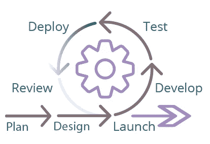

# 敏捷测试测试人员指南

> 原文：<https://blog.devgenius.io/a-testers-guide-to-agile-testing-ff730f8b8c59?source=collection_archive---------2----------------------->

在过去的几年中，我们已经看到了 IT 行业中软件开发周期的巨大转变。大多数组织已经从传统的 ***瀑布*** 方法转移到 ***敏捷*** 方法，或者选择适合其开发和交付需求的混合模型。这种转变有助于组织采用迭代方法，进行持续开发，并在每个阶段保持测试，以构建更健壮的产品。与旧的范例不同，在旧的范例中，测试人员的目标包括在漫长的瀑布循环结束时发现缺陷，新的目标包括持续地防止缺陷并帮助更快地交付产品。在这篇文章中，我将与你分享一个 ***质量保证分析师*** 如何执行 ***敏捷测试*** 以及他们在敏捷团队中的角色。我还将与你分享一些在敏捷环境中测试的策略，我发现这些策略是成功的。

# 什么是敏捷测试，为什么它很重要？

很难谈论敏捷测试，听起来不像我们在谈论敏捷开发。它们是一前一后完成的，需要持续的相互作用，共同完成敏捷方法的思想。

敏捷测试是 QA 在动态环境中遵循的一种软件测试实践，在这种环境中，测试需求根据客户需求不断变化。它是与开发活动并行进行的，在开发活动中，测试团队经常从开发团队接收应用程序代码，以进行测试。

它尽可能早地将 QA 引入到项目中，以预见问题，编写和执行测试用例，并发现需求中的任何差距。随着项目被划分为迭代阶段，测试人员能够将焦点添加到开发过程中，并提供快速、连续的反馈。因此，可以快速预防或解决复杂的问题。敏捷测试还提供了更多的灵活性、更快的发布、更高的生产率和成本效率。

# QA 在敏捷团队中的角色是什么？

在敏捷中，测试是每个人的责任。质量标准必须贯穿整个周期。业务分析师专注于创建详细的用户故事，而开发人员专注于开发高质量的代码，QA 的职责是细化每个用户故事的验收标准，从客户的角度测试每个 sprint 中已完成的功能，并确保所有以前完成的功能没有退化。QA 角色和职责不仅仅限于敏捷测试，还包括以下内容:

QAs 与产品所有者、业务分析师和开发团队密切合作，以了解正在开发的产品、面向的对象以及产品的成功标准。

他们更深入地研究由业务分析师创建的验收标准，以编写测试用例、可视化工作流、创建愉快的路径、测试标准项目，并进行负面测试。

一个有经验的 QA 也敏锐地意识到发布的范围，并相应地设置他们的测试边界。

测试人员必须与团队沟通，并在测试时提问，这允许他们识别需求差距或得到突出问题的答案。与团队的沟通和协作至关重要，因为这有助于测试变得更加准确和可靠。它还有助于通过早期的测试反馈和提高的质量来加快进度。

作为敏捷团队的一员，测试人员应该始终与项目团队保持同步，参加 sprint 计划会议，确定可能的问题领域，并每天站起来促进合作。参加 sprint 回顾会给团队提供了一个发现弱点和确定解决方案的机会。参加 sprint 回顾或产品演示会议可以让测试人员看到新特性是如何工作的，并给他们机会向开发人员提出重要的问题。

用证据记录测试场景和测试执行对测试人员来说很重要，但是它应该是最小的和简洁的。

# QA 用来执行敏捷测试的策略是什么？

每个组织都有不同的方法和策略来测试应用程序。敏捷方法相信只准备足够的文档来支持团队的即时需求。因此，QAs 将为测试策略和计划准备足够的高级文档来指导团队。下面是我在准备敏捷测试时遵循的一些策略:

在测试开始前制定一个计划是非常重要的。在你开始测试之前，计划好你的时间和测试用例，这将让你在应用程序部署好之后，马上投入到测试中。

我使用手工和自动化测试的结合。自动化测试帮助我用预先构建的回归套件加速我的回归测试，当我必须进行更集中的测试时，手动测试帮助我。

作为一名测试人员，我总是相信一旦应用程序部署完毕，就要对主要或基本功能进行冒烟测试，这有助于我尽早识别任何重大错误。

根据验收标准执行验收测试，以建立更好的测试覆盖面。每个验收标准可以有一个或多个验收测试，并集中在设定的条件。

流程效率测试有助于确定用户是否能够无缝地浏览产品。它有助于识别流程中是否有令人困惑的部分，并有助于确定是否需要添加或删除任何步骤。

业务规则和数据定义的验证是测试的一个重要部分。

进行探索性测试允许测试人员遵循一条未定义的路径，并找到应用程序中隐藏的风险和缺陷。

进行回归测试是敏捷测试的一个重要部分。回归测试确保在引入新特性后，测试的功能按预期工作。

使用跨浏览器测试对于敏捷测试非常重要，因为测试人员可以在有限的时间内快速测试多个设备和浏览器。

拥有像 Slack 和 Zoom 这样的实时消息应用程序可以让团队中的每个人都保持联系，并快速解决重要问题。

# 敏捷测试的好处是什么？

敏捷测试是有成本效益的。它节省时间和金钱。

它减少了文档。

它很灵活，适应性很强，可以很快实现变化。

当您实施敏捷测试时，团队会很快意识到需求或使用的技术中存在的差距，并且他们可以尽早找到可行的解决方案。

持续的沟通有助于快速解决缺陷。

敏捷测试提供了一种从最终用户那里获得持续反馈的方式。

每日敏捷会议有助于提前确定问题，并更快地获得解决方案。

# 敏捷测试的弊端是什么？

敏捷开发过程的连续性也带来了一些测试缺陷:

尽管敏捷中不鼓励这样做，但有时需求可能会发生变化，或者故事可能会从 sprint 中删除，这会改变测试的范围。

由于敏捷中的文档是最少的，而项目是快节奏的，当不熟悉项目的人加入团队时，知识转移会成为一个大问题。

如果开发人员、测试人员和产品负责人之间缺乏沟通，敏捷测试将无法工作。

对于测试人员来说，完成当前迭代/冲刺的所有测试是最大的挑战之一。

# 结论

与瀑布方法相比，敏捷测试是非结构化的，但是由于最小的计划，它适用于较小的项目。它提高了产品质量，降低了 bug 泄漏的风险，并帮助开发团队在更短的周期内发布软件。在敏捷测试中，产品的可交付特性在迭代结束时交付给客户。频繁的发布使客户高兴，并增加客户满意度。

快乐的客户=快乐的组织！

## ——索尼娅·马克瓦纳，质量/商业分析师 [AWH](http://awh.net) 。我们正在帮助企业通过技术推动增长。