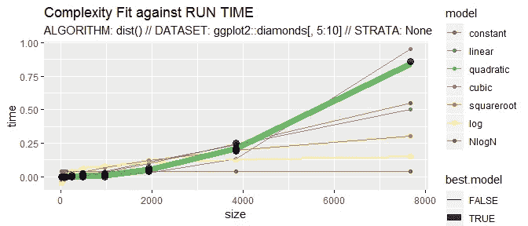
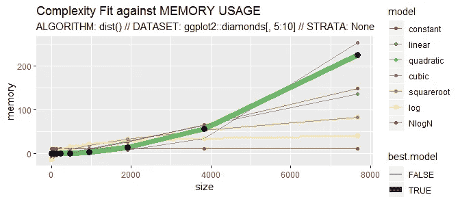

# 一个以最小努力估计算法的时间和内存复杂性的工具

> 原文：<https://blog.devgenius.io/a-tool-to-estimate-time-and-space-complexities-of-algorithms-with-minimum-efforts-8d9a5c1e96ae?source=collection_archive---------10----------------------->


马库斯·斯皮斯克在 [Unsplash](https://unsplash.com?utm_source=medium&utm_medium=referral) 上的照片

介绍 *GuessCompx* 工具，根据经验估算复杂性

> **功能:**
> 
> *GuessCompx，*一个 R 包介绍
> 
> *根据经验*估算算法的时间和内存复杂度的工具

# *背景*

*当算法或程序在计算机上运行时，它需要一些资源。对于某些输入，算法的复杂度是资源的度量。这些资源通常是空间和时间。因此，复杂性有两种类型:空间复杂性和时间复杂性。时间复杂度定义了算法完成其执行所需的时间。这可能因算法的输入而异。例如，如果所考虑的算法是冒泡排序，并且输入是排序的数组，那么时间复杂度会更低。这被称为最佳情况复杂性。当输入数组反转时，该算法需要更多的时间来对数组进行排序。这是最坏情况的复杂性。当输入数组既没有排序也没有反转时，时间复杂度介于最好情况和最坏情况的复杂度之间。这被称为平均情况复杂性。算法完成执行所需的确切时间因计算机而异。因此，我们实际上关注的是当输入大小增加时复杂性的行为。这是复杂性的渐近行为。有各种各样的符号用来表示的渐近复杂性，如大 O，大ω，大θ等。在最坏的情况下，冒泡排序算法的复杂度是 O( *n2* )。由于运行时间不能大于最坏情况，通常考虑最坏情况的复杂性。复杂度较低的算法比复杂度较高的算法更有效。所以，在开发新算法的时候，开发者需要检查它的复杂度。这个过程相当耗时。在全面运行一段新代码之前，知道它的大致执行时间可以节省很多时间。使用各种手动方法(如主定理)计算复杂度是一个繁琐的过程，并且更容易出错。这些方法正受到经验方法的挑战，这些方法试图通过观察代码运行几次来估计复杂性。*

# ***介绍 *GuessCompx* ，一个 R 包***

*软件包 [*GuessCompx*](https://CRAN.R-project.org/package=GuessCompx) 的目的是在算法最终实现之前，估计所需的计算时间和内存。复杂性受到各种因素的影响，例如数据的维度、递归预测的时间范围、特征的数量、并行计算等。但是这个包只估计了数据中行数的复杂性。其他因素不在包的范围内。该算法在数据的子集上运行，在每次运行中增加大小，如果需要，使用抽样或分层抽样。拟合各种复杂函数，并选择数据的最佳拟合。使用均方误差作为指标，通过 LOO(留一法)程序实现不同模型之间的比较。内存分析使用 *memory.size()* 函数，该函数只能在 windows 机器上运行。该软件包可以从 CRAN 存储库安装:*

> *install.packages("GuessCompx ")*

***CompEst()***

*这个包的主要函数和唯一入口点是 *CompEst()* 函数。该函数接受各种输入格式，如数据帧、矩阵、时间序列等。用户可以根据自己的需要，使用各种参数来配置函数。该函数创建一个数据大小的向量，用作输入长度。参数 max.time 用作循环遍历数据大小时的停止条件。max.time 表示完成一次迭代的最长时间。该函数通过评估样本输入上目标函数的每次迭代所使用的时间和内存来工作。为此，在双垃圾回收前后分别使用了 *system.time()* 和 *memory.size()* 函数， *gc()* 。这些结果和数据一起作为复杂性模型的输入。 *cv.glm()* 函数计算每个模型的 LOO 误差，最终选出最佳模型。数据的抽样不包括在时间和记忆的评估中。该函数返回最佳模型列表、整个数据集的计算时间、时间和内存复杂性，以及两个突出显示最佳模型曲线的图。下面给出了完整的函数调用，*

> *CompEst(d，f，random.sampling=FALSE，max.time=30，start.size=NULL，replicates = 4，strata=NULL，power.factor=2，alpha.value = 0.005，plot.result=TRUE)*

*`d`:测试算法的数据帧*

*`f`:实现算法的函数*

*`random.sampling`:布尔值，指定是否在每一步随机取样*

*`max.time`:分析每一步的最大允许时间(秒)。*

*`start.size`:运行算法的第一个样本的大小。默认值为 *floor(log2(nrow(d)))**

*`replicates`:相同样本量的重复运行次数。*

*`strata`:包含不同类别的列名的字符串。*

*`power.factor`:样本量增加的数量。默认值为 2，表示大小在每一步中都加倍。*

*`alpha.value`:检验模型是否显著不同于常数关系的 alpha 风险*

*`plot.results`:布尔值，表示是否要显示汇总图。*

***CompEstBenchmark()和 CompEstplot()***

*这个函数提供了一个适合所有复杂性模型的基准程序。该函数接收由 CompEst()函数返回的数据帧(to.model ),并返回所有拟合复杂度模型的列表。用户还需要指定函数是处理时间还是内存数据(使用)。*

> *CompEstBenchmark(to.model，use="time ")*

**CompEstplot()* 函数绘制 *CompEst()* 函数的结果。该函数的输入是由 *CompEst()* (to.plot)产生的数据帧。其他参数是 *element_title* ，一个添加到情节和用途的副标题的字符串，一个指定函数是处理时间还是内存数据的字符串。该函数返回一个 ggplot 对象。*

***CompEstPred()***

*该函数预测整个数据集的计算时间。该函数的参数是:*

*`model.list` *model.list* :包含拟合复杂度函数的列表。*

*`benchmark`:复杂度函数的 100 个误差的向量。*

*`N`:整个数据集使用的行数，表示函数处理的是“时间”还是“内存”数据的字符串。*

***groupedsamplefracatleastosample()和 head()***

**groupedsamplefracatleastosample()*对输入数据的随机比例进行采样。输入以数据帧的形式给出，函数返回数据的一个小样本。返回的样本包含至少 1 个观察值。也可以指定样本是否随机抽取。*

**rhead()* 函数用于从给定的向量或数据帧中生成小的随机样本。除了 *CompEst()* 功能之外的所有功能都在内部使用，以完成不同的任务，用户不能直接访问。*

# *它是如何工作的？*

*这个包使 R 用户能够在完全运行任何算法之前，凭经验估计它的计算时间和内存使用量。用户的算法是在他的数据集的一组大小不断增加的小部分上运行的。然后拟合各种模型以捕捉可能最适合算法的计算复杂性趋势(独立 o(1)、线性 o(n)、二次 o(n2)等)。)，一个为了时间，另一个为了记忆。该模型最终会预测完整数据的时间和内存使用情况。*

*关于算法复杂性的细节可以在维基百科页面上找到。请注意，复杂性仅与数据大小(行数)有关，而不是其他可能的参数，如特征数量、调整参数等。在软件包的未来版本中，可以研究与这些参数的相互作用。*

*已经实现的复杂度函数如下: *O(1)，O(N)，O(N)，O(N)，O(N^0.5)，O(log(N))，O(N*log(N))**

*大多数算法具有不随时间变化的复杂性行为:一些算法与行数无关(想想`length`函数)，一些算法是线性的，一些算法是二次的(通常是距离计算)，等等。我们跟踪算法运行的计算时间&存储数据子集的增加，如果需要，使用抽样或分层抽样。我们用一个简单的`glm()`程序和一个`glm(time ~ log(nb_rows))`类型的公式来拟合各种复杂函数，然后找到最适合数据的。使用均方误差作为指标，通过 LOO ( **留一法**)程序实现模型之间的比较。*

*`GuessCompx`包有一个单一的入口点:接受不同输入格式(数据、帧、矩阵、时间序列)的`CompEst()`函数，并且完全可配置以适应大多数用例:从多大的数据开始，你需要花多长时间进行审计(通常 1 分钟就能给出一个好的结果)，你希望每个测试的大小有多少个重复(如果可变性很高)，你是否需要分层抽样(如果每次运行都必须包括一个变量的所有可能类别)，每次运行增加多少大小，等等。*

*关于内存复杂性的说明:内存分析依赖于`memory.size()`函数来估计趋势，该函数仅在 Windows 机器上有效。如果检测到另一个操作系统，算法将跳过内存部分。*

# *例子*

*这里，`CompEst()`用于显示`dist()`函数的二次复杂度:*

```
***CompEst**(d = ggplot2::diamonds[, 5:10], f = dist, replicates = 10,       max.time = 10)*
```

****

```
*#> $sample.sizes
#> [1]    15    15   15    15   15    15    15    15    15    15  30
#> [12]   30    30   30    30   30    30    30    30    30    60  60
#> [23]   60    60   60    60   60    60    60    60   120   120 120
#> [34]  120   120  120   120   120   120   120   240  240   240 240
#> [45]  240   240  240   240   240   240   480   480  480   480 480
#> [56]  480   480  480   480   480   960   960   960  960   960 960
#> [67] 960   960  960   960  1920  1920  1920  1920  1920 1920 1920
#> [78] 1920 1920 1920  3840  3840  3840  3840  3840  3840 3840 3840
#> [89] 3840 3840 7680  7680  7680  7680  7680  7680  7680 7680 7680
#> [100] 7680 15360 15360 15360 15360 15360 15360 15360 15360 15360 
#> [110] 15360 30720 30720 30720 30720 30720 30720 30720 30720 30720 
#> [120] 30720 53940 53940 53940 53940 53940 53940 53940 53940 53940   #> [130] 53940
#> 
#> $`TIME COMPLEXITY RESULTS`
#> $`TIME COMPLEXITY RESULTS`$best.model
#> [1] "QUADRATIC"
#> 
#> $`TIME COMPLEXITY RESULTS`$computation.time.on.full.dataset
#> [1] "41.53S"
#> 
#> $`TIME COMPLEXITY RESULTS`$p.value.model.significance
#> [1] 7.988636e-102
#> 
#> 
#> $`MEMORY COMPLEXITY RESULTS`
#> $`MEMORY COMPLEXITY RESULTS`$best.model
#> [1] "QUADRATIC"
#> 
#> $`MEMORY COMPLEXITY RESULTS`$memory.usage.on.full.dataset
#> [1] "11121 Mb"
#> 
#> $`MEMORY COMPLEXITY RESULTS`$system.memory.limit
#> [1] "8064 Mb"
#> 
#> $`MEMORY COMPLEXITY RESULTS`$p.value.model.significance
#> [1] 2.05865e-259*
```

*这些结果表明，经验估计的时间和记忆复杂性本质上都是二次的。在[出版物](https://arxiv.org/pdf/1911.01420.pdf)中详细讨论了已知标准复杂性的各种众所周知的计算方法的 GuessCompx 验证。*

# *摘要*

*这个帖子是对 *GuessCompx* R 包的一个彻底的描述。该软件包用于对算法或函数的时间和内存复杂性进行经验估计。它测试用户数据的多个大小不断增加的样本，并尝试拟合七个复杂性函数中的一个:O(N)、O(Nˇ2)、O(log(N))等。基于使用 LOO-MSE(留出一个均方误差)的最佳拟合过程，它还可以预测整个数据集的完整计算时间和内存使用情况。这里建议的方法和包被认为是 R 用户群体的新内容；然而，在自动化和各种复杂功能方面，还有很大的改进空间。读者的建议是受欢迎的，更多的细节，请随意评论这篇文章。*

> ****作者:****
> 
> **尼拉杰·丹拉杰·博克德博士**
> 
> **博士后研究员，**
> 
> **丹麦奥尔胡斯大学**
> 
> *[*https://www.researchgate.net/profile/Neeraj_Bokde*](https://www.researchgate.net/profile/Neeraj_Bokde)*