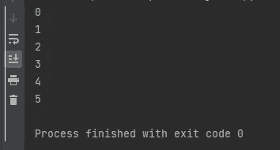
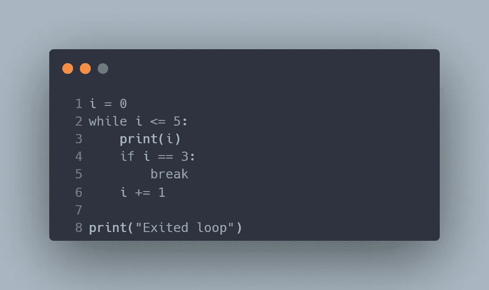

# Python while 循环教程

> 原文：<https://blog.devgenius.io/a-tutorial-on-python-while-loops-681f0a5e578c?source=collection_archive---------4----------------------->

## 了解如何使用 while 循环多次执行同一代码块


图片由 [Unsplash](https://unsplash.com/?utm_source=unsplash&utm_medium=referral&utm_content=creditCopyText) 上的[onder rtel](https://unsplash.com/@onderortel?utm_source=unsplash&utm_medium=referral&utm_content=creditCopyText)拍摄

在 python 或任何其他编程语言中，有时我们希望多次执行相同的任务。每当你想使用它的时候，写同样的代码块是没有效率的。对于这样的任务，我们依赖于循环。在 python 中，今天您将学习两种类型的循环 for 循环和 while 循环。

本文将向您全面介绍 Python while 循环。像往常一样，您将通过示例学习如何在程序中使用 while 循环。您还将了解 Python 的 break 和 continue 关键字。本教程面向初学者，但假设你熟悉可迭代的数据类型，如字符串、列表、元组和字典。如果你需要复习，就去谷歌一下。我们直入主题吧，好吗？

## 介绍

只要某个条件保持为真，while 循环就用于重复代码块。它使用以下语法。

```
while expression:
    statement(s) 
```


While 循环语法。来源:[以身作则](https://www.learnbyexample.org/python-while-loop/)

缩进用于将 while 循环体与代码的其余部分分开。执行缩进的语句，直到条件改变。表达式用于指定执行缩进代码的条件。假设您想打印从 0 到 5 的数字。您可以使用以下代码，而不是编写 5 条打印语句:

```
#define counter variable 
i = 0
#print the numbers 0 to 5 
while i <= 5:
    print(i)
    i += 1 #increment counter by 5 
```


While 循环代码打印从 0 到 5 的数字

**输出:**



在上面的代码中，您会注意到，每次打印后，我们都会将计数器*“I”*加 1。这就是我们能够打印数字 0 到 5 而不仅仅是 0 的方法。这个语句也保证了我们的条件最终发生变化，即在某个点 *i > 0* 或者表达式 *(i ≤ 5)* 最终变为假。

您也可以使用 while 循环来打印列表中的项目。假设我们有一个装着水果的篮子，想知道当我们一个接一个地拿走水果时，还剩下哪些水果。因此，我们创建了一个简单的程序，打印出篮子里所有剩余的水果。它看起来会像这样:

```
fruits = ["apple","banana","strawberry","kiwi","orange"]
while fruits:
    print(fruits)
    fruits.pop()
```


while 循环打印剩余水果

在上面的代码中，我们使用 pop()方法删除列表中的最后一项。这类似于一次从篮子里拿走一个水果。我们这样做是为了使我们的代码不会无限期地运行。也就是说，我们希望避免创建一个无限的 while 循环。我们稍后会详细讨论这一点。现在，看一下输出，自己试一下代码。

**输出:**


印刷剩余水果的产量

**无限 while 循环**

创建 while 循环时，添加一个最终将条件更改为 false 的语句非常重要。如果条件从未变为假，循环将永远运行，并被称为无限循环。我们想避免这种情况。例如，如果您从上面的代码中删除了 *fruits.pop()* 语句，代码将会一直运行，直到我们手动终止程序。然而，在某些情况下无限循环是有用的，但是这方面的讨论超出了本教程的范围。尝试删除 fruits.pop()行，看看会发生什么。注意到输出从不改变吗？


无限 while 循环输出

**else 子句**

Python 还允许我们使用可选的 else 子句，该子句将在条件为假时执行。只有当 while 循环在条件变为 false 后正常终止时，才会执行该子句。但是，如果循环由于 break 或 return 语句而提前终止，则它不会执行。我们稍后将讨论 break 语句。假设我们想让水果代码告诉我们所有的水果都从篮子里拿走了，我们需要修改如下:

```
fruits = ["apple","banana","strawberry","kiwi","orange"]
while fruits:
    print(fruits)
    fruits.pop()
else:
    print("All fruits have been removed from the basket.")
```


而 else 代码

**输出**


而 else 输出

## **第 2 部分-中断和继续语句**

Python 中的 break an *d continue 语句用于改变 loo* p 的正常流程。

**中断语句**

break 语句用于终止并立即退出循环，程序在循环后继续运行。它允许您在外部条件被触发时退出 while 循环。让我们回到打印从 0 到 5 的数字的代码。我们可以修改代码，在遇到数字 3 时退出 while 循环。我们的代码将在打印完 3 后退出 while 循环，而不是打印从 0 到 5 的数字。我们使用 if 语句来检查 I 是否等于 3。请参见下面修改后的代码。

```
i = 0
while i <= 5:
    print(i)
    if i == 3:
        break
    i += 1

print("Exited loop")
```



while 循环中的 break 语句

**输出**:


while 循环输出中的 break 语句

**继续语句**

另一方面，continue 语句返回到 while 循环的开头。它会略过目前反覆项目中剩余的程式码。假设我们只想打印不能被 2 整除的数字。我们将修改前面的代码，如下所示。这里必须在继续语句之前修改我们的控制变量 *i* 。

```
i = 0
while i <= 5:
    i += 1
    if i%2 == 0 :
        continue
    print(i)
```


while 循环中的继续语句

**输出**:


while 循环输出中的 continue 语句

## 结论

在本教程中，您学习了 while 循环的语法，了解了无限 while 循环以及 break 和 continue 语句。本教程向您介绍了这些概念，现在轮到您进一步探索它们了。当您想要使用 while 循环并想出如何创建这样的程序时，一个很好的练习是考虑真实生活中的用例。恭喜你坚持到了最后。