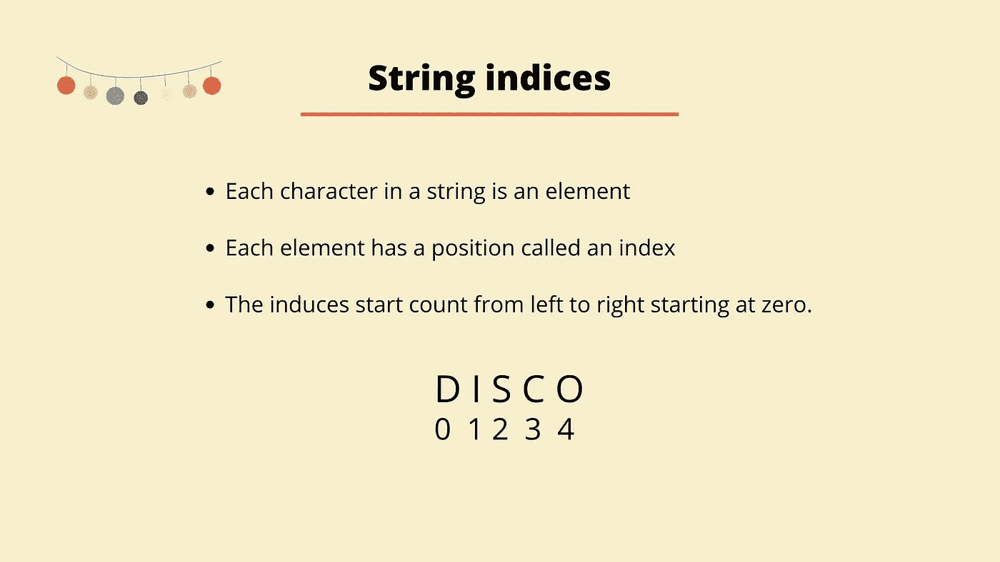
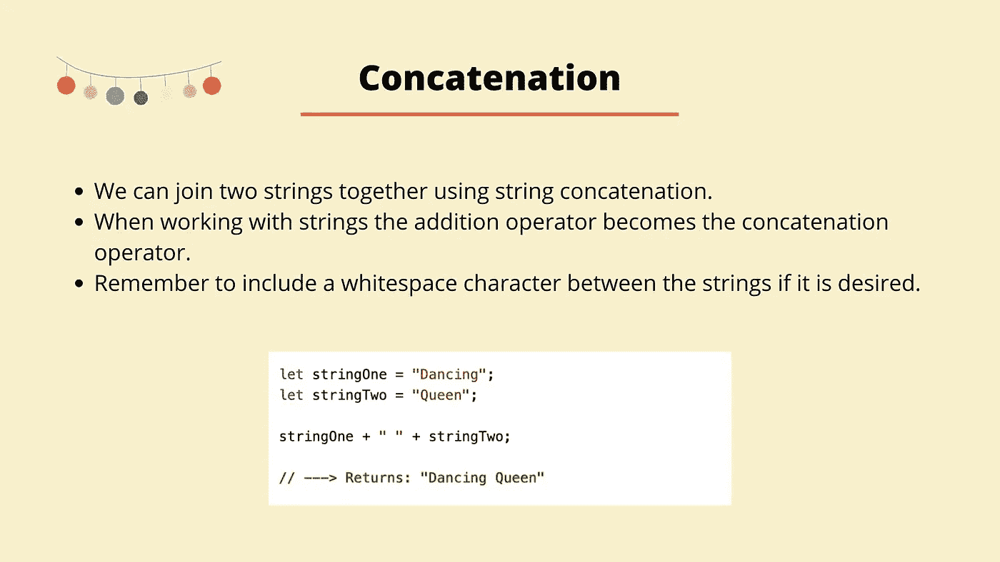
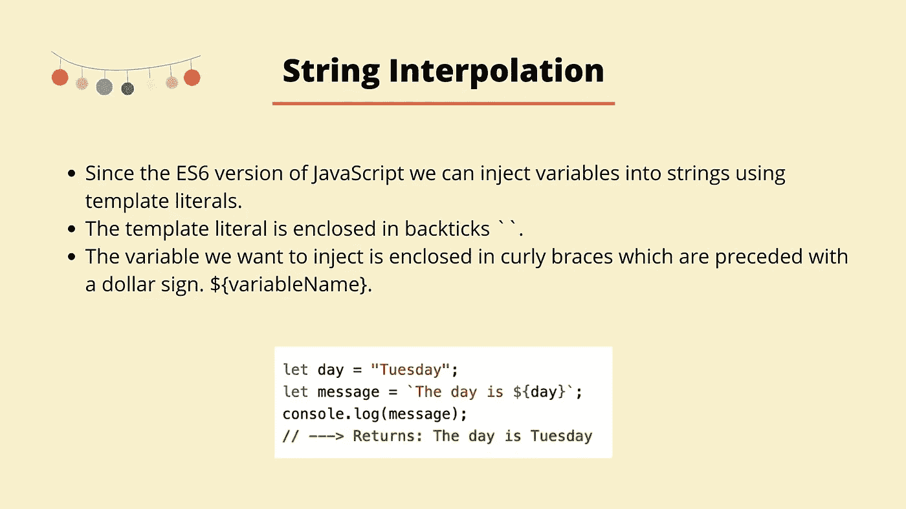
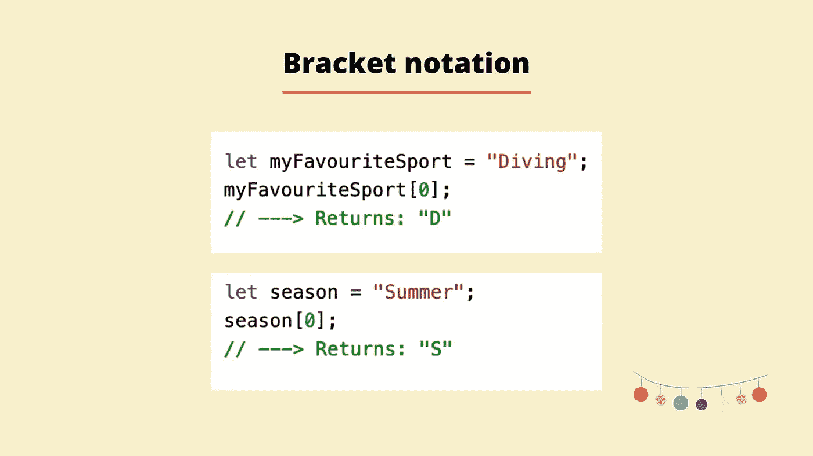
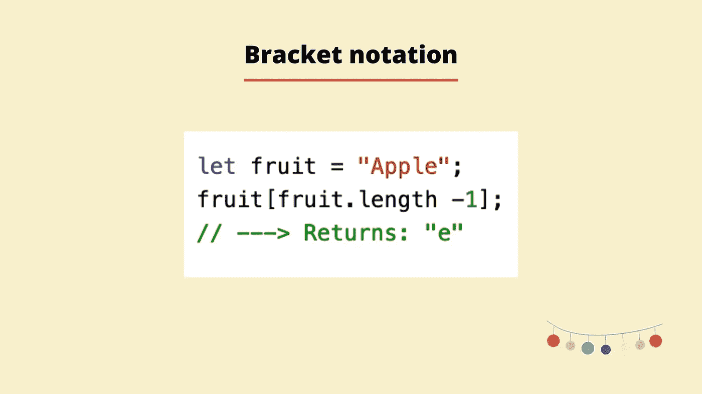

# JavaScript 中字符串的可视化指南

> 原文：<https://blog.devgenius.io/a-visual-beginners-guide-to-strings-in-javascript-4fb0abc923dd?source=collection_archive---------16----------------------->


字符串是 JavaScript 中的基本数据类型之一。对于那些不熟悉 JavaScript 中基本数据类型的人来说，如下所示:

*   数字
*   布尔代数学体系的
*   线
*   空
*   不明确的
*   标志
*   BigInt

## 什么是字符串？

字符串是用单引号或双引号括起来的一组字符。字符串可以包含任何内容，它不一定只是文本字符，但是引号中的任何字符都将是字符串的一部分。只要在字符串的开头和结尾使用相同的引号，就可以使用单引号或双引号。从概念上讲，将字符串视为一段文本是记忆字符串的好方法。

当我们处理字符串时，我们将字符串中的每个字符称为一个**元素**。根据元素在字符串中的位置，每个元素都有一个**索引**。你可以认为这有点像门牌号，取决于房子在街上的位置。字符串中索引的唯一区别是它们从零开始计数，因此，我们称字符串为**零索引**。因此，如果您有一个字符串，其中只包含单词 *disco* ， *d* 的索引为 0，字符串中的最后一个字母 *o* 的索引为 4。



## 标准内置对象

JavaScript 有一套所谓的标准内置对象。这些扩展了语言的功能，帮助我们使用它。有一个日期对象用于处理日期，一个数学对象用于更深层次的数学计算，还有一个字符串对象。

每个标准内置对象都有一组内置属性和方法。一个**方法**本质上是一些内置的功能，允许我们执行一些过程或动作。所以，回到字符串，如果我们想在字符串中找到一个特定的字符，或者我们想替换字符串中的某些内容，我们可以使用字符串方法来帮助我们实现。

所有方法都遵循您要调用方法的项的相同结构，后跟一个点、方法名、左括号和右括号。

```
"some string".methodName();
```

Mdn Mozilla [网站](https://developer.mozilla.org/en-US/docs/Web/JavaScript/Reference/Global_Objects/String)列出了我们可用的方法。如果您访问网站，然后查看内置对象，在本例中是 String，那么您可以在左侧看到所有的方法和属性。如果这个方法旁边有一个 bin 符号，你需要注意这个方法是不推荐使用的。这意味着最好不要使用这些方法，因为它们可能不再适用于所有浏览器。

让我们快速地看一些带有字符串的例子。我们将从短语*我是字符串*开始。

```
"I am a string"
```

在上面的例子中，我们用引号将短语括起来，现在我们有了第一个字符串。

你可以在一个字符串中使用任何字符，它不一定只是一个字母，但引号内的任何内容都将是字符串的一部分。如果我取一个数字，比如 123，用引号括起来，那么这也是一个字符串。

```
"123"
```

当您在字符串中使用数字时，一定要记住您使用的是字符串数据类型，而不是数字数据类型，因此您尝试执行的任何计算都可能会出现意外。

```
"123 + 6"
// ---> Returns: '123 + 6'
```

## 串联

当你在处理字符串时，你以前可能知道的加法运算符 *+* 现在变成了连接运算符。让我们来看看如果我们试图给一个字符串添加一个值会发生什么。

```
"123" + "6";
// ---> Returns "1236"
```

当我们尝试将两个字符串相加时，你可以看到值被连接到字符串上，而不是值递增。

如果你有两个独立的字符串，有时你可能希望将这两个字符串连接在一起。也许你的名和姓是两个独立的字符串，但是你想打印出你的全名。当我们把两个字符串连接在一起时，我们就把它们连接起来了。当连接字符串时，如果需要的话，记住在两个字符串之间包含空格是很重要的。



在上面的例子中，我们创建了两个变量， *stringOne* 和 *stringTwo* 。然后，我们继续将两个字符串连接在一起。如果我们没有包括空白，我们将会有以下结果

```
"DancingQueen"
```

## 使用引号

你可能想对字符串做的另一件事是在字符串中使用引号。这是可以的，但是无论您在字符串内使用什么样的引号，都必须与您在字符串外使用的引号相反，如下例所示:

```
"I am a 'quote'";
```

## 插入文字

字符串插值描述了何时将变量注入字符串。在 ES6 版本的 JavaScript **中，引入了模板文字**。

模板文字提供了一种简洁的方式将变量或表达式插入(注入)到字符串中，而不是必须进行连接。模板文字包含在反斜线( **``** )中，而不是通常的双引号或单引号中。你想要插入的变量被包在花括号里，并以美元符号开始。变量本身放在花括号内。

```
 `${myVariable}`;
```



在上面的例子中，我们创建了一个名为 *day* 的变量，并用字符串 *Tuesday* 对其进行初始化。然后我们创建另一个名为*消息*的变量，并使用内插法将日期变量插入字符串。当最后打印出*消息*变量时，我们可以看到*日*变量是如何成功添加到*消息*中的。

## 长度

前面我提到过 String 对象有一组处理字符串的方法和属性。其中一个属性是长度属性。当我们把它加到一个字符串的末尾时，字符串的长度就会返回给我们。

所以我们先造一个三个字母的单词“猫”。现在，如果我们使用长度属性，我们可以看到字符串的长度是三。

```
"cat".length;
// ---> Returns 3
```

如果我们取一个稍微长一点的字符串，比如说“美好的一天”，你可以看到长度是 8。所以空格被计算在字符串的长度内，但是引号没有，字符串的长度从 1 开始计算，不像字符串的索引。

```
"nice day".length;
// ---> Returns 8
```

## 访问字符串中的元素

为了找到一个字符串的第一个字符，我们可以使用括号符号，它使用两个方括号 *[]* 。JavaScript 使用从零开始的索引，这意味着字符串的第一个字符将在索引 0 处找到，第二个字符在索引 1 处找到，依此类推。使用同样的方法，我们可以在一个字符串中的任意指定索引处找到这个字符。



上面的例子显示了如何访问字符串中的第一个元素。如果您想要访问任何其他元素，您只需使用您想要访问的元素的索引，因此继续上一个示例和变量 *season* ，我们可以访问第三个元素 *:*

```
season[3];
// ---> Returns: 'm'
```

通过使用括号符号，我们也可以很容易地访问字符串中的最后一个元素。为了找到最后一个元素的索引，我们可以使用一个快捷方式，而不必计算字符串中的每个字符。我们可以将字符串的长度传入括号中，然后从该值中减去 1(记住字符串是零索引的)。这种方法可用于从字符串后面开始查找字符串中的任何其他字符。



## 不变

在 JavaScript 中，字符串是不可变的。这意味着一旦字符串被创建，我们试图直接对字符串做的任何事情都不会改变字符串的初始值。这有点像是说，一旦你出生了，你就不能改变你的出生日期。

让我们首先创建一个名为 *greeting* 的变量，并用字符串 *hello* 初始化它。现在，我们将尝试访问字符串的第一个元素，并使用控制台日志 *y* 将其更改为 *Z.* 您可以看到什么都没有更改，这是因为字符串是不可变的。

```
let greeting = "hello";
greeting[0] = "Z";
console.log(greeting);// ---> Returns: hello
```

如果我们想这样做，我们必须创建一个新的字符串和一个新的变量，以使更改生效。在查看字符串方法时，了解这一点非常重要，因为这些方法中的许多方法都会返回一个新的字符串，并对该方法进行修改。但是如果不把这些保存到一个现有的变量或者创建一个新的变量，你的改变就不会被保存。

请随时张贴任何意见，问题或反馈！

在 Instagram 上关注我[这里](https://www.instagram.com/codecup_dev/)。

你可以在 [Skillshare](https://www.skillshare.com/classes/JavaScript-fundamentals-Strings/1618487691) 上观看以上视频及更多内容。

下次见！