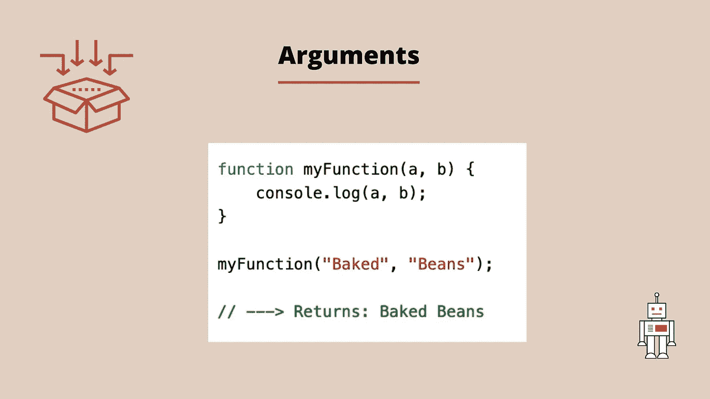

# Javascript 中函数的可视化介绍

> 原文：<https://blog.devgenius.io/a-visual-introduction-to-functions-in-javascript-966aead2c979?source=collection_archive---------10----------------------->

当我们编写程序时，我们可能会达到这样一个点，我们希望有一些可重用的代码，也许是为了完成一项任务。这可以通过使用函数来实现。

本质上，函数是一个代码块，它让**做**一些事情，然后**返回**一些事情。有几种方法可以用来创建函数。其中之一是通过创建一个**函数声明**。

当我们在变量中存储一个值时，我们使用一个命名的变量来实现。函数声明以类似的方式工作。现在让我们来分解创建一个函数所涉及的组件。

## 那么我们如何创建一个函数呢？

在上面的例子中，*函数*是关键字， *thisIsMyFunction* 是标识符(函数的名称)。标识符后面是一组括号。代码块，在这个例子中是 console.log，然后用花括号括起来。后来为了运行函数，你用括号调用函数的名字。

## 什么是函数形参和实参？

同样，我们有时可以将参数和值传递给方法函数，函数也允许我们这样做。我们称这些参数为自变量。当我们声明一个函数时，我们可以指定这些参数。在下面的例子中, *a* 和 *b* 是参数。参数充当值的占位符，这些值将在函数被调用时传递给函数。现在，当我们调用函数时，传递给**参数**的**参数**可以是值或变量。

## 我们如何从函数中返回一些东西？

每个函数都会返回一些东西。我们使用关键字 **return** 从一个函数返回一个值，后跟我们想要返回的值。如果我们不指定函数要返回的内容，将会返回未定义的内容。

如果你想看这篇文章的视频版本，请访问。

请随时张贴任何意见，问题或反馈！

在 Instagram 上关注我[这里](https://www.instagram.com/codecup_dev/)。

我还有一门关于这个话题以及更多内容的课程。

下次见！