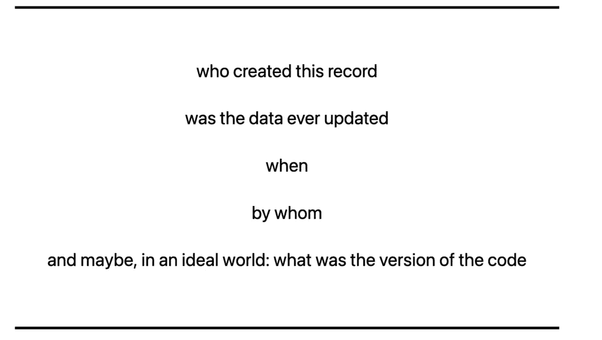
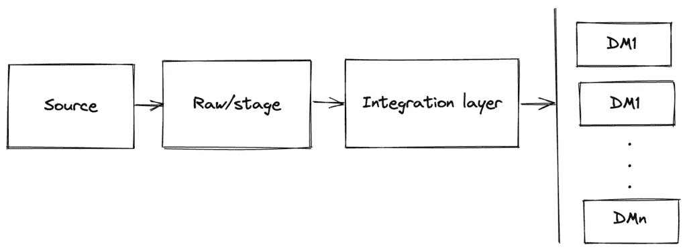
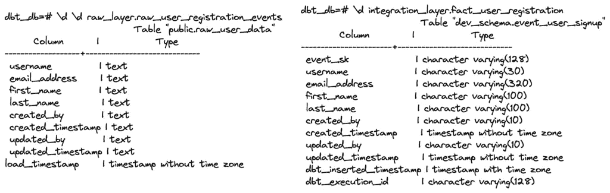
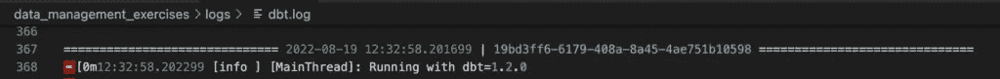
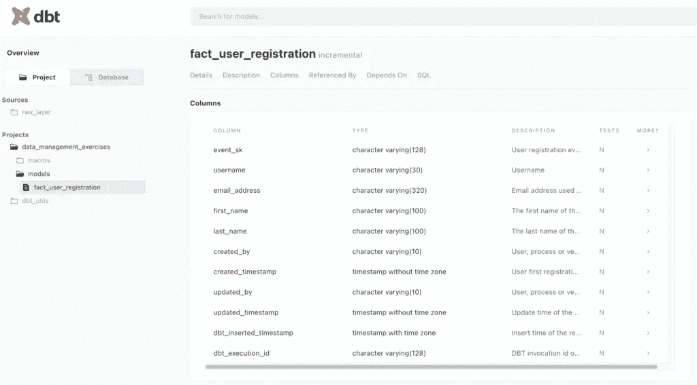

# 一种确保数据处理中可审计性的方法

> 原文：<https://blog.devgenius.io/a-way-to-ensure-auditability-in-data-processing-f7664b70ec2b?source=collection_archive---------3----------------------->

我称之为数据管理的三位一体:可追溯性、可审计性和可再现性。本文关注的是数据的可审计性；它是什么，如何设置，以及如何在您的数据管道中确保它。我将使用 dbt 进行实践练习。

# 数据可审计性

我的大部分数据职业生涯都是在银行或电信的数据仓库中度过的。在这两种情况下，数据可审计性都是必须的，这是法律要求的，尤其是当我们谈到金融和发票时。除此之外，在欧洲，我们有 GDPR，建立一个使数据审计更容易的流程是遵守法律的一种方式。

数据可审计性有两个主要组成部分:

*   能够概述您如何处理数据——数据质量、数据处理标准和数据用户管理
*   能够评估您处理数据的方式的性能或效率

在本文中，我不会关注数据质量或数据用户管理，而是关注数据处理标准。每当我们处理数据时，我们都希望能够回答以下问题:



这些问题可以通过始终使用一组标准的审计列来回答。这些列不仅提供如上所述的基本信息，还可以用于在数据处理中生成更深入的见解，并最终帮助您了解数据谱系和可追溯性。我们来详细看看吧！

# 后端(web)应用程序

当我们谈到典型的用户界面时，有一组标准列被添加到数据中(注意，这里的命名是一个示例，最好遵循您的命名约定):

*   创建者
*   更新者
*   CreatedTimestamp
*   UpdatedTimestamp

当我注册成为用户时，会为我生成一条记录。信息看起来像:

```
{
    "username": "username",
    "email_address": "email_address",
    "first_name": "first_name",
    "last_name": "last_name"
}
```

我在一个网站注册的时候，有一个重要的时间属性:注册的瞬间。这是 CreatedTimestamp，它是一个在用户的生命周期中永远不会改变的值。

但是谁在为我创造记录呢？CreatedBy 可以是 API 进程名称、允许以我的名义生成数据的一般技术用户、API 版本等。虽然听起来可能有些多余，但 CreatedBy 为审计记录是由哪个流程创建的提供了可能性，以确保在注册步骤中没有欺诈行为。

假设我正在更新我的姓氏。该操作将发出一个带有新时间戳的新记录，称为 UpdatedTimestamp。有了它，我们可以跟踪一个人的注册表的变化和行动。UpdatedBy 遵循 CreatedBy 逻辑。

如果我的用户可以更改另一个用户的日历条目，该怎么办？在这种情况下，日历记录更改可以在 UpdatedBy 字段中使用 my user。通过这种方式，我们可以跟踪谁对某个业务流程进行了更改。

如果我完全处理流数据会怎么样？然后，事件时间戳可以用来计算注册的时间，但是请注意，如果您不存储计算结果，则每次都需要重新计算。

# (大)数据处理

如果在用户应用程序端，一次处理一个记录，当我们谈到(大)数据处理时，数据通常是大量处理的(当然是在流平台之外！).这意味着我们会收到多个记录，我们会检查它们的质量，我们可能会清理它们，最后我们可能会存储它们以备将来使用。

```
username   email_address   first_name  last_name   created_by created_timestamp          updated_by   updated_timestamp
0   username   email_address   first_name  last_name    api_v22   2022-03-15 20:29:57.000    api_v22      2022-04-15 20:29:57.000
1   username_  email_address_  first_name  last_name    api_v23   2022-06-15 20:29:57.000    api_v24      2022-08-15 20:29:57.000
```

我们已经有了用户数据注册表单的审计信息，但是当我们执行数据处理步骤时，我们有了新的时间戳，CreatedBy/UpdatedBy 不再与注册流程相关，而是与创建/更新信息的*进程*相关。在我们了解如何用 dbt 实现审计列之前，让我们先了解一下数据管道设计。

# 数据处理设计

下图描述了(大)数据处理的通用架构。它的重点是数据处理部分，因此没有添加数据可视化工具。我们从将数据加载到原始层(或阶段)开始，并从那里将其转换和处理到集成层。在集成层之上，可能会创建其他数据集市或层:



源可以是生成数据的任何其他应用程序。在这种情况下，我们的源将是负责注册表单的应用程序。该应用程序中的数据可以通过多种方式交付:

*   文件交付，通常包含所有用户或所有新的/修改的用户(这被称为完全/增量批处理方法)
*   事件交付，通常包含由注册表单生成的事件(这称为流方法)
*   数据同步，通常基于数据库中的变更事件(这称为变更数据捕获方法)

通常，源系统不会保存历史。根据多种因素，应用程序会在更改时覆盖记录。这就是为什么数据被发送到数据平台，在那里建立历史和分析应用程序可以开发。

第一层是原始/暂存层，其中的数据是作为从源接收的数据的精确副本加载的。根据使用情况，这一层可以是持久的，也可以是临时的。我在同一个框中使用 raw/stage，因为如果我们看云数据仓库，它们在意义上可能会重叠。

集成层是数据建模活动发生的层。集成可能是:

*   技术:创建代理键，添加技术有效性间隔，创建外键或
*   功能性:添加从业务角度看有意义的属性(用户类型、登录次数等)。

根据用例的不同，可能会有技术层和业务层。

数据集市层不是强制性的。如果集成层包含所需的信息，就没有必要拥有数据集市。但是它可能有助于实现数据最小化和其他关于数据使用的规则。

# dbt 实践

从这一章开始，我将带您从数据源开始处理数据，确保我们添加了审计信息。该代码可在 [github](https://github.com/acirtep/data-management-exercises-dbt) 上获得。请记住，这是一个游乐场仓库。在专业环境中，事情完全是以不同的方式完成的！查看您有兴趣在生产环境中使用的每个部件的文档链接。

请注意，dbt 推荐的最佳实践是拥有阶段-中间-集市层，其中阶段是原始层之上的 1:1 视图。从性能和架构的角度来看，我并不 100%同意这种方法，所以我不会遵循它。这些练习的设置是一个*持久化的*原始层，数据从该层转换到集成层。

# 设置

在 docker-compose 的帮助下，我们开发了两个服务:一个 postgres 数据库和一个 python 应用程序。python 应用程序包含对原始层的加载和 dbt 设置。当执行 docker-compose up 时，python 服务将作为入口点执行多个命令:

```
command: 
      - bash
      - -c
      - |
        python /app/data_management_exercises/load_raw/create_raw_layer.py
        python /app/data_management_exercises/load_raw/initial_load_user_data.py
        dbt deps
        dbt run --full-refresh --model fact_user_registration
        python /app/data_management_exercises/load_raw/load_updated_user_data.py
        dbt run --model fact_user_registration
        dbt docs generate
        dbt docs serve
```

1.  创建原始图层模式
2.  执行对 raw 的初始加载
3.  安装了 dbt 依赖项
4.  完全刷新
5.  在 raw_layer 中加载增量数据
6.  将增量数据添加到 integration _ layes
7.  生成文档
8.  服务文档

在您的终端中看到此消息意味着它正在成功运行:

```
dbt_dm_app     | 13:09:14  Catalog written to /app/data_management_exercises/target/catalog.json
dbt_dm_app     | 13:09:34  Running with dbt=1.2.0
dbt_dm_app     | 13:09:34  Serving docs at 0.0.0.0:8080
dbt_dm_app     | 13:09:34  To access from your browser, navigate to:  http://localhost:8080
dbt_dm_app     | 13:09:34  
dbt_dm_app     | 13:09:34
```

dbt 不提供从源数据加载到原始数据的功能。所以我创建了一个 Python 脚本，将一些虚拟数据加载到 Postgres 表中。我使用 faker 生成假数据，使用 sqlalchemy 和 pandas 将数据加载到一个名为 raw_user_registration_events 的表中。我选择了一个描述性的名称，即使这个表可以很容易地命名为 only users。通过添加后缀“registration_events ”,我清楚地表明该表包含了与注册表单相关的事件:它捕获了注册以及与之相关的属性的任何变化。

我有两种方法加载数据:

*   full，这将从头开始重新创建表(类似于 dbt 中的表具体化)
*   增量，将数据追加到现有的表中

因为这些数据是为游乐场准备的，所以我简单地使用了 sqlalchemy 和 pandas。我本可以使用 dbt 的种子，但使用它们可能会发出错误的信号。不要将它们用于加载步骤！

```
if __name__ == "__main__":
    initial_user_data = get_initial_user_data()
    initial_user_data_df = pandas.DataFrame(initial_user_data)
    initial_user_data_df['load_timestamp'] = datetime.now() - timedelta(1)
    pg_conn = get_pg_conn()
    initial_user_data_df.to_sql(
        name='raw_user_registration_events',
        schema='raw_layer',
        con=pg_conn,
        if_exists='replace',
        index=False
    )
    pg_conn.close()if __name__ == "__main__":
    pg_conn = get_pg_conn()
    user_data_df = pandas.read_sql(
        'select username, email_address, first_name, created_by, created_timestamp \
        from raw_layer.raw_user_registration_events limit 5;', pg_conn)
    user_data_df = add_updated_attributes(user_data_df)
    user_data_df['load_timestamp'] = datetime.now()

    user_data_df.to_sql(
        name='raw_user_registration_events',
        schema='raw_layer',
        con=pg_conn,
        if_exists='append',
        index=False
    )
    pg_conn.close()
```

初始载荷和增量载荷之间的区别是:

*   在初始加载中，该表被删除并重新创建
*   在初始加载中，时间戳设置为昨天，在增量加载中设置为现在
*   增量加载由初始加载中加载的 5 条记录组成，包含对姓氏和审计列的更新

原始层中的数据示例:

```
dbt_db=# select * from raw_layer.raw_user_registration_events limit 5;
    username    |    email_address     | first_name | last_name | created_by |  created_timestamp  | updated_by |  updated_timestamp  |       load_timestamp       
----------------+----------------------+------------+-----------+------------+---------------------+------------+---------------------+----------------------------
 ryanbrown      | tjackson@example.com | Elizabeth  | Mccall    | api_v22    | 2022-08-16 16:30:46 | api_v22    | 2022-08-16 16:30:46 | 2022-08-18 12:13:03.920983
 angelajohnson  | steven74@example.org | Victoria   | Brown     | api_v22    | 2022-08-16 04:03:36 | api_v22    | 2022-08-16 04:03:36 | 2022-08-18 12:13:03.920983
 twilliams      | lisa12@example.com   | Jeremy     | Salinas   | api_v22    | 2022-08-12 01:47:42 | api_v22    | 2022-08-12 01:47:42 | 2022-08-18 12:13:03.920983
 ralphschultz   | adam41@example.com   | Gregory    | Dean      | api_v22    | 2022-08-17 15:13:17 | api_v22    | 2022-08-17 15:13:17 | 2022-08-18 12:13:03.920983
 katherineprice | tking@example.org    | Ashley     | Roberts   | api_v22    | 2022-08-10 08:41:13 | api_v22    | 2022-08-10 08:41:13 | 2022-08-18 12:13:03.920983
(5 rows)
```

您可能会注意到，即使在这一层，我也添加了一个审计列: *load_timestamp* 。这对于存储非常重要，因为基于它，您可以:

*   确定数据加载的时间
*   如果您希望进行增量读取，可以对其进行筛选/分区，这与大数据处理相关
*   用它进行*技术*时间旅行

# dbt 模型

考虑到我接收的数据类型，我决定使用*事实*作为表名前缀。作为事实但没有任何度量的表被称为无事实事实。

从原始层到集成层的加载步骤有一些重要的变化:

*   我利用源代码来维护我的 dbt 项目中的血统(为什么？惊喜！)

```
version: 2sources:
  - name: raw_layer
    database: dbt_db
    schema: raw_layer
    tables:
      - name: raw_user_registration_events
        columns:
          - name: username
            description: "Username"
          - name: email_address
            description: "Email address used in the registration form"
          - name: first_name
            description: "The first name of the user"
          - name: last_name
            description: "The last name of the user"
          - name: created_by
            description: "User, process or version which created the record"
          - name: created_timestamp
            description: "User first registration time"
          - name: updated_by
            description: "User, process or version which updated the record"
          - name: updated_timestamp
            description: "Update time of the record in the source system"
          - name: load_timestamp
            description: "Time of load from source into the raw_layer"
```

*   我转换了列以确保正确的数据类型

```
{{ 
    config(
        materialized = 'incremental'
        ) 
}} select
    cast({{ dbt_utils.surrogate_key(['username', 'updated_timestamp']) }} as varchar(128)) as event_sk,
    cast(username as varchar(30)) username,
    cast(email_address as varchar(320)) email_address,
    cast(first_name as varchar(100)) first_name,
    cast(last_name as varchar(100)) last_name,
    cast(created_by as varchar(10)) created_by,
    cast(created_timestamp as timestamp) created_timestamp,
    cast(updated_by as varchar(10)) updated_by,
    cast(updated_timestamp as timestamp) updated_timestamp,
    {{ get_audit_columns() }}
from {{ source ('raw_layer', 'raw_user_registration_events') }} where cast(load_timestamp as date) = cast(current_date as date)
```

完全刷新后，只需预览一下数据:

```
dbt_db=# select * from  integration_layer.fact_user_registration limit 5;
             event_sk             |    username    |    email_address     | first_name | last_name | created_by |  created_timestamp  | updated_by |  updated_timestamp  |    dbt_inserted_timestamp     |           dbt_execution_id           
----------------------------------+----------------+----------------------+------------+-----------+------------+---------------------+------------+---------------------+-------------------------------+--------------------------------------
 9bd7b86d7193954910ef1d1349b05735 | ryanbrown      | tjackson@example.com | Elizabeth  | Mccall    | api_v22    | 2022-08-16 16:30:46 | api_v22    | 2022-08-16 16:30:46 | 2022-08-19 12:20:45.964459+00 | 52f445a2-66f2-4947-abfd-e54a7a3cbfb4
 0767c505fe7deb060e14d84ac98b0c1e | angelajohnson  | steven74@example.org | Victoria   | Brown     | api_v22    | 2022-08-16 04:03:36 | api_v22    | 2022-08-16 04:03:36 | 2022-08-19 12:20:45.964459+00 | 52f445a2-66f2-4947-abfd-e54a7a3cbfb4
 a5cc0ed6ada714e7ff29894322ae2a90 | twilliams      | lisa12@example.com   | Jeremy     | Salinas   | api_v22    | 2022-08-12 01:47:42 | api_v22    | 2022-08-12 01:47:42 | 2022-08-19 12:20:45.964459+00 | 52f445a2-66f2-4947-abfd-e54a7a3cbfb4
 5ac5a072f29ac8429f0ef7ada12a0080 | ralphschultz   | adam41@example.com   | Gregory    | Dean      | api_v22    | 2022-08-17 15:13:17 | api_v22    | 2022-08-17 15:13:17 | 2022-08-19 12:20:45.964459+00 | 52f445a2-66f2-4947-abfd-e54a7a3cbfb4
 83998db3f6bc8155eec3ed2fe7eac421 | katherineprice | tking@example.org    | Ashley     | Roberts   | api_v22    | 2022-08-10 08:41:13 | api_v22    | 2022-08-10 08:41:13 | 2022-08-19 12:20:45.964459+00 | 52f445a2-66f2-4947-abfd-e54a7a3cbfb4
(5 rows)
```

该层的数据与原始层的数据相比如何？



首先，在这一层，我们已经应用了造型，并相应地定义了我们的数据。通过这样做，我们启用了“写错误”模式:如果列不符合其数据类型，加载将失败。其他变化包括:

*   添加代理键，以唯一地标识事件
*   添加 dbt_inserted_timestamp 以反映插入的时间
*   我们不传播 load_timestamp，因为这会产生数据冗余，并且它不会在集成层中产生值(想象一下数据的重新交付)

如果在源系统中我们有 2 个时间组件，这里我们有 3 个:

*   报名的那一刻
*   更新姓氏的时刻
*   将数据加载到集成层的时刻

这些组件帮助我们回答数据审计中需要回答的问题。它们还帮助我们进行时间旅行，是再现性的关键。你在表定义中还看到了什么额外的东西？

# dbt 元数据

每当执行 dbt 命令时，都会生成一个日志文件。默认情况下，日志将放在日志目录下，但这可以更改。从 dbt 1.2.0 开始，也可以在 CLI 中配置日志路径。

让我们看看增量执行后的日志文件:



嗯，时间戳旁边的字符串是什么？不是别的，就是 invocation_id，也就是我们的“由审计列创建”。我们可以通过使用 invocation_id jinja 函数将它与我们的数据存储在一起。现在我们可以分析数据处理是如何发生的:

```
dbt_db=# select dbt_execution_id, dbt_inserted_timestamp, count(*) from integration_layer.fact_user_registration group by 1,2 order by 2;
           dbt_execution_id           |    dbt_inserted_timestamp     | count 
--------------------------------------+-------------------------------+-------
 52f445a2-66f2-4947-abfd-e54a7a3cbfb4 | 2022-08-19 12:20:45.964459+00 |    25
 19bd3ff6-6179-408a-8a45-4ae751b10598 | 2022-08-19 12:33:00.227058+00 |     5
```

为什么我们想知道 execution_id 是什么？因为它是某个 dbt 调用的唯一标识符，并且基于它，dbt(在 dbt cloud 版本中)将为您提供类似用于该运行的 SQL 查询的信息，这有助于数据管理的可追溯性部分。有了这些信息，它还可以帮助您在生产环境中进行影响分析或调试。

SQL 也可以在

*   在调试日志中
*   在执行 dbt 编译后的编译目录中。

通过使用宏，我可以轻松地在我的模型中标准化审计列:

```

current_timestamp as dbt_inserted_timestamp,
cast('{{ invocation_id }}' as varchar(128)) as dbt_execution_id

```

# dbt 文档

我们都喜欢自动化文档，所以我们选择用 dbt 生成文档也就不足为奇了。

通过执行 *dbt docs generate* ，dbt 将解析来自您的存储库和数据库元数据的信息，将其保存在目标目录下，并创建 html 页面，将信息呈现在网页上。

通过执行*dbt docs serves*，dbt 将在 localhost:8080 上运行一个 docs 网页，该网页将显示在生成步骤中收集的信息。



你还记得我在项目中也配置了我的资源吗？因此，我可以在谱系图中看到它们:


你认为在 docs 应用程序中提供元数据怎么样？这将极大地有助于进行审计和数据发现。

# 结论

无论使用何种数据处理工具，都必须确保数据的可审计性。小小的第一步是准备好审计列，这样我们可以直接回答简单的问题，或者通过分析所用工具的元数据来回答。

除了您的数据，您还发现了哪些其他相关信息？编排流程的执行 id、代码的版本、允许运行代码的技术用户是什么？它们都是有效的选项，我承认我通常会添加它们。

# 观察

在写这篇文章的时候，我在 dbt 中钻研了很久。我浏览了 github 库，分析了日志，尝试了不同的配置。

我非常惊讶地看到每次运行时有多少查询被发送到数据库，如何进行增量装载，如何使用临时表，以及在执行 1:1 插入后。我没有在生产中见过 dbt(事实上我曾用 AWS Glue 替换它)，但我很想知道这种方法是否有效。

从 postgres 日志中，每当我运行 dbt 时，我还会看到一条警告消息:

```
root@e34ae017ecb9:/app/data_management_exercises# dbt run
13:39:21  Running with dbt=1.2.0
13:39:22  Found 1 model, 11 tests, 0 snapshots, 0 analyses, 476 macros, 0 operations, 0 seed files, 1 source, 0 exposures, 0 metrics
13:39:22  
13:39:23  Concurrency: 1 threads (target='dev')
13:39:23  
13:39:23  1 of 1 START incremental model integration_layer.fact_user_registration ........ [RUN]
13:39:24  1 of 1 OK created incremental model integration_layer.fact_user_registration ... [INSERT 0 5 in 1.30s]
13:39:24  
13:39:24  Finished running 1 incremental model in 0 hours 0 minutes and 2.04 seconds (2.04s).
13:39:24  
13:39:24  Completed successfully
13:39:24  
13:39:24  Done. PASS=1 WARN=0 ERROR=0 SKIP=0 TOTAL=1
root@e34ae017ecb9:/app/data_management_exercises#dbt_dm_pg      | 2022-08-19 13:39:23.013 UTC [120] WARNING:  there is already a transaction in progress
dbt_dm_pg      | 2022-08-19 13:39:23.162 UTC [121] WARNING:  there is already a transaction in progress
dbt_dm_pg      | 2022-08-19 13:39:23.204 UTC [121] WARNING:  there is already a transaction in progress
dbt_dm_pg      | 2022-08-19 13:39:24.014 UTC [122] WARNING:  there is already a transaction in progress
dbt_dm_pg      | 2022-08-19 13:39:24.659 UTC [123] WARNING:  there is already a transaction in progress
```

当我检查 dbt.log 时，我看到了与 dbt 触发的 SQL 相对应的警告。从表面上看，连接完成得很好，但是缺少事务的结束。我认为这可能是 dbt 如何处理 Postgres 事务的一个问题，即使在运行期间 Postgres 连接似乎没有增加，并且它们被正确关闭。

关于 docs，有一个关于描述的小问题:当使用 dbt 创建一个表时，schema.yml 中的描述不会作为注释添加到数据库目录中的表中。为了持久化该描述，您需要在 dbt_project.yml 文件中配置 persist_docs。但是通过这样做，每次 dbt 运行都将在表/列级别执行注释的添加。

# 证明文件

1.  [数据审计维基](https://en.wikipedia.org/wiki/Data_auditing)
2.  [造假单据](https://faker.readthedocs.io/en/master/#)
3.  [熊猫读取 sql API](https://pandas.pydata.org/docs/reference/api/pandas.read_sql.html)
4.  [dbt 日志](https://docs.getdbt.com/reference/events-logging)
5.  [dbt 编译](https://docs.getdbt.com/reference/commands/compile)
6.  [dbt 元数据 API](https://docs.getdbt.com/docs/dbt-cloud/dbt-cloud-api/metadata/metadata-overview)
7.  [dbt 源参考](https://docs.getdbt.com/docs/building-a-dbt-project/using-sources)
8.  [dbt 最佳实践](https://docs.getdbt.com/guides/legacy/best-practices)
9.  [dbt 云最佳实践](https://docs.getdbt.com/guides/best-practices)
10.  [dbt 宏](https://docs.getdbt.com/docs/building-a-dbt-project/jinja-macros)
11.  [dbt 文档](https://docs.getdbt.com/docs/building-a-dbt-project/documentation)

首发@ [ownyourdata.ai](https://ownyourdata.ai/wp/a-way-to-ensure-auditability-in-data-processing/) 。