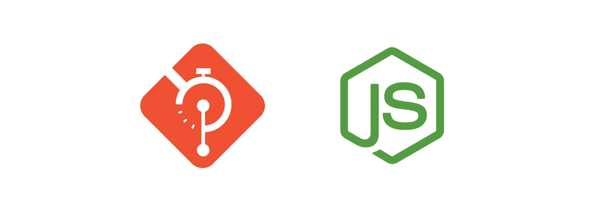
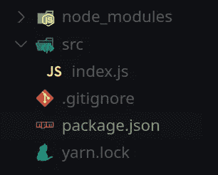
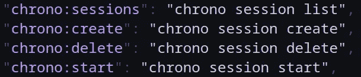
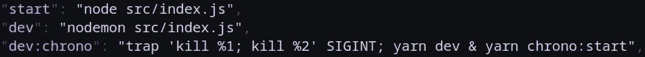
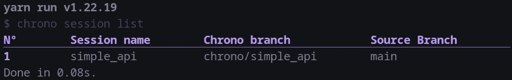
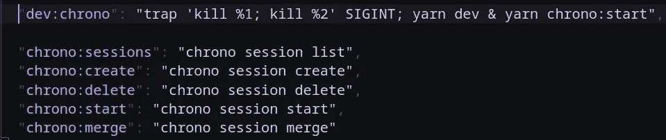
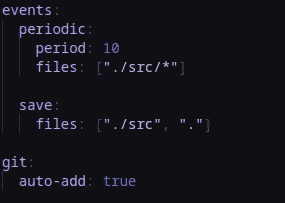

# 尝试在 Chrono 中使用 NodeJS 项目

> 原文：<https://blog.devgenius.io/a-way-to-find-bugs-and-feature-ideas-to-improve-your-own-code-5c7f1db5167e?source=collection_archive---------8----------------------->



大家好！
在这篇博文中，我将尝试在一个 Node JS 项目中使用 [Chrono](https://github.com/hazyuun/Chrono) 来发现新的功能想法，以及需要修复的新错误

如果你不知道什么是 [Chrono](https://github.com/hazyuun/Chrono) ，我推荐你阅读[我之前关于 chrono](https://medium.com/dev-genius/chrono-the-git-time-machine-c52e75b48f5c) 的文章，或者继续，我会一路简要解释。

# 放弃

> [Chrono](https://github.com/hazyuun/Chrono) 还在开发阶段，不保证稳定。
> 
> 如果您打算使用它或测试它，请谨慎使用。
> 
> 使用风险自担，我不对你的任何行为负责。
> 
> 另外，如果您发现任何 bug 或有任何建议，请随时[在 Github 上提交问题。](https://github.com/hazyuun/Chrono/issues)
> 
> 谢谢！

# 介绍

几个月前，我开始研究 [Chrono](https://github.com/hazyuun/Chrono) ，这是一个简单的工具，当事件发生时，git 会在临时分支中为你提交(定期或在文件保存时)，在[我之前的博客文章](https://medium.com/dev-genius/chrono-the-git-time-machine-c52e75b48f5c)中了解更多信息。

在你自己的项目中发现问题和新特性想法的最好方法之一，就是试着自己使用它！这就是我所做的，我试着在一个简单的 Express JS 服务器中使用它，下面是它是如何进行的

# 使用 Chrono 设置节点 JS 项目

让我们试着用 Express 制作一个非常简单的 REST-ful API，我将跳过初始化过程，因为这超出了这篇博文的范围。

好了，我们有了这个基本的文件夹结构，以`index.js`作为主入口点。



文件夹结构

现在，由于我们将使用超时空，我认为在`package.json`中为它添加一些 npm 脚本是个好主意

因此，让我们从基本的会话列表/创建/删除/启动命令开始:



一些超时空的脚本

然后，我们可能希望同时启动会话和运行 nodemon，并用 Ctrl+C (SIGINT)停止它们，这样做有点棘手；首先，我们想同时运行这两个命令，这相当容易:

```
yarn dev & yarn chrono:start
```

> 注意，我把`yarn chrono:start`留在了最后，以便让它获得命令行参数(会话名)

现在，如果我们让它保持原样，它会工作得很好，但是当我们按 Ctrl+C 时，我们不能停止这两个进程，所以要这样做，我们可以使用`trap`命令注册一个 SIGINT 信号处理程序来终止这两个进程，就像这样:

```
trap 'kill %1; kill %2' SIGINT; yarn dev & yarn chrono:start
```



*   添加功能:如果我们也可以使用 Chrono 命令合并会话，那就太好了(我之前也有过这个想法，但我还是在待办事项列表中注明了)

现在，我们需要`chrono.yaml`配置文件，我刚刚用了这个

```
events:
  periodic:
    period: 10
    files: ["."]
  save:
    files: ["."]
```

初次提交的时间

```
$ git init
$ git add .
$ git commit -m "Initial commit"
```

不错！

# 尝试使用它

首先，我创建了一个计时会话

```
$ yarn chrono:create simple_api
```

我们可以看到它被创造出来:

```
$ yarn chrono:sessions
```



会话列表

我开始了这次会议

```
$ yarn chrono:start simple_api
```

然后我在`index.js`中写了一个简单的路线并保存，保存事件被触发了，但是没有提交任何东西！原来保存事件不会递归地触发子目录，换句话说，配置文件中的`"."`不包括目录中的文件，

*   **要修复的错误:**子目录中的文件不会触发保存事件

作为解决办法，我修改了配置文件，使其也包含了`./src`，并重启了 Chrono

```
events:
  periodic:
    period: 10
    files: ["./src/*"]
  save:
    files: ["./src", "."]
```

我决定将路由与入口点分开，所以我添加了一个新文件，只包含路由，然后注意到它没有被提交，因为它没有被 git 跟踪！

*   要添加的功能:如果我们有自动添加新文件的选项，那就太好了

# 添加新功能后

我补充道:

*   合并命令
*   未跟踪文件的自动添加选项

之后，我给`package.json`添加了合并脚本



并在计时配置文件中启用自动添加



然后再次尝试使用它(从头开始),这次很顺利

# 结论

这是在我自己的代码中发现新问题和 bug，以及新特性想法的好方法

我希望你喜欢阅读这篇文章，你可以查看 github 上的 [Chrono 库](https://github.com/hazyuun/Chrono)

祝你白天/晚上愉快！
干杯！