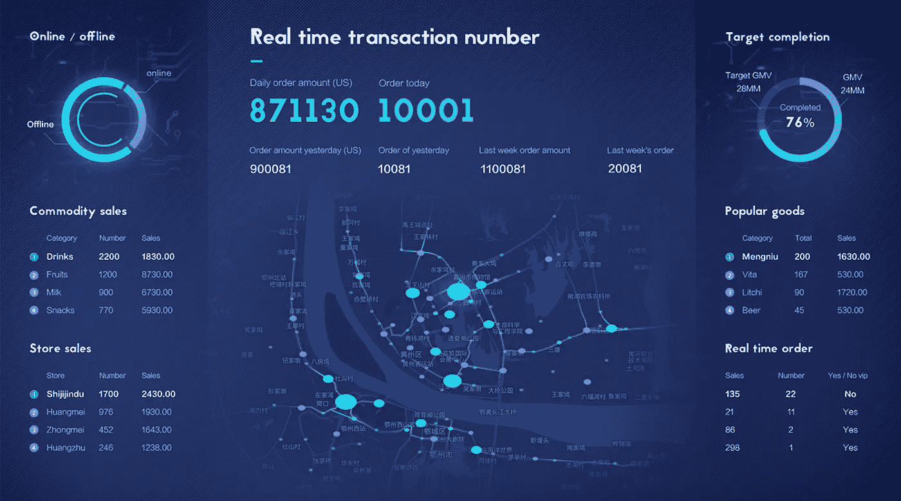
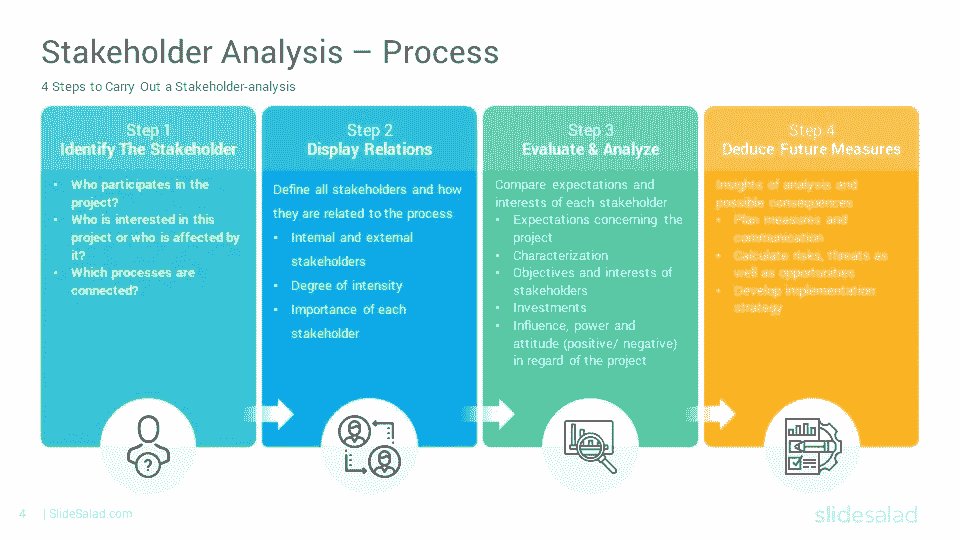
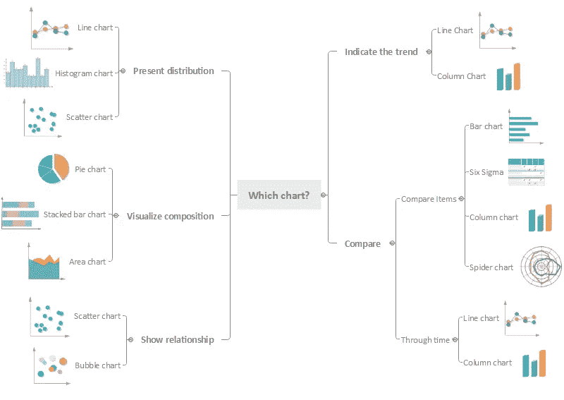
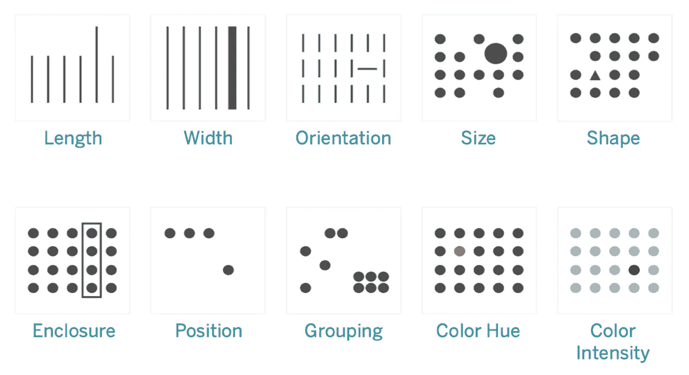
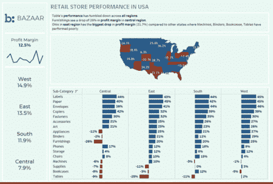

# 定义明确、设计良好的仪表板

> 原文：<https://blog.devgenius.io/a-well-defined-a-well-designed-dashboard-ab5c6f7bda95?source=collection_archive---------9----------------------->

今天的博客是关于如何精心制作一个定义良好和设计良好的仪表板。它使用直观，能够吸引用户参与，并且易于阅读、理解和解释数据所提供的信息(趋势、模式、可操作的见解、建议)。

[来源:Pinterest](https://www.pinterest.com/pin/55872851613180039/)

> 一个定义良好的仪表板是一个以它应该做的方式显示它需要做什么的仪表板。
> 
> 一个好的设计就像一个好的笑话——如果你必须解释它，它可能没有那么好。

在技术层面上，一个设计良好的仪表板是一个移情的、研究驱动的和人驱动的设计。

现在，让我们了解这个过程，并创建一个定义良好、设计良好的仪表板。

# 问题陈述定义

首先，我们定义并理解业务问题陈述及其范围。确定利益相关者和解决业务问题的数据。

如果可能的话，仔细阅读问题陈述和利益相关方沟通，了解该解决方案将如何帮助企业最大化投资回报/最小化成本/优化流程或改善客户服务。

# 利益相关者的信息

第二，我们需要提出不同的研究问题来阐明与业务目标一致的利益相关者的所有需求。了解他们在解释数据分析结果方面的知识和技能，以及他们在使用分析工具访问和使用仪表板时的舒适程度。

[利益相关者分析](https://www.slidesalad.com/product/stakeholder-analysis-powerpoint-templates/)

我们的研究问题越精炼，越符合业务需求，数据来源、探索和分析过程就越准确。

# 来源和分析数据

第三，我们开始通过内部数据库或调查、问卷、访谈等收集我们在第一步中确定的数据。，并通过执行探索性数据分析(EDA)来确保它是准确、一致、相关、有效和高质量的。接下来，基于问题陈述和来自涉众的输入，开始分析数据&开始创建符合分析的视觉效果，并将成为仪表板的一部分。[图表指南](https://chart.guide/charts/chart-choosing/)和[数据目录](https://datavizcatalogue.com/search.html)是很好的资源，可以帮助你为你的数据选择合适的视觉效果/图表。

[选择正确的图表](https://www.edrawsoft.com/chart/choose-right-chart.html)

一旦我们完成上述三项任务，请确保数据分析的结果有助于回答业务问题。如果没有，重申数据探索和分析的过程。

# 计划设计

在这一步中，需要考虑的几个要点或方面是:

## a.仪表板的布局和信息架构

信息架构侧重于仪表板中信息(视觉效果)的组织。**它提供了仪表板**的鸟瞰图。使用 F 和 Z 图案来反映用户的眼睛如何扫描页面。以绝对顶级的必备外卖打头阵。

## b.美学

I .用适当的空白空间平衡视觉效果，为数据创造喘息空间。

二。使用一致的设计语言和配色方案。

三。干净、清晰、易于理解的用户界面，允许用户与仪表板交互并理解关键要点。

四。小心你的标签和图例，注意字体、大小和颜色。它不应该隐藏你的图表，但也要足够大，便于阅读。

## c.让它互动

使用过滤器、按钮以及向下钻取和向上钻取操作项来分别过滤数据、显示或隐藏或更改可视元素以及显示数据。

## d.利用预先注意的属性

[Tableau 帮助—可视化分析](https://help.tableau.com/current/blueprint/en-us/bp_why_visual_analytics.htm)

让我们通过一个例子来完成上面讨论的这个过程:

**问题陈述定义**

产品子类别在美国的表现如何？

**研究问题**

Q1。绩效对不同的团队意味着什么？它应该用销售额、销售量、利润还是这些指标的组合来衡量？

Q2。他们希望看到地区级、州级或城市级产品子类别的表现吗？

**数据**

数据来自位于美国各地的超级商店样本数据集。

**解决方案**

在与所有利益相关者交流后，我们了解到他们希望从利润率(%)的角度来查看产品子类别的表现，利润率(%)是指一年内各地区和州之间的利润和销售额的比率。

观察下面的仪表板，我们可以看到我们在分析中使用了很少的颜色。如果利润率大于或等于零，那么地图和条形图都将是蓝色的，如果利润率小于零，它将是红橙色的中暗阴影。

此外，每个可视元素充当一个过滤器，因此当用户单击特定的州、地区、子类别或月份时，数据会得到相应的过滤。这简化了用户与仪表板的交互流程，并创建了高参与度和交互性。

[Tableau 仪表盘](https://public.tableau.com/app/profile/max6387/viz/ContentWritingExample/BazaarPerformaceDashboard)

在仪表板中，有七个视觉元素

1.该条形图显示了按子类别和地区细分的利润率。

2.显示美国各州利润率明细的地理图

3.分地区利润率。

4.KPI 显示所有产品子类别和地区的总体利润率，并显示月环比趋势。

5.列出了分析过程中发现的一些见解。

6.仪表板的描述性标题，向风险承担者介绍仪表板上显示的信息或视觉效果。

7.(可选)徽标和公司名称，这取决于是否遵循了这一做法。

# 纪念

**仪表板是你通过数据告知的故事**的一部分，它需要**简单**，并且**易于理解**，它应该**节省**用户的时间。此外，还需要确保通过仪表盘上的视觉传达的分析与数据相符。

创建定义明确、设计良好的仪表板是一个**迭代过程**。确保从您的利益相关者那里获得**反馈**以进行改进，改进您的工作并展示**相关数据**以使**与**业务目标**或结果**保持一致。

始终保持**简化**、**精简**和**锐化**你的仪表盘，因为有效的仪表盘传达复杂的量化信息，有助于洞察、理解&基于证据的决策。

> 表现力是准确显示相关数据；有效性是可视化表达其含义的能力。

