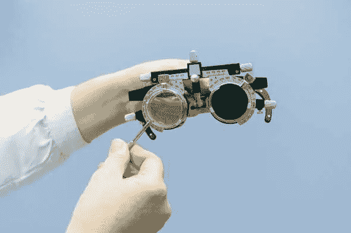

# ♿·a11y:我们如何改善有视觉障碍的人的网络体验？

> 原文：<https://blog.devgenius.io/a11y-how-can-we-improve-the-web-experience-for-people-with-visual-impairments-c3673535ca85?source=collection_archive---------9----------------------->

所以当我们谈论残疾的类型时，我们在谈论什么。为了让每个人都能访问网络，我们需要考虑什么？影响我们使用网络的残疾主要有五个方面。视觉障碍、听觉障碍、运动障碍、认知障碍以及前庭障碍和癫痫。这篇文章主要是关于视觉障碍的。

# 视觉障碍

这些是与眼睛有关的损伤和残疾，可能是近视、丧失视力、色盲或任何其他疾病。

# 色盲

色盲是一种相当常见的障碍，它会使你看到的颜色与实际颜色略有不同。有不同类型的色盲，让我们不要进入医学术语，而是为了简化，让我们说有三种基本类型。

1.  红绿色盲(难以区分红色和绿色)
2.  蓝黄色盲(难以区分蓝色和黄色)
3.  完全色盲

## 💡我们能做些什么让色盲的人也能上网？

在这种情况下，要让网络变得可访问，还有很多事情要做

1.  避免某些颜色组合(如绿色和黑色、蓝色和灰色、绿色和灰色等)更多信息，您可以查看[我们是色盲——让色盲的世界变得更美好](https://wearecolorblind.com/)
2.  尝试用单色浏览你的应用程序或网站，看看你无法分辨的所有细节。在灰度模式下浏览你的网站有助于你想象它如何呈现给色盲观众+
3.  使用图标或符号以及颜色来传达信息，比如我们如何提醒用户某些事情不正确，等等

## 📚如果你感兴趣，这里有一些资源

1.  [https://www . usability . gov/get-contained/blog/2010/02/color-blindness . html](https://www.usability.gov/get-involved/blog/2010/02/color-blindness.html)
2.  [https://www . design mantic . com/community/website-design-guide-color-blind . PHP](https://www.designmantic.com/community/website-design-guide-color-blind.php)
3.  [https://jfly.uni-koeln.de/color/](https://jfly.uni-koeln.de/color/)
4.  [https://docs . Microsoft . com/en-us/previous-versions/windows/internet-explorer/ie-developer/accessibility/gg 701983(v % 3d vs . 85)](https://docs.microsoft.com/en-us/previous-versions/windows/internet-explorer/ie-developer/accessibility/gg701983%28v%3dvs.85%29)

# 视力下降

除了色盲之外，还可能有其他问题导致他的视力下降，无论是与年龄有关还是由于任何其他疾病，视力模糊或模糊。近视和远视也可以包括在这里。

## 💡我们能做些什么来让他们访问网络？

1.  让文字更清晰，因为使用真实字体而不是在图像中使用(这对放大镜也有帮助)
2.  清除输入字段和信息的标签。
3.  文字和背景的对比度更好。(WCAG 2.1 AAA-文本和文本图像的最小对比度为 7:1。)

## 📚如果你感兴趣，这里有一些资源

1.  [https://webaim.org/articles/visual/lowvision](https://webaim.org/articles/visual/lowvision)
2.  [https://web design . tuts plus . com/articles/accessibility-basics-design-for-visual-deficiency-CMS-27634](https://webdesign.tutsplus.com/articles/accessibility-basics-designing-for-visual-impairment--cms-27634)

我不是无障碍专家，我正在探索这些领域，你可以和我一起走这条学习之路。我也会继续发布资源链接。

祝你愉快...今天再见👋

本文原载于 Kiran 的个人博客→ [OnePercentBlog](https://kirananto.com/a11y-visual-impairments/)