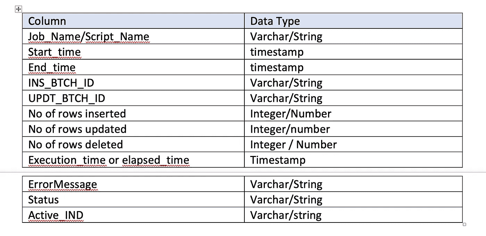

# 数据平台实施基础知识

> 原文：<https://blog.devgenius.io/abc-of-data-platform-implementation-88307e43fe61?source=collection_archive---------3----------------------->

随着数据世界的不断发展，我们已经看到了 OLTP 系统、OLAP 系统、数据仓库实施、数据湖实施的发展。我们还学习了数据网格，并评估了数据网格在给定的实现用例中的用途。除了数据系统，我们还学习了过去十年中演变的各种数据类型，从结构化数据到半结构化数据，从半结构化数据到非结构化数据。我们还见证了处理图像、视频、音频、文档、pdf 以及地理空间数据集是多么容易。我们还学习了从大型机——本地编程——JCL/COBOLs 到基于 Python/Java 的组件的范式转变，这些组件易于开发和部署，并与 CI/CD 集成在一起。云转换、数据现代化有助于快速采用不断发展的数据，并从处理过的数据中获取价值。

所有领域中的大多数组织都在采用数据现代化途径。当我们致力于数据现代化、BYOD(数据)模型时，很少有数据平台的本机组件需要与数据和流程一起现代化。让我们来谈谈其中的一些关键组件——

1.变更数据捕获

2.审计批量控制

3.错误处理和警报

4.DPM —数据管道监控

5.应用程序维护(可维护性)

6.系统运行状况监控(数据库性能、利用率等)

7.成本或计费监控

变更数据捕获是数据实现中最关键的部分之一。有各种类型的 CDC 和各种实施变更数据捕获的方法。我们已经在之前的一篇博客中了解到这一点—[https://poojakelgaonkar . medium . com/change-data-capture-in-dwbi-ETL-ELT-implementations-af08b 54d 8 FB 5](https://poojakelgaonkar.medium.com/change-data-capture-in-dwbi-etl-elt-implementations-af08b54d8fb5)

我们还学习了数据现代化的使用案例，其中我们学习了使用谷歌云平台实施 CDC—[https://poojakelgaonkar . medium . com/implementing-slow-changing-dimensions-using-GCP-services-b0ac 11d 08 deb](https://poojakelgaonkar.medium.com/implementing-slowly-changing-dimensions-using-gcp-services-b0ac11d08deb)

GCP 的 Datastream 是变更数据捕获的托管服务之一，它从源系统捕获变更，并将它们实时复制到目标系统。更多信息请访问—[https://poojakelgaonkar . medium . com/implementing-change-data-capture-using-GCP-datastream-c 340238 b5 d2b](https://poojakelgaonkar.medium.com/implementing-change-data-capture-using-gcp-datastream-c340238b5d2b)

在这篇博客中，我们将了解更多关于审计批处理控制的内容，这是数据平台实现的关键组件之一。让我们通过各种问答来进一步了解这个框架。

**什么是审计批量控制(ABC)？**

-这是与大多数数据平台(数据仓库或数据湖)一起实施的框架。该框架有助于捕获、维护正在设置和执行的各种数据管道的细节。此框架建立了一个审计表，可用于调试任何作业失败、数据问题、对特定负载或负载天数的任何数据问题的更正。

**什么是审计表？**

- ABC 框架围绕审计表。审计表是一种日志条目表，它记录和维护条目、状态，并更新具有给定批处理 id 和执行日期或运行日的作业执行的最终状态。

**什么是批次 ID？**

-批处理 id 是分配给在给定数据平台内运行的每个加载、每个作业或管道的唯一 ID。这用作唯一标识符，用于识别给定日期的批量作业或负载。这通常由 rundate — YYYYMMDD 和 job — 01 或 02 的执行发生次数构成，基于特定日期运行 job 的次数。在某些情况下，这也作为字母数字与工作标识符一起使用，以识别工作类型，如 LD、UPD、DEL 等。

**批次 ID 如何帮助识别负载或校正负载？**

*   在对表执行每个 DML 事务时使用批处理 ID，这也被跟踪并记录到审计表中。例如，一旦为给定的执行日生成批处理 id，插入作业运行并在审计表中创建一个条目，详细信息包括脚本名称、批处理 id、开始日期、结束日期、执行状态、update_batch_ID 等。这是审计表和目标表中的一列，是数据系统的一部分。我们可以使用该列来查询给定日期加载/更新/删除的表数据。

**审计表看起来怎么样？**

-审核表具有如下所示的列-

**审计表是如何加载的？**

-我们可以创建一个可重用的脚本或 sql 或函数或 SP 来传递所需的参数，并调用插入命令在脚本名称的开头创建一个表条目。

**如何或何时更新审计表？**

-我们可以根据作业执行的状态(成功或失败)更新表格。如果脚本中的任何任务失败，则调用可重用组件，用 error_msg、End_time 和 Updt_btch_id 更新审计表。当作业成功完成时，使用相同的 update 语句。如果成功，错误消息将为空。

**ABC 中使用的典型参数有哪些？**

-这是一个可重用和可配置的框架。审计表中的所有列都将由父作业/脚本或包装程序脚本填充。Batch_ID 列生成可以是另一个可重用的组件，将脚本细节传递给调用 SQL 来加载或更新审计表的脚本。

**为什么 ABC 有益？**

- ABC 在许多方面都是有益的——

o 审计表有助于跟踪活跃的管道

o 这用于调试任何失败的管道

o 这避免了由于意外重新运行作业而导致的数据重复

o 这用于运行和捕获数据异常警报

o 这用于纠正/更新从源系统意外收到的数据问题

o 在 Batch_id 的帮助下，可以跟踪和纠正任何数据问题

o 这也可用于设置自动监控，向应用程序支持团队发出警报

我们今天已经学习了数据平台实施的基础知识。让我们在接下来的博客中了解剩余的关键或重要特性。

我希望这个博客系列将有助于理解、学习和实现数据平台最重要或关键的组件。

> 关于我:
> 
> 我是 DWBI 和云建筑师！我目前在雪花公司的 GCP 担任高级数据架构师。我一直在处理各种遗留数据仓库、大数据实施、云平台/迁移。我是 SnowPro 核心认证数据架构师，也是 Google 认证的 Google 专业云架构师。您可以联系我 [LinkedIn](https://www.linkedin.com/in/poojakelgaonkar/) 如果您在认证、数据解决方案和实施方面需要任何进一步的帮助！