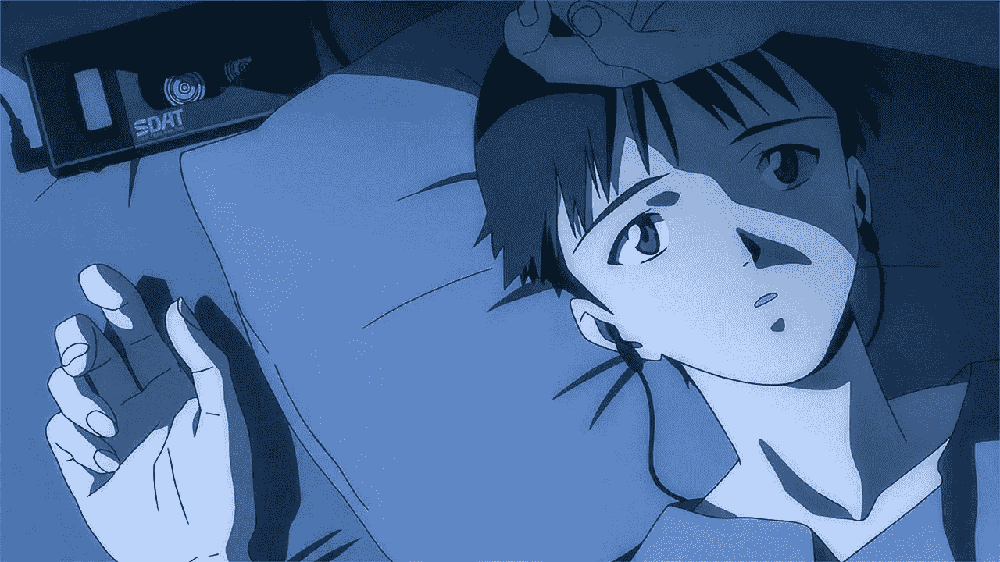

# 作为学生开发者的选择。

> 原文：<https://blog.devgenius.io/about-choices-as-a-student-developer-6332d99522d4?source=collection_archive---------32----------------------->

> 在你做的每一件事情中，你都在选择方向。你的生活是选择的产物。

~凯瑟琳·霍尔博士

随着时间的推移，做出这些选择变得越来越困难。尤其是在我们作为学生面对的信息海洋中。选择悖论，我们都面临着它，现在比以往任何时候都多。它对初学者来说是最普遍的。

自从我上大学以来的一年里，我一直带着这种不知道该选择什么，或者在某些情况下选择太多的感觉在车道上颠簸。所以我想在这里分享这些想法可能会很有趣。

# 对每个人来说都是如此。

因此，我带着自己选择的学位和一些计算机科学知识，以及来自不同文章和 YouTube 视频的大量灵感，进入了大学。但是，没有什么比走进一个有数千名学生的校园，而我的一批学生中有 600 多名学生更让我不知所措了。我知道，这是个疯狂的数字。除此之外，他们还听了特别添加的迎新演讲，谈论了各种技术方面的事情以及对我们的期望。房间里充满了很多动力，它们的波浪卷走了那些正在关注的人，而我恰好是那些人中的一员。

这种动机足以驱使我在大学的头几周同时开始游戏开发、机器学习和竞争性编程，这很好，因为第一学期通常被认为是探索该行业不同方面的时间。老实说，我很好地管理了我的时间，处理好了我正在做的所有不同的事情。

# 过于积极的阶段和崩溃。

> *任何东西喝多了都不好，但香槟喝多了就正好。*

斯科特·菲茨杰拉德

我不知道我是否到了喝香槟的年龄，但不管怎样。当我在进行你们可能称之为“提高技能”的时候，时间不够的感觉不可避免地袭击了我。但是我最终在理解那种感觉上做得很糟糕。我决定通过牺牲我花在游戏和动漫上的时间(从我的电脑上删除它们)来弥补更多的时间，只是为了能够做更多的**事情，而不是做更少的**事情。****

看到我错在哪里了吗？尽管如此，我还是为自己当时做出的决定感到骄傲。我觉得我肯定会成为一名伟大的开发人员，不会因为分心而动摇。

大约不到两周，我开始承认我讨厌自己那样做。机器人角色终于被剃掉了，现在它面临着严重的崩溃。我终于意识到，我不能承诺一件事是不成熟的，我有太多的事情要做，而且没有减压的方法。损害我的幸福，尤其是我的动漫，是不值得的。我意识到在我的选择之间保持平衡的重要性。

# 选择

我是不是用这个词太多了？无论如何，我当时唯一优先考虑的事情是找一份高薪工作，以更快地还清我的学生贷款。虽然我过去和现在都对日常技术和创新充满热情，但我觉得我把它当成了我必须做的事情，而不是我想做的事情。我想无耻地指责我和其他面临这种情况的学生所面临的无限多的选择。

但同样真实的是，我们面对不断增长的选择数据库并从中学习的越多，我们就越不可能试图用不同的特征来过度适应我们的生活/学习模式。从而提高我们模型性能的质量。

好吧，机器学习的双关语真的很糟糕，但我想说的是，不要迷失。重要的是要很好地掌握所有不断出现的不同更新，这很容易淹没在不同的点击诱饵中，但记住后退一步，冷静一点。那使你保持健康。

我现在正试着投入到 ML 中，当我厌倦了数据库的时候，我会边学游戏开发。但我知道它可能会改变，这没关系。

收官，继续磨，继续心寒。