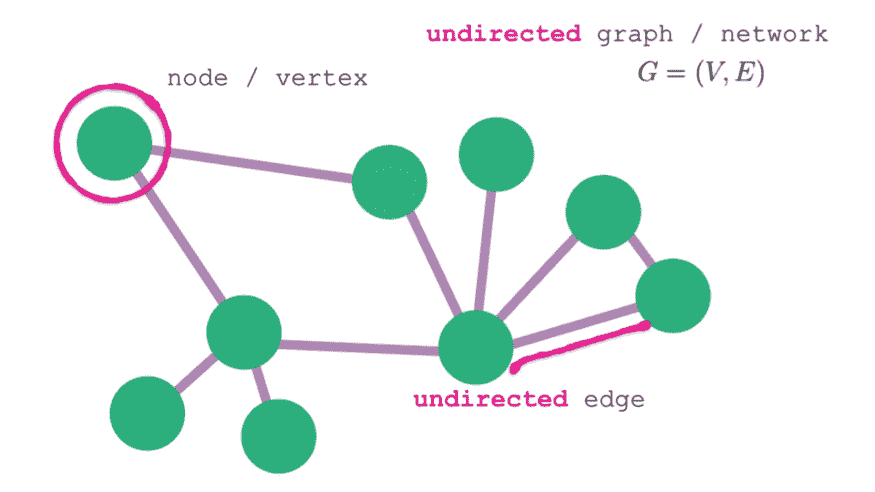
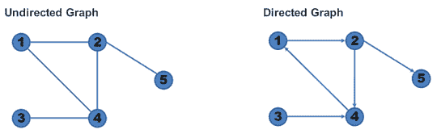
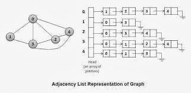
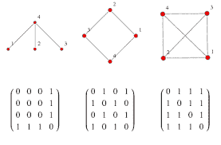
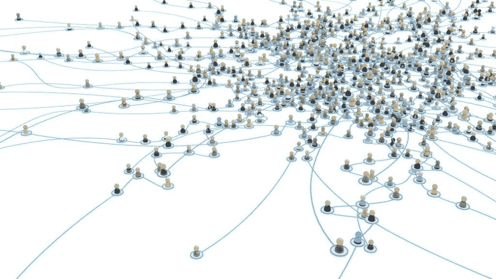
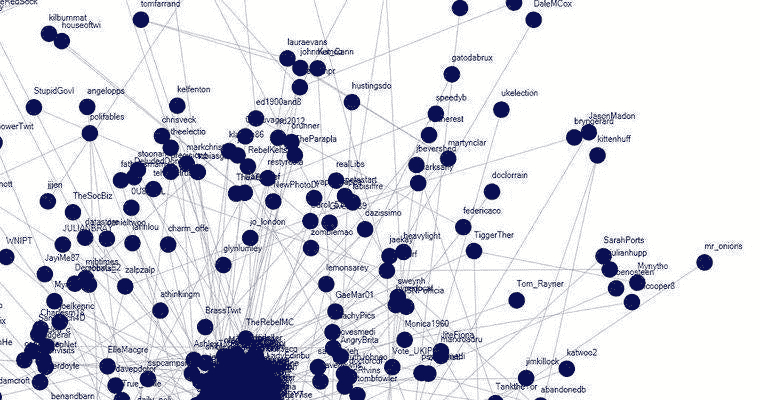

# 关于图论上面的*最重要*标签？！

> 原文：<https://blog.devgenius.io/about-the-most-important-tag-above-graph-theory-858c58654c06?source=collection_archive---------7----------------------->

我们确实经常在几乎每个视频或文章的算法旁边看到最重要的标签，以及破解编码采访的图表。因此，在本文中，我们将对此进行简单的探讨。这更侧重于结构的应用和它的整体重要性，所以您可能想看另一篇关于实现或算法分析的文章。

说到编码面试，一定要看看[编码技巧的](https://vxhltech.hashnode.dev/about-the-most-important-tag-above-graph-theory-ckdbubgqz02dh66s185u1gufr?guid=none&deviceId=7f5c5574-c372-42b5-8c96-4c2fea28f348)博客关于[如何在编码面试中胜出](https://codinglanguages.hashnode.dev/how-to-ace-coding-interviews-the-ultimate-guide-ckcxekdxp00bqois16r59a9c1)。当我面试的时候，我可能会参考这个指南。

> *图是一种数据结构。数据结构是一种有效组织数据的方式，在图中，数据以顶点/节点和边之间的网络的符号表示来组织。*

我们可以把节点看作是数据块(T8 ),把边看作是这些数据块之间的关系(T10)。

有向图指定特定顶点与其他顶点的访问度(从当前节点访问的节点数),无向图不指定访问度。其他包括加权图，其中每个边被赋予特定的数字权重。

# 实施情况简介:

有三种方法可以实现图形:

***1。邻接表:***

当图很稀疏时，也就是边的数量比可能的节点数量少得多时，经常使用这种方法。它的存储效率很高，并且很好地表示了稀疏图。

节点作为对象存储，每个节点都有一个相邻节点的列表。这种数据结构允许以列表的形式在节点上存储附加数据。示例:

在这里，我们可以看到 Alice Smith 通过列表与每个人连接，连接的类型由字典键表示。

**②*。邻近矩阵:***

这在图形密集或连接速度需要超快的情况下使用。由于矩阵实现，确定节点 A 和节点 B 之间的连接需要 O(1)的时间复杂度。主要缺点是存储需求为 O(N>2)，其中 N 是节点数。

2D 列表，其中第一维索引表示源节点，第二维索引表示目的节点。听起来很简单是的。例如，在列表`list[0][1]`中，`0`表示第 0 个索引源节点，1 表示第 1 个索引目的节点。如果两个节点之间的关系有特定的权重(quanititative value)，则`list[0][1]=4`的值将是它的权重。节点的数据必须从邻接矩阵外部存储。

***3。关联矩阵:***

这在边缘非常重要的时候使用。如果我更关心关系而不是关系中的节点，这可能是有帮助的。

2D 列表，其中第一维表示节点，第二维表示边。例如，在列表`list[0][1]`中，`0`代表第 0 个索引源节点，1 代表第 1 条边。当您想要进行复杂的矩阵运算或搜索关系时，例如给我所有具有“兄弟”关系的节点，这是非常有用的。

要更详细地了解技术方面，你可以看看这篇文章。我更喜欢它们来满足我大部分的 DSAlgo 需求。

> *每一个非平凡程序都是一个图。函数调用、变量访问和作用域、对象，所有这些都是图论。*

> *如果你想要更明确的东西，每* [*内存管理方法*](https://en.wikipedia.org/wiki/Memory_management) *。最简单的* [*标记-清除*](https://en.wikipedia.org/wiki/Tracing_garbage_collection) *涉及到创建一个有向图的* [*生成树*](https://en.wikipedia.org/wiki/Minimum_spanning_tree#:~:text=For%20directed%20graphs%2C%20the%20minimum,Chu%E2%80%93Liu%2FEdmonds%20algorithm.&text=Such%20a%20tree%20can%20be,problem%20on%20the%20new%20graph.) *。有效地使用***引用计数需要了解* [*循环*](https://en.wikipedia.org/wiki/Cyclic_graph) *和非循环图。**

*更具体地说，冒险游戏也是一个例子。位置是**顶点**，它们之间的运动需要**边**的遍历。自动帮助需要找到它们之间的路径。此外，谷歌地图涉及到寻找从源到目的地的最短路径，涉及到使用像 Djikstra 的算法。*

*为一个问题选择一种算法是一个偏好的问题。在以下情况下:*

*还有很多，一个延伸到另一个。不需要完全了解它们，但我们可以尝试一些很酷的个人项目，其中最受欢迎的项目包括使用 Djikstra 算法的寻路可视化工具，它可以保证到目的节点的最短路径，或者使用 A*算法对其进行优化，以用于更实际的应用。*

*   *看看这个[路径寻找可视化工具](https://clementmihailescu.github.io/Pathfinding-Visualizer/)，由 Clement 使用不同的图遍历算法。这真是太酷了。*
*   *这里有一个[寻路项目列表](https://awesomeopensource.com/projects/pathfinding)供参考。*

# *1.网络系统及其安全性:*

**

**推特社交图**

*在没有图数据模型的情况下，在这些类型的图中确定朋友的朋友和其他关系路径可能是痛苦的，并且在只有相对较少的记录的情况下变得非常低效。*

*图论广泛应用于网络系统的表示。网络中的图论可以观察到两类:[拓扑](https://en.wikipedia.org/wiki/Topology)和[网络理论](https://en.wikipedia.org/wiki/Network_theory)。拓扑是以各种格式表示网络结构的方式，有助于简化问题并获得更准确的结果。术语网络和图是相似的，因为两者都指顶点和边排列的拓扑(结构)。术语网络理论代表了使用拓扑分析图形和应用网络理论的不同方法。更简单地说，它对确定关系很有帮助。*

> **ESAT 和法国海军病毒学和密码学实验室的计算机科学家团队最近使用了* [*顶点覆盖*](https://en.wikipedia.org/wiki/Vertex_cover) *算法来设计实时保护网络免受病毒攻击的最佳策略。这是设计网络防御策略的最佳解决方案。网络活动用于解决大量的组合问题。**

# *2.网站设计:*

**

*图论用于网站设计过程的建模，其中网页用顶点表示，网页之间的超链接用图中的边表示。这个概念被称为[网络图](https://en.wikipedia.org/wiki/Webgraph)。图形表示有助于找到所有连接的组件，使用有向图我们可以评估网站的效用和层次结构。*

# *3.数据科学问题:*

*在数据科学中，有各种各样的实体，它们相互之间有不同的相关性，以获得最佳的洞察力。图表有助于使用不同的算法描述这些关系，例如:*

*   *最短路径算法*
*   *最小生成树*
*   *PageRank 算法*

*更多的数据正被用于数据科学中不同的商业问题。要了解更多细节，请查看[这篇](https://towardsdatascience.com/data-scientists-the-five-graph-algorithms-that-you-should-know-30f454fa5513)文章进行深入研究。*

# *4.操作系统:*

**

*操作系统是一个程序，作为用户和计算机硬件之间的接口。操作系统的目的是提供一个环境，在这个环境中，用户可以以一种高效和方便的方式执行程序。图论在操作系统解决[作业调度](https://en.wikipedia.org/wiki/Job_scheduler)和[资源分配](https://en.wikipedia.org/wiki/Resource_allocation)问题中发挥着重要作用。[图着色](https://en.wikipedia.org/wiki/Graph_coloring)的概念应用于 CPU 的作业调度问题。假设作业是图的顶点，在两个不能同时执行的作业之间会有一条边。图表也用于磁盘调度算法。*

*这就是本文的全部内容，希望它能对应用程序方面有所启发。这篇文章纯粹是出于好奇，而我正在学习所有关于图形数据结构和实现它，所以我花了我的时间。如果你觉得这很有帮助，请留下赞并分享。注销:)。*

**原发布于*[*https://vxhltech . hash node . dev*](https://vxhltech.hashnode.dev/about-the-most-important-tag-above-graph-theory-ckdbubgqz02dh66s185u1gufr)*。**