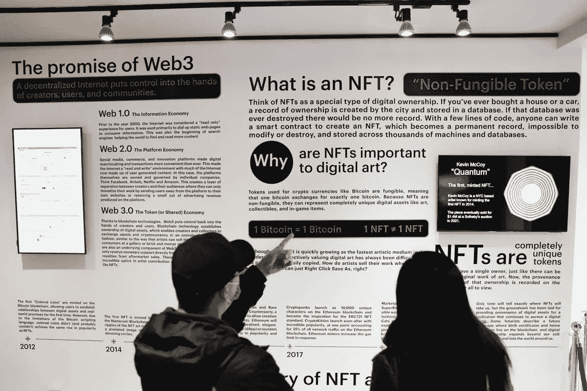

# 让我们谈谈网络 3:这是未来还是炒作？

> 原文：<https://blog.devgenius.io/about-web3-is-it-the-future-or-just-hype-7e890591202?source=collection_archive---------8----------------------->

> 人们称 web3 为互联网的下一次革命；你怎么想呢?

在这篇文章中，我将粗略地介绍一下 **Web3** 、**、**、**区块链系统**、及其未来，以及介于两者之间的一切。

**网站的建立 3**


在我谈论 web3 之前，我有必要带你回到 90 年代的网络。现在， **Web1** 作为一个*只读*的互联网功能，由一些社区开发的静态网站并没有产生很多互动。

然后 **Web2** 过渡到“读写”，这意味着 Web 开发者可以授权最终用户发布他们的内容或评论，同时建立各种社交媒体平台。有了 web2，即使用户没有 HTML 知识或不知道什么是 web 服务器，建立网站也变得很容易。然而，某些集中化的公司仍然可以操纵、保存和交易用户内容和个人数据，从而产生惊人的收入水平。

Web3 现在是第三代网络。它建立在区块链的基础上，允许个人和企业之间的安全交易。它还允许智能合同，这意味着它们可以在没有人工干预的情况下自动执行。

一般的科技实体和科技巨头控制着你墙后花园的资产和数据，所以下一阶段的数字所有权早就应该到来了。Web3 是下一代互联网，也是第一个去中心化的 Web。因此，虽然 web2 极大地增强了互联网的社交能力和用户体验，但 web3 通过使用区块链技术赋予用户所有权，开创了一个新时代。

**web 3 有什么好玩的？**

嗯，权力下放。这意味着中央机构不控制你的数据；你，个人，掌握着它，你决定如何使用它。这样，你就可以获得自己的价值，而不是被当作产品出售。
Web3 对 DNS 的许多传统弱点具有抵抗力，随着其功能的不断完善，从无缝支付到身份验证，用户已经建立了一个强大的保证，即他们的 Web3 交互在支付网络、社交媒体平台和他们日常访问的其他网站上是安全的。

WEB3、加密货币、区块链——它们只是很酷的流行语吗？

一些技术领域的愤世嫉俗者已经迅速将 web3 贴上了骗局的标签，尽管将整个生态系统贴上骗局的标签似乎有些草率。我们可能会遇到的问题是，`web3`、`crypto`和`blockchain`这几个词经常互换使用，尽管它们都表示不同的意思。
然而，几乎显而易见的是，无论最终的 web3 系统是什么样子，加密技术都将发挥重要作用。

> “网络 3”与财务价值有着内在的联系

**区块链**


区块链是一种记录数据的方式，使系统无法被改变、黑客攻击或利用或变得复杂。区块链是在参与区块链的计算机网络上复制和分发交易的日志。

谷歌文档是区块链技术运作的一个简单类比。创建一个谷歌文档后，你可以和不同的人分享。然后，文档被分发，而不仅仅是被复制或传输。这建立了一个分散的分发链，允许每个人同时访问基本文档。这消除了任何人由于等待另一方的修改或变更而被排除在外的可能性。相比之下，对文档的所有更改都是实时注册的，这使得更改变得非常明显。然而，需要注意的一个重要属性是，与谷歌文档不同，区块链平台上的原始内容和数据一旦被写入，就无法进行调整，因为它的安全级别有所提高。

区块链比谷歌文档更复杂，但这种类比是合格的，因为它说明了该技术的基本概念。

## 为什么区块链恰好是一件大事…

嗯！简单的解释是，区块链被认为是一种崭露头角的革命性技术，因为它有助于降低安全风险，杜绝欺诈，并以更可扩展的方式带来透明度。

在 2010 年代，区块链因其与加密货币和 NFTs 的联系而变得越来越受欢迎。从那时起，区块链技术已经成为不同国际行业的管理解决方案。今天，区块链已经提供了高水平的透明度、数据安全性和医疗保健，并普遍改变了我们大规模处理数据所有权的方式。

## 区块链在科技公司的应用。

如前所述，区块链的用途远远超出了加密货币的核心——这项技术正在以某种方式融入几乎每个现代行业。

区块链技术彻底改变了智能合同、医疗保健、银行甚至投票。现在，尽管这种技术持续增长，但区块链的可行应用仍有待发现。

## WEB3 的未来…



这些年来，互联网的快速发展一直吸引着人们的注意力。几年前，没有人会想到虚拟世界有一天会成为现实。现在，整个技术空间都在谈论 web3 的到来，它将存在多久，等等。

所有这些趋势查询都强调了 web3 及其使用案例的关键优势。脸书模式及其向元模式的转变是互联网未来最合适的亮点。大型科技公司雇佣了成千上万的人从事他们的元宇宙开发项目。最重要的是，大约 5000 万美元的资本流入和新就业机会的创造为元宇宙的发展提供了可靠的推动力。

底线是，web3 正致力于改变用户的互联网体验。人们天生倾向于尝试新事物，用户对加密货币和 NFT 的兴趣已经证明了这一点。我想说的是，web3 的未来很可能会经历许多挑战，然后最终转变为整个互联网的成熟标准。

*就是这样，伙计们；如果你觉得这篇文章很有帮助，请留下你的掌声，并在 Medium 上跟随我获取更多类似的内容。如果你也想对这篇文章有所贡献或者分享你的想法，请留下你的个人信息。*

```
**MOST IMPORTANTLY** *This article isn't completly opinion-based, but a result of internet research and thus should not be taken as an investment advice.*
```

感谢您的阅读时间，干杯！