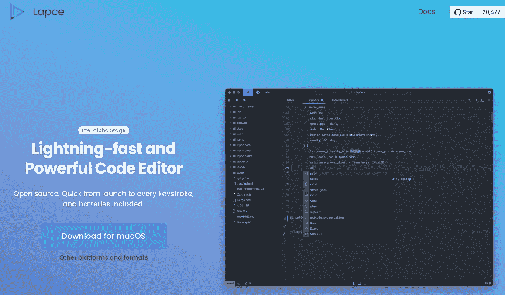

# Rust 初学者的绝对最小 VSCode 设置

> 原文：<https://blog.devgenius.io/absolute-minimal-vscode-settings-for-rust-beginner-51f7f4060ebb?source=collection_archive---------5----------------------->


# 1.探索

当我们第一次开始学习 Rust 时，我们面临一个重要的问题:我们应该使用什么编辑器？

我尝试了 IntelliJ，起初，它似乎是社区 IntelliJ 版本的一个好选择。但是当我尝试调试时，我意识到我需要购买许可证。这是一个相当高的代价，尤其是如果你甚至不确定你会喜欢这门语言。

后来，我换了一个新的编辑器:



lapce.dev

Lapce 是**一个基于 Rust 的编辑器**那快如闪电。当我第一次听到“快如闪电”的时候，我不明白。那有什么不同？大多数编辑都很快。但当我打开一个文件，我看到了不同之处。

Lapce 有一个光明的未来，但它仍在发展中。有些错误可能会令人沮丧。我报道了其中的一些。我希望 Rust 开发人员的情况会有所好转

但关键因素是 Lapce 没有支持在编辑器中调试 Rust 的计划…所以最后我不得不使用我的最后一个选项，VS 代码。

# 2.VS 代码:你所要做的就是安装一个 Rust 扩展包

VsCode 拥有成为一个完美的 Rust 编辑器所需的一切…在你的机器上安装 rust 之后，你只需要安装 Rust 扩展包


或者您可以在下面单独安装它们:

**CodeLLDB** —用于调试 Rust 代码，您将使用它来逐行调试**代码**

Rust-Analyser —官方的 Rust 代码分析器，帮助我们检测语法错误

**Crate** —帮助您在 VsCode 中快速创建 Rust 项目

**Toml**——帮助你阅读 Toml 配置…类似于 Java 中的 Maven

此外，您可以安装其他插件，如 *ErrorLen、Vim 和 themes..etc* 。太棒了！

# 3.调整 VSCode，最大化您在 Rust 开发方面的经验

在安装了 Rust 需要的所有扩展之后…下面是你的编辑器在 Rust 中的样子


镶嵌提示噪音太大

VS 代码显示了很多镶嵌提示，就像截图里一样。那是有帮助的，但是他们可能太吵了。有了这些提示，很难专注于你的代码。你需要更深的颜色，这样你就可以专注于你的代码。

如果你有同样的感觉，这里有一些设置供你添加到你的`settings.json`文件中:(`ctrl + shift + p` - >类型`settings`...)"

```
 "workbench.colorCustomizations": {
        "editorInlayHint.foreground": "#868686f0",
        "editorInlayHint.background": "#18181800",
        // Overrides for specific kinds of inlay hints
        "editorInlayHint.typeForeground": "#486148f0",
        "editorInlayHint.parameterForeground": "#486148f0",
    }
```

下面的镶嵌提示帮助我们更快地了解生锈，向我们展示生锈是如何借用和终身跟踪的。

```
 "rust-analyzer.inlayHints.lifetimeElisionHints.enable":"always",
    "rust-analyzer.inlayHints.reborrowHints.enable": "always",
```

添加这些设置后，代码看起来会更好，如下所示


所有镶嵌暗示都更暗

下面是一个快速演示视频:[https://www.youtube.com/watch?v=YOTU-re5_uM&t = 140s](https://www.youtube.com/watch?v=YOTU-re5_uM&t=140s)