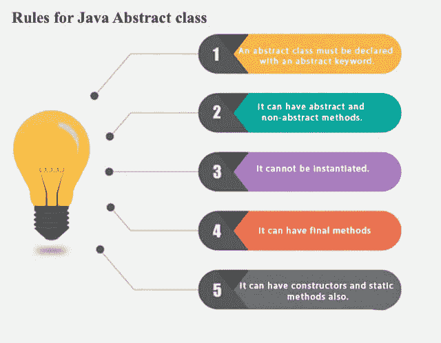

# Java 中的抽象

> 原文：<https://blog.devgenius.io/abstraction-in-java-d4e6108f3df2?source=collection_archive---------2----------------------->

在本文中，我们将了解什么是 Java 中的抽象，以及为什么它很重要。抽象是 JAVA 面向对象编程的四大支柱之一，另外三个是

1.  遗产
2.  包装
3.  多态性

在某些情况下，我们希望定义一个类，声明一些方法，但不想在这些方法中添加任何功能。

例如，假设我们声明了一个名为 Shape 的类，其中有 perimeter 和 are a 方法。形状是一个基本的结构，不同的形状如圆形、正方形等，周长和面积是不同的。

所以我们可以声明一个类为抽象类，如果我们想把它作为所有其他类的基本结构来扩展这个基类的话。

**请注意-**

1.  我们不能创建抽象类的对象
2.  抽象类可以有抽象和非抽象方法
3.  最终方法也可以存在于抽象类中
4.  扩展抽象父类的子类需要声明抽象类中声明的所有抽象方法。

在这段代码中，我们观察到-

1.  我们需要在 Circle 和 Square 中声明所有扩展 Shape 类的抽象方法。
2.  不需要在圆形和方形类中声明非抽象的颜色方法。
3.  不允许 Shape 类(父类)中的抽象方法的功能。

**我希望你们喜欢这篇文章。请在这里订阅更多精彩的文章，并请给出一个👏如果你觉得这篇文章信息丰富。**