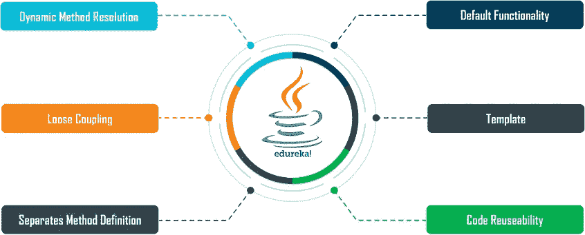
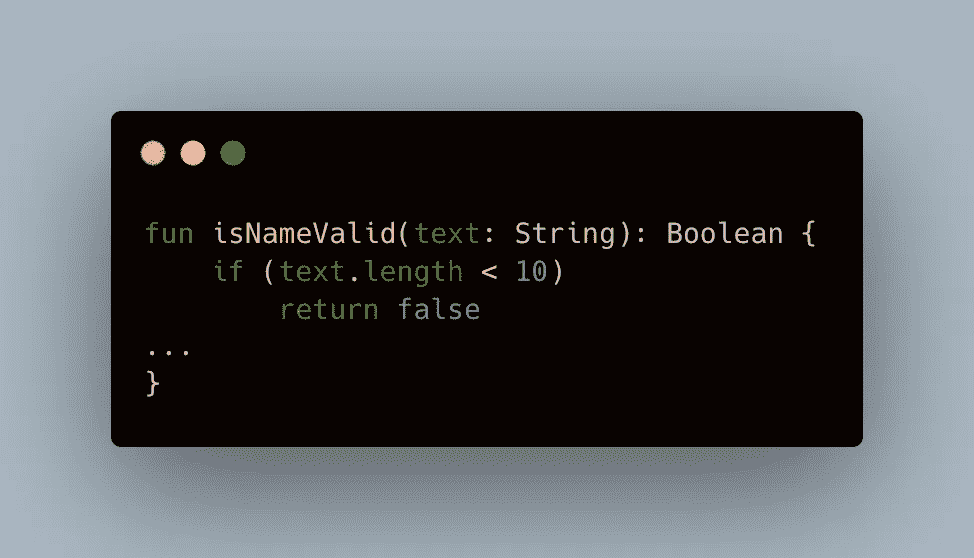
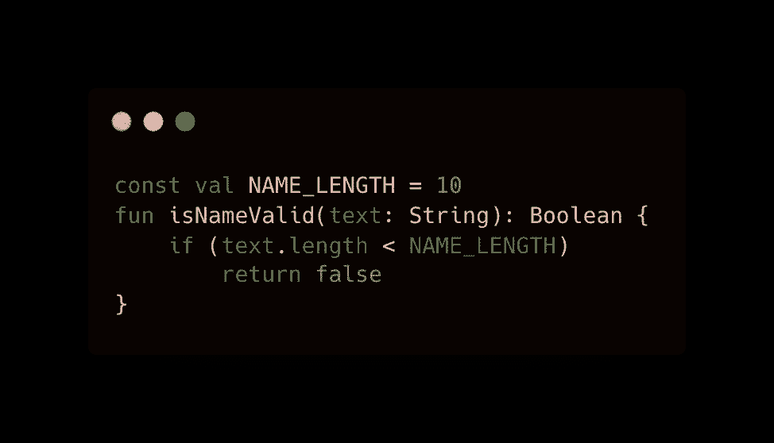
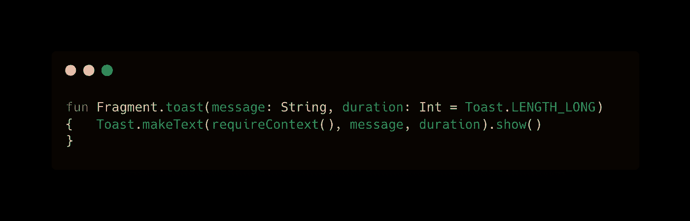
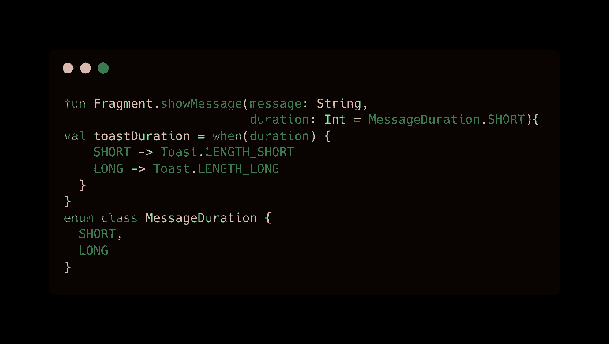
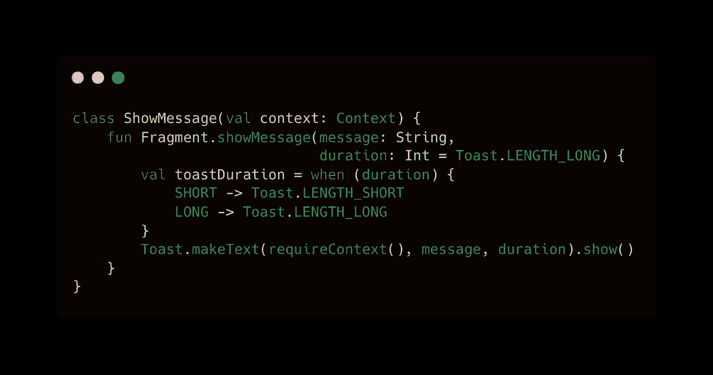

# 科特林的抽象魔法

> 原文：<https://blog.devgenius.io/abstraction-in-modern-world-54022c477912?source=collection_archive---------2----------------------->

本文将定义如何在 Kotlin 世界中准确地使用现代世界中的抽象。



当我们将实际代码隐藏在像函数或类这样的抽象之后时，我们不仅保护了用户免受这些细节的影响，而且我们也给了自己以后修改这些代码的自由。

**常数**

文字常量在被广泛使用时是有问题的，为了避免这种情况，我们应该使用抽象。

让我们以**是一个无效的**函数为例，如果名字有期望的长度，它返回 true。



数字 10 很容易理解，但如果我们将它声明为常数会更好，比如:



现在我们可以在不理解**是无效的**函数的逻辑的情况下改变这个值。如您所见，提取常量:

*   给个合适的名字。
*   它帮助我们在未来改变它的重要性。

**功能**

假设您正在开发一个应用程序，并且您注意到您经常需要向用户显示一条 toast 消息。这是您以编程方式实现的方式:

```
Toast.makeText(**this**,message,Toast.LENGTH_LONG).show()
```

现在我们可以创建一个扩展函数来显示这个 toast:



现在，这看起来很完美，但是如果我们把这个函数的实现从 Toast -> SnackBar 改变，我们还没有准备好。

简单的解决方法是将这个函数从 toast -> Snackbar 重命名为

```
**fun** Fragment.snackbar(message: String, duration: Int = 
...}
```

这个解决方案看起来很完美，但是很危险。当其他模块依赖于这个函数时，它们的功能会受到影响，特别是当参数也改变时。

作为开发人员，我们可以创建一个名为 **showMessage** 的高级函数，它可以处理显示 Toast 或 SnackBar 的复杂性。



所有内容都隐藏在 showMessage 函数中，但是函数不能保存状态。

**类**

下面是我们如何将消息显示抽象成一个类:



我们可以在类中注入上下文，它也可以保存状态。

```
**val message** = ShowMessage(*context*)
message.showMessage(**"Test"**)
```

**界面**

将逻辑隐藏在类的后面是一个很棒的想法，但是我们可以将类隐藏在一个*接口的后面，这给了在类中添加特性更多的自由。*

```
**interface** IMessageInterface {
    **fun** showMessage(msg: String)
}
```

现在我们有了更多的自由，我们可以通过提供不同的实现来显示特定于平台的**对话框/消息**。

就是这样。感谢阅读别忘了鼓掌订阅。

请继续关注另一篇文章。

[](https://medium.com/subscribe/@dev.soni04) [## 每当 Dev Soni 发布时收到一封电子邮件。

### 每当 Dev Soni 发布时收到一封电子邮件。注册后，如果您还没有，您将创建一个中型帐户…

medium.com](https://medium.com/subscribe/@dev.soni04) 

别忘了鼓掌…..


[德夫·索尼](https://medium.com/@dev.soni04?source=post_page-----54022c477912--------------------------------)

## 领导力和生活方式

[View list](https://medium.com/@dev.soni04/list/leadership-and-life-style-636d1a1f07bf?source=post_page-----54022c477912--------------------------------)3 stories