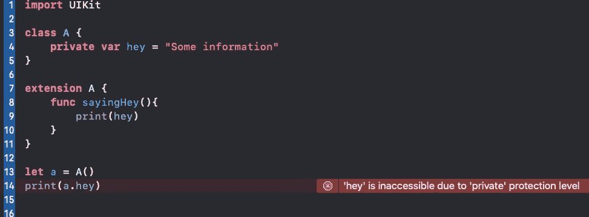

# Swift 中的访问控制

> 原文：<https://blog.devgenius.io/access-control-in-swift-d6b3abd8d939?source=collection_archive---------23----------------------->

快速浏览 swift |**Private**|**Public**|**file Private**|**Open**|**Internal**

# 定义和理解

随着代码变得越来越复杂，控制这个接口成为软件设计的一个重要部分。您可能希望创建作为代码“助手”的方法，或者创建用于跟踪内部状态的属性，而您不希望这些内部状态成为代码接口的一部分。

> **在 Swift 中，*访问控制*用于限制应用程序的部分源代码。你实际上是禁止其他模块、框架、类和代码使用你的代码。访问控制的一个好处是能够清楚地为你的代码定义一个公共 API，并隐藏私有的实现细节。**

# 访问控制简介

**基本上，你通过使用某个关键字为你的代码中的方法或变量定义一个*区域*。**

有一些关键词你可能听说过:

*   私人的
*   文件私有
*   公共
*   打开
*   内部的

您使用上述关键字进行访问控制。现在让我们用代码例子来理解它，看看我们如何给方法或变量一个访问区域。

# Swift 中的私人访问控制

这是 swift 中最常用的访问控制，现在让我们编写代码，看看它是如何工作的:

> 只能由定义类型、同一源文件中该类型的所有嵌套类型和扩展访问。

在上面的代码中，有一个类 A 将一个变量设为私有，然后我们试图在第 14 行访问它，你可以看到这个错误。而我们可以在它的扩展中使用它。

# Swift 中的文件私人访问控制

> 可从定义它的源文件中的任何地方访问。

# Swift 中的公共访问控制

> 可以从定义它的模块中的任何地方访问，也可以从导入该模块的另一个软件模块中访问。

# Swift 中的开放式访问控制

> 与 public 相同，具有能够被另一个模块中的代码覆盖的额外能力。

# Swift 中的内部访问控制

> 可从定义它的*模块*内的任何地方访问。这是**默认的**访问级别。

# 关键注意事项

*   访问控制修饰符是私有的、文件私有的、内部的、公共的和开放的。默认为内部访问级别。
*   修饰符可用于控制代码的可见接口并隐藏复杂性。
*   private 和 fileprivate 分别保护代码不被其他类型或文件中的代码访问。
*   public 和 open 允许从另一个模块访问代码。open 修饰符还允许实体被其他模块覆盖。

> 我的领英:[linkedin.com/in/my-pro-file](https://www.linkedin.com/in/my-pro-file)

## 你可能感兴趣的话题

*   **协议**:[https://level up . git connected . com/protocols-in-swift-7359 a 88248 b 4？source =-8-&gi = b 985317 da 979](https://levelup.gitconnected.com/protocols-in-swift-7359a88248b4)
*   **枚举**:[https://level up . git connected . com/enumerations-in-swift-5d d14 b 4055 a 7](https://levelup.gitconnected.com/enumerations-in-swift-5dd14b4055a7)
*   **属性**:[https://medium . com/dev-genius/what-are-Properties-in-swift-2 EC 8 ABA 9a 378](https://medium.com/dev-genius/what-are-properties-in-swift-2ec8aba9a378)
*   **结构**:[https://medium . com/@ MD code 2021/what-is-Structure-in-swift-ebc 22767 fe1d](https://medium.com/@mdcode2021/what-is-structure-in-swift-ebc22767fe1d)