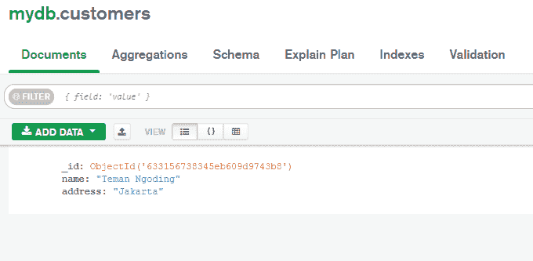

# 用 Node 访问 MongoDB。射流研究…

> 原文：<https://blog.devgenius.io/access-mongodb-with-node-js-8645494f3101?source=collection_archive---------10----------------------->


MongoDB 是一个数据库，开发者可以使用它来创建结构化的应用程序和网站。MongoDB 是使用 C++语言构建的。从数据库发出的结果是 JSON 格式的。MongoDB 一般不需要像 SQL 那样的表间关系，因为 MongoDB 是 noSql 数据库。以下是不同之处。


[https://www.dewaweb.com/blog/mongodb-adalah/](https://www.dewaweb.com/blog/mongodb-adalah/)

节点。JS 是一种取自 JavaScript 的编程语言，可以使用 V8 JavaScript 引擎运行，该引擎可以在浏览器之外运行。节点。JS 是开源的，类平台的。

好的，让我们直接进入我们将要讨论的材料。

1.  安装 MongoDB
2.  创建项目
3.  创建数据库
4.  创建收藏
5.  插入数据
6.  查找数据
7.  更新数据
8.  删除数据

您可以在此了解更多教程:

[使用 JavaScript 的 WEB CRUD LocalStorage】](https://temanngoding.com/en/web-crud-localstorage-using-javascript/)

[JavaScript 中 BOM 和 DOM 的区别](https://temanngoding.com/en/difference-between-bom-and-dom-in-javascript/)

[基础 JavaScript 第 6 部分:If Else JavaScript](https://temanngoding.com/en/basic-javascript-part-6-if-else-javascript/)

# 安装 MongoDB

请先在这里下载 MongoDB[https://www.mongodb.com/download-center](https://www.mongodb.com/download-center)。您将获得如下所示的 MongoDB 应用程序:


安装后，您必须进行如下配置:

```
C:\Users\XYZ>d:cd C:\Program Files\MongoDB\Server\6.0\bin
C:\Program Files\MongoDB\Server\6.0\bin>mongod.exe --dbpath "C:\data" 
C:\Program Files\MongoDB\Server\4.2\bin>mongo.exe
MongoDB shell version v4.2.1
connecting to: mongodb://127.0.0.1:27017/?compressors=disabled&gssapiServiceName=mongodb
Implicit session: session { "id" : UUID("4260beda-f662-4cbe-9bc7-5c1f2242663c") }
MongoDB server version: 4.2.1
>
```

安装过程已经完成，我们继续 Node.Js。

# 创建项目

您在项目文件夹中创建 main.js 文件。接下来在 Node.JS 中安装 MongoDB。

```
C:\Users\Your Name>npm install mongodb
```


# 创建数据库

使用节点创建数据库。JS 代码如下:

```
var MongoClient = require('mongodb').MongoClient;
var url = "mongodb://localhost:27017/mydb";MongoClient.connect(url, function(err, db) {
  if (err) throw err;
  console.log("Database created!");
  db.close();
});
```

输出:


要运行它，您只需在终端上使用 node。

# 创建收藏

接下来，如果您使用 SQL，我们将创建一个功能类似于表的集合。我们创建的代码如下:

```
var MongoClient = require('mongodb').MongoClient;
var url = "mongodb://localhost:27017/";MongoClient.connect(url, function(err, db) {
  if (err) throw err;
  var dbo = db.db("mydb");
  dbo.createCollection("customers", function(err, res) {
    if (err) throw err;
    console.log("Collection created!");
    db.close();
  });
});
```

输出:


我们已经成功创建了一个集合。我们可以在 MongoDB GUI 应用程序中看到它。然后我们会得到一个集合(客户)。


# 插入数据

创建集合后，我们将尝试创建代码，向我们创建的集合中添加数据。

```
var MongoClient = require('mongodb').MongoClient;
var url = "mongodb://localhost:27017/";MongoClient.connect(url, function(err, db) {
  if (err) throw err;
  var dbo = db.db("mydb");
  var myobj = {name: "Teman Ngoding", address: "Jakarta"};
  dbo.collection("customers").insertOne(myobj, function(err, res) {
    if (err) throw err;
    console.log("1 data inserted");
    db.close();
  });
});
```

输出:


让我们检查一下 MongoDB GUI，结果如下:



# 查找数据

现在我们尝试使用 Node.JS 显示数据名称。

```
var MongoClient = require('mongodb').MongoClient;
var url = "mongodb://localhost:27017/";MongoClient.connect(url, function(err, db) {
  if (err) throw err;
  var dbo = db.db("mydb");
  dbo.collection("customers").findOne({}, function(err, res) {
    if (err) throw err;
    console.log(res.name);
    db.close();
  });
});
```

输出:


# 更新数据

我们继续根据我们选择的查询更改数据，在下面的示例中，我们将更改地址:雅加达到万隆。

```
var MongoClient = require('mongodb').MongoClient;
var url = "mongodb://127.0.0.1:27017/";MongoClient.connect(url, function(err, db) {
  if (err) throw err;
  var dbo = db.db("mydb");
  var myquery = { address: "Jakarta" };
  var newvalues = { $set: {name: "Teman Ngoding", address: "Bandung" } };
  dbo.collection("customers").updateOne(myquery, newvalues, function(err, res) {
    if (err) throw err;
    console.log("1 document updated");
    db.close();
  });
});
```

输出:


# 删除数据

我们将从集合中缩进删除数据。下面的代码将删除地址为:Bandung 的数据。

```
var MongoClient = require('mongodb').MongoClient;
var url = "mongodb://localhost:27017/";MongoClient.connect(url, function(err, db) {
  if (err) throw err;
  var dbo = db.db("mydb");
  var myquery = { address: 'Bandung' };
  dbo.collection("customers").deleteOne(myquery, function(err, obj) {
    if (err) throw err;
    console.log("1 document deleted");
    db.close();
  });
});
```

所有带有地址:万隆的代码将被删除。那么客户集合中的所有数据都将被删除。


这就是如何使用 Node 访问 MongoDB 数据库。JS，希望有用。

***谢了。***

**标签:**[MongoDB](https://temanngoding.com/en/teman%20ngoding/mongodb-en/)[nodejs](https://temanngoding.com/en/teman%20ngoding/nodejs-en/)