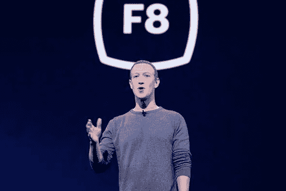
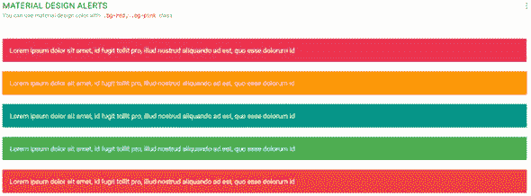
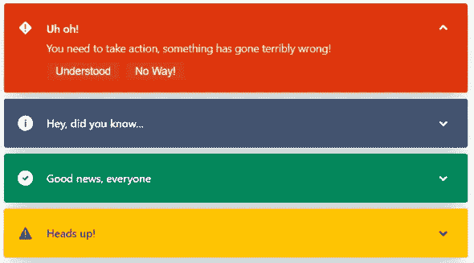

# ♿无障碍是你的工作！！

> 原文：<https://blog.devgenius.io/accessibility-is-your-job-9422c804d804?source=collection_archive---------19----------------------->

Web 可访问性不仅仅是 web 开发的事后想法。这是你在网上创建内容、页面和应用程序时必须做的事情。不考虑可访问性就像歧视人一样。可访问性就是让你的应用程序能够接触到 100%的用户群，而不管他们在浏览网页时是否有残疾。

脸书创始人马克·扎克伯格是色盲！！你如何向他展示你的网站？

是的，我知道这不是很重要，你甚至可以不考虑这些细节就创建页面。但是好和伟大的区别在于对细节的关注。

# 那么，我们有哪些借口来避免考虑可访问性呢？

1.  **无障碍不酷**😎

通常情况下，如果我们严格遵守我们的可访问性原则，有时最华丽的 UI 是不可能的。但我们真正应该思考的是，花哨的用户界面并不总是最好的，重要的是从产品中受益的人。但如果有办法绕过这个，我很乐意..([Adam Wathan&Steve Schoger 的《重构用户界面](https://refactoringui.com/book/)》给出了一些相关的提示)

**2。有什么影响？我们没有看到立竿见影的效果。**

残疾人确实使用互联网！！不是每个人都是完美的。易访问性不只是帮助你为他们改进网站，它只是提高网站对每个人的可用性。

**3。不确定要做什么？**

很多时候，我们中的大多数人在创建网站时甚至没有想到这一点，有时当你实际上看到有人在努力使用产品或在互联网上遇到可访问性概念时，我们实际上想到了它。这是我们对用户应该有的同理心。你可以通过互联网获得很多关于无障碍的信息。您可以在此处获得通用指南— [网页内容可访问性指南(WCAG) 2.0](https://www.w3.org/TR/WCAG20/)

**4。太辛苦了，工作量太大了！！**

确实很难想到每一个微小的细节，不同的用例。但是值得。通过让每个人都能接触到它，它甚至对商业有好处。

所以我第一次开始思考这个问题是在我看到有人患有色盲，无法识别网站上的成功和失败信息，因为它们只是用颜色编码。这里可以看到一个例子。

*这是一个非常糟糕的实现，因为用户很难一眼就识别出来。*

*atlaskit 考虑到了这种情况，所以我们在阅读之前就用图标来帮助理解内容。*

所以在看到这些之后，我开始研究可访问性。因此，随着我的进步，我将继续发布关于可访问性的快速信息。

理论到此为止，我们以后再详细讨论吧。

# 那么我们应该寻找哪些领域呢？

1.  文本可读性
2.  覆盖在背景图像上的文本
3.  颜色、过滤器等
4.  链接识别
5.  颜色组合
6.  表单占位符和验证
7.  主要按钮
8.  警报消息
9.  图表

**实际上，如果你对阅读更多关于可访问性的内容感兴趣，我会在这里提供一些资源:**

1.  [为色盲用户设计](https://www.slideshare.net/TDdesign/how-to-design-for-colorblind-user)
2.  [如何满足网页内容无障碍指南 2.0](https://amzn.to/3dhyiJv)
3.  [网络无障碍:研究的基础(人机交互系列)](https://amzn.to/2zyLriY)
4.  [介质上的可访问性类别](https://medium.com/topic/accessibility)

今天再见👋

这篇文章最初发表在 Kiran 的个人博客— [OnePercent 博客](https://kirananto.com/accessibility-your-job/)