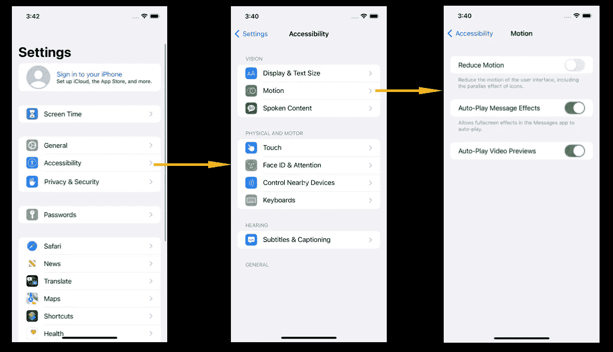

# 可访问性:减少运动

> 原文：<https://blog.devgenius.io/accessibility-motion-605bee78d809?source=collection_archive---------20----------------------->

在我职业生涯的大部分时间里，这是我没有探索的领域。我认为自己是一个容易接近的优秀开发人员。然而，我在大多数情况下错过了“减少运动”适应。

**用例:**本文将帮助 iOS 开发者了解，我们如何为不喜欢动画或对动画有一些身体问题的用户调整我们的应用程序。

**先决条件:**

*   基本的 iOS Swift 知识。
*   愿意采用可访问性增强。

**让我们开始吧:**

可以在 iOS 中通过
设置—辅助功能—减少运动—打开
来减少运动，如下图所示:

启用减少运动。

每当我们看到减少运动被启用时，建议减少或不增加应用程序的动画，包括导航动画。
我会写如何发现 UIKIT 和 SwiftUI 中是否启用了 reduce motion。

**UIKIT:**

由于 UIKIT 已经存在了很长时间，它非常成熟，我们可以通过下面的代码很容易地判断出是否启用了 reduce motion:

检测和使用 UIKIT 中的减少运动。

SwiftUI:

我们可以使用 UIKIT 可访问性变量或通过环境属性来识别减少运动，后面的概念见下面的实现:

SwiftUI 中减少运动的检测和使用。

**注意:**交易方法不适用于 SwiftUI 中的导航堆栈，这可以确定为 SwiftUI 仍在发展中。一旦有了突破，我会更新这篇文章。

# 判决:

Reduce motion 实现使我们的应用程序可用于更加多样化的社区。希望这篇文章能帮助一些开发者在这个领域进行更多的探索。

**分享这个博客来传播知识|一定要关注，喜欢就鼓掌！快乐编码:)**

**在**[**Linkedin**](https://www.linkedin.com/in/nilaakash-singh-79a386b2/)**和**[**Twitter**](https://twitter.com/NilaakashSingh)**上加我。**