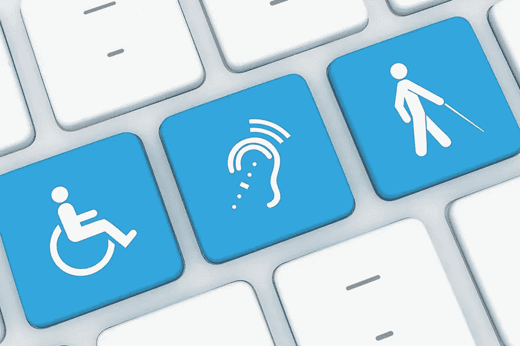
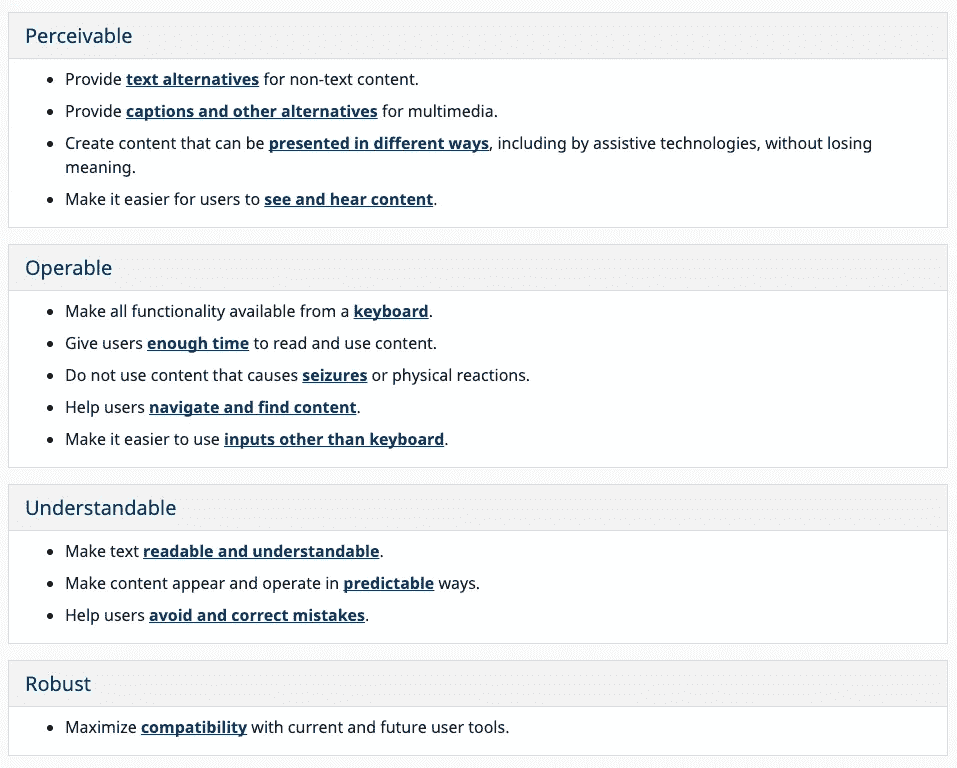

# 可访问性第 1 部分:外行人的介绍

> 原文：<https://blog.devgenius.io/accessibility-part-1-a-laymans-introduction-740f9c4762c8?source=collection_archive---------31----------------------->

当我们忍受冠状病毒引发的封锁时，网络对社会的正常运转有多重要变得越来越明显。当我们被迫进入时，我们的生活已经转移到了网上。即使没有一个全球性的疫情，很明显，如果一个人愿意，他可以在网上度过一生。网上购物、网上银行、远程工作和众多聊天服务，让朋友和家人保持联系。因此，我建议适用于现实世界的规则也应该适用于网络世界。不幸的是，在残疾人无障碍方面，存在明显的问题。

如果一个盲人在街上行走而不需要任何形式的帮助，公众会感到震惊，同样，应该对残疾网民及其需求给予同等程度的关注。当我开始编写包含最佳可访问性原则的代码时，我想看看规范可访问性领域的指南和法律的状态，重点是针对聋人和重听人的规定。关于技术元素的进一步的博客，比如利用焦点、语义标记和 ARIA 将在本系列的后面发表！

**可访问性的当前状态**

W3C Web Accessibility Initiative 负责一组广泛的标准，即 Web 内容可访问性指南(WCAG)。下面的片段是四个核心原则的基本概述，POUR。

WCAG 还提供了一个简短的高层次的总结，以确保您的产品符合标准，但扩展的指导方针也可用于那些寻求更深入的解释。这被称为网络目标清单，可以在 https://webaim.org/standards/wcag/checklist 的[找到。然而，就像一般的技术一样，它是一个快速发展的领域，指南可能很快就会过时。个人有更大的责任来确保可用性是每个决策的首要考虑，并确保他们敏锐地意识到新技术和实践。](https://webaim.org/standards/wcag/checklist)

**Web 2.0**

尽管字幕已经存在了一个多世纪，但仍有许多例子表明字幕和隐藏字幕达不到可接受的标准。例如，YouTube 经常会有自动生成字幕的视频，这些字幕完全不准确。这就是通常被称为 Web 2.0 的新一代互联网内容的问题所在。它的典型特征是客户端内容创建水平的提高。像 YouTube 和 Instagram 这样的网站几乎完全是由用户驱动的，因此它回避了一个问题，内容创作者是否有义务为他们的用户提供可访问性。不幸的是，有人会说他们真的不需要这么做。W3C 指南顾名思义，是咨询性的指南，而不是网络法律。通过欧盟网页可访问性指令 2016/2102，存在针对公共部门网站的立法，但这不包括大多数网站。

重要的一步是 2006 年通过的《联合国残疾人权利公约》(联合国 CRPD 公约),目前已有 181 个国家批准了该公约。第九条第一款第(二)项规定，获取信息和通信技术，包括网络，被定义为一项基本人权。它不区分私人网站和公共网站。值得注意的是，它具有法律约束力，正在形成成员国关于残疾和无障碍的立法。

**一些相关问题**

首先，有人能在网络上充分实施如此高水平的活动吗？据估计，活跃网站的数量从 2 亿到 4 亿不等。此外，责任是落在政府、网络浏览器所有者、ISP、网站所有者身上，还是落在需要自我监督的内容创建者身上。

自然也有成本与收益的争论。然而，不久前，人们对网络安全也说了同样的话。现在最重要的是，每个公司都要考虑到这一点，我建议对可访问性给予同等的重视。

> “Ofcom 研究发现，大约 760 万(范围从 700 万到 810 万)英国成年人声称使用过这项服务。其中，140 万人(从 120 万到 160 万不等)有听力障碍。很大一部分字幕的使用是偶然的，许多字幕用户使用这项服务的动机似乎不是为了弥补听力障碍。

正如 Ofcom 的研究表明的那样，可访问性服务可能不仅仅被服务最初设计的那些人使用。收益可能比最初预期的要大。

尽管如此，应该指出的是，有许多企业提供了很好的解决方案。一些值得注意的例子包括:

谷歌的**Live transcription**是开源的，提供非常准确的语音到文本转录。如果聋人在唇读方面有困难，这将有助于他们与听力正常的人交流。它的开源特性意味着任何人都可以在他们的应用程序中实现它。在 IOS 上，**艾娃**应用是一个有价值的选择。

**TapSOS:** 一款应用程序，在需要时将患者的病史和设备位置发送给急救服务，消除了所有口头交流的需要。

一个来自法国初创公司的便捷应用程序，可以实时转录电话内容。

**未来**

欧盟已经通过了欧洲无障碍法案，成员国必须在 2025 年前遵守该法案。这也适用于私人网站。在不久的将来，至少在欧盟，学习如何使网站更易访问似乎将成为所有网站开发者的必备技能。如果没有法律上的推动，我希望道德上的义务会鼓励其他人考虑无障碍。

> **“网络彻底改变了残疾的影响，因为网络消除了许多人在现实世界中面临的沟通和互动障碍。然而，当网站、网络技术或网络工具设计糟糕时，它们会制造障碍，阻止人们使用网络。”**

这凸显了一个不可访问网络的悖论，而不是它的本意。

*【https://www.w3.org/WAI/standards-guidelines/wcag/glance/】*

*[2][*https://www . ofcom . org . uk/about-ofcom/latest/media/media-releases/2015/quality-subtitling-3rd-report*](https://www.ofcom.org.uk/about-ofcom/latest/media/media-releases/2015/quality-subtitling-3rd-report)*

*[https://www.w3.org/standards/webdesign/accessibilityT21](https://www.w3.org/standards/webdesign/accessibility)*