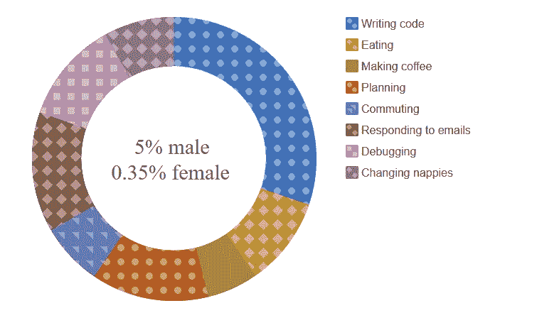
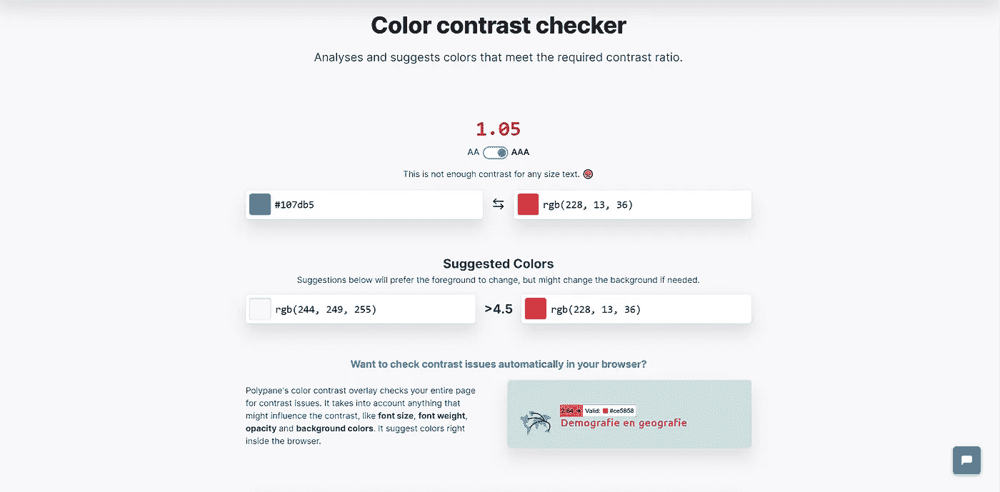
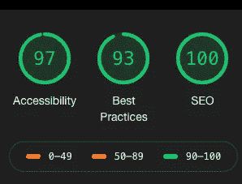
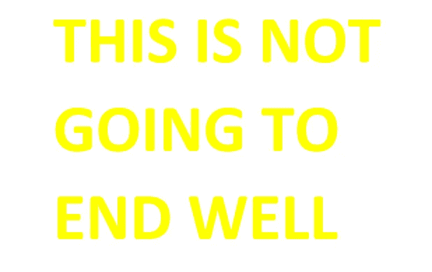

# 无障碍第 2 部分:视觉障碍

> 原文：<https://blog.devgenius.io/accessibility-part-2-visual-impairments-aff895a87a01?source=collection_archive---------31----------------------->

网络上有大量设计精美的网站。然而，如果考虑的话，对视觉障碍者的可访问性通常是事后的想法。这篇博客将探讨那些给视障用户制造障碍的网站设计问题。有许多工具、提示和技巧可供开发者使用，以确保没有用户被排除在网站的预期体验之外。

# 用颜色来讲故事

作为一名开发人员，我并不抱怨要让你的网站看起来吸引用户。这是任何网站的一个重要方面。然而，仅仅用颜色来讲述一个故事会让你的网站很难被很多用户访问，尤其是色盲。马克·扎克伯格、富有远见的导演克里斯托弗·诺兰和好莱坞最好的人山谬·里维只是这个庞大群体中的一小部分。例如，对于色盲来说，使用颜色渐变的饼状图和热图可能很难理解。最终，这使得解释数据变得困难，并破坏了您的用户体验。

## 技巧

*   首先进行灰度测试，或者考虑在原始数据旁边放一个替代图表。
*   这些是要避免的颜色组合:红色和绿色，绿色和棕色，绿色和蓝色，蓝色和灰色，蓝色和紫色，绿色和灰色，绿色和黑色。
*   利用 alt 属性。
*   考虑使用图案而不仅仅是颜色。

用图案代替颜色是一个很好的选择

最后，使用强烈对比的颜色！这也不仅仅适用于色盲。

# 对比

许多工具测试可访问的颜色组合。我最喜欢的是 Polypane 颜色对比检查器，这是一个简单而有效的工具，可以确定颜色组合是否通过 WCAG 2.0(网页内容无障碍指南)，它还可以建议更好的颜色组合，并允许用户在 AA 和 AAA 之间切换。此外，WebAIM 对比度 checker⁴对对比度以及一致性所需的对比度进行了更详细的解释。

编辑:Polypane 颜色对比检查器还说明了一致性所需的比率。

多潘恩颜色对比检查器

另一个优秀的工具是 Lighthouse，它可以在 Chrome DevTools 的审计标签中找到。它测试你的网站或应用程序的几个方面，并就如何改进你的应用程序提供个性化的提示。

使用 Lighthouse 在熨斗测试我的最终项目

这是测试工具中最简单明了的，反馈也是清晰简洁的。除了可访问性之外，它还测试其他重要方面，如搜索引擎优化和渐进式网络应用，结合这一事实，使用这一强大的工具是显而易见的。

# 文本

对于大多数人来说，阅读一整页 10pt 大小的文本并不是一个有吸引力的建议，更不用说视力受损的人了。例如，那些有阅读障碍的人会受到这些设计选择的负面影响。此外，有人认为，糟糕的文本可能会导致认知负荷增加，从而导致内容消费受损。如果你有重要的信息需要传达给用户，这就不理想了。

## 技巧

*   用大字体清晰简洁地表达你的信息。
*   拆分大段文字。
*   请注意，在显示文本时，颜色对比也非常重要。

# 眼疲劳

我们越来越多的时间是在电脑屏幕前度过的。一个越来越普遍的问题是这些屏幕发出的蓝光及其对我们视力的影响。我使用的一个很棒的应用程序是 f.lux，它可以帮助防止眼睛疲劳。但是，调整显示器色温的效果会导致某些颜色在外观上发生变化。开发人员应该考虑这些变化，避免使用最大的违规者。例如，黄色会被完全洗掉。

费勒克斯在晚上不喜欢黄色

许多优秀的应用程序可以在所有网站上通用，比如前面提到的 f.lux，但开发者也可以在微观层面上提供帮助。许多网站为用户提供了暗用户界面和亮用户界面的选择。同样，这不仅仅是视障人士的问题，所有用户都可以从中受益。除了有助于缓解眼睛疲劳，它还给予用户更多的风格自由。

# 当前技术

做我的眼睛——一个由汉斯·桂鑫·维伯格创建的旧应用程序，但仍被广泛使用。一个将盲人和志愿者配对的应用程序，志愿者可以通过视频通话，帮助阅读说明，检查食品的保质期等等。

看看 AI——微软的一款应用程序，它利用人工智能来做盲人难以处理的日常事情。该应用程序可以识别物体，并以声音形式描述它们。它还有一个条形码扫描仪，能够识别货币和人类情感。

BlindSquare —仅限 IOS。一款为视障人士提供安全导航的应用程序。引导语音帮助用户到达他们需要去的地方，同时还根据日常习惯建议感兴趣的地方。

这些设计变更在很大程度上很容易实现。一些小的注意事项可以对视障用户体验网络的方式产生巨大的积极影响。在未来的博客中，我将研究盲人、屏幕阅读器的可访问性，并编写代码让他们有效地工作。

[1][https://venngage.com/blog/color-blind-friendly-palette/](https://venngage.com/blog/color-blind-friendly-palette/)

[2][http://between two brackets . com/data-graphics-and-colour-vision/](http://betweentwobrackets.com/data-graphics-and-colour-vision/)

https://polypane.app/color-contrast/#fg=%23107db5&[BG = % 23 fff&level = aa](https://polypane.app/color-contrast/#fg=%23107db5&bg=%23fff&level=aa)

[4]https://webaim.org/resources/contrastchecker/