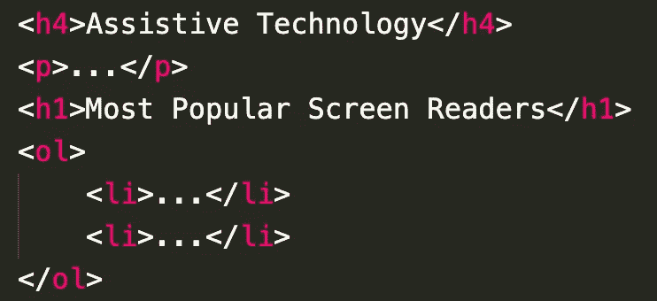
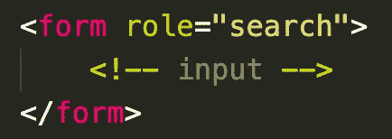
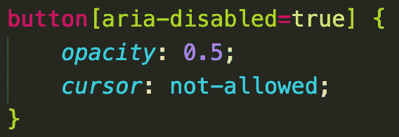
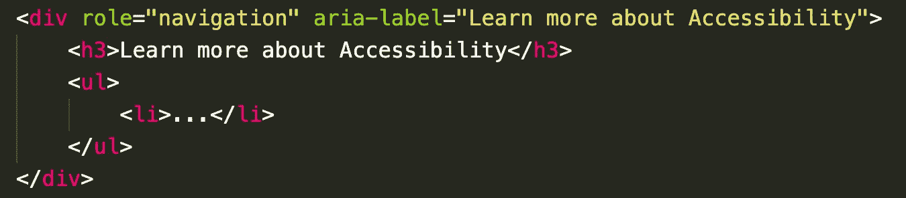
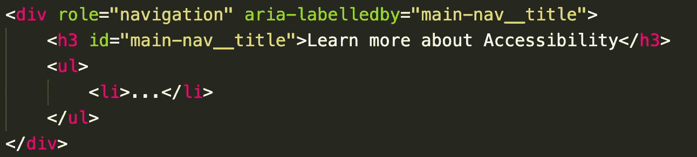

# 可访问性第 3 部分:语义 HTML 和 ARIA

> 原文：<https://blog.devgenius.io/accessibility-part-3-semantic-html-and-aria-2a9934e162c6?source=collection_archive---------5----------------------->

可刷新盲文显示器

网页可访问性是巨大而复杂的。当我努力自学必要的工具使网络成为真正的平等主义者时，这一点变得非常明显，正如它被设计的那样。因此，这篇博客旨在做一个概述，试图为那些对该领域感兴趣的人提供一个基础，因为我将继续这样做！它将关注语义 HTML 和 ARIA，这两种方法为 web 页面提供了为其内容添加含义所必需的工具。至关重要的是，这对于辅助技术(如屏幕阅读器)的正常运行至关重要。

## 语义 HTML

语义 HTML 元素是那些*“向浏览器和开发者双方清楚地描述其含义”* *的元素。*因此，它们具有内置的功能，可以极大地帮助编写可访问性代码。因此，如果网站是可访问的，鼓励使用原生 HTML 元素。大约有 100 个语义元素[，每个都有明确的作用和意义。例如，< h1 >元素是语义性的，因为它显然是页面上的顶级标题。然而，< div >没有语义，因为它没有固有的含义；我们无法确定它的内容。](https://developer.mozilla.org/en-US/docs/Web/HTML/Element)

***为什么要用语义 HTML？***

就这个博客而言，语义 HTML 的主要好处是更容易访问网站。还有其他好处，如增加搜索引擎优化和更干净的代码，但这超出了本文的范围。

正如我们之前提到的，语义 HTML 是屏幕阅读器更容易理解的代码。使用语义元素，如

、

<main>、</main>

一个有趣的例子是屏幕阅读器如何解释非语义斜体*和粗体**元素，以及语义强调*和强**元素。两者产生相同的结果，在浏览器中分别是斜体和粗体文本。然而，屏幕阅读器只会识别语义元素。包裹在*中的文本将被强调显示给用户，而*元素将被完全跳过。********

***注意事项***

*   确保您使用正确的 HTML 元素来实现您想要实现的功能。纯粹为了样式的目的使用按钮元素是不好的做法。屏幕阅读器仍然会将该元素解释为按钮。
*   正确使用标题并使其尽可能具有描述性是非常重要的，因为许多屏幕阅读器用户依靠标题来更有效地跳转到网站的不同部分。因此，标题级别必须反映内容层次结构。

WCAG 失败了

使用

#### 作为主标题，并应用相反的标题顺序，将

# 放在

#### 之后，不符合网页内容可访问性指南。

最终，语义 HTML 元素所能提供的功能可能会受到限制。这就是咏叹调发挥作用的地方。

## 可访问的富互联网应用程序

WAI-ARIA，可访问的丰富互联网应用程序，“*定义了一种使 Web 内容和 Web 应用程序对残疾人更易访问的方式”* *。随着网络的成熟，网站变得越来越复杂，产生了高级的用户界面控件，这些控件目前可能不存在于语义 HTML 中。ARIA 可以用来弥补这种支持的不足，并为辅助技术提供额外的信息。ARIA 的三个主要组成部分是角色、状态和属性。*

***咏叹调角色***

角色指示元素应该遵循的用户界面模式的类型。例如，语义 HTML 

只有在没有其他选择的情况下，才更改语义元素上的角色

> 注意:如果您打算使用缺省角色，就不需要在元素上声明角色。

咏叹调角色有六类；

1.  **Landmark** - *供屏幕阅读器快速导航到页面的不同部分。例子包括“横幅”、“导航”、“主”和“表单”。*
2.  **文档结构** - *当无法使用语义元素时，用作章节描述。还组织页面上的内容。例子包括“img”、“heading”、“table”和“presentation”。*
3.  **小部件***——用于描述交互元素或模式，在 HTML 中目前没有语义上的对等物。* *例子包括“tab”、“tabpanel”、“slider”和“progressbar”。*
4.  **窗口***-用于子窗口，如模态窗口。只有两个角色；“alertdialog”和“dialog”。*
5.  **Live Regions***——用于在网页初次加载后通知用户页面上发生的变化。例如，新闻提要或搜索结果可以定期更新，而不需要重新加载整个页面。这五个角色是“警报”、“日志”、“字幕”、“计时器”和“状态”。* ***通常，使用 aria-live 属性创建一个 live 区域。***
6.  **抽象** - *仅由浏览器使用，并为其他角色的构建提供基础。开发人员永远不应该使用这个角色。*

***咏叹调状态***

ARIA 状态描述了元素的当前状态。因此，它们本质上是动态的，通常用 JavaScript 更新。aria-disabled 属性就是一个例子。大多数开发人员都知道禁用的属性，视力正常的用户会从禁用的元素中获得足够的反馈。例如，按钮可能是半透明的，或者单击没有任何效果。但是，屏幕阅读器将完全忽略任何具有 disabled 属性的元素。利用 aria-disabled 属性将允许屏幕阅读器确认按钮的存在及其当前状态。

使用 JavaScript，一旦满足所有条件，就可以动态地将状态更改为 false。如果在与元素的初始交互之后发生了变化，诸如屏幕阅读器之类的辅助技术将能够通知用户。

> 注意:与 disabled 属性不同，aria-disabled 在默认情况下不会设置元素的样式。您可以使用下面的 CSS 选择器来设计元素的样式，以适应可视化用户。

***咏叹调属性***

ARIA 属性*“定义标准 HTML 中不支持的附加语义”*。通常，它们用于描述与其他元素的关系。两个常用的属性是 aria-label 和 aria-labelledby。前者标记元素，然后辅助技术将通知用户。该标签在浏览器中不可见。

> 注意:屏幕阅读器会阅读文本内容，所以如果文本内容的目的非常清楚，aria 标签是不必要的。

在这种情况下，aria 标签是多余的

aria 标签在这里是至关重要的，因为“X”不是不言自明的

当标签文本在浏览器中可见时，Aria-labelledby 变得有用。属性可用于引用包含文本内容的元素。在下面的第一个片段中，使用 aria-label 违背了软件工程的枯燥原则。不要重复自己！

在这种情况下，aria-label 的使用是冗长的

aria-labelledby 是更好的选择

状态和属性通常用于支持页面上的 ARIA 角色，通常统称为属性。在这篇博客中，我只能涵盖其中的一些，但是有许多资源列出了大量的 ARIA 角色、状态和属性，可以用来创建可访问的网站。一个极好的选择是[数字 A11Y 备忘单](https://www.digitala11y.com/wai-aria-1-1-cheat-sheet/)，以及永远可靠的 [MDN 网络文档](https://developer.mozilla.org/en-US/docs/Web/Accessibility/ARIA/ARIA_Techniques)。

这对我来说是一次学习经历，我希望对你也是如此。本系列的下一篇博客将是关于键盘可访问性的。这一点至关重要，因为许多要求网站无障碍的用户无法使用鼠标。标签索引的使用、旁路块和使用 JavaScript 的焦点将是所涉及的一些主题。

[1]https://www.w3schools.com/html/html5_semantic_elements.asp

[2][https://www.w3.org/WAI/standards-guidelines/aria/](https://www.w3.org/WAI/standards-guidelines/aria/)

[https://webaim.org/techniques/aria/](https://webaim.org/techniques/aria/)